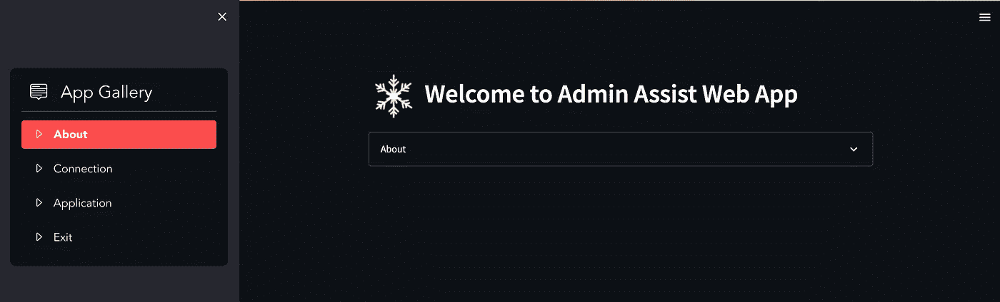
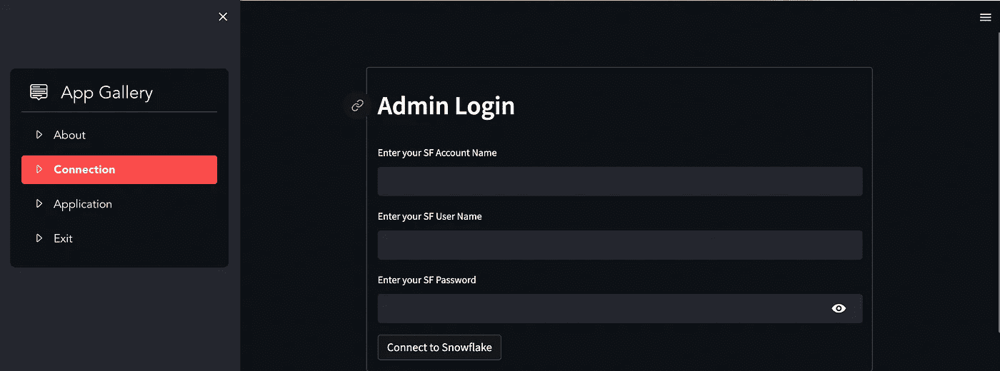
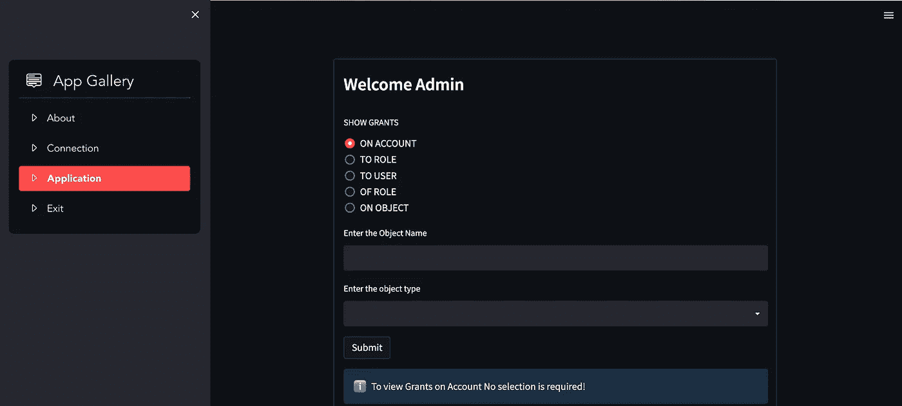
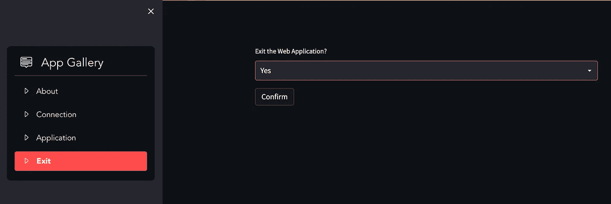

# 简化雪花管理

> 原文：<https://blog.devgenius.io/streamlit-the-snowflake-admin-e24691d3b650?source=collection_archive---------16----------------------->

Streamlit 是一个开源 Python 库，有助于创建和共享用于机器学习、数据科学和其他目的的酷的定制 web 应用程序。

很快，我们就可以用很少的几行代码构建和部署视觉上吸引人且非常强大的 web 应用程序，并且可以吸引那些希望使用 GUI 方式的人。

*最好的数据平台，雪花和 Streamlit 成为一个真正强大的软件包，可以在雪花云上构建数据应用程序，具有前所未有的强大功能和良好的数据可视化。为什么不试着造一个呢？*

> ***介绍管理员辅助 App！***

我们将创建一个应用程序，雪花管理员可以使用它来查看雪花上各种对象的授权。

## 关于雪花访问控制的一点信息

雪花使用以下方法进行访问控制。(来自 SF Docs :-更多信息请访问([https://Docs . snow flake . com/en/user-guide/security-access-control-overview . html # access-control-framework](https://docs.snowflake.com/en/user-guide/security-access-control-overview.html#access-control-framework))

*   **自主访问控制(DAC):** 每个对象都有一个所有者，该所有者可以授予对该对象的访问权限。
*   **基于角色的访问控制(RBAC):** 访问权限分配给角色，角色再分配给用户。

理解雪花中的访问控制的关键概念是:

1.  **安全对象:**可被授予访问权限的实体。除非获得授权，否则访问将被拒绝。
2.  **角色:**可以被授予特权的实体。角色依次分配给用户。请注意，角色也可以分配给其他角色，从而创建角色层次结构。
3.  **权限:**对对象的访问权限的定义级别。可以使用多个不同的特权来控制授予的访问粒度。
4.  **用户:**被雪花识别的用户身份，无论是与人还是与程序关联。

**显示授权列出所有明确授予角色、用户和共享的访问控制权限**

# **应用:-**

该应用程序有以下 4 个标签。

**关于** :-在 App 上获取一些重要信息

**连接** :-用你的管理员凭证连接到雪花数据库

**申请** :-使用页面查看授权

**退出** :-退出应用程序并关闭连接

# **连接页面:-**

它获取帐户详细信息并建立到 SF DB 的连接。

**IMP 注意:-提供的密码不会存储在任何地方。**

# 申请页面:-

通过提供对象名称和对象类型详细信息，查看下面屏幕上的授予权限。

# 退出页面:-

最好在使用后退出应用程序，以优雅地关闭连接。

你可以在这里看到一个演示！

**使用应用:-**

[https://tech-am-streamlit-app-admin-assist-53up 3t . streamlitapp . com/](https://tech-am-streamlit-app-admin-assist-53up3t.streamlitapp.com/)

细流和雪花现在在一起了。❤

干杯！教师节快乐。