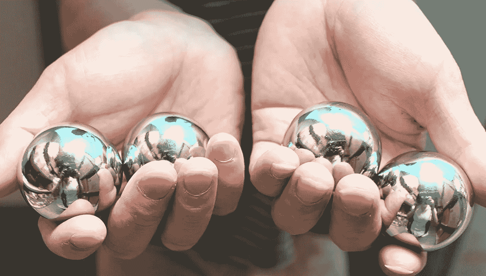

# 程序员减压玩具

> 原文：<https://blog.devgenius.io/stress-relief-toys-for-programmers-641df3bbfdba?source=collection_archive---------0----------------------->

## 找到提高生产力的方法。

奥拉夫·阿伦斯·罗特内在 [Unsplash](https://unsplash.com?utm_source=medium&utm_medium=referral) 上的照片

每个程序员都会面临一定程度的压力。程序员是一个非常需要学习的工作，不仅在身体上，而且在精神上。

我不是解决压力问题的医生，但我可以从我的个人经历中给出一些建议。

**下面是 16 种可以帮助减轻压力和焦虑的烦躁玩具。**

# 1.一个巨大的输入按钮

[图像来源](https://www.amazon.com/Creative-Pillow-Unbreakable-Anti-Stress-Offices/dp/B088PP6MTP/ref=sr_1_4?dchild=1&keywords=giant+enter+button&qid=1619794763&sr=8-4)

一个巨大的输入按钮是我见过的有趣但有效的工具。你可以在电脑上连接一个巨大的输入按钮。当你感觉无聊的时候，你可以用力按一下这个按钮，感觉很新鲜。另外，这个额外的回车键可以让你的思维活跃很长一段时间。

# 2.桌面沙袋

[图像来源](https://www.amazon.com/Milky-House-Desktop-Punching-Standing/dp/B07J6QNQHY/ref=sr_1_8?crid=35QKN7IO27K7V&dchild=1&keywords=desktop+punching+bag+stress+relief&qid=1619795001&sprefix=desktom+punching+bag%2Caps%2C453&sr=8-8)

它被称为科技压力出气筒。这个包很耐用，可以放在你的电脑旁边。你可以反复击打这个袋子，直到你消除压力。

有了这些沙袋，你就能在工作中获得即时能量。对工作环境来说是极好的。

# 3.魔方

[西格蒙德](https://unsplash.com/@sigmund?utm_source=medium&utm_medium=referral)在 [Unsplash](https://unsplash.com?utm_source=medium&utm_medium=referral) 上拍照

魔方是用来正念和减压的。它增强我们的免疫系统和心理健康。这也增加了我们专注于工作的能力。魔方被证明**降低压力**。

所以每个程序员都可以保持一个魔方。

# 4.小野压路机

[图像来源](https://www.amazon.com/ONO-Roller-Original-Handheld-Promotes/dp/B079T416DB/ref=sr_1_2?dchild=1&keywords=Ono+Roller&qid=1619795485&sr=8-2)

这个坐立不安的小玩意有很高的放松力。而且比其他坐立不安的小玩意更专业。这是一个毫不费力的按摩辊。它有助于你的大脑，缓解焦虑和压力。

# 5.原始的烦躁旋转器

Christophe Hautier 在 [Unsplash](https://unsplash.com?utm_source=medium&utm_medium=referral) 上拍摄的照片

这是另一个令人不安的代价。它是你工作死亡的必备配件。它体积小巧，重量轻，适合放在口袋和钱包里。

所以你可以带着它去任何地方。

# 6.旋转坐立不安

[摄](https://unsplash.com/@soothy?utm_source=medium&utm_medium=referral)在 [Unsplash](https://unsplash.com?utm_source=medium&utm_medium=referral)

这个玩具帮助一个人减轻焦虑压力。它提高了工作中的注意力和集中力。

# 7.点击比特

[图像来源](https://www.amazon.com/Improved-Quality-Anxiety-Attention-Minion/dp/B06X6GXF45/ref=sr_1_17?dchild=1&keywords=Clickeybits+stress+toy&qid=1619796270&sr=8-17)

Clickeybits 是一个由机械键盘开关制成的有趣的彩色小工具。当你拿着它们时，这个设计会给你一种独特的机器人般的感觉。它有六个按钮，你可以同时全部按下。

# 8.Ooey 胶粘闪光珠球

[图像来源](https://www.amazon.com/Ball-Bubbleezz-Squishy-Bead-Pink/dp/B07DG1DM2T/ref=pd_bxgy_img_2/134-7100430-5496902?_encoding=UTF8&pd_rd_i=B07DG1DM2T&pd_rd_r=82e3ef37-e98b-47a7-b74a-c6fb8df6fc8a&pd_rd_w=T3sED&pd_rd_wg=JZrJt&pf_rd_p=fd3ebcd0-c1a2-44cf-aba2-bbf4810b3732&pf_rd_r=WPZG8WX8AA9NJWA6SGP9&psc=1&refRID=WPZG8WX8AA9NJWA6SGP9)

有史以来最令人满意的黏糊糊的挤压球之一。它的特点是充满闪光的橡胶皮肤，它是一个凝胶基底和水珠。

触摸这些球你会感觉很棒。

它能立即减轻你的压力。这些压力球很快就会成为你的最爱之一。

# 9.思考油灰

[图像来源](https://www.amazon.com/Arfun-Magnetic-Therapy-Fidget-Stress/dp/B078KTMLCV/ref=sr_1_57?dchild=1&keywords=thinking+putty+for+stress&qid=1619798673&sr=8-57)

我们可以用思维油灰作为压力球。认为油灰就像你手指上的口香糖。你可以利用你的大脑，用这个神奇的玩具消除压力。

# 10.变色光球

[梅勒妮·玛格达莱娜](https://unsplash.com/@m2creates?utm_source=medium&utm_medium=referral)在 [Unsplash](https://unsplash.com?utm_source=medium&utm_medium=referral) 上的照片

在众多工具中，变色光球是我的最爱之一。这种球有多种组合颜色。这个非凡的球只要按一下按钮就会发光变色。所以你可以在心情上用任何颜色。

我喜欢这个轻便的球，它能帮助我提神醒脑。

# 11.滴答玩具

[图像来源](https://www.amazon.com/Sensory-Special-Reliever-Silicone-Circularity/dp/B08PQG9LWP/ref=sr_1_28?dchild=1&keywords=tick+tock+stress+toy&qid=1619796847&sr=8-28)

对于这种材料，这允许旋转小工具三分钟或更多次。它能让人放松。

# 12.动量 360 坐立不安旋转器

[图片来源](https://www.amazon.com/Anti-Anxiety-Spinner-Spinning-Relieving-Boredom/dp/B0774RJFC6/ref=sr_1_25?dchild=1&keywords=The+momentum+360+fidget+spinner&qid=1619796940&sr=8-25)

Momentum 360 将有多种颜色，是一款缓解压力的小工具。这可以帮助人们集中注意力，感觉更好。

通过让他们的手忙碌起来，他们通常能够更好地专注于其他任务。

# 13.坐立不安的鳍状肢

[图像来源](https://www.amazon.com/lieomo-Stress-Relief-Fidget-Sensory/dp/B07JVLF7RN/ref=rtpb_5?pd_rd_w=3NMmR&pf_rd_p=be844577-fee7-4bbc-8dda-083e56cc6f0d&pf_rd_r=VR25GYR58TJC211RAS82&pd_rd_r=314fa190-b911-41ca-981f-f0cdc3fa4647&pd_rd_wg=YFPmt&pd_rd_i=B07JVLF7RN&psc=1)

这种玩具可以提高协调性和良好的乐器技巧，并有助于手部肌肉的发展。

# 14.压力球

照片由[艾哈迈德·扎扬](https://unsplash.com/@zayyerrn?utm_source=medium&utm_medium=referral)在 [Unsplash](https://unsplash.com?utm_source=medium&utm_medium=referral) 上拍摄

它是一个小球，你可以按这个球直到你想要。这可以减轻压力，也有助于专注于工作。您可以尝试不同的尺寸，看看哪种效果最好。

# 15.链条冥想球

[图像来源](https://www.amazon.com/Heavier-Stress-Exercise-Therapy-Squeeze/dp/B00L2PKFGG/ref=sr_1_9?dchild=1&keywords=Chaines+meditation+ball&qid=1619798246&sr=8-9)

这些冥想球已经存在了几十年，可以立即缓解压力。你可以用手指滚动这些球。

# 16.头皮按摩器

[图像来源](https://www.amazon.com/Massager-Protable-Relaxation-Reduction-Fathers/dp/B07PDHMTTD/ref=pd_bxgy_img_3/134-7100430-5496902?_encoding=UTF8&pd_rd_i=B07PDHMTTD&pd_rd_r=376bd26a-a629-4bb8-9992-503f8ac05b5b&pd_rd_w=meLEA&pd_rd_wg=RtEIX&pf_rd_p=64f1202a-5328-4a60-96da-055e0a1874f3&pf_rd_r=C4FRXMSZK455WVHZJZ66&psc=1&refRID=C4FRXMSZK455WVHZJZ66)

这是目前最受欢迎的玩具之一。它给人刺痛感，给人放松的感觉。

我想没有一个程序员会说他们在编程的旅途中没有面临任何压力。你可以从中选择任何一个。

# 结论

压力直接影响我们的工作效率，所以我们需要解决这个问题，瞬间提升我们的工作速度。也许这个玩具对你有帮助，并在本文中找到它的帮助。

谢谢你。