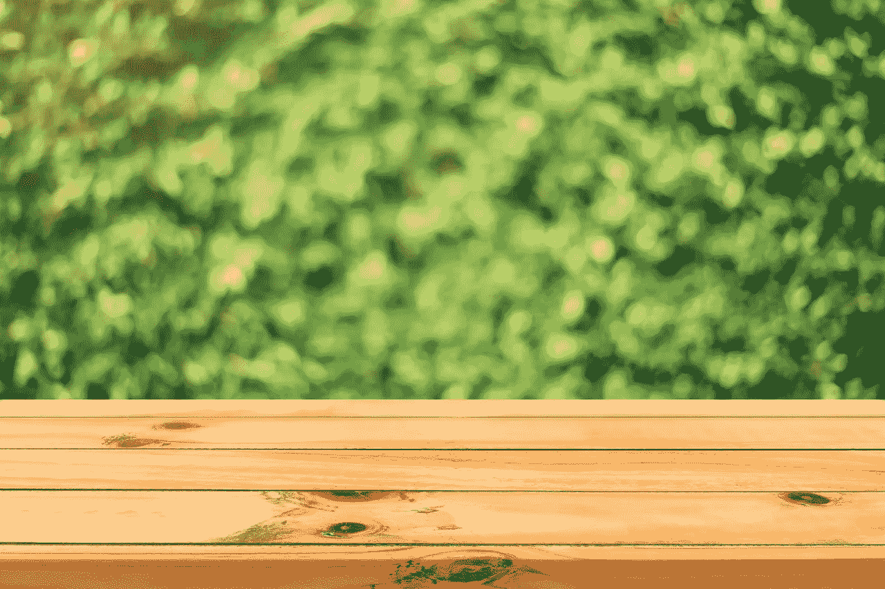
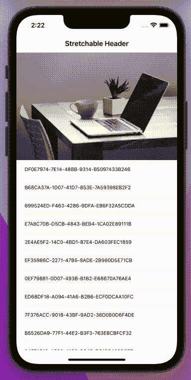
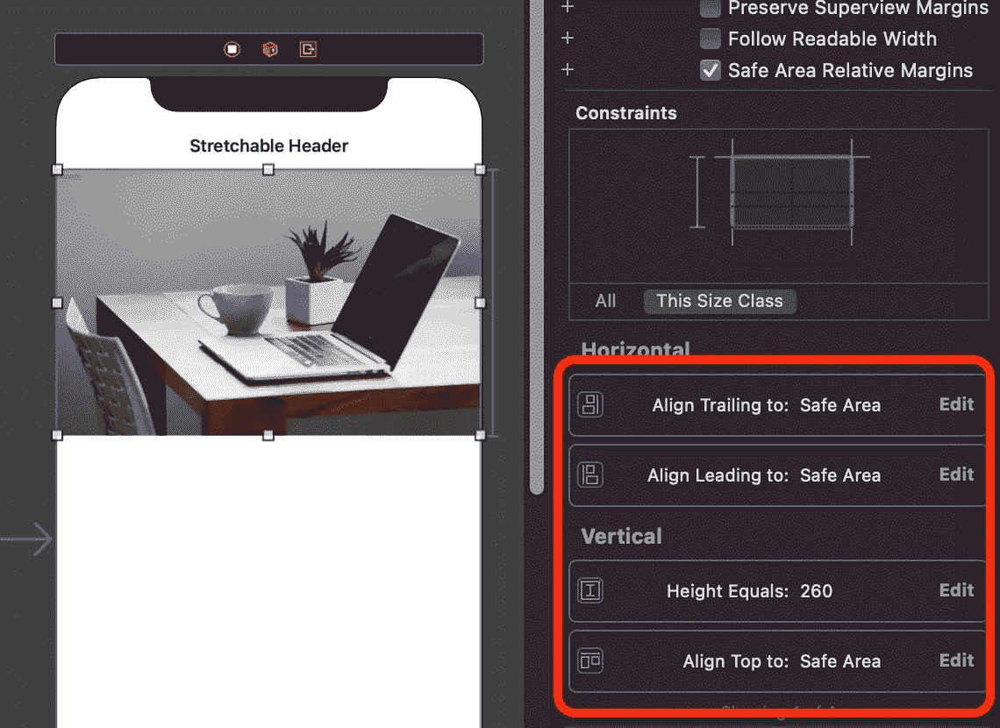
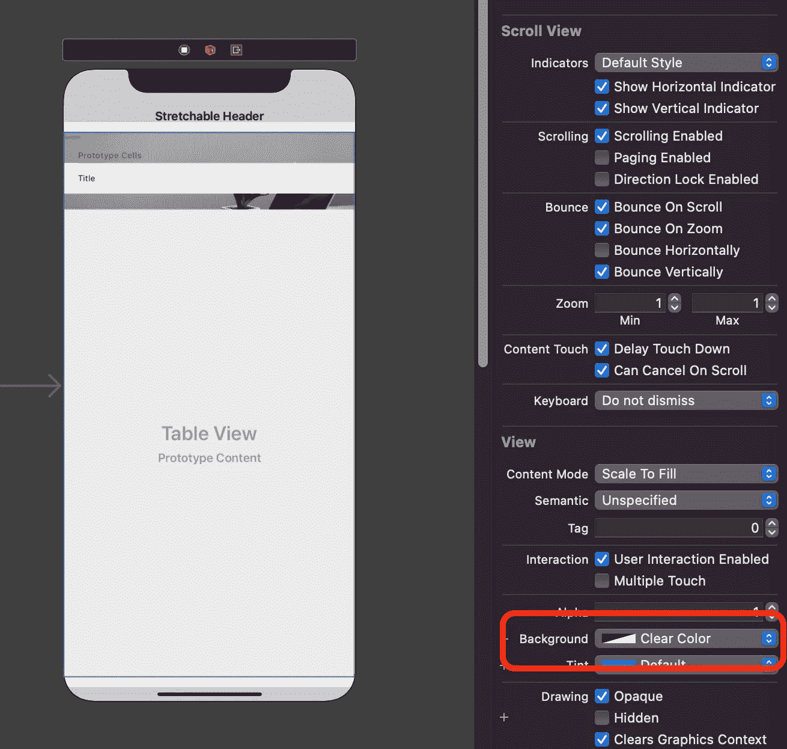
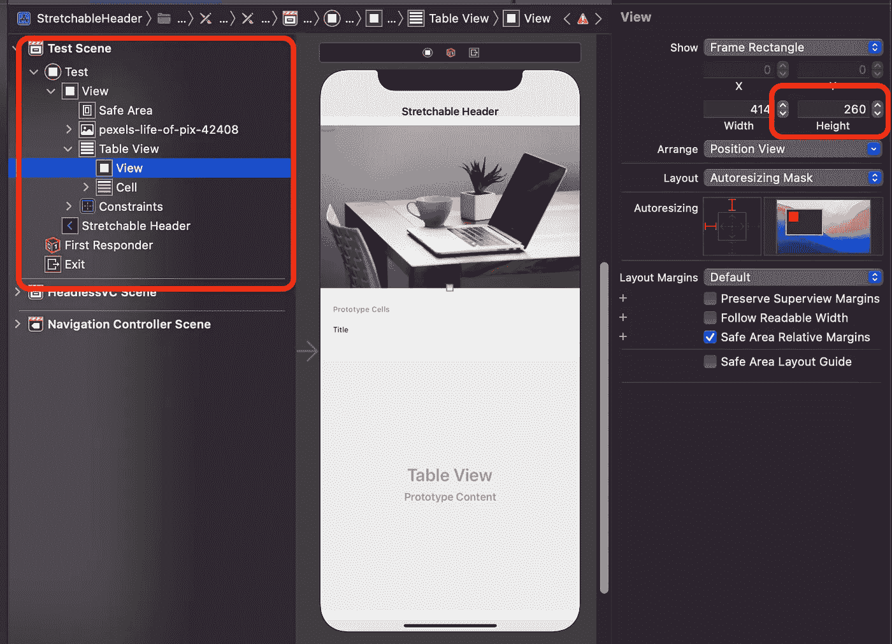

# UITableView 中的可拉伸标题

> 原文：<https://blog.devgenius.io/stretchable-headers-in-uitableview-b58aaf5fd809?source=collection_archive---------8----------------------->

## 为您的 UITableView 构建外观现代的标题



来自 [Pexels](https://www.pexels.com/it-it/foto/panca-in-legno-marrone-347140/?utm_content=attributionCopyText&utm_medium=referral&utm_source=pexels) 的[tira chard kumtanam](https://www.pexels.com/it-it/@tirachard-kumtanom-112571?utm_content=attributionCopyText&utm_medium=referral&utm_source=pexels)照片

近年来，随着大图像被用作列表的标题，移动应用变得越来越流行。如您所知，一张图片胜过千言万语，所以一张大照片可以帮助用户更好地理解屏幕内容。当然，用户体验的很大一部分是通过与软件组件的出色手动交互来提供的，在 UI 中模拟某种弹性行为更好，感觉也更自然，而且，过去某个时候，有人说过“*如果当用户拉下桌子时，图像会越来越大，这不是很酷吗？如果当用户向上滚动这个列表时，这个漂亮的大图像会消失，这不是更酷吗？*”于是**伸缩头套**诞生了！

在我的 iOS 职业生涯中，我见过这些效果的许多不同实现……有些简单，有些难以再现，有些线性，有些非常复杂。在本文中，我将向您展示我的方法。😉

在视频中，您可以看到最终结果:



这种效果是用一个非常简单的技巧产生的。

不要把标题放在`UITableView` `view`里面，只需要用一个`UIImageView`把它放在桌子下面。是的，就在桌子下面！约束图像视图的侧面和顶部，并根据您的需要设置高度约束。给图像赋予内容模式**纵横比填充**。这很重要。如果没有这一点，当用户拉桌子时，您将不会体验到图像缩放。



添加图像

然后在图像上添加`UITableView`并将四边约束添加到控制器的安全区域。给出一个透明的背景。这将是下一段所需要的。



添加一个可视视图并给出清晰的背景

对于故事板的最后一段，在表格上添加一个`UIView`作为标题，并赋予它一个透明的背景色。给这个视图的高度取一个值，该值将等于上一个例子中用于高度约束的高度，在我们的例子中是 260。



不用说，您必须向表中添加一个原型单元格。

现在让我们继续我们的 viewController。创建两个`IBOutlet`，一个用于表格，另一个用于可拉伸图像的高度约束。然后添加一个`CGFloat`变量来记录约束本身的初始参考值，我们稍后会看到它的含义:

```
**@IBOutlet** **weak** **var** cnstHeaderHeight: NSLayoutConstraint!
**@IBOutlet** **weak** **var** tableView: UITableView!**var** refConstraintValue: CGFloat?
```

对于这个例子，我创建了一个简单的 UUID 列表，如下所示:

```
**var** items = (0…30).map { _ **in** UUID().uuidString }
```

如果你对使用`map`操作符感兴趣，看看我最近写的另一篇文章:

[](https://betterprogramming.pub/map-compactmap-and-flatmap-in-swift-4ea4f1a39cbd) [## Swift 中的地图、紧凑地图和平面地图

### 如何以及何时使用它们

better 编程. pub](https://betterprogramming.pub/map-compactmap-and-flatmap-in-swift-4ea4f1a39cbd) 

是时候将我们的`delegate`和`datasource`添加到控制器的启动序列中了:

很好，现在让我们实现一个非常简单的`UITableViewDataSource`:

好了，我们的控制器完成了，但是正如你可以想象的那样，对标题图像没有任何影响。
你可能知道`UITableViews`是从`UIScrollViews`派生出来的，但你可能不知道`UITableViewDelegate`是从`UIScrollViewDelegate`派生出来的，所以我们可以实现这个委托，并用它来读取表格中可滚动区的位置，即纵轴上的位置。使用这个值，我们将修改标题图像高度的实时值:

*   第 5 行:如文章开头所述，如果值 nil 被设置为高度约束的参考值。稍后将用于一些计算。
*   第 12 行:当高度大于零时，我将其作为高度约束，否则我将其设置为零，因为尺寸不能为负。如您所见，y 偏移为零的初始值给出了原始高度，即`refConstraintValue`本身。如果`finalHeight`变得比参考值大，图像变大。如果变小，图像会缩小，保持在视图的中心位置，如原始视频所示。

正如你所看到的，这种方法非常简单，可以轻松地给你带来惊人的效果。一旦你知道了垂直偏移量的值，你就可以实现任何事情。例如，你可以创建一些现代化的用户界面，其标题只在需要时才淡入(我为此添加了一个自定义视图):


这种效果是通过在`scrollViewDidScroll`结束时简单调用下一个函数来实现的:

其中`navView`是我们的可褪色导航视图，150，62 是根据经验选择的幻数(永远不要使用它们…)以创造一个好的效果。为了将值限制在 0 和 1 之间，我还使用了箝位函数。

我希望你喜欢这篇文章，如果你喜欢，请鼓掌。
如果这篇文章对你有用，请随意[给我一杯咖啡](https://www.buymeacoffee.com/dy59tqxn794)，并允许我创作更酷的内容和文章。

享受你的编码！