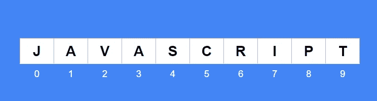

# JS 系列# 5:JS 中的字符串

> 原文：<https://blog.devgenius.io/string-in-js-6a410990719?source=collection_archive---------17----------------------->

## 你想知道的关于弦的一切

> 字符串是一组字符或文本。


诺亚·卡特在 [Unsplash](https://unsplash.com?utm_source=medium&utm_medium=referral) 上拍摄的照片

在 JS 提供的 5 种[数据类型](https://medium.com/@maheshshittlani/first-step-of-learning-js-6f83e446a341)中，String 是使用最多的类型。字符串是组合在一起的字符序列。

1.  字符串必须用引号括起来
2.  为了在 JS 中包装字符串，使用了单引号和双引号。

```
let firstName = "Jim"
let msg = 'It really a fun to write on medium'
```

无论使用单引号还是双引号，字符串值都是一样的。

> 不允许嵌套引号。

若要在字符串中使用双引号，请用单引号将字符串值括起来。类似地，在字符串中使用单引号，将字符串值括在双引号中。要理解这一事实，请阅读下面的例子…

```
let publisherName = 'O' really' // error
let publisherName = "O' really" // Correctlet msg = 'Happy birthday "Jim Stark"' //Correct
```

# 字符串索引

> 字符串被索引。



字符串索引

字符串中的每个字符都有一个相关的索引，也可以说是位置索引。有了这个索引，字符串中的每个字符都可以单独访问。使用字符串`subscript operator []`访问单个字符。

`String`索引总是从 0 开始。与 python 和 Go 等其他编程不同，JavaScript 不支持负索引。

```
let str = 'JAVASCRIPT';console.log(str[0])  // J
console.log(str[4])  // S
console.log(str[15]) // undefined
console.log(str[-1]) // undefined
```

> 每个`String`都有一个名为`length`的属性与之相关联。

`length`属性返回`String`中的字符总数。

```
let str = 'JAVASCRIPT'
console.log(str.length); // 10
```

## 使用长度属性访问最后一个字符

```
let str = 'JAVASCRIPT'
console.log(str[str.length - 1]) // T
```

## JavaScript 字符串是可变的

JavaScript 中的字符串在创建后可以更改，所以 JavaScript 字符串是可变的。
让我们用一个例子来了解事实…

```
let name = 'Kim'
name[0] = 'J'
console.log(name) // Jim
```

# 字符串转义

字符串转义也称为`Escape characters`、`Escape Notation`、`Escape Sequences`是字符串中具有特殊含义的字符的组合。

## 转义序列的公共列表

1.  \n —换行
2.  \t —制表符
3.  \' —单引号
4.  \" —双引号

在 MDN 上找到[转义序列](https://developer.mozilla.org/en-US/docs/Web/JavaScript/Reference/Global_Objects/String)的完整列表。理解下例中转义字符是如何工作的…

```
console.log("Hello\nJavaScript") // Hello
                                   // JavaScriptconsole.log("Hello\tJavaScript") // Hello    JavaScriptconsole.log('You shouldn't learn JS for animation') // Errorconsole.log('You should\'t learn JS for animation') // OKconsole.log("You shouldn't learn JS for animation") // OK
```

## 编写长字符串

JS 中的一个字符串不能换行，要写一个跨多行的字符串有两种方法…

1.  我们可以使用 concatenate(+)操作符将拆分成多行的字符串连接起来——参见下面的示例 1……
2.  您可以在每一行的末尾使用反斜杠字符(\)来表示该字符串将延续到下一行—参见下面的示例 2…

```
**Example-1:** console.log("This is very long string that will wrap "+
"in multiple lines otherwise my code will be unreadable")**Example-2:** console.log("This is very long string that will wrap \
in multiple lines otherwise my code will be unreadable")
```

# 模板字符串文字

模板字符串文字是允许嵌入表达式的字符串，表达式将被计算并转换为结果字符串。

```
`I have counted ${6 + 6} apples` // I have counted 12 apples
```

> 模板字符串用反勾号括起来。

模板字符串包含在反斜杠(``)中。不要用单引号括起来。

允许使用模板字符串文字嵌套`single quotes('')`和`double quotes("")`。

模板字符串中的表达式被写入`curly braces {}`，所有表达式都以`Dollar($)` 符号为前缀。

```
let username = 'Alex'
`Welcome back, ${username}``Game over ${username.toUpperCase()}`
```

让我们看看更多的模板字符串文字的实时例子…

```
**Example-1:**
let animal = 'Dog'
let sounds = 'Boo Woo!!
'console.log(`My ${animal} sounds like ${sound}`)**Example-2:** let item = 'Barbie';
let qty = 5;
let unitPrice = 50;
console.log(`You bought ${qty} ${item}, Total price: $${unitPrice * qty}`)// You bought 4 Barbie, Total price: $250
```

如果你喜欢这篇文章，请关注我:

【中:】[https://medium.com/@maheshshittlani](https://medium.com/@maheshshittlani)
**Github:**[https://github.com/maheshshittlani](https://github.com/maheshshittlani)
**LinkedIn:**[https://in.linkedin.com/in/mahesh-shittlani-638b7429](https://in.linkedin.com/in/mahesh-shittlani-638b7429)