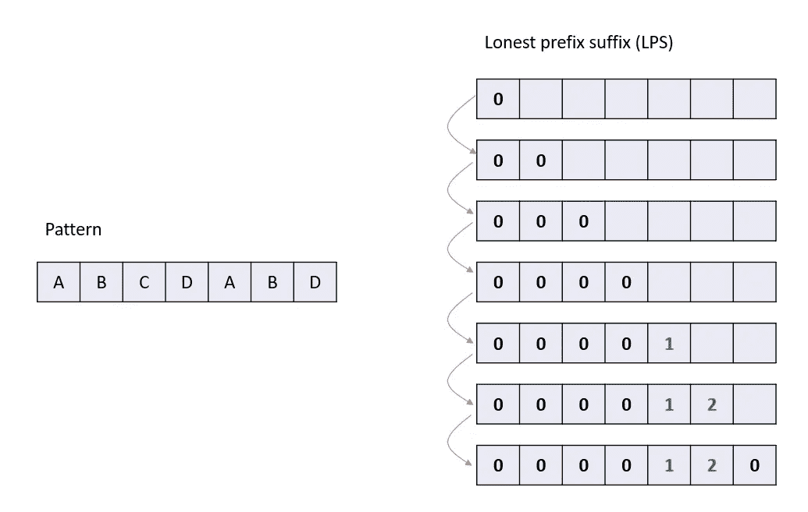

# 字符串匹配— KMP

> 原文：<https://blog.devgenius.io/string-matching-kmp-ccad1ffbeb11?source=collection_archive---------11----------------------->


[基兰伍德](https://unsplash.com/@kieran_wood?utm_source=unsplash&utm_medium=referral&utm_content=creditCopyText)在 [Unsplash](https://unsplash.com/s/photos/puzzle?utm_source=unsplash&utm_medium=referral&utm_content=creditCopyText) 上拍摄的照片

Knuth Morris & Pratt 算法。

在一种简单的字符串匹配方法中，每当我们遇到模式和目标字符串之间的不匹配时，我们只在目标中向前移动一步，并从头开始匹配整个模式。部分匹配会导致额外的计算时间。通过使用 LPS 表可以跳过那些部分匹配，从而避免在寻找部分匹配时不必要的旧比较，这是该算法的主要思想。在了解 LPS 表之前，让我们先了解一些术语。

**前缀**:一个字符串中的所有字符，以一个或多个结尾截断。`a, ab, abc, abcd`是`abcdabd`的前缀。

**后缀**:一个字符串中的所有字符，有一个或多个，在开头截断。`dabd, abd, bd`是`abcdabd`的后缀。


## LPS 表

在 KMP 算法中，我们准备了一个表，叫做 LPS 表。在 **LPS 表**中，我们将模式的每个字符映射到一个值。映射到每个字符的值，即 LPS[i]代表最长固有前缀的长度，该前缀也是第一个`i`字符中的后缀，其中`0<i<len(pattern)-1`。

*   **步骤 1 —** 定义一个大小等于模式长度的列表。
*   **第二步—** 定义变量 **i & j** 。设置 i = 0，j = 1，LPS[0] = 0。
*   **步骤 3 —** 比较**图案【I】**和**图案【j】处的字符。**
*   **步骤 4 —** 如果两者匹配，则设置`LPS[j] = i+1`并将两个 i & j 值增加 1。转到步骤 3。
*   **步骤 5 —** 如果两者都不匹配，则检查变量`i`的值。如果是`0`，则设置 **LPS[j] = 0** ，并将`j`值增加 1，如果不是`0`，则设置 **i = LPS[i-1]** 。
*   **步骤 6-** 重复上述步骤，直到 LPS[]的所有值都被填充。



```
def compute_lps(pattern):
    lps = [0] * len(pattern)
    prefix = 0
    for i in range(1, len(pattern)):
        while prefix and pattern[i] != pattern[prefix]:
            prefix = lps[prefix - 1]
        if pattern[prefix] == pattern[i]:
            prefix += 1
            lps[i] = prefix
    return lpspattern = 'abcdabd'    
print(compute_lps(pattern))
```


## LPS 表的搜索/使用

在 KMP，当我们遇到不匹配时，KMP 不是在目标文本中向前移动一个符号并从模式字符串的最开始处开始，而是使用 LPS 从发生不匹配的完全相同的地方继续。

当出现不匹配时，我们使用 LPS 表来决定跳过多少字符进行比较。
当出现不匹配时，检查模式中不匹配字符的前一个字符的 LPS 值。如果是`0`，那么开始比较模式的第一个字符和文本中不匹配字符的下一个字符。如果不是`0`，则开始将索引值等于前一个字符的 LPS 值的字符与模式中的不匹配字符和文本中的不匹配字符进行比较。

```
def kmp(pattern, text):
    match_indices = []
    pattern_lps = compute_lps(pattern)

    patterni = 0
    for i, ch in enumerate(text):

        while patterni and pattern[patterni] != ch:
            patterni = pattern_lps[patterni - 1]

        if pattern[patterni] == ch:
            if patterni == len(pattern) - 1:
                match_indices.append(i - patterni)
                patterni = pattern_lps[patterni]
            else:
                patterni += 1 return match_indices
```


KMP 算法的时间复杂度是 O(m+n)。空间复杂度为 O(m)。