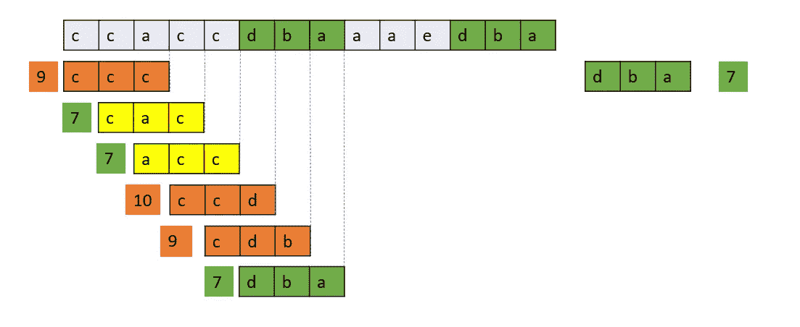

# 与 Rabin Karp 匹配的字符串

> 原文：<https://blog.devgenius.io/string-matching-with-rabin-karp-ea37370a60ee?source=collection_archive---------4----------------------->


由 [Ashkan Forouzani](https://unsplash.com/@ashkfor121?utm_source=unsplash&utm_medium=referral&utm_content=creditCopyText) 在 [Unsplash](https://unsplash.com/s/photos/puzzle?utm_source=unsplash&utm_medium=referral&utm_content=creditCopyText) 上拍摄

模式搜索

给定一个字符串和一个模式，查找在该字符串中找到该模式的所有索引。

强力:将给定的模式与文本中的所有位置进行比较。


```
s = 'ccaccdbaaaedba'
pattern = 'dba'n = len(s)
pw = len(pattern)res = []
for i in range(n-pw+1):
    if s[i:i+pw] == pattern:
        res.append(i)

print(res)
```

在上述方法中，如果**模式的大小是 M** 并且**串的大小是 N** ，则搜索的复杂度是 **N*M** 。如果我们比较字符串的子串(模式长度窗口)的散列，并将其与模式的散列进行比较，我们可以改进这一点。



```
n = len(s)
pw = len(pattern)
code = {'a' : 1, 'b' : 2, 'c' : 3, 'd' : 4}def get_hash(word):
    return sum([code[char] for char in word])res = []
pattern_hash = get_hash(pattern)
for i in range(n-pw+1):
    if get_hash(s[i:i+pw]) == pattern_hash and s[i:i+pw] == pattern:
        res.append(i)

print(res)
```

这是一个简单的散列函数，它将代码值相加。由于本质上是相加的，它将不能区分`aab` & `aba`，因为两者将具有相同的散列码(1+1+2 == 1+2+1)。我们可以通过让散列函数知道顺序来改进这一点。

```
n = len(s)
pw = len(pattern)def get_hash(word):
    return sum([code[char]*(10**(pw-1-idx)) for idx,  char in enumerate(word)])res = []
pattern_hash = get_hash(pattern)for i in range(n-pw+1):
    if get_hash(s[i:i+pw]) == pattern_hash and s[i:i+pw] == pattern:
        res.append(i)

print(res)
```

在上面的逻辑中，我们已经通过根据它们的顺序将系数引入到字符代码中来去除虚假命中。但是我们正在计算每个子串的散列。我们需要改进哈希值的计算，这样我们就可以使用最后计算的哈希值来计算哈希。这被称为滚动散列。此外，由于我们使用指数，我们可能会遇到计算出的散列非常大的情况。为了避免这种情况，我们可以使用预定义常数的 mod，比如质数。


瞧，我们已经达到了拉宾-卡普算法。Rabin-Karp 给出了字符串匹配的滚动哈希策略。哈希算法如下。

```
hash(txt[s+1..s+m]) = d(hash(txt[s..s+m-1])-txt[s]*h)+txt[s+m])%q
```

其中:

> d →字符串空间中可能的字符数
> q →质数
> h → d^(m-1)

Rabin Karp 算法首先将模式的哈希值与文本的当前子字符串的哈希值进行匹配，如果哈希值匹配，则只有它开始匹配单个字符。

上述算法的代码。

```
def rabin_karp(pattern, text):
    d = 26 # a b c ... z
    q = 5381 # large prime number
    m = len(pattern)
    n = len(text)
    p = 0 # hash for pattern
    t = 0 # hash for text
    h = 1
    i = 0
    j = 0

    res = []

    for i in range(m-1):
        h = (h*d) % q

    for i in range(m):
        p = (d*p + ord(pattern[i])) % q
        t = (d*t + ord(text[i])) % q

    for i in range(n-m+1):
        if p == t:
            for j in range(m):
                if text[i+j] != pattern[j]:
                    break
            j += 1
            if j == m:
                res.append(i)

        if i < n-m:
            t = (d*(t-ord(text[i])*h) + ord(text[i+m])) % q

            if t < 0:
                t = t + q

    return restext = "ccaccdbaaaedba"
pattern = "dba"
print(rabin_karp(pattern, text))
```

Rabin-Karp 算法的平均和最好的运行时间是 O(n+m)，但是它的最坏情况时间是 O(nm)。最坏情况的一个例子如下:

```
pattern = 'aaa'
string = 'aaaaaaaa' 
Here At every charcter hash will match and will have to **compare n characters m times.**
```

编码快乐！！！