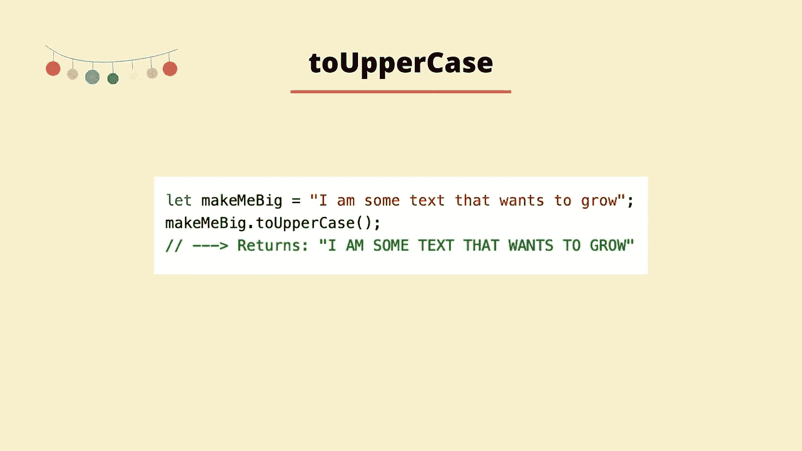
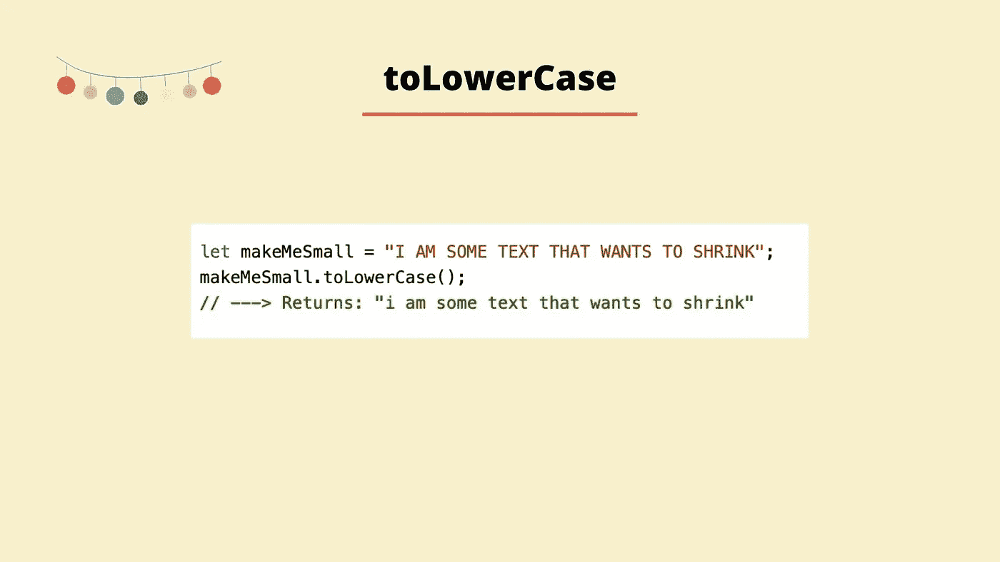
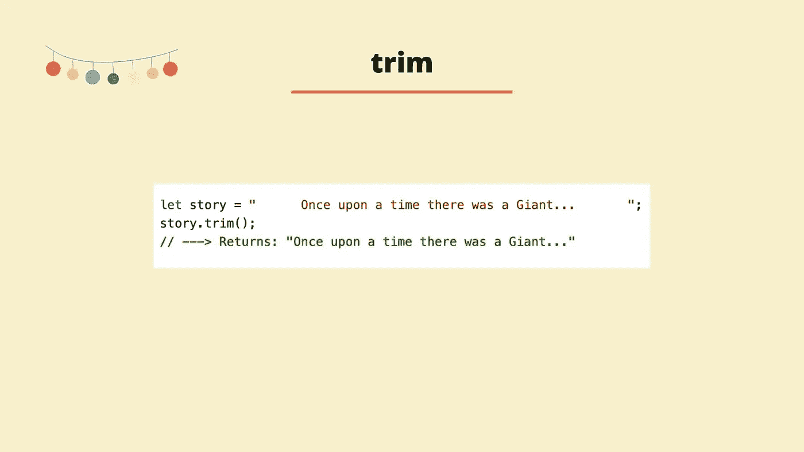
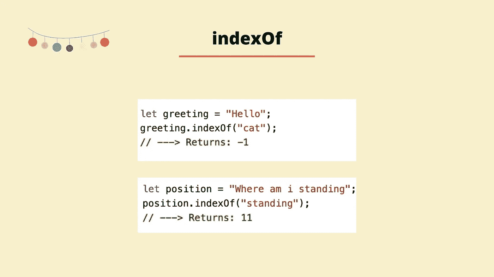
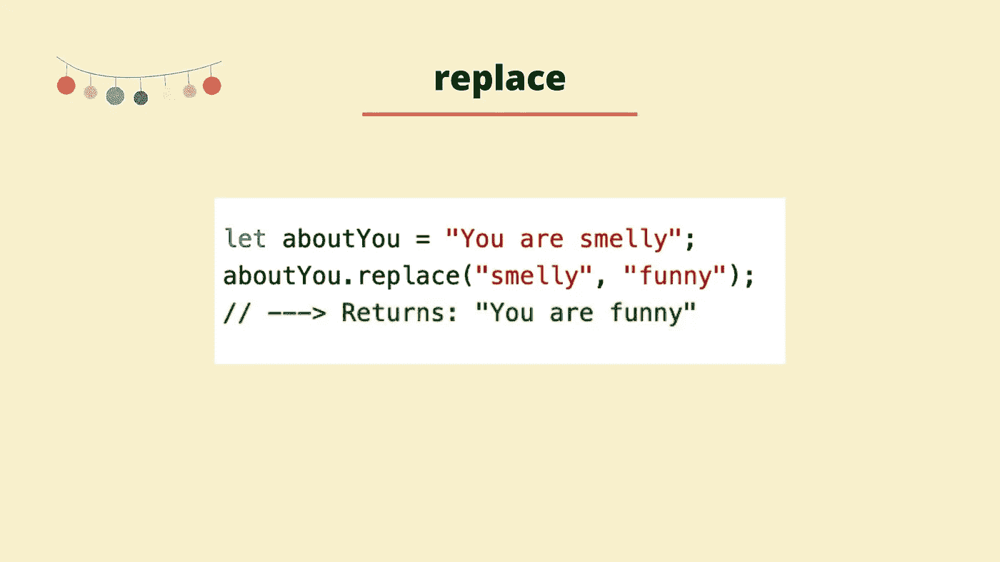
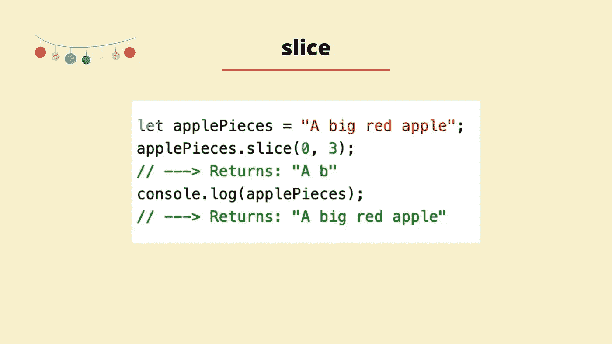
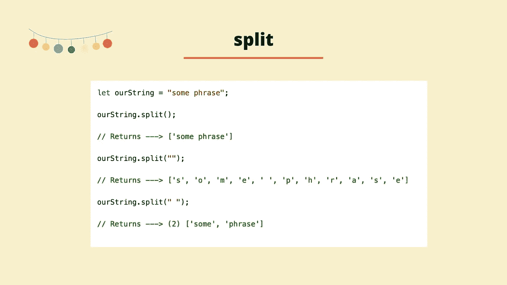
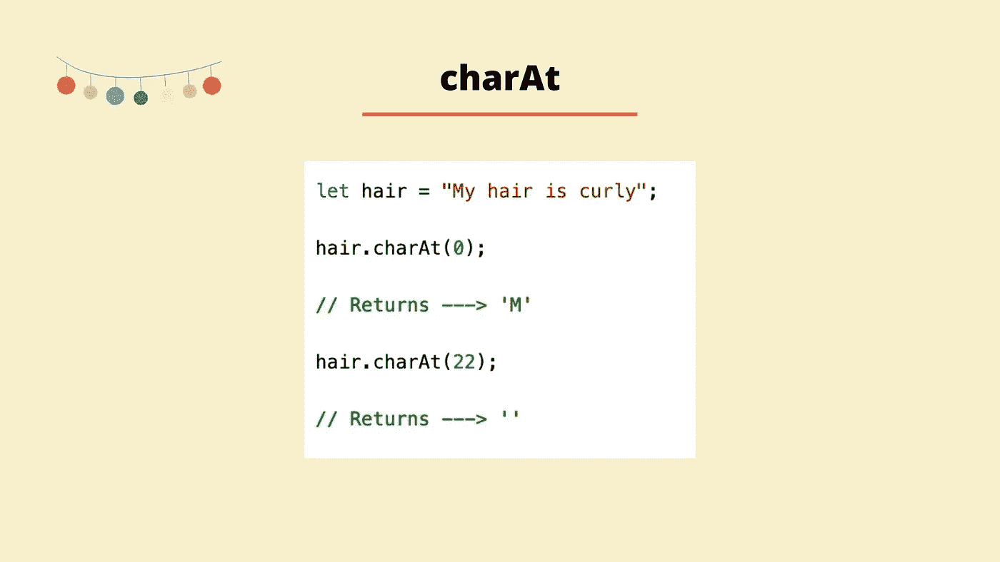
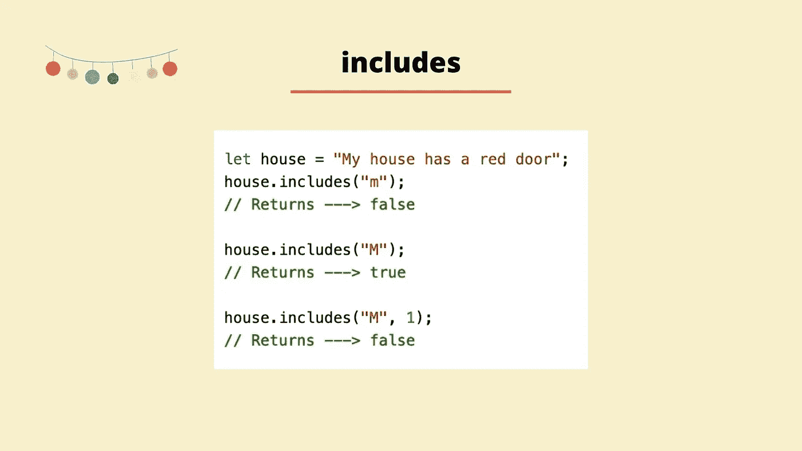
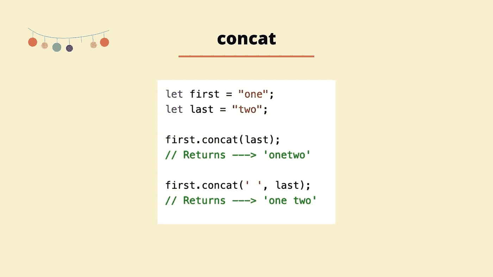

# 介绍 JavaScript 中的十种字符串方法

> 原文：<https://blog.devgenius.io/string-methods-a843f32ad87d?source=collection_archive---------12----------------------->

我最近发表了一篇[文章](/a-visual-beginners-guide-to-strings-in-javascript-4fb0abc923dd)介绍 JavaScript 中的字符串，让我们接着看十字符串方法。

## toUpperCase

*toUpperCase* 方法将把字符串中的所有字符转换成大写字符。方法不修改非文本字符。该方法的返回值是带有大写字符的字符串。

在上面的例子中，我们从用一串文本初始化变量 *makeMeBig* 开始。接下来，我们在字符串上调用 *toUpperCase* 方法。调用此方法的返回值是整个字符串，但要大写。

## toLowerCase

toLowerCase 方法将字符串中所有大写的文本字符转换成小写。该方法的返回值是所有字符都是小写的字符串。

在上面的例子中，我们首先用一个包含所有大写字母的字符串初始化一个名为 *makeMeSmall* 的变量。接下来，我们在这个字符串上调用 *toLowerCase* 方法。我们返回的是字符串，但整个字符串都是小写的。

## 整齐

如果我们正在处理一个在开头或结尾有多余空格的字符串，我们可以使用 *trim* 方法删除它。该方法的返回值是删除了空格的字符串。如果我们在一个开头和结尾都不包含空格的字符串上使用这个方法，那么我们将返回没有任何改变的原始字符串。

在上面的例子中，我们首先创建一个名为 story 的变量，我们用一个开头和结尾都有空格的字符串初始化它。然后我们调用字符串上的 *trim* 方法。调用该方法后的返回值是去掉了开头和结尾空格的字符串。

## 索引 Of

如果我们想找到字符串中特定字符的位置，我们可以使用 *indexOf* 方法。在方法内部，我们传递我们正在寻找的字符或值。该方法将返回该元素在字符串中第一个实例的位置。如果元素不存在，将返回-1。

在上面的第一个例子中，我们创建了一个名为*问候*的变量，并用字符串 *hello* 对其进行初始化。我们调用字符串上的方法的*index，并传入 *cat。*字符串 *c* at 在*问候*字符串中不存在，所以我们得到-1 作为返回值。*

在上面的第二个例子中，我们用一个新的字符串初始化一个名为 *position* 的变量。接下来，我们寻找字符串*的索引。*字符串 *standing* 确实存在于字符串中，所以我们得到返回给我们的字符串的索引，因为字符串的索引是**零**是索引 11。

## 替换

*replace* 方法从字符串中提取一段，并用新值替换它。replace 方法有两个参数:

*   第一个参数是字符串中要替换的值。
*   第二个参数是要用来替换第一个值的值。

replace 方法仅替换值的第一个实例，它不会更改该值的任何重复出现的实例。该方法的返回值是带有替换值的字符串。

在上面的例子中，我们首先用一个字符串初始化一个名为 *aboutYou* 的变量。我们想把字符串中的最后一个词从*臭*替换成*好笑*。为此，我们在字符串上调用 *replace* 方法，传入我们想要更改的元素，然后传入我们想要更改该元素的内容。然后运行该方法，并返回新版本的字符串。

## 薄片

*slice* 方法从一个现有的字符串中删除一部分，并返回给我们。Slice 接受两个参数，开始索引和可选的结束索引。

起始索引是应该从中获取该部分的字符串的索引。结束索引是该部分应该停止的字符串的位置。结束索引不包括在内，如果您将 5 作为结束索引传递，该部分将一直计数到 5，但不包括 5。如果只有一个参数传递给该方法(起始索引)，那么该部分将从该索引开始，一直延续到字符串的末尾。如果传入一个不存在于字符串中的起始索引，那么将返回一个空字符串。

在上面的例子中，我们用一个字符串初始化一个变量 *applePieces* 。我们继续在字符串上调用 slice 方法，并传入 0 和 3。这相当于说，从索引 0 开始，取字符串的一部分，一直到索引 3。该方法的返回值是字符串中已经被切片的部分，因此，我们得到从索引 0 到(但不包括)第三个索引的字符串部分。

## 使分离

方法会将一个字符串分割成子字符串，并将这些子字符串放入一个数组中，然后返回该数组。该方法有两个参数，但这两个参数都是可选的。第一个参数是*分隔符*，它表示每个拆分应该发生在哪里。第二个参数称为*极限*。limit 必须是正数，并说明可以返回的子字符串的数量限制。

在上面的例子中，我们声明了变量 *ourString* 。然后用字符串 *some phrase 初始化 *ourString* 变量。*接下来，我们调用字符串上的 *split* 方法。我们不向该方法传递任何参数，所以它返回给我们一个数组中的单个字符串。

在下一步中，我们再次调用原始字符串上的方法，这一次我们将一个空字符串传递给方法参数。这次我们得到了一个数组，字符串中的每个元素都成为数组中的一个单独的元素。

在最后一个例子中，我们再次调用方法，这一次我们将空白传递给方法参数。这意味着每当字符串中存在空格时，就会发生拆分。我们得到一个包含两个元素的数组。

## chatAt

方法返回字符串中指定索引处的字符。该方法只接受一个参数，即您要查找的元素的索引。如果没有向该方法传入索引，则该方法将使用默认索引 0。该方法的返回值是索引处的字符，如果指定的索引处没有字符，则返回一个空字符串。

在上面的例子中，我们声明了一个名为 *hair* 的变量，并用一个字符串初始化它。接下来使用 *charAt* 方法，我们寻找索引为 0 的元素。这是然后返回给我们。接下来，我们再次调用方法，查找索引为 22 的元素。这个索引中没有元素，所以我们得到一个空字符串。

## 包含

*包括*方法，用于检查字符串中是否存在指定的元素，并返回一个*布尔值*(真或假)。该方法区分大小写，并接受两个参数。

第一个参数是要查找的字符串。第二个参数,*位置*是可选的，它是您想要查看的字符串的位置。如果没有定义可选参数，字符串将从索引 0 开始查找，因为这是默认值。

在上面的例子中，我们首先用一个字符串声明一个名为 *house* 的变量。接下来，我们使用 *includes* 方法来检查字符串是否包含字母 *m，*因为该方法区分大小写，并且字符串中字母 *m* 的唯一实例是大写的，所以我们得到 false 作为返回值。接下来，我们继续寻找字母 *M* 的大写对应。这确实存在，所以我们得到真实的返回。最后，我们再次寻找字母 *m* ，但是这次我们传入索引 1 作为我们想要寻找的位置。这次我们得到 false，因为字母 *m* 的唯一实例在索引 0 处。

## 串联

*concat* 方法将两个或多个字符串连接在一起，并返回一个包含连接元素的新字符串。该方法采用一个或多个参数，这些参数是您希望连接到原始字符串的字符串。

在上面的例子中，我们用字符串初始化了两个变量，*第一个*和*最后一个*。然后，我们继续对第一个变量调用 *concat* 方法，并将变量 *last* 作为参数传入。我们将两个字符串连接在一起作为返回值。

接下来，我们再次调用该方法，但这次我们传入一个空字符串，其中一些空格作为第一个参数，变量 *last* 作为第二个参数。我们首先返回变量*中的字符串*，接着是初始参数，它是一些空格，接着是第二个参数，它是变量*最后一个*中包含的字符串。

我希望你喜欢这篇文章，请随时发表任何意见，问题或反馈！

更多内容可以关注我！

我在 Instagram [这里](https://www.instagram.com/codecup_dev/)，你可以在 [Skillshare](https://www.skillshare.com/classes/JavaScript-fundamentals-Strings/1618487691) 上观看以上视频和更多内容。

下次见！