# 熊猫数据帧上的字符串操作

> 原文：<https://blog.devgenius.io/string-operations-on-pandas-dataframe-88af220439d1?source=collection_archive---------1----------------------->

## 字符串方法


来自[佩克斯](https://www.pexels.com/photo/beaded-multicolored-accessory-1339862/?utm_content=attributionCopyText&utm_medium=referral&utm_source=pexels)的[玛格达·埃勒斯](https://www.pexels.com/@magda-ehlers-pexels?utm_content=attributionCopyText&utm_medium=referral&utm_source=pexels)的照片

在本文中，让我们介绍可以在 pandas 数据帧上执行的字符串操作。

1.  转换为大写/小写/title case-str。上海峡。下海峡。标题
2.  strip，lstrip，rstrip
3.  使分离
4.  替换
5.  startswith，endswith，包含

# 1.转换为大写/小写/标题大小写

*示例 1:将 pandas dataframe 中一列的字符串转换成大写*

```
s1=pd.read_csv(**"s1.csv"**)
s1.head()
```

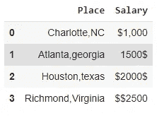

```
s1[**'Place'**]=s1.Place.str.upper()
s1.head()
```

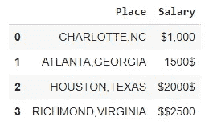

“位置”列中的所有值都转换为大写。

***示例 2:将 pandas dataframe 中一列的字符串转换为小写***

```
s1[**'Place'**]=s1.Place.str.lower()
s1.head()
```

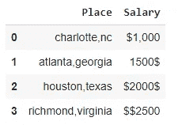

***例 3:将 pandas dataframe 中的一列字符串转换为 titlecase***

```
s1[**'Place'**]=s1.Place.str.title()
s1.head()
```

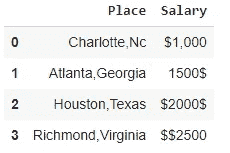

# 2.strip，lstrip，rstrip

***例 1:让我们把“$”从“薪水”一栏中去掉。前导和尾随' $ '符号。***

**去除** →用于去除提到的前导和尾随空格/字符。

```
s1[**'Salary'**]=s1.Salary.str.strip(**'$'**)
s1.head()
```

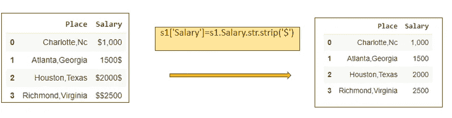

***例 2:让我们从“薪金”列中去掉前导' $ '。***

**lstrip** →用于删除前面提到的空格/字符。

```
s1[**'Salary'**]=s1.Salary.str.lstrip(**'$'**)
s1.head()
```


***例 3:让我们去掉“Salary”列后面的' $ '符号。***

**rstrip** →用于删除提到的尾随空格/字符。

```
s1[**'Salary'**]=s1.Salary.str.rstrip(**'$'**)
s1.head()
```

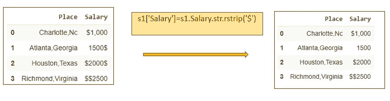

# 3.使分离

如果我们需要根据某个分隔符字符串将数据帧中的列分成两列，我们可以使用 str.split()函数

***示例 1:根据分隔符字符串“，”*** 将“地点”列拆分为“城市”和“州”列

```
s1[[**'City'**,**'State'**]]=s1.Place.str.split(**','**,expand=**True**)
s1.head()
```

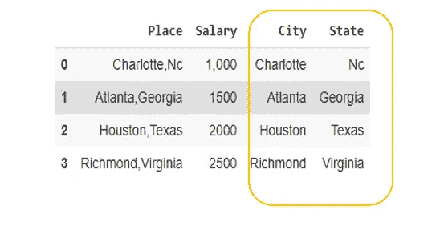

# 4.替换

如果我们需要替换 pandas 数据帧中一列的子串，我们可以使用 str。replace()函数。

***示例:将“州”列*** 中的“nc”替换为“北卡罗来纳”

```
s1[**'State'**]=s1.State.str.replace(**'nc'**,**'North Carolina'**)
s1.head()
```

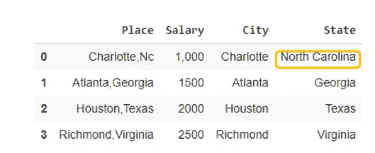

# 5.startswith，endswith，包含

## 开始于

*str。startswith("prefix")* →如果字符串以提到的" prefix "开头，则返回 True。
我们可以将这个函数应用于 pandas dataframe 中的一列，以过滤特定列中以提到的“子串”开头的行。

***示例 1:过滤“位置”列中以“C”开头的行***

```
s2=s1.loc[s1.Place.str.startswith(**"C"**)]
s2
```

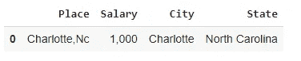

## 末端

*str。endswith("suffix")* →如果字符串以提到的" suffix "结尾，则返回 True。
我们可以将这个函数应用于 pandas dataframe 中的一列，以过滤特定列中以提到的“子串”结尾的行。

***例 2:过滤“位置”列中以“as”结尾的行***

```
s2=s1.loc[s1.Place.str.endswith(**"as"**)]
s2
```

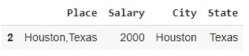

## 包含

***示例 2:过滤“Place”列中包含子字符串“lotte”的行***

```
s2=s1.loc[s1.Place.str.contains(**"lotte"**)]
s2
```

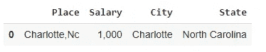

# 参考资料:

 [## API 参考- pandas 0.22.0 文档

### 这个页面给出了所有公共熊猫对象、函数和方法的概述。一般来说，所有的类和函数…

pandas.pydata.org](https://pandas.pydata.org/pandas-docs/version/0.22/api.html#string-handling) 

感谢阅读！

*如果你喜欢阅读我更多关于 Python 和数据科学的教程，
关注我的* [***中型***](https://medium.com/@IndhumathyChelliah) ***，*** [***推特***](https://twitter.com/IndhuChelliah)

*点击这里成为中等会员:*[*https://indhumathychelliah.medium.com/membership*](https://indhumathychelliah.medium.com/membership)