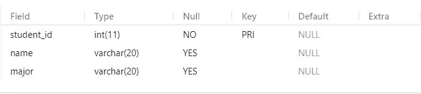
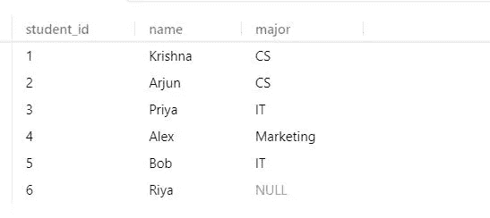

# 结构化查询语言(SQL):重要概念

> 原文：<https://blog.devgenius.io/structured-query-language-sql-import-624bc930927d?source=collection_archive---------2----------------------->

[https://pix abay . com/vectors/database-schema-data-tables-schema-1895779/](https://pixabay.com/vectors/database-schema-data-tables-schema-1895779/)

在本文中，我试图解释什么是 SQL，它的优点，以及它的重要概念，如果熟悉关系数据库，任何人都可以很容易地掌握这些概念。

**什么是 SQL？** 结构化查询语言(SQL)是一种计算机语言，用于处理数据库，或者更准确地说，用于处理关系数据库。

SQL 的优点如下，
它用于存储、操作或检索数据库中的数据。它允许我们访问、定义、描述和更新数据，并创建、删除或丢弃我们正在使用的表格和数据库。它还允许我们设置表的权限，这样只有特定的人才能访问它们，因此提供了一种保护个人数据的感觉。

使用 SQL 的主要优势之一是它允许我们使用一些 SQL 模块或库与其他语言集成。

SQL 使用命令与数据库交互，这些命令通常分为以下三组:

**DDL(数据定义语言):**它由用于定义数据库模式(结构)的 SQL 命令组成。它包括创建、更改、删除命令。

**DML(数据操作语言):**它由用于操作数据库中数据的命令组成，包括选择、插入、更新和删除等命令。

**DCL(数据控制语言):**由设置用户权限和其他控制的命令组成。它包括 GRANT 和 REVOKE 这样的命令。

为了使用或编写查询，我们需要一个关系数据库管理系统(RDBMS)。有各种 RDBMS 可用，如 MySQL、MS SQL Server、Oracle、MS Access。
我将使用 MYSQL 编写各种查询，并使用关系数据库。更多关于 MYSQL 的信息可以在[这里](https://www.tutorialspoint.com/mysql/index.htm)找到。

让我们先来看看我们将要使用的 SQL 中的一些基本数据类型，
INT 是标准整数，
FLOAT 是单精度浮点数，
DOUBLE 是双精度浮点数，
CHAR 是固定长度的字符串，
VARCHAR 是可变长度的字符串。
你可以在这里了解更多关于数据类型[的知识。](https://www.mysqltutorial.org/mysql-data-types.aspx)

现在让我们从 SQL 命令和查询开始……
在这里，我将用例子来解释如何使用各种 SQL 命令。

**创建数据库** 为了处理各种数据，我们应该先创建一个数据库。
创建学生数据库；
SQL 命令可以用大写和小写来写，我将用大写来写 SQL 命令。
这里需要注意的一点是，每个 SQL 查询都以分号(；).执行上述查询后，将创建一个名为 student 的数据库，现在我们可以在该数据库中创建表。

**创建表** 现在让我们创建一个包含学生 id、姓名和专业的简单表。
这里我们可以给出我们将在表格中使用的各种属性的数据类型。
创建如下所示的简单表格。

创建表格

现在假设我们必须向上面创建的表中添加另一列，那么我们该如何做呢？
这在 SQL 中非常简单，我们只需使用如下所示的 ALTER 命令，

该查询将向表 student 中再添加一列百分比。

现在假设我们想从表中删除一列，如下所示，下面的查询将删除我们在上面创建的 percentage 列。非常简单，我们只需在要删除的列前添加 DROP 命令。

从表中删除列

到目前为止，我们创建了一个表，修改并删除了该表中的一列，但我们不知道它是否真的被创建，我们应该有一些证据吧！
要查看一个表是否真的被创建或者是否被修改，我们可以使用 DESCRIBE 命令和表名，如下所示，
DESCRIBE student；
该命令将给出表格结构及其属性和类型，如下所示。

**将值插入表中** 现在让我们将值插入表中，这可以通过两种不同的方式完成。
首先，我们可以按照表格中列的顺序直接插入值，如下图所示。

其次，我们还可以通过如下方式指定列名来将值插入到特定的列中，

以类似的方式添加几个值后，我们的表将如下所示，

**更新表**的值
因为我们只在最后一行添加了 student_id 和 name，所以它在专业列中显示 NULL。但是我们也可以使用更新查询来编辑或修改它，如下所示:

在这里，让我告诉你关于 WHERE 子句当我们从表中获取数据时必须使用一些条件时，我们可以使用 WHERE 子句从表中获取或过滤所需的数据。

**选择查询**
SQL 中还有一个特殊的语句使我们的工作变得非常简单，这就是 Select 语句。这条语句帮助我们从数据库中获取表格形式的数据。假设我们必须从数据库中查看整个表，我们可以使用' * '和如下所示的 select 语句，
SELECT * FROM student；
该查询将获取学生表的所有列和行。

就像任何其他编程语言一样，即使是 MYSQL 也有一些内置函数，我们可以使用它们来简化我们的工作。
有些函数是 COUNT()、MAX()、MIN()、SUM()。
我们可以使用 COUNT()计算特定列中实体的数量，使用 MAX()计算列中的最大值，类似于使用 MIN()和 SUM()函数。
除了这四个还有更多功能。这个[站点](https://www.w3schools.com/mysql/mysql_ref_functions.asp)有关于这些功能的大量信息以及它们的描述。

**通配符** 当我们想在列中找到某种类型的模式时，我们可以使用通配符。常用的通配符有“_”和“%”。
假设在上面的表中，我们想要找到一个名字以‘A’开头的学生的名字，我们可以简单地运行下面的查询，

该查询将获取姓名以“A”开头的学生的所有姓名
我们可以尝试以下各种组合:

> 像“%A”将给出一个以“A”结尾的名称(大写 A，因为这里区分大小写，它将对“A”和“A”进行不同的解释)
> 像“%ab”将查找该特定名称(单词)中任何位置有“ab”的所有名称
> 像“_a%”将查找第二个字母为“A”的所有名称
> 像“a%b”将查找以“A”开头并以“b”结尾的所有名称。