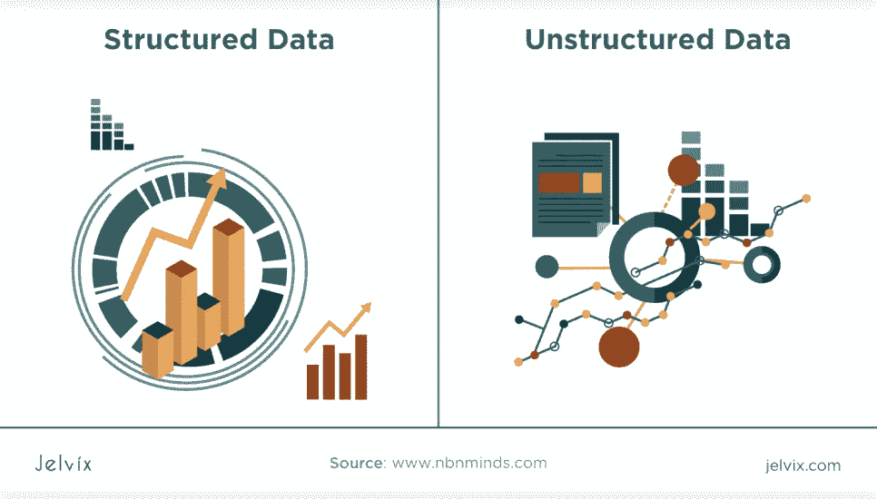
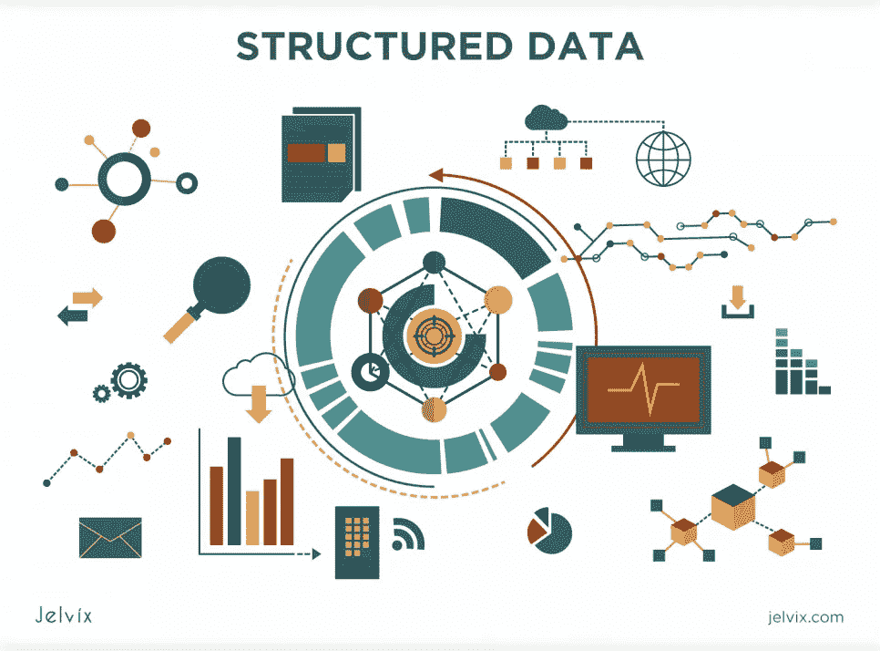
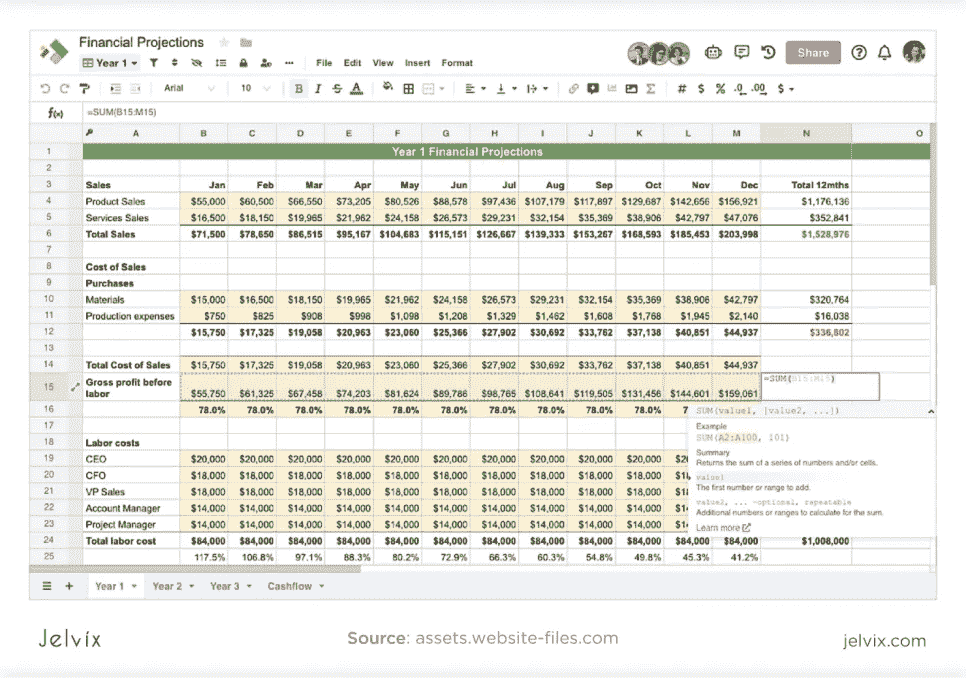
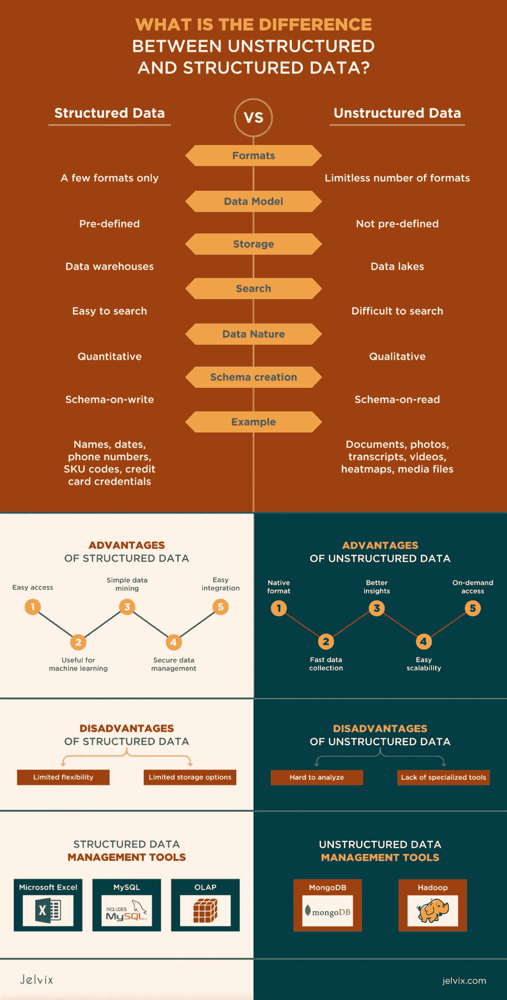
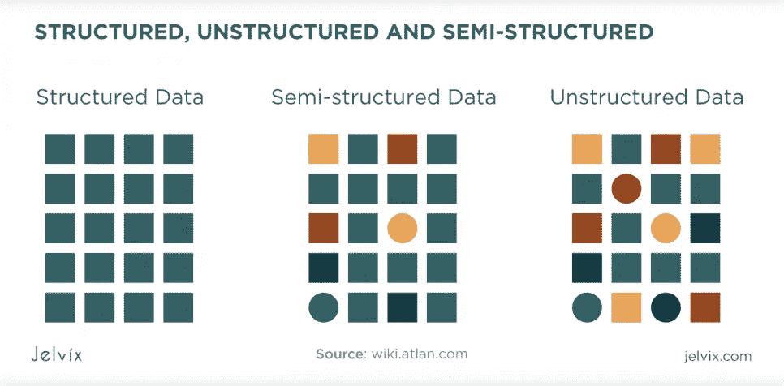

# 结构化数据与非结构化数据—有什么区别？

> 原文：<https://blog.devgenius.io/structured-vs-unstructured-data-what-is-the-difference-2bfb77782175?source=collection_archive---------21----------------------->

## 预计 2021 年的数据消耗量为 74。而且，这个数字到 2024 年底还会翻倍。

## 未来将是数据丰富的时代。机器学习和人工智能正在以极高的速度发展。结构化和非结构化数据的主要特征是什么？发现帖子中的主要区别。

如今，我们创建、共享和存储了海量数据。大企业和小公司处理它来运行他们的业务并获得有用的见解。数据是 21 世纪血管中的血液。

根据[财经在线](https://financesonline.com/how-much-data-is-created-every-day/)的研究，预计 2021 年数据消耗量为 74 Zettabytes。而且，这个数字到 2024 年底还会翻倍。一个 data 字节的数据包含十亿 TB。据估计，一个 zettabyte 硬盘可以存储 600 亿个视频游戏。

然而，大多数人对数据本身了解多少呢？

他们处理的信息是数字、名字或图像。在大多数情况下，所有的信息都分为结构化和非结构化。非结构化数据和结构化数据有什么区别？继续阅读这篇文章，发现你需要知道的关于结构化和非结构化数据的一切。

# 结构数据

结构化数据的定义非常简单。简而言之，它是一种符合特定标准的定量数据。它很容易组织、分类和分析。结构化数据的主要标准是所有记录具有相同的格式，并且由数字或符号组成。在大多数情况下，结构化信息存储在由行和列组成的[关系数据库](https://aws.amazon.com/relational-database/)中。

根据来自 [GeeksforGeeks](https://www.geeksforgeeks.org/what-is-structured-data/) 的结构化数据定义，它是一种人类或计算机可以轻松访问的数据类型。结构化数据通常借助 [SQL](https://en.wikipedia.org/wiki/SQL) (结构化查询语言)进行管理。它允许在用户和机器都能提交的请求的帮助下管理数据库中的数据。

通常，信息存储在数据仓库中，因为它很容易分析。这种类型的数据有一个预定义的数据模型，它不灵活，因为它总是匹配特定的标准。结构化数据的格式数量非常有限。

# 结构化数据的来源

结构化数据的定义是，用户和计算机都可以生成这种类型的信息，通常存储在关系数据库中。然而，计算机系统是结构化数据的主要来源。由于计算机是由特定的逻辑和算法驱动的，它们可以很容易地生成、存储和分析这种类型的数据。

SQL 数据库是结构化数据的主要来源。如今，机器在网上收集大量用户数据。例如，根据[最近的研究](https://9to5mac.com/2021/03/30/research-shows-google-collects-20x-more-data-from-android-than-apple-collects-from-ios/)，谷歌从 Android 和 iOS 设备中获取 1.3 TB 的数据。所有的数据包括许多关于用户如何使用他们的设备，他们安装了什么应用程序，他们花了多少时间在线等的记录。

结构化数据的另一个例子是由库存管理系统生成的 SKU 码。考虑到每种不同颜色、形状和尺寸的产品都必须有一个唯一的 SKU 编码，SKU 编码的数量每天都在急剧增加。因此，机器生成的结构化数据的数量不断增加。

然而，也有许多不同来源的结构化数据可以由用户生成。例如，电子表格、(在线事务处理)系统、在线表单和服务器日志都可以是结构化数据的来源。存储结构化数据最常见的文件格式是 XML 和 CSV。

# 结构化数据用例

包含重要客户信息的电子表格就是结构化数据的一个例子。它可能包含暗示姓名、年龄、职业、公民身份、国籍等的列。这种数据由数字和字母组成。每个单元格对应特定的信息，因此可以很容易地对其进行寻址。由于信息符合特定标准，用户可以应用公式。此外，他们还可以批量编辑数据，对数据进行排序，或者点击几下鼠标，选择符合特定标准的单元格。

此外，几乎所有的客户管理系统都只操作结构化数据。平均而言，它意味着关于客户的识别信息。这些数据是根据特定需求、支付细节和其他信息安排的。例如，它可能暗示第一次购买的日期、每月花费的金额或平均响应时间。由于所有数据都是结构化的，因此可以对其进行分析以获得有用的见解。

# 结构化数据的优势

*   **容易接近。**事实上，结构化数据的主要好处是计算机可以轻松管理它。由于所有信息都有特定的格式，算法可以快速处理它并提供有用的见解。此外，用户还可以访问和分析结构化数据。它有关系数据库使用的预定义的固定模式。
*   **对机器学习有用。近来，人工智能和机器学习技术发展迅速。结构化数据可以帮助开发者训练机器学习算法。它使算法的信息操作变得简单。在结构化数据的帮助下，算法学会管理非结构化数据。**
*   **简单的数据挖掘。**当用户需要获取特定信息时，结构化数据可以帮助节省大量时间。它使得搜索和提取过程快如闪电。即使电子表格包含数千行，用户也可以毫不费力地找到所需的行。
*   **安全的数据管理。公司使用的大量数据需要明智地存储。这可能意味着敏感信息或信用卡凭据。当所有数据都结构化后，就可以很容易地编码和解码。因此，使用结构化数据的公司即使在数据泄露的情况下也能保证客户信息的安全。**
*   **易于集成。**结构化数据可以轻松集成到其他平台中，并使用各种工具进行处理。例如， [CSV 格式](https://en.wikipedia.org/wiki/Comma-separated_values)的库存电子表格，包含产品名称、价格、图像、数量和其他特征，可以轻松集成到在线商店中。因此，用户只需点击几下鼠标，就可以创建数千张产品卡并经营一家在线商店。

# 结构化数据的缺点

*   **灵活性有限。**根据结构化数据定义，这类信息具有预定义的结构。因此，在大多数情况下，它仅用于特定的目的。它很难被更新或转换以用于不同的目的。
*   **有限的储物选项。**结构化数据存储在数据仓库中，数据仓库是具有严格模式的系统。因此，如果需求发生变化，用户需要更新所有数据。这可能需要大量的计算能力和时间。

# 结构化数据管理工具

的确， [Microsoft Excel](https://www.microsoft.com/en-us/microsoft-365/excel) 是管理结构化数据的便捷工具。它预见了以特定顺序排列所有数据、为单元格设置数据类型以及批量修改信息的能力。然而，它不是唯一用于管理结构化数据的工具，尽管它非常方便。有很多流行的工具用于此目的。最受欢迎的列举如下。

*   [**MySQL**](https://www.mysql.com/) **。**它是最流行的关系数据库管理系统，可以按行和列排列结构化数据。用户可以根据需要访问和修改数据。此外，该工具使搜索和更新任何结构化信息变得容易。
*   %20is,databases%20and%20supports%20complex%20analysis.&text=The%20databases%20that%20a%20business,transaction%20processing%20(OLTP)%20databases.)****。**该工具的名称代表在线分析处理。它帮助用户高效地分析集中存储的结构化数据。很多公司用它来进行全面的分析查询。**

# **非结构化数据**

**使用的另一种类型的数据是非结构化的。用于信息处理的普通工具很难处理定性数据。什么是非结构化数据？简而言之，非结构化数据定义了任何格式的所有信息。可以是图像、视频、歌曲、语音录音等。格式的多样性是无限的。**

****

**因为没有预定义的模型，所以它存储在非关系数据库中。所有非结构化信息都不会被处理，而是以其本机格式存储。它没有被安排，所以用户在处理大量非结构化数据时会遇到困难。此外，这种类型的信息占用了所有存储数据的大约 80%,使得任务更具挑战性。**

# **非结构化数据的来源**

**几乎任何东西都可能是非结构化数据的来源。如今，许多公司收集大量数据。但是，由于他们不能处理信息，他们把信息存储在数据湖中。这是按原样存储原始数据的完美解决方案。非结构化数据的一个例子是什么？可能是视频、邮件、博客帖子、热图等。**

**社交媒体平台和消息是非结构化数据的最大来源。与计算机不同，人们不喜欢保持一切统一。他们每秒钟都会生成大量内容，并在网上分享。根据[最近的统计](https://www.takeo.ai/can-you-guess-how-much-data-is-generated-every-day/)，用户每天产生 25 亿 GB 的内容。所有的媒体都是非结构化的内容，存储在不同科技巨头的服务器上。**

# **非结构化数据示例**

**探索非结构化数据的例子是理解这类数据的最佳方式。它可以帮助区分非结构化数据和结构化信息。简而言之，它是任何无法结构化和分析的信息，因为它不符合任何预定义的标准。因此，您目前正在阅读的出版物和所有媒体文件都是非结构化数据的例子。**

**数据挖掘是最有趣的非结构化数据示例之一。如今，许多公司对他们拥有的结构化数据的数量不满意。因此，他们在数据收集专家和人工智能的帮助下分析大量非结构化数据。这有助于他们获得额外的结构化数据，增强现有的洞察力。有时，非结构化数据可能是公司的重要信息来源。**

**此外，非结构化数据有助于创建聊天机器人。在大多数情况下，这种类型的数据用于帮助算法理解用户的请求。因此，聊天机器人可以引导用户找到合适的信息来源。此外，他们可以分享最普遍的问题的答案。它有助于提高客户服务经理的工作效率。**

# **非结构化数据的优势**

*   ****原生格式。**非结构化数据不需要符合特定要求。所以，不需要转换。人类和机器人生成的所有内容都按原样存储。**
*   ****快速数据采集**。收集非结构化数据很容易，因为它占据了互联网上大约 80%的信息。此外，因为它不需要预定义，所以没有任何限制可以挑选出特定的非结构化数据。**
*   ****更好的见解。**公司很少使用原始的非结构化数据，因为很难分析这种类型的信息。然而，它也可以是有用见解的重要来源，有助于获取有关客户或企业的数据。**
*   ****易于扩展。**非结构化信息存储在数据湖中，不需要符合特定要求。因此，如果添加了新信息，就不需要更新特定的数据库结构。云存储或本地服务器可以轻松扩展以存储非结构化数据。**
*   ****按需访问。**在大多数情况下，非结构化数据是按需访问的。所以，存放起来比较便宜。**

# **非结构化数据的缺点**

*   ****难以分析。**非结构化数据的主要缺点是格式的数量是无限的。很难通过分析获得新的见解。例如，非结构化数据可能意味着文本、视频、动画或图像。需要雇佣数据科学专家来分析它们并获得有用的信息。**
*   ****缺乏专门的工具。**由于非结构化信息不符合任何标准，因此少量工具可以管理这类数据。在大多数情况下，需要使用不同的工具来操作图像、视频、文本和其他数据类型。**

# **非结构化数据管理工具**

**尽管非结构化数据包含许多不同的格式，但仍需要对其进行管理。为了保持所有信息的有序和可访问性，需要使用特定的工具。选择最好的工具将帮助您找到适合您需求的工具。**

*   **[MongoDB。这是一个全面的平台，能够存储许多不同的数据类型。例如，在该工具的帮助下，用户可以使用不同的平台存储和使用非结构化文档。](https://www.mongodb.com/)**
*   **[**Hadoop**](https://hadoop.apache.org/) 。它是一种工具，能够管理和处理不同网络中的大量数据。此外，该工具没有所需的格式。因此，它可以管理任何类型的非结构化数据。**

****

# **结构化数据与非结构化数据:要点**

**对于“什么是结构化数据和非结构化数据的例子？”这个问题，很难给出完整的答案有很多特性需要考虑。**

**但是，下面的比较表将帮助您掌握结构化数据和非结构化数据的主要区别。**

****结构化数据/非结构化数据****

****格式**只有几种格式/无限种格式**

****数据模型**预定义/非预定义**

****存储**数据仓库/数据湖**

****搜索**易搜索/难搜索**

****数据性质**定量/定性**

****模式创建** [写模式](https://www.techopedia.com/definition/30899/schema-on-write) / [读模式](https://www.techopedia.com/definition/30153/schema-on-read#:~:text=Schema%20on%20read%20refers%20to,than%20as%20it%20goes%20in.)**

****示例**姓名、日期、电话号码、SKU 代码、信用卡凭证/**

**文档、照片、文字记录、视频、热图、媒体文件**

# **其他类型的数据**

**在过去的几十年里，公司需要应对越来越多的与数据存储和管理相关的挑战。因此，对于开发人员来说，只处理结构化数据和非结构化数据选项这样的数据量是非常有限的。所以其他类型的数据被开发出来以简化这个过程。**

# **半结构化数据**

**长期以来，许多开发人员努力在结构化和非结构化信息之间建立一座桥梁。于是，半结构化数据格式出现了。这是一种独特的格式，与上述任何一种格式都没有关系。粗略地说，它占用了整个数据的 5%并解决了特定的问题。这对企业来说至关重要，因为半结构化信息是结构化和非结构化信息的混合体。**

****

**一言以蔽之，类似于非结构化数据。然而，它使用的元数据带来了高效使用它的能力。例如，在这种数据类型的帮助下，用户可以整理文档、图像、视频等非结构化内容。它帮助管理者操作大量的非结构化信息。此外，他们可以获得更多的见解。**

**为了想象什么是半结构化数据，你需要仔细看看 [XML](https://developer.mozilla.org/en-US/docs/Web/XML/XML_introduction) ，一种标记语言。它帮助开发者和机器理解特定的数据应该如何排列。它是一种标签驱动的语言，帮助开发人员更新数据结构。**

# **[计]元数据**

**元数据是使半结构化数据可搜索和可分类的关键元素。它是一种特殊类型的数据，借助标签和语义标记来定义非结构化信息。它们可以识别特定的信息类型，并简化非结构化数据管理流程。**

**元数据最好的例子是图像可能有的替代文本。它有助于定义特定图片中显示的内容。不幸的是，谷歌算法无法识别所有图像来搜索正确的图像。Alt 标签帮助机器人识别图像，以便进一步搜索。元数据可以包括日期、位置和用于制作快照的硬件的技术规格等信息。**

# **结束语—数据的未来**

**感谢帖子中提供的信息，您可以找到以下问题的答案:“数据的三种类型是什么？”以及“结构化数据和非结构化数据的主要区别是什么？”然而，问题“未来数据会发生什么变化？”，以及“哪种类型最好？”留下来。**

**不幸的是，不可能选择最好的数据类型。任何类型的信息都有其好处、优点和缺点。所以，如果考虑用什么类型的数据，首先要分析自己的需求。这将有助于选择正确的数据格式。**

**注意，未来将是[数据丰富的](https://www.forbes.com/sites/alteryx/2021/09/27/how-to-prepare-your-company-for-a-data-rich-future-with-easy-to-use-analytics-automation/?sh=77558a9463e7)。机器学习和人工智能正在以极高的速度发展。因此，公司将分析原始的非结构化数据，以获得有用的见解。**

***最初发表于*[T5【https://jelvix.com】](https://jelvix.com/blog/structured-vs-unstructured-data)*。***