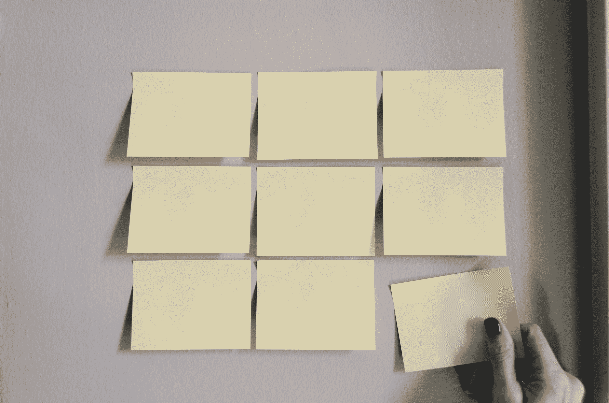
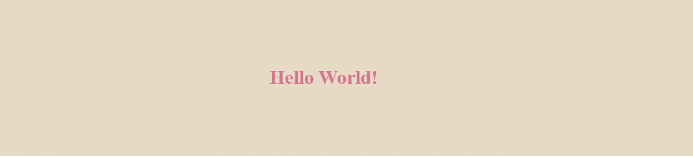
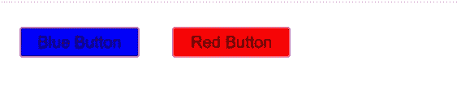
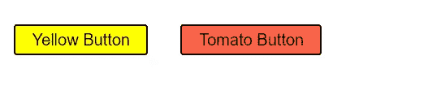
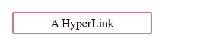

# React 中的样式组件—您需要知道的一切

> 原文：<https://blog.devgenius.io/styled-components-in-react-all-you-need-to-know-9a44b89ba348?source=collection_archive---------0----------------------->



由[凯利·西克玛](https://unsplash.com/@kellysikkema?utm_source=medium&utm_medium=referral)在 [Unsplash](https://unsplash.com?utm_source=medium&utm_medium=referral) 上拍摄的照片

# 介绍

React by definition 遵循基于组件的架构方法，其中组件代表应用程序中的特定屏幕或元素。这就产生了对能够以基于组件的方式进行管理的 CSS 样式的需求。传统上，在 web 应用程序开发中，css 一直在一个外部 CSS 文件(如 index.css)中进行管理，或者只是管理整个应用程序样式的几个样式表(CSS 模块)。然后，您可以将属性作为一个字符串传递给`className` prop。

这种方法存在一些问题:

*   如果没有正确的结构，CSS 样式表或模块可能会随着应用程序的增长而变得过大和复杂，这使得应用程序样式难以管理。
*   由于样式表既大又复杂，所以很难重构和删除不使用的不必要的样式。
*   复杂的应用程序很容易出现类名冲突。
*   由于上述问题，需要有一个基于组件的方式来管理 CSS，样式化的组件会派上用场。

如果你想在 YouTube 上学习这个教程，可以点击下面的链接。

Github 上有基于 YouTube 教程的最终解决方案。

[](https://github.com/tndungu/Styled-components-React) [## GitHub-tndungu/Styled-components-React:展示 React 中样式化组件的使用

### 展示 React 中样式组件的使用。为 tndungu/Styled-components-React 开发做出贡献

github.com](https://github.com/tndungu/Styled-components-React) 

# 样式组件

Styled components 是一个用于设计 React 应用程序的库，允许使用 CSS-in-JavaScript。使用样式化组件具有以下主要优势:

1.  通过关注单个用例，开发人员可以更好地管理 CSS。
2.  用户体验得到了增强，样式化组件跟踪页面上呈现的组件，并注入它们的样式，仅此而已。结合代码分割，应用程序将加载更快。
3.  更容易删除未使用的 CSS——CSS 的维护很容易，很容易看到哪些样式没有被使用并删除它们。

# 装置

**带 npm**

```
npm install --save styled-components
```

**带纱**

```
yarn add styled-components
```

# 入门指南

styled-components 使用带标记的模板文本来设计组件的样式。创建的样式是附加了样式的普通 React 组件。

下面的示例创建了一个包装组件和一个标题组件，并附加了样式:

```
import styled from "styled-components";// Create a Title component that'll render an <h1> tag with some styles
const Title = styled.h1`
  font-size: 1.5em;
  text-align: center;
  color: palevioletred;
`;// Create a Wrapper component that'll render a <section> tag with some styles
const Wrapper = styled.section`
  padding: 4em;
  background: #e5d9c5;
`;const App = () => {return (
    <Wrapper>
    <Title>
      Hello World!
    </Title>
  </Wrapper>
  );
};export default App;
```

输出



# 基于道具的改编

您可以将一个函数(插值函数)传递给样式化组件的模板文本，以根据组件属性对其进行调整。这意味着，如果你有一个蓝色的按钮，现在你需要一个红色的，没有必要有 2 个组件，你可以根据组件的道具有条件地调整。参见下面的例子。

```
import styled from "styled-components";const Button = styled.button`
  /* Adapt the background colors based on backgroundColor prop */
  background: ${props => props.backgroundColor === 'blue' ? "blue" : "red"};font-size: 1em;
  margin: 1em;
  padding: 0.25em 1em;
  border: 2px solid palevioletred;
  border-radius: 3px;
`;const App = () => {return (
    <div>
    <Button backgroundColor='blue'>Blue Button</Button>
    <Button backgroundColor='red'>Red Button</Button>
  </div>
  );
};export default App;
```

输出



# 扩展样式

有时，您可能需要使用现有的样式，但对一个实例进行一些更改。因为这是一个单独的例子，你不需要像上面那样使用插值函数，最好是创建一个继承另一个组件样式的新组件。这是通过将它包装在如下所示的`styled()`构造函数中完成的。

```
import styled from "styled-components";const Button = styled.button`
  background: yellow;
  font-size: 1em;
  margin: 1em;
  padding: 0.25em 1em;
  border: 2px solid black;
  border-radius: 3px;
`;const TomatoButton = styled(Button)`
background: tomato;
`
const App = () => {
  return (
    <div>
    <Button>Yellow Button</Button>
    <TomatoButton>Tomato Button</TomatoButton>
  </div>
  );
};export default App;
```

输出



# “AS”多形态道具

有时，您可能需要更改最终呈现的标签或组件。例如，您可能有一个按钮组件，您希望将其呈现为带有标签的超链接。

```
import styled from "styled-components";const Button = styled.button`
  display: flex;
  align-content:center;
  justify-content:center;
  color: black;
  margin: 1em;
  padding: 0.25em 1em;
  width:10%;
  text-decoration:none;
  border: 2px solid palevioletred;
  border-radius: 3px;
`;const App = () => {
  return (
    <div>
    <Button as='a' href='#'>A HyperLink</Button>
  </div>
  );
};export default App;
```

输出



# 类似 scss 的语法

styled-components 使用支持类似 scss 语法的 [stylis](https://github.com/thysultan/stylis) 预处理器。例如，这提供了对高级选择器模式的支持。

```
import styled from "styled-components";const StyledCard = styled.div`
  border: 1px solid black;
  display: flex;
  align-items: center;
  flex-direction: column;
  width: 20%;
  > .name {
    font-size: 22px;
    color: black;
    transition: 0.5s;&:hover {
      color: red;
    }+ .surname {
      color: #b30e16;
    }
  }
`;const Container = styled.div`
  display: flex;
  align-items: center;
  justify-content: center;
`;const App = () => {
  return (
    <Container>
      <StyledCard>
        <h1 className="name">Antony</h1>
        <p className="surname">Ndungu</p>
      </StyledCard>
    </Container>
  );
};export default App;
```

# 动画片

样式组件有`keyframes`创建动画关键帧。关键帧不是特定于组件的，这意味着它们可以导出到应用程序中的任何地方。

```
import styled, { keyframes } from "styled-components";const rotate = keyframes`
from {
  transform: rotate(0deg);
}to {
  transform: rotate(360deg);
}
`
const Rotate = styled.div`
  display:inline-block;
  animation: ${rotate} 2s linear infinite;
  padding: 2rem 1rem;
  font-size:1.2rem
`const App = () => {
  return (
    <Rotate>&lt; 💅🏾 &gt;</Rotate>
  );
};export default App;
```

# 结论

本教程涵盖了您在日常开发中需要的大多数样式组件特性。在 render 方法之外定义样式组件很重要。这是为了确保组件不会在每次渲染过程中重新创建。它还确保缓存正常工作，否则渲染速度将会减慢。此外，并不是所有东西都需要组件样式。如果过度使用样式化的组件，就有过度设计应用程序的风险。

如果您需要进一步讨论，请随时在下面发表评论。