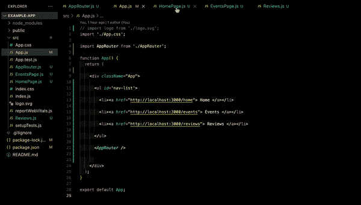
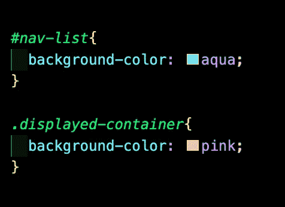
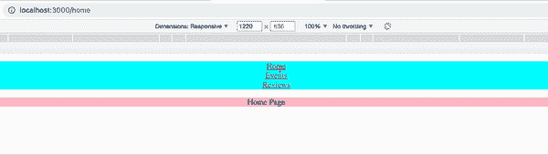
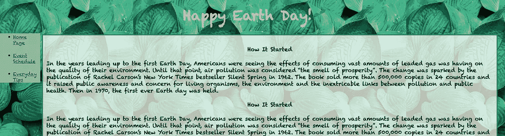
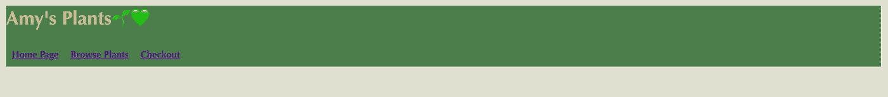
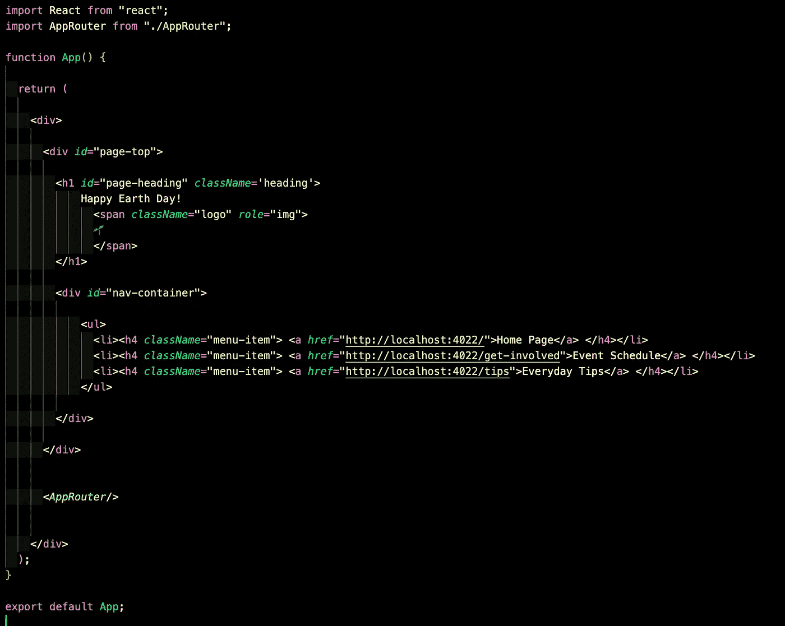
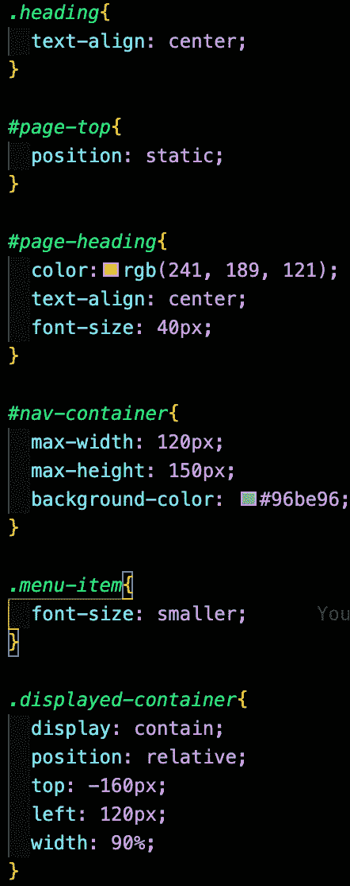
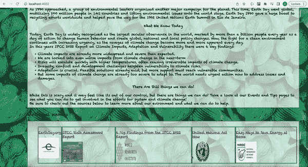
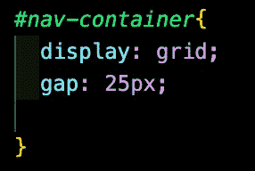
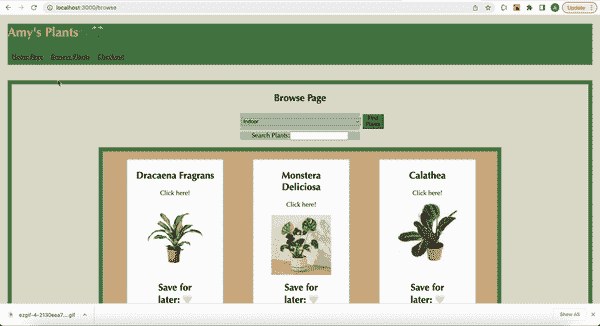

# 导航条样式

> 原文：<https://blog.devgenius.io/styling-nav-bar-28514f9706de?source=collection_archive---------13----------------------->

在我的上一篇文章中，我做了一个简单的、无风格的导航条的分步指南。在这篇文章中，我将分享一些帮助我进入造型的技巧。例如，在下面的链接中查看我的帖子。

 [## 如何使用 React 路由器创建导航栏

### 作为 React 的新手，弄清楚如何在不同的元素之间切换以在 DOM 上呈现不同的东西可以…

medium.com](https://medium.com/@amyago19/how-to-create-a-navbar-using-react-router-51b78bc6ce51) 

## 标记类名或 Id

确保你想要的一切都在你想要的地方的最简单的方法是给你的标签分类和 id。确保您为 nav 提供了一个 id，并且任何 React 组件在最高呈现标签中都有相同的类名。使用我前一篇文章中的导航条，我将提供一个我喜欢如何命名组件的例子:

nav 的 id 是“nav-list ”,在每个元素中，我给了它们的 div 一个类名“displayed-container”。

使用一些简单的样式，我们可以更清楚地看到不同的组件。

现在你已经对识别标签如何帮助我们设计风格有了一个基本的了解，让我们继续讨论导航条的两个基本结构风格。

# 水平与垂直

这两个是我在熨斗学校软件工程训练营的第二和第三阶段为我的项目创建的导航条的例子。

首先，我们将讨论地球日项目中导航的垂直样式。

## 垂直的

在我看来，这种造型是两者中更具挑战性的。这段代码来自地球日项目，其设置类似于示例应用程序:

我们有一个 App.js，它有一个无序列表，其中包含 BrowserRouter 中确定的每个路径的标签。我们的 navbar 位于一个 id 为“nav-container”的 div 中，该 div 位于一个 id 为“page-top”的 div 中。每个 li 都有一个“菜单项”的类名。现在让我们来看看 css:

这些是重要的样式元素，它们允许你在页面的左上角有一个菜单栏，并且在一个区域显示 DOM 上的任何变化。

正如您在上面看到的，id 为“page-top”的 div 中的任何内容都被赋予了一个静态位置。这意味着 div 是根据文档的正常流程定位的。因为 div 中的内容在页面的顶部，所以它们将停留在那里。这意味着当我们在页面上滚动时，div 也将保持不动。

现在让我们看看导航容器。这里，我们指定了最大宽度和高度。这可以是你想要的任何尺寸。然而，请注意这些的价值，因为它们将决定你如何调整你想要出现在导航旁边的东西的大小。

在这个例子中，我们在 css 中也有一个“display-container”类样式标签，它的 className 的应用方式与我们的示例 app 相同。任何正在变化的东西都会呈现在显示容器中。我将显示容器的宽度减少了 90%,以确保将它放在导航条旁边时不会出现横向滚动。我们使用“display: contain ”,因为它可以用来防止每个内部元素在这个边界框之外产生副作用。接下来，我应用了‘position:relative’来告诉代码其他的改变是相对于元素的正常位置的。这就是我们如何应用导航的最大高度和宽度来告诉我们的代码它应该将“显示容器”类向上和向右移动多远。我们通过给“top”一个接近 navs 最大高度的负值，并使用最大宽度作为我们从左边移开的值。

这就是如何组合在一起创建一个应用程序！

## 水平的

现在让我们看看 PlantStore 项目的水平导航，以及为什么我觉得它是两者中最容易的:

如果你的应用程序的其他格式类似于这些例子，那么你的 nav 在 App.js 中，AppRouter.js 在下面。这意味着任何你想在下面显示的东西，所以唯一需要做的样式是确保你的导航项目显示在浏览器中。我们通过使用“display:grid”来做到这一点，它将这些子元素中的任何一个都变成网格项，并以网格的形式放置它们。

这是使用页面时的样式外观:

我希望这有所帮助！以下是一些帮助我整理这个造型的资料:

*   [https://www.w3schools.com/css/default.asp](https://www.w3schools.com/css/default.asp)
*   [https://developer . Mozilla . org/en-US/docs/Web/CSS/CSS _ Grid _ Layout](https://developer.mozilla.org/en-US/docs/Web/CSS/CSS_Grid_Layout)
*   【https://css-tricks.com/almanac/properties/p/position/ 