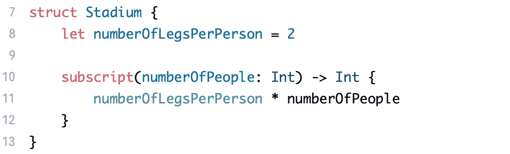
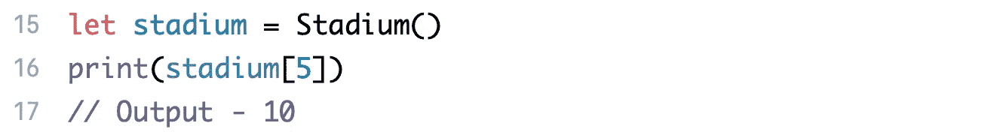
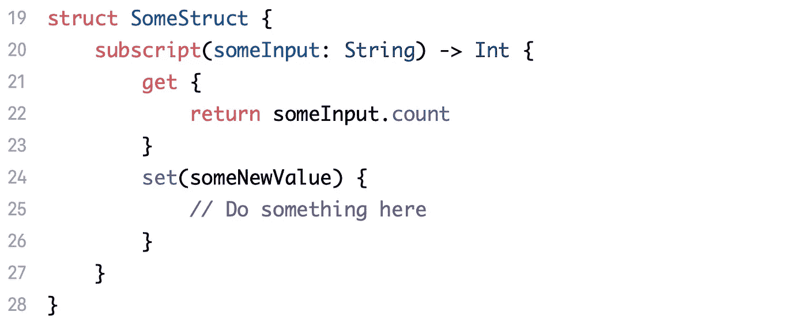
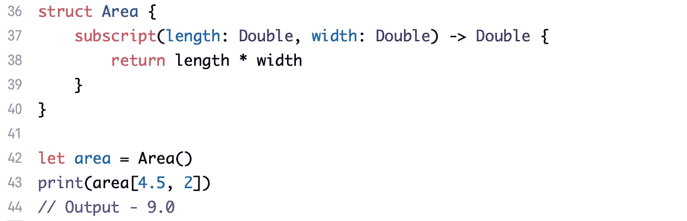
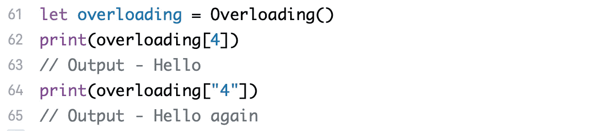
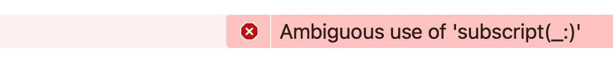
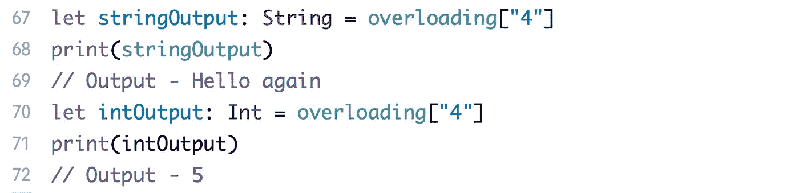
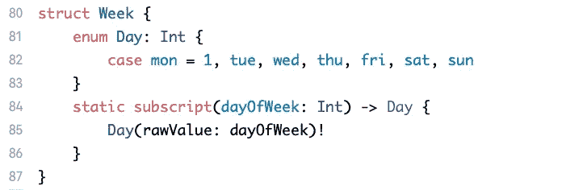
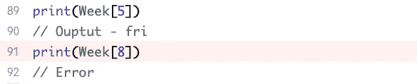

# Swift 中的下标

> 原文：<https://blog.devgenius.io/subscripts-in-swift-aa8db00032b2?source=collection_archive---------1----------------------->


在 [Unsplash](https://unsplash.com/s/photos/array?utm_source=unsplash&utm_medium=referral&utm_content=creditCopyText) 上由 [Faris Mohammed](https://unsplash.com/@pkmfaris?utm_source=unsplash&utm_medium=referral&utm_content=creditCopyText) 拍摄的照片

你如何访问一个数组的元素？

```
let element = array[5]
```

上述属性**元素**被设置为数组中的第六个元素**。但是这里的“**【5】**”是什么意思呢？我们在字典中也注意到了这一点，我们使用**键**访问**值**。我们可以为一个类型定义它吗？这就是我们将在今天的文章中发现的！**

本文是 [**Swift 基础知识**](https://swiftsimplified.medium.com/list/swift-basics-b2f15c120a96) 系列的一部分，帮助初学者以更加简单实用的方式理解 Swift 的基本概念。请随意查看关于其他基本 Swift 概念的文章。这些教程的全部内容可以在[这里](https://github.com/harshvardhanarora/Swift_Basics)找到。我们开始吧！

## 如何创建一个下标？

让我们直接看一个例子来理解下标



我们定义了一个结构 **Stadium** ，它存储了一个名为**numberoflegspersperson**的常量属性。第 10 行是我们定义下标的地方。这是一个只读下标的例子。让我们来看看它的实际应用—



我们创建结构的一个实例，然后在该实例上使用 **[]** 语法，并在括号内传递一个整数。Swift 能够识别出你有一个接受整数的下标，从而调用我们在结构中定义的下标。

正如我上面提到的，这是一个**只读**下标的例子。创建一个**读写**下标类似于一个计算属性。让我们看看语法—



就这么简单。您可以移除 **someNewValue** ，但是该属性仍可以在名称 **newValue** 下使用，该名称可以在集合闭包内访问。

## 下标中的多个参数

上面的例子在下标中只有一个参数。也可以有多个参数。让我们看一个例子——



也可以有两个以上的参数。那里没有限制。

## 重载下标

我们也可以在一个类型中有多个下标。调用哪一个取决于调用下标时的输入参数及其类型。如果参数的**参数类型**不同或者参数的**数量**不同，可以有重载下标。你也可以用不同的**返回**类型重载下标，但这只能在某些情况下起作用。让我们来看几个例子——


两个下标有不同的**参数类型**，因此输出将依赖于此——



对于不同数量的参数，它将类似地工作。让我们看看返回类型不同时的情况—


将上面的下标添加到您的代码中，不做任何其他事情。你会看到**打印(重载["4"])** 现在给你一个错误，操场不跑了。这里发生了什么？

如果你仔细阅读代码，你会明白现在有两个下标将**字符串**作为参数，但是它们返回 **Int** 和 **String** 。当您试图打印该下标的输出时，Swift 不知道您指的是哪个下标。因此它抛出了不明确的使用错误—



我们可以通过明确指定下标的结果来解决这个问题



现在 Swift 知道你是在寻找返回一个 **Int** 还是一个 **String** 的下标。

## 类型下标

就像方法和属性一样，我们有**实例**和**类型**下标。您看到的所有以上示例都是实例下标。让我们来看看一个下标——



注意强行解开"**！**"在第 85 行，如果 **dayOfWeek** 在范围 1…7 之外，程序将崩溃！让我们看看这段代码的运行情况—



注意，我们现在在类型本身上调用下标语法，而不是创建它的一个实例，然后在该实例上调用它。

就是这样！这是一篇相当短的文章。还是给自己时间吸收全部吧，试着自己把代码写出来，看看[操场](https://github.com/harshvardhanarora/Swift_Basics)本身，以防卡住。如果您有任何问题，请随时通过 LinkedIn 联系我。

接下来，我们将关注 Swift 中的**继承。敬请期待！**

为你创作这些文章，占用了我大量的精力和资源。你可以通过 [**给我买一杯咖啡**](https://www.buymeacoffee.com/swiftsimplified) 来支持我的旅程。如果目前你还不能贡献金钱，如果你能把这篇文章分享给你的网络，那就太好了！希望能继续给大家带来这样的内容，帮助你的 iOS 开发之旅。