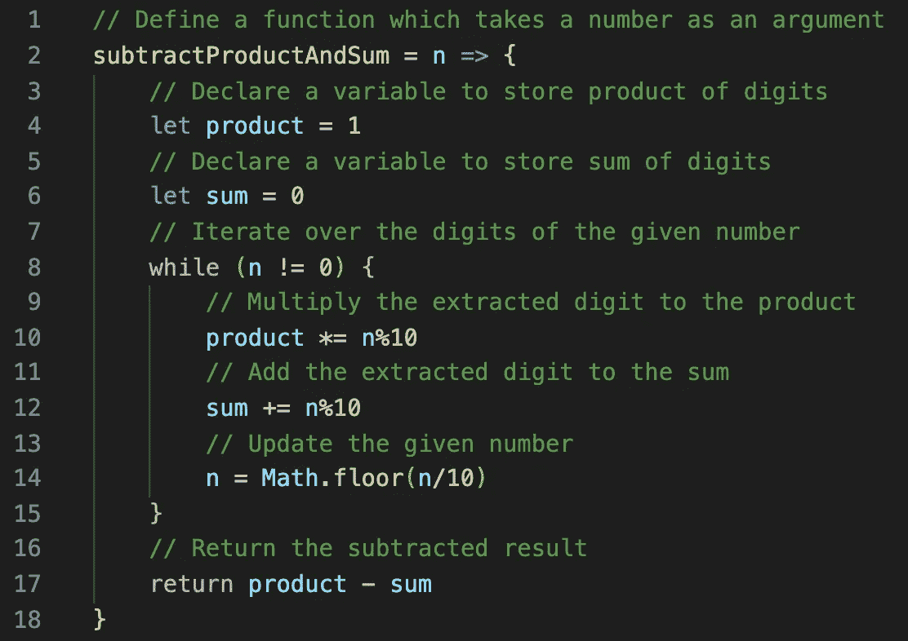

# 减法乘积和求和问题

> 原文：<https://blog.devgenius.io/subtract-product-and-sum-problem-6d4d39a3c91e?source=collection_archive---------13----------------------->

## 用 JavaScript 解决


照片由 [Antoine Dautry](https://unsplash.com/@antoine1003?utm_source=unsplash&utm_medium=referral&utm_content=creditCopyText) 在 [Unsplash](https://unsplash.com/?utm_source=unsplash&utm_medium=referral&utm_content=creditCopyText) 上拍摄

在这篇博文中，我从 [LeetCode](https://leetcode.com/problems/subtract-the-product-and-sum-of-digits-of-an-integer/) 中挑选了名为“减去整数位数的乘积和”的问题:

*给定一个整数* `*n*` *，返回其位数与位数之和的乘积之差。*

```
**Example 1:****Input:** n = 234
**Output:** 15 
**Explanation:** 
Product of digits = 2 * 3 * 4 = 24 
Sum of digits = 2 + 3 + 4 = 9 
Result = 24 - 9 = 15**Example 2:****Input:** n = 4421
**Output:** 21
**Explanation:** Product of digits = 4 * 4 * 2 * 1 = 32 
Sum of digits = 4 + 4 + 2 + 1 = 11 
Result = 32 - 11 = 21
```

## 我的方法

有几种方法可以解决这个问题，我将向您介绍我的方法以及我是如何一步步解决这个问题的:

1.  声明一个变量来存储给定数字的数字乘积，并将其设置为 1。

`let product = 1`

2.声明一个变量来存储给定数字的位数之和，并将其设置为 0。

`let sum = 0`

3.使用模/余数运算符(`%`)得到给定数字的最后一位(`n`)。

`n%10`

4.只要给定的数字不为 0，重复以下三个步骤；直到计算出给定数字的所有位数。

`while (n != 0)`

5.将提取的给定数字的位数乘以存储位数乘积的赋值变量的值。

`product *= n%10`

6.将提取的给定数字的位数与存储位数总和的赋值变量的值相加。

`sum += n%10`

7.将给定的数字除以 10，并使用`Math.floor()`将其向下舍入，以删除您已经计算过的最后一位数字。

`n = Math.floor(n/10)`

8.返回给定数字的位数之和与乘积之差。

`return product — sum`

以下是上述逻辑在 JavaScript 中的实现:



正如你在代码中看到的，我们可以很容易地提取一个数的最后一位，方法是将它除以 10，并借助于模数运算符(`%10`)得到它的余数。例如，如果数字是`248`，模数`10`产生`8`。要删除最后一个数字并得到下一个数字，我们只需要将这个数字除以 10 并将其四舍五入(`/10`)。例如，如果数字是`248`，在我们应用`Math.floor()`之后，除以`10`得到`24`。然后，我们用一个`while`循环遍历数字的所有位数，将数字乘以`product`，将数字加到`sum`。最后，计算乘积和数字之和的差，得到结果。

## 时间和空间复杂性

我们对一个给定数字的每个数字只迭代一次，所以**时间复杂度**将取决于从给定数字中提取的位数； **O(n)** 。我们创建了两个变量，没有使用任何额外的空间，所以**空间复杂度**是常数； **O(1)** 。

## 结论

我上面采用的方法是使用**模数**，另一个非常常见的解决这个问题的替代方法是使用**字符串**。这实际上与我的方法没有太大区别。主要的区别是，给定的数字将被转换成一个字符串，以提取每个数字，然后循环遍历其数字，以计算数字的乘积和总和。

希望对你有帮助，感谢阅读！