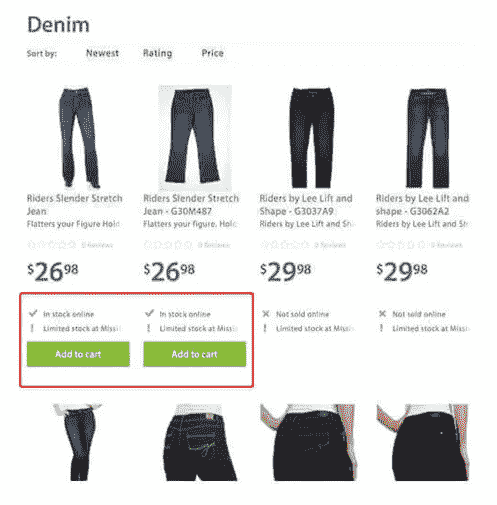

# 有效使用用户界面/UX 设计的成功案例

> 原文：<https://blog.devgenius.io/success-stories-with-the-effective-use-of-ui-ux-designs-69e3544aa2d?source=collection_archive---------8----------------------->

用户界面设计

在一个以消费者为中心的现代世界，一个设备或软件的界面设计可能是决定其成功与否的因素。

但是， ***界面设计*** 是什么意思呢？

> ***“界面设计可以被描述为关注用户与计算机/设备交互的技术。”***

用户界面设计可以被认为是一个非常重要的方面，因为它可以影响一个特定产品的成功。有几个真实世界的例子，公司通过使用有效的用户界面设计获得了更多的成功。

让我们来看看其中的一些。

**1。谷歌浏览器**

谷歌在 2008 年推出的 Chrome 网络浏览器就是一个好的用户界面和体验帮助公司获得更多成功的例子。当谷歌推出 Chrome 时，它在市场上的竞争对手是苹果的 Safari、微软的 Firefox 和 Internet Explorer 等浏览器。然而，Chrome 获得了巨大的兴趣，并在发布后的几年内超越了所有竞争对手。这一成功的主要原因是出色的用户界面和用户体验。

谷歌浏览器促进了用户界面标准的一致性。因此，它的可用性得到了提高。单独的浏览器标签是 Chrome 的主要介绍之一，它有助于提高稳定性。隐名标签是 Chrome 的另一个被证明非常苛刻的功能。此外，与当时的主要竞争对手微软 ie 相比，Chrome 的性能更快。鉴于这些原因，谷歌 Chrome 已经成为网络浏览器的新市场巨头。近年来，Chrome 重新设计了用户界面，以进一步增强用户体验。

谷歌 Chrome 界面

经过重新设计，Chrome 地址栏能够显示一些细节，比如天气，而无需打开新标签。此外，地址栏还会显示一个链接是否已经被访问过。此外，通过重新设计的 Chrome，可以在主页上管理喜爱网站的快捷方式。随着用户界面和用户体验的增强，当考虑网络浏览器时，谷歌 Chrome 已经增长到目前大约 60%的巨大市场份额。

**2。沃尔玛**

[沃尔玛](https://www.walmart.com/)是专注于用户界面设计和用户体验后收入和成功增长的另一个例子。沃尔玛最初的网站对移动设备没有反应。然而，在对用户记录和模式进行了大量分析后，沃尔玛后来重新设计并开发了一个响应式网站设计。此外，产品类别页面也进行了优化。

响应式沃尔玛用户界面设计

此外，它没有最初的两个按钮，只有一个带有“添加到购物车”选项的按钮，已经显示了详细信息。

添加到购物车选项

有了这些小小的改变，沃尔玛能够吸引更多的顾客，实现更多的销售。因此，在 2014 年至 2015 年期间，沃尔玛的收入在一年内增长了 98%。

**3。iPhone**

另一个成功使用用户界面的例子是 2007 年推出的 iPhone。当时，智能手机市场主要是围绕微软的 Windows mobile 建立的，Windows mobile 有许多功能和已经开发的应用程序。然而，随着 iPhone 的推出，市场份额已经大规模转向 iPhone，尽管微软的 Windows mobile 功能丰富。

iPhone UI 设计

与微软的 Windows mobile 相比，iPhone 市场份额快速增长的主要原因之一是其简单的用户界面。Windows mobile 的用户界面非常复杂。然而，iPhone 更注重简洁。此外，iPhone 的用户界面设计能够给用户留下良好的第一印象。鉴于这些原因，iPhone 能够获得巨大的市场份额，并且从此一蹶不振。

因此，正如上面提到的例子，用户界面和用户体验可以被认为是应用程序或设备成功的两个重要因素。

可以从下面的视频看关于这个话题的视频讲解。

有效使用用户界面/UX 设计的成功案例

*你对此有什么想法？如果你有任何问题或其他事实，请在下面评论。敬请关注下一篇文章。*

*业务查询，可以在这里* ***找我* [***。***](https://linktr.ee/Chamod_Kavishka)**