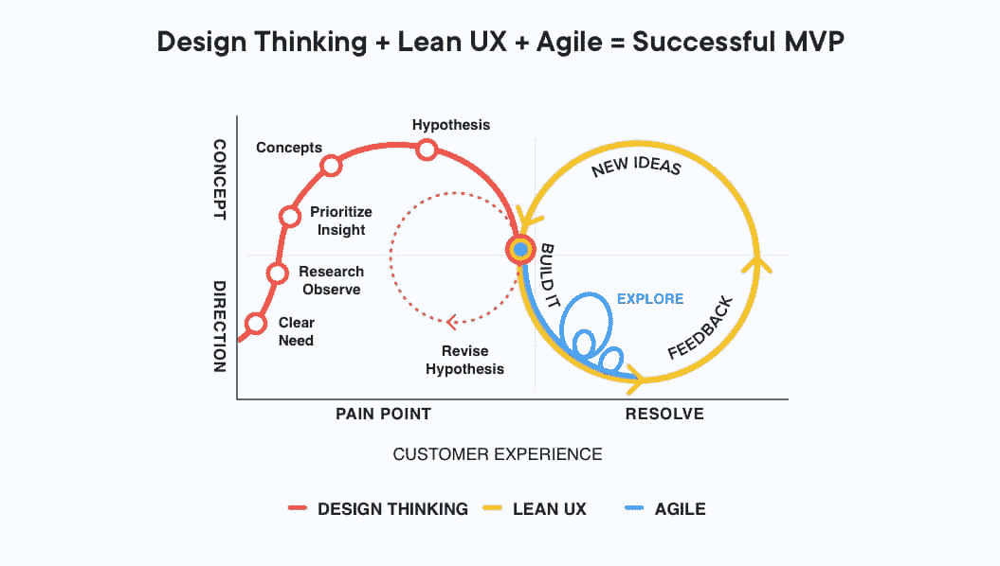

# 从 MVP 开始的成功创业故事

> 原文：<https://blog.devgenius.io/successful-startups-stories-that-started-with-mvp-ae25a78b424f?source=collection_archive---------3----------------------->

在大多数初创公司倒闭的环境中，要想以最小的成本和风险取得成功，每个项目都应该从推出最基本的可行产品开始。在本文中，我们将分析 MVP 的概念、类型、构建阶段和 MVP 示例。

# 什么是 MVP？

[来源](https://www.netsolutions.com/insights/wp-content/uploads/2018/06/Design-thinking-Lean-UX-helps-to-build-an-MVP.jpg)

MVP(最低可行产品)是一种最低设计的产品，展示给买家/投资者以测试需求。或者，它也被称为你未来产品的原型。

很多情况下，创业公司失败的原因是缺乏市场需求。在几乎一半的情况下，企业家花了几个月甚至几年的时间才意识到他们的假设是错误的，没有人对他们的产品感兴趣。

MVP 概念旨在降低出现这种情况的风险。它可以应用于任何产品的创建，但最常用于数字服务和软件的开发。

这是一个未来项目的版本，它允许你以最低的成本收集尽可能多的关于客户如何与之互动的实用数据。

# MVP 的类型

[来源](https://www.pexels.com/ru-ru/photo/4126743/)

MVP 是产品的第一个版本。但是，它本身并不一定是一种产品。也可以称为假设检验法。

## 预购 MVP 类型

**用途:**如果开发产品需要大量的资源和时间投入(例如，你正在开发一款创新的智能水壶)和/或需要大量客户才能实现盈利。

**怎么做:**在 Kickstarter 上创建一个登陆页面或众筹活动。

**目的:**获得预付款，证明人们会为产品付款。

## 受众培养 MVP

**用法:**你有一个想法，但你不是该领域的专家，所以你需要深入客户的世界，了解你的产品是否以及如何改变这个世界。也适合咨询市场，线上产品，免费和社交产品。

**怎么做:**在社交网络上创建群组。

**目的:**在产品开发前建立客户群，定义未来产品的功能和内容；评估潜在客户的兴趣。

**重要提示:**不要把对某个话题的兴趣和付费意愿混为一谈。

## 礼宾 MVP

**用途:**如果你的客户离线工作，对技术不太精通；如果你正在处理一个难以预测物流的产品。

**做什么:**帮助客户解决他们的问题(例如，在开发一项送货上门的服务之前，通过电话了解客户想买什么，然后去商店购买并送货上门)。

**目的:**基于对每个客户的个性化服务，你甚至可以在产品自动化之前就获得使用经验，评估需求，并了解谁对服务感兴趣。

## 绿野仙踪最有价值球员

**用途:**如果产品需要开发复杂算法或过程自动化；如果你从事复杂行业(法律、金融)。

做什么:在做复杂的功能之前，在你的网站上放一个由两个字段组成的申请表:联系信息和描述。让内部员工处理表单并将结果发送给客户。从外面看，它将看起来好像应用程序已经被系统处理过。

**目的:**了解请求的频率，在客户眼中看起来像一家严肃的公司(因为你提供自动化服务)。

## 单一用例 MVP

**用法:**你假设一个产品的一部分需要分离出来作为一个单独的产品；你正在进入一个由更复杂、更昂贵的产品主导的市场。

**怎么办:**不要在当前资源中引入功能，而是创建一个单独的页面(单独的设计和域)，少量的新流量可以发送到该页面。

**目的:**仅提供解决一个现有问题的产品将有助于测试关于该特定功能的可行性和价值的假设。

## 别人的产品 MVP

**用法:**如果进入一个有既定竞争对手的市场；如果你想在有限的工程资源或物流上开发一个难以预测的产品。

**怎么做:**举个例子，那些想在旅游领域提供额外服务的人(将来，开一家新的旅游运营商公司)可以将竞争对手的搜索基础连接到他们的网站，从销售文书和签证服务开始。

目的:测试你在该领域的知识、优势和营销渠道。

# MVP 细节

在保持可用性的同时逐渐改进产品有助于开发人员立即测试假设:

如果在滑板上走动不舒服，滑板车怎么样？如果滑板车不能加速，自行车将如何处理？

每个随后的原型都解决了客户的一个需求和/或提高了现有特性的效率。

与消费者的持续接触提供了关于可能的错误和缺点的信息。但是当原型没有和直接用户一起测试时，最终产品会继承最初阶段的错误。如果这个理想的产品是从零开始开发的话，发布后的 bug 修复对预算的打击会更大。从这个意义上说，最小可行产品法符合“精益制造”的原则:它在短时间内找到最简单、最便宜的解决方案。

在某些情况下，客户可以在摩托车阶段就对产品表示满意。因此，没有必要把它提高到汽车的阶段。这个阶段被称为 ***最小可爱产品***——能让顾客感到满意的产品。找到这个里程碑的能力将为创业公司节省大量资源和时间。

但是，即使最终产品与开发人员在旅程开始时向客户描述的是同一辆车，旅程也会朝着有利于所有市场参与者的方向发展。在创建产品的过程中，收集了有用的见解，消除了错误。这意味着客户将收到比原计划质量更高的汽车。

如果你的初创公司在产品和软件开发方面需要帮助，有 [7Devs](http://7devs.co/) ，一家提供外包和人事服务的公司。

# 从 MVP 开始的成功创业故事

每个公司的 MVP 看起来都不一样。为了找到你的道路，我们来看看知名公司是如何成功开发 MVP 的:

## Spotify

Spotify 是一项在线音频流媒体服务。当 Napster 关闭时，Spotify 的联合创始人丹尼尔·埃克(Daniel Eck)考虑创建一个平台，用户可以花很少的费用获得合法的音乐。他的家人和朋友是第一批试用这款应用的人。当开发人员发现他们的想法很成功时，他们就把应用程序展示给了更多的观众。如今，Spotify 是一项音乐、视频流和播客点播服务，在全球 79 个国家提供。

## 爱彼迎（美国短租平台）

这是一个短期租赁的在线列表服务。最初，三个人创建了一个简单的网站，他们发布了一个租赁充气床的广告。然后三个客人来找他们，他们想分享他们的公寓。看到项目已经找到了目标受众，创作者开始寻找重新设计平台的方法。如今，Airbnb 拥有 1.5 亿用户，400 万个房源，估值 300 亿美元。

## Dropbox

另一个成功的 MVP 例子是云存储服务 Dropbox。这一切都始于该公司的创始人德鲁·休斯顿发布了一段 3 分钟的视频，展示了与 Dropbox 的同步。在它发布后，等待测试的名单一夜之间从 5000 增长到 75000。

## 优步

优步是一个查找、呼叫和支付出租车费用的移动应用程序。早在 2010 年，优步只专注于连接客户和出租车司机，并在应用程序内支付。直到开发人员确信他们的想法能为更多的观众所接受，他们才开始改进产品。在其整个生命周期中，优步已经将应用程序的功能扩展到 GPS、多个目的地、拼车、在线跟踪、车费分摊等。

一些初创公司的创始人担心低功能产品找不到目标受众。但是不要担心，因为即使接收效果不好，您也可以修复每个功能。MVP 让你明白谁需要你的产品以及如何改进它，同时以最低的成本获得最大的成果。这就是为什么初创公司更喜欢创建一个商业 MVP，来帮助测试商业模式中最危险的假设。

# 如何开发一个 MVP

如果你不是一家大公司，并且你正在创建第一批服务之一，一个简单的 MVP 的概念对你来说就足够了。

首先，您需要定义产品将解决的问题，并创建一个包含解决该问题的最小功能集的项目。然后开始学习了解你的用户，根据市场的真实要求来改进你的产品。

这个想法是让服务测试你的基本假设。这可能是人们感兴趣的东西吗？如果答案是肯定的，MVP 创业公司可以进一步发展他们的活动:招募团队，寻求资金。

因此，您需要一步一步地:

1.  确定产品解决的问题，它的主要任务
2.  通过与潜在客户的交流来检验你的假设。进行市场调查
3.  创建一个产品必须包含的所有特性的列表，这些特性被认为是“可行的”
4.  理想情况下，应该有一个阶段，在这个阶段你知道这已经是可以发布的项目的 MVP 了
5.  创建一个 MVP——可以在实践中检验的你的想法的最小版本
6.  开始收集数据，检查性能，添加所需的特性，并向产品的更完整版本前进。

# 结论

使用 MVP 商业方法，公司可以向潜在客户展示一个想法。他们可以开始创造收入，在市场上达到一定的地位，并收到不断的反馈。因此，时间得到了明智的利用，公司对投资者开放，并准备好将其业务货币化。

如果你或你的员工团队发现很难处理这种方法，你总是可以求助于有经验的 MVP 公司，他们为创业公司提供 MVP 开发服务。这是有想法和一定资金的客户通常选择的方法。不用找开发者，不用从零开始创建团队，不用解决法律问题。有足够多像我们这样有经验的公司会为你做这项工作。