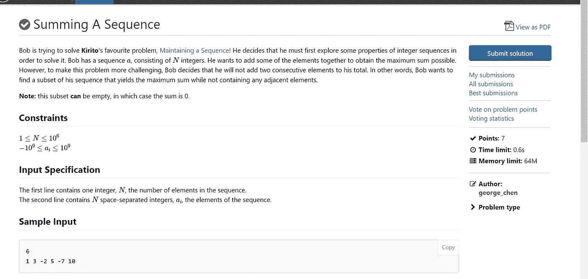
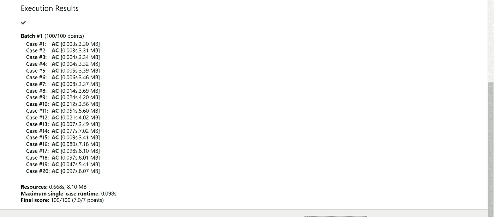

# 对序列求和

> 原文：<https://blog.devgenius.io/summing-a-sequence-1119657ec30b?source=collection_archive---------7----------------------->

今天我在 DMOJ 上遇到了这个问题。这个问题要求我们找出这个列表中不使用相邻元素的最大和。



让我们直接进入算法的核心，从这里开始工作。我将要使用的方法涉及到一些动态编程。我们将初始化一个 DP 数组，它将包含包含我们的数字的数组的当前迭代的最大和。那么算法如下:

```
N = //the total number of numbers 
DP(N) // DP array
Nums(N) // contains your numbers
Loop through nums starting at 2:
   DP[current_index] = max(DP[current_index-1], DP[current_index-2] + Nums[current_index]) 
```

这是可行的，因为它允许我们选择或不选择当前元素。如果我们决定选择当前元素作为我们的最大和的一部分，那么你不能包括前一个元素。

虽然您可能认为算法已经完成，但事实并非如此。我们仍然需要考虑 N ≤ 2 的情况。在没有数字的情况下，你可以安全地返回 0，但是考虑到问题约束，这是不存在的。

接下来，如果 N ≥ 1，我们可以设置 DP[0] = Nums[0]，如果 Nums[0]处的项是大于 0 的正整数。然后，如果 N>1，可以设置 DP[1]等于 Nums[0]和 Nums[1]的最大值，如果它是非负的且大于 0。我们必须这样做的原因是因为我们只能在第二个索引处开始我们算法的迭代。这是因为我们不能使用相邻的元素，所以我们必须从手动计算前几个开始。

这是算法的代码

```
 #include <vector>
#include <iostream>
#include <cstdio>
#include <algorithm>
#include <cmath>
#define ll long long
using namespace std;
int main()
{

 int n; cin >> n;
 vector<ll> nums(n);
 vector<ll> dp(n);
 for (int i = 0; i < n; i++) {
  cin >> nums[i];
 }
 if (nums[0] > 0) {
  dp[0] = nums[0];
 }
 if (max(nums[0], nums[1]) > 0) {
  dp[1] = max(nums[0], nums[1]);
 }

 for (int i = 2; i < n; i++) {
  dp[i] = max(dp[i - 1], nums[i] + dp[i - 2]);
 }
 cout << dp[n - 1] << endl;
}
```



我希望这能帮助你理解如何解决这种类型的问题，如果你觉得有用的话，可以留下你的赞。