# 以有趣的方式用图像和 OpenCV 给自己充电

> 原文：<https://blog.devgenius.io/super-charge-yourself-with-images-opencv-in-a-fun-way-bb50ddd16bf9?source=collection_archive---------12----------------------->

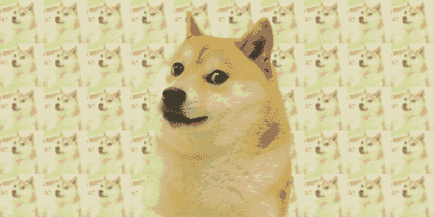

# **博客的目标是涵盖以下主题:**

1.  什么是图像？什么是像素？
2.  什么是二值与灰度图像？
3.  什么是彩色图像？
4.  什么是图像分辨率和标准分辨率？
5.  有哪些常见的图像格式？
6.  什么是图像处理？
7.  图像处理的使用
8.  python 中有哪些流行的读取/操作图像的库？
9.  为什么要用 OpenCV？
10.  如何安装 OpenCV？
11.  如何使用 Python & OpenCV 读取图像？
12.  如何使用 Python 和 OpenCV 读写图像？
13.  如何使用 Python & OpenCV 重新缩放图像？
14.  如何使用 Python & OpenCV 阅读视频？
15.  如何使用 Python & OpenCV 重新缩放视频？

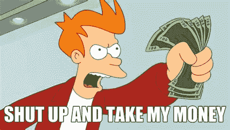

让我们开始吧…！

# **1。什么是图像？**

> 图像、数字图像或静止图像是视觉信息的二进制表示，例如图画、图片、图表、徽标或单个视频帧。数字图像可以电子方式保存在任何存储设备上。

> 图像由像素或像素值的矩阵(网格)组成。像素是图像的最小构建块。

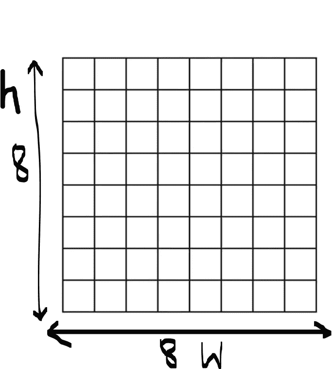

在上图中，它是由盒子组成的矩形，或者可以说是 8×8 的矩阵，其中 h 是高度，w 是矩阵或图像的宽度。

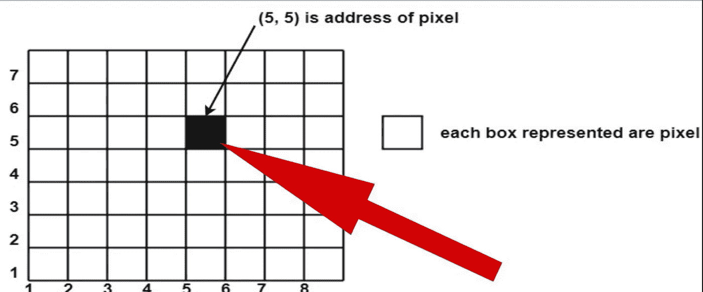

所表示的每个方框是像素值，其表示图像的给定位置(地址)中的强度或颜色

正如你在上面的图片中看到的不同像素值，范围从 0 到 255，即 256 级，换句话说，这是一个**灰度图像**

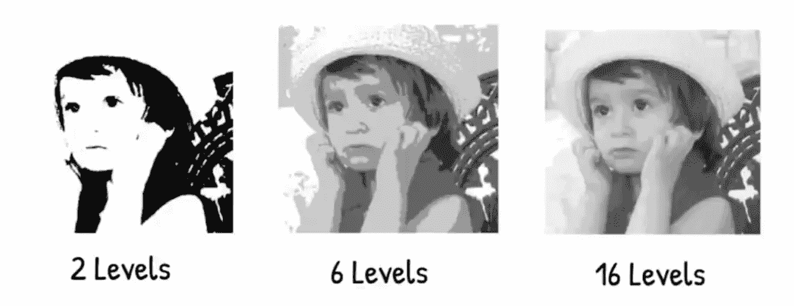

级别

# **2。什么是灰度图像？什么是二进制图像？**

> **灰度图像**，例如从 0 到 255 的灰度，即 256 级或 8 位
> 
> **二进制图像**是二进制的，表示黑色(0)或白色(1)，即 2 个等级

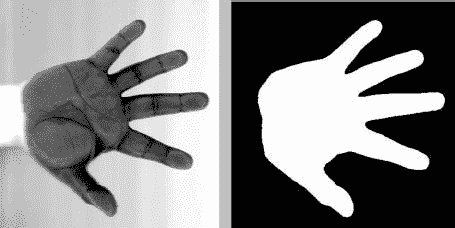

灰度与二进制图像

以上是灰度与二值图像的例子，左边部分是灰度表示，右边部分是二值表示

# **3。什么是彩色图像？**

> 1.**黑白图像(二进制)**:一个 M×N 矩阵。每个值为 1 或 0。
> 2。**灰度图像**:一个 M×N 矩阵。每个成员的值范围从 0 到 255
> 3。**彩色图像** : MxNx3 矩阵。每个 M×N 平面为红、绿、蓝通道。每个成员的值范围从 0 到 255。

或者，我们可以说:

> 灰度图像只有黑白阴影。它没有色度之类的任何颜色信息。
> 
> 灰度图像通常是 8 位图像，每个像素有 256 种灰度组合。
> 
> 而彩色图像通常是 24 位图像，其中 8 位为红色，8 位为绿色，8 位为蓝色信息。这三种基本颜色的组合可以为一个像素产生 16，777，216 种颜色组合。

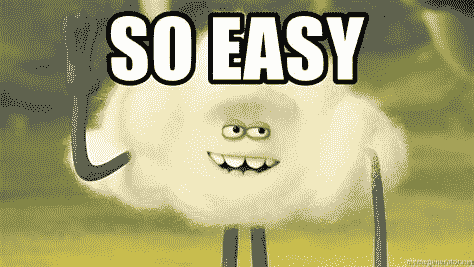

如上所述，图像是具有一定高度和宽度的像素值矩阵，即宽度 x 高度的表示也称为**图像分辨率。**

# **4。什么是图像分辨率？**

> **图像分辨率**是像素分辨率——即图像中的像素数量。**图像分辨率通常表示为水平 x 垂直尺寸或宽度 x 高度**。
> 
> **根据维基百科** : **图像分辨率**是图像所包含的细节。该术语适用于数字图像、电影图像和其他类型的图像。“更高的分辨率”意味着更多的图像细节。图像分辨率可以通过多种方式测量。**分辨率**量化线条彼此之间的接近程度，并且仍然可以明显分辨。

# **标准图像分辨率为:**

> **VGA** (视频图形阵列):640 x 480 像素
> 
> **高清**(高清):1280 x 720 像素像素
> 
> **FHD** (全高清):1920 x 1080 像素
> 
> **4K** 分辨率是指大约 4000 像素的水平显示分辨率:3840 x 2160 像素

# **5。标准数字图像文件格式包括以下几种:**

> **JPEG** (读作 JAY-peg)是根据联合图像专家组标准制作的图形图像文件。
> 
> GIF (包括其设计者在内的许多人读作 JIF，其他人读作 GIF 加一个硬 G)代表图形交换格式。
> 
> **PNG** (发音为 ping)是用于图像压缩的可移植网络图形文件格式。
> 
> **SVG** (可缩放矢量图形)是一个矢量文件，用于在线显示 2D 图形、图表和插图。
> 
> **TIFF** (标记图像文件格式)是应用程序之间交换光栅图形(位图)图像的标准格式，包括用于扫描仪图像的格式。

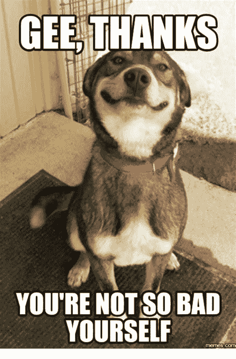

# 6.什么是图像处理？

> 图像处理是将图像转换成数字形式并执行某些操作以从中获取一些有用信息的过程。
> 
> 当应用某些预定的信号处理方法时，图像处理系统通常将所有图像视为 2D 信号。

# 7.图像处理的使用

> Instagram & Snapchat 滤镜
> 计算机视觉
> 显微成像
> 面部识别
> 物体检测
> X 光骨骼检测
> 特征提取

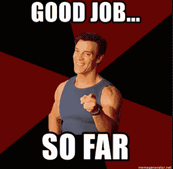

# 8.python 中有哪些流行的读取/操作图像的库？

> [OpenCV](https://opencv.org/)
> [Scikit-image](https://scikit-image.org/)
> [SciPy](https://scipy.org/)
> [Mahotas](http://mahotas.readthedocs.io/en/latest/)
> [Pillow/PIL](https://pillow.readthedocs.io/)
> SimpleITK
> [Matplotlib](https://matplotlib.org/)
> [NumPy](https://numpy.org/)
> Pgmagick
> SimpleCV

# 9.为什么要用 OpenCV？

信用:[https://medium . com/analytics-vid hya/what-and-why-opencv-3b 807 ade 73 a 0](https://medium.com/analytics-vidhya/what-and-why-opencv-3b807ade73a0)

> OpenCV 是一个用于实时计算机视觉的编程函数库。它是由英特尔公司的**[*柳树车库*](https://en.wikipedia.org/wiki/Willow_Garage) *，Itseez 开发的。***

> ***“OpenCV 是跨平台的，在许可下可以免费使用，这使得企业可以轻松利用和修改代码，并支持深度学习框架 TensorFlow、Torch/PyTorch 和 Caffe。”***

> ***OpenCV 是用*[*c++*](https://en.wikipedia.org/wiki/C%2B%2B)*写的。支持 Windows、*[*Android*](https://opencv.org/android/)*和 Mac OS。***

*****支持哪种语言:*****

> **1.C++**
> 
> **2.Android SDK**
> 
> **3.Java 语言(一种计算机语言，尤用于创建网站)**
> 
> **4.计算机编程语言**
> 
> **5.MATLAB/OCTAVE**
> 
> **6.c(不推荐)**

*****支持哪些 OS(桌面和移动):*****

1.  **Linux 操作系统**
2.  **Windows 操作系统**
3.  **安卓**
4.  **苹果操作系统**
5.  **FreeBSD，**
6.  **NetBSD**
7.  **OpenBSD。**

> **该库拥有超过 2500 种优化算法，包括一套全面的经典和最先进的计算机视觉和机器学习算法。**
> 
> **OpenCV 拥有超过 47，000 人的用户社区，预计下载次数超过 1，800 万次或 1，800 万卢比，这使其在世界社区中变得更加重要。**

# **10。如何安装 OpenCV？**

> **pip 安装 opencv-python**

**更多选项请查看:[**https://pypi.org/project/opencv-python/**](https://pypi.org/project/opencv-python/)**

## **最后，让我们开始使用 OpenCV:**

****

# **11.如何使用 Python & OpenCV 读取图像？**

**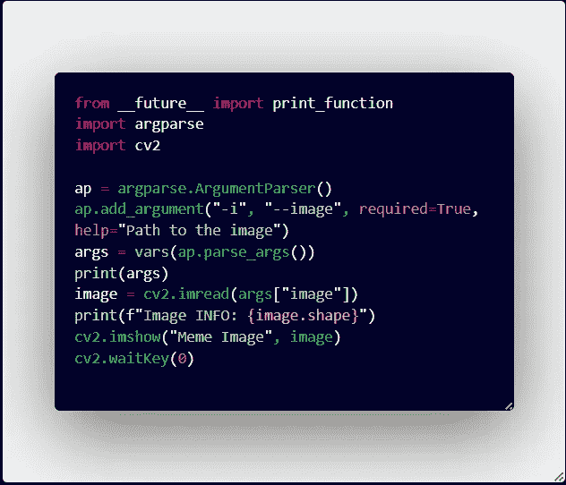**

**您可以运行上面的代码片段:**

**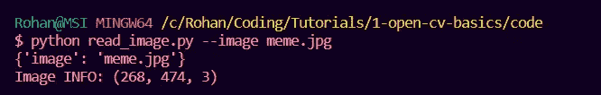**

> ****argparse** 模块使得编写用户友好的命令行界面变得容易。**

**在哪里**

****read_image.py** 是模块/python 脚本**

****—图像 meme.jpg**是讲述图像的路径**

**输出如下所示:**

**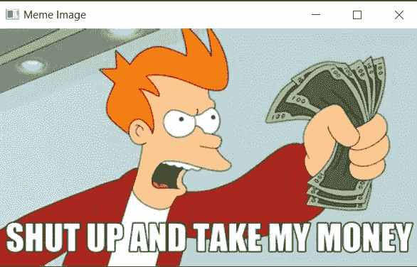**

**产出数字**

**现在来看一下上面脚本的细节:**

*   **image = cv2.imread(**args["image"]**)其中 args[" image "]给出 cv2 . im read 函数的路径**
*   ****cv2.imread** 从给定路径读取图像&存储到图像变量中**
*   ****image.shape** 给出图像的细节**
*   **从输出图像信息: **(268，474，3)** 其中 268 是宽度，474 是高度& 3 表示通道数，即 RGB**
*   **cv2.imshow("Meme image "，Image):获取 Image 变量并显示给定的图像，窗口名为:Meme Image，正如我们从输出图中看到的。**

# **12.如何使用 Python 和 OpenCV 读写图像？**

**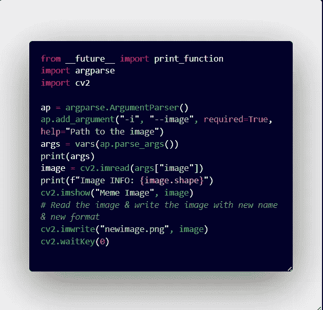**

**读取和写入图像**

**除了以下变化之外，我们主要使用上述相同的代码片段:**

*   ***#读取图像&用新名称写图像&新格式***
*   **cv2.imwrite("newimage.png "，image)，其中" newimage.png "是要另存为的名称和格式。**

# **13.如何使用 Python & OpenCV 重新缩放图像？**

**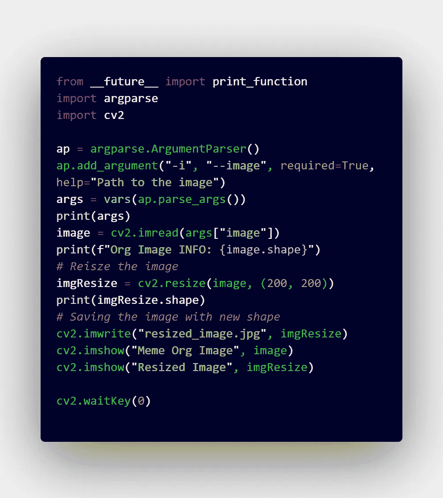**

> ***#重新调整图像***
> 
> **imgResize = cv2.resize(image，(200，200))这里(200，200)是我们想要调整图像大小的新大小& cv2.resize 是我们使用 opencv 来调整大小的函数**
> 
> ***#用新形状保存图像***
> 
> **cv2.imwrite("resized_image.jpg "，imgResize)这里我们将 imgResize 变量传递给 cv2.imwrite 函数，以保存调整后的图像，名称为:" resized_image.jpg "**
> 
> **cv2.imshow("Meme Org Image "，Image):显示输出窗口**
> 
> **cv2.imshow("调整大小的图像"，imgResize):显示输出窗口**

**我们运行如下图所示的脚本:**

**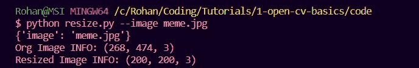**

**输出如下:左边是原始图像，右边是调整后的图像**

**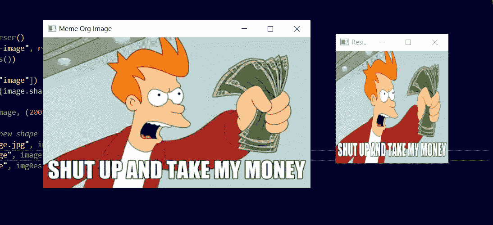****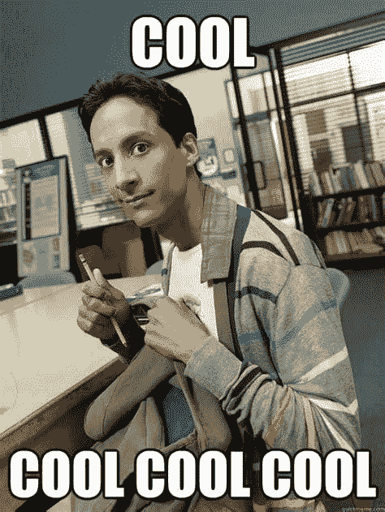**

# **14.如何使用 Python & OpenCV 阅读视频？**

**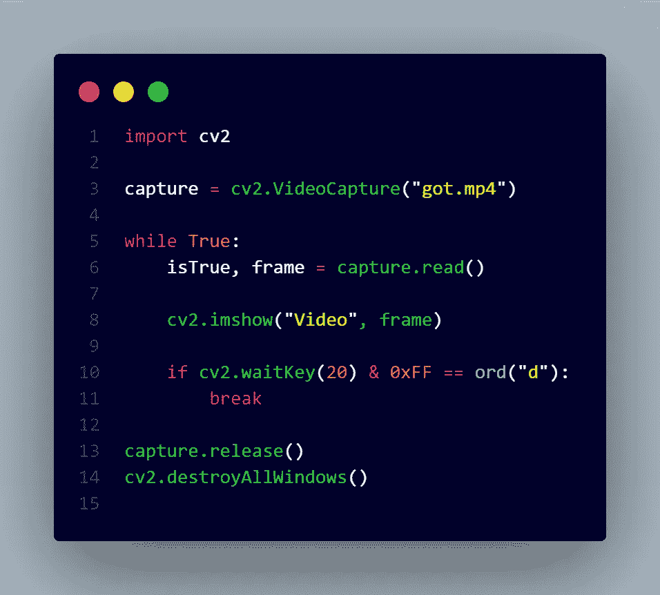**

> **捕获= cv2。video capture(" got . MP4 ")# video capture 函数从指定路径读取视频**
> 
> **#在框架中循环**
> 
> **虽然正确:**
> 
> **isTrue，frame = capture.read()**
> 
> **cv2.imshow("Video "，frame) #逐帧读取并显示**
> 
> **if cv2 . wait key(20)& 0x ff = = ord(" d "):#如果你从键盘上按下" d "，它就停止**
> 
> **破裂**
> 
> **释放视频对象**
> 
> **cv2.destroyAllWindows()**

**输出上面的代码片段:**

**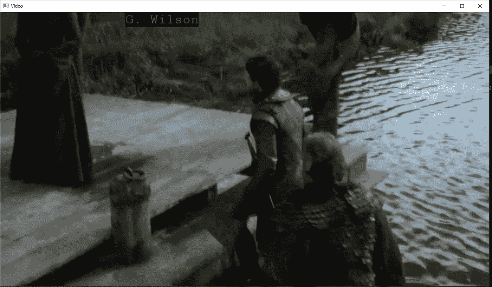**

# **15.如何使用 Python & OpenCV 重新缩放视频？**

**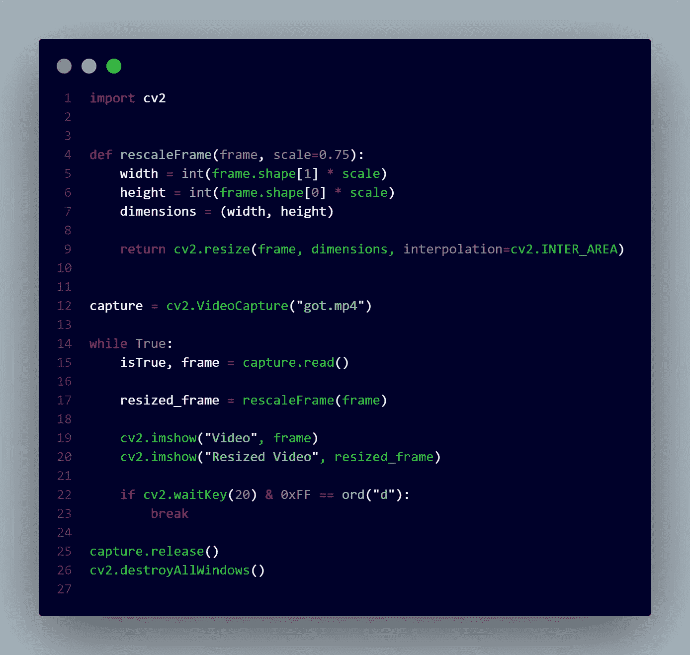**

## **定义一个重缩放帧功能来重缩放每一帧:**

> **定义重缩放帧(帧，缩放=0.75):**
> 
> **宽度= int(frame.shape[1] *比例)**
> 
> **height = int(frame . shape[0]* scale)**
> 
> **尺寸=(宽度，高度)**
> 
> **return cv2.resize(帧，尺寸，插值=cv2。区间 _ 区域)**

**运行上述代码片段后的输出:**

**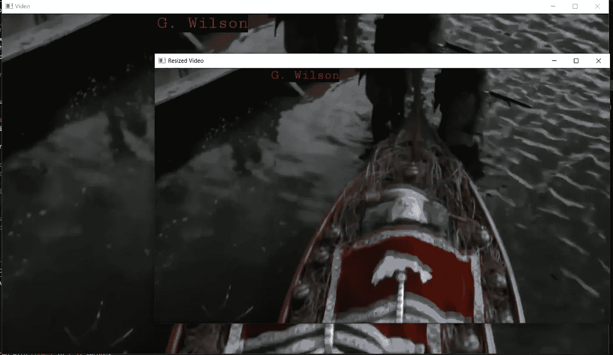**

**在上面的输出截图中，我们可以清楚地看到原始视频和调整大小的视频帧。**

**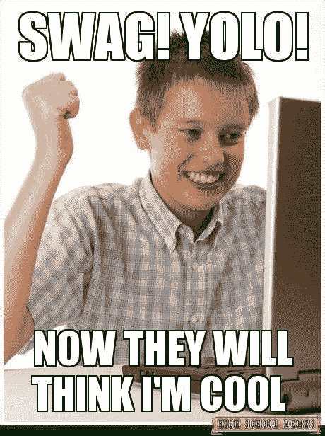**

**希望这些基础知识可以让你开始使用 OpenCV &你可以在 OpenCV 的基础上构建伟大的工具和应用程序。**

**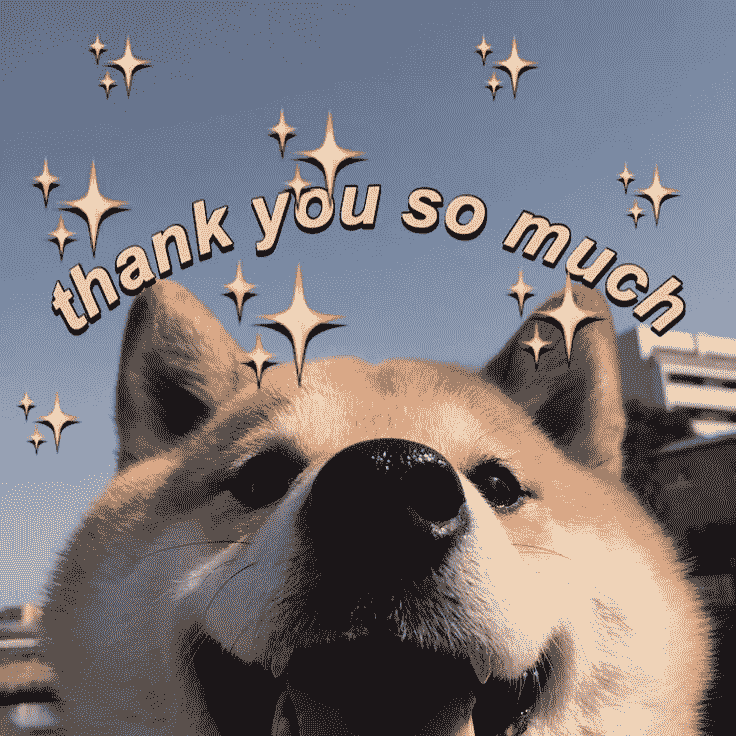**

**请随时添加任何反馈或意见。谢谢你。**

**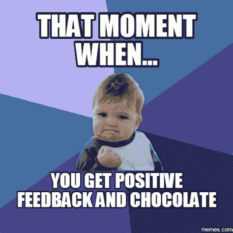**

# **参考资料:**

** [## 灰度图像和彩色图像有什么区别？

### 回答(第 1 题，共 5 题):灰度图像只有黑白阴影。它没有任何颜色信息，如…

www.quora.com](https://www.quora.com/What-is-the-difference-between-grayscale-image-and-color-image?share=1)**