# 超快速布局，带顺风和反应 JS

> 原文：<https://blog.devgenius.io/super-fast-layout-with-tailwind-and-react-js-86dd5d6c2f36?source=collection_archive---------8----------------------->


照片由[詹姆斯·哈里逊](https://unsplash.com/@jstrippa?utm_source=medium&utm_medium=referral)在 [Unsplash](https://unsplash.com?utm_source=medium&utm_medium=referral) 拍摄

你好，今天我将展示如何为你的应用程序实现一个超级简单的布局，包括导航栏、内容部分和页脚。

先决条件:

好了，在开始之前，我们需要下一个模板:

一个带有 react js 的简单应用程序(你可以用 [next](https://nextjs.org/docs) 、 [create-react-app](https://create-react-app.dev/) 或 V [ite](https://vitejs.dev/) 来创建它)或者如果你愿意，你可以访问框架部分的 [tailwind 页面](https://tailwindcss.com/docs/installation/framework-guides)。在这种情况下，我使用了 Vite

不错！在项目创建之后，我们必须安装 tailwind，这样你就可以阅读文档来安装 npx 了

```
npm install -D tailwindcss postcss autoprefixer
npx tailwindcss init -p
```

好了，让我们配置 tailwind，将所有模板文件的路径添加到您的`tailwind.config.cjs`文件中。

在 index.css 中

```
@tailwind base;
@tailwind components;
@tailwind utilities;
```

只需运行 dev 服务器来使用 tailwind:

```
npm run dev
```

很好，我们现在正在使用 vite 和 Tailwind css。

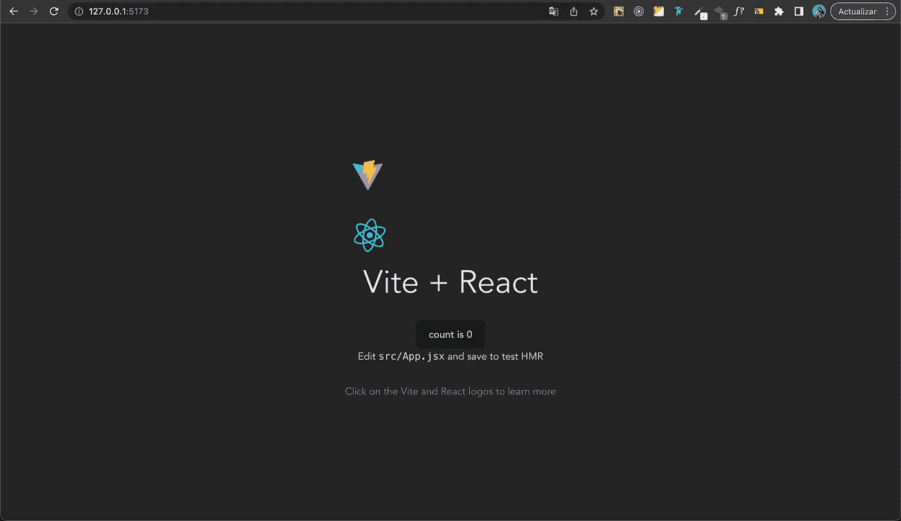

现在我们将删除所有由 Vite 创建的 css，因为我们正在使用 tailwind。

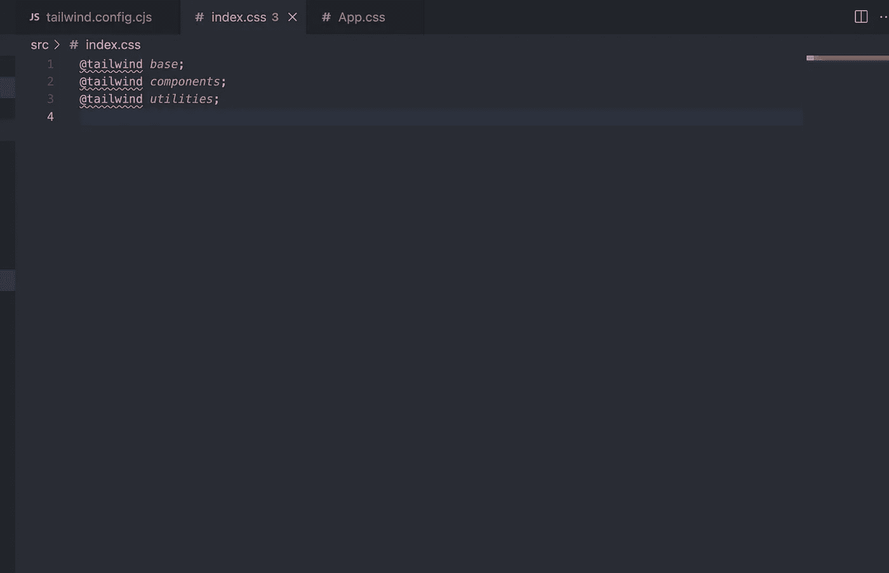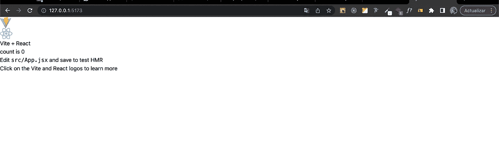

完美！然后，我将展示我们今天将在媒体网站上创建的模板:

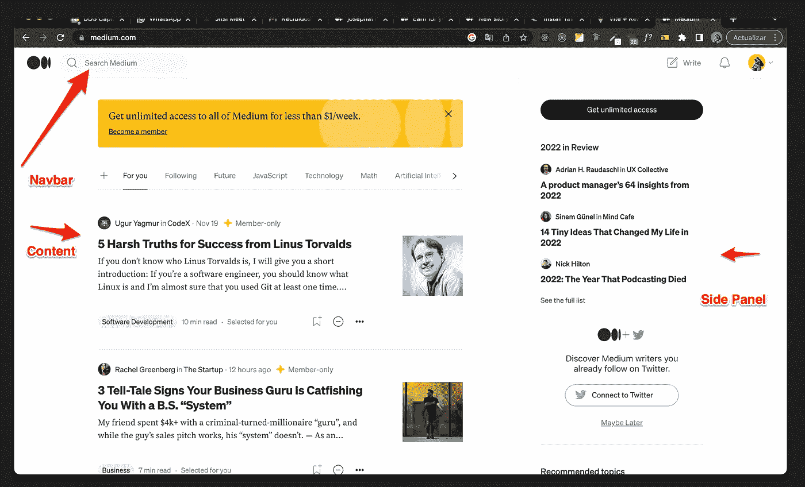

Excelent！现在让我们首先工作，我们必须在组件中定义我们的布局:

1.  导航条
2.  内容
3.  阿斯代帕内尔

完美！这些组件将显示在一个网格中，我将指定一种背景颜色来标识每个组件。

现在，我们将创建下一个文件和文件夹，以包括布局的所有组件，如下所示:

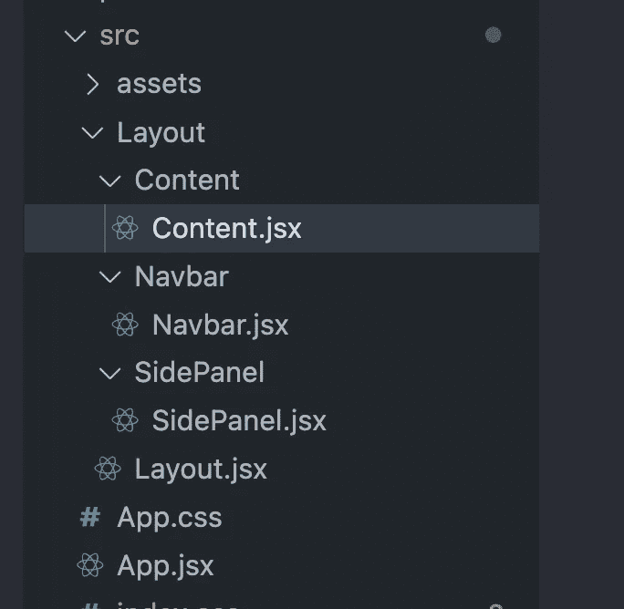

好，让我们从创建我们的布局和添加网格类来初始化我们的网格布局的一些 jsx 代码开始

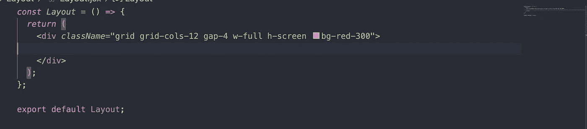

很好，这是我们布局的主要组成部分！

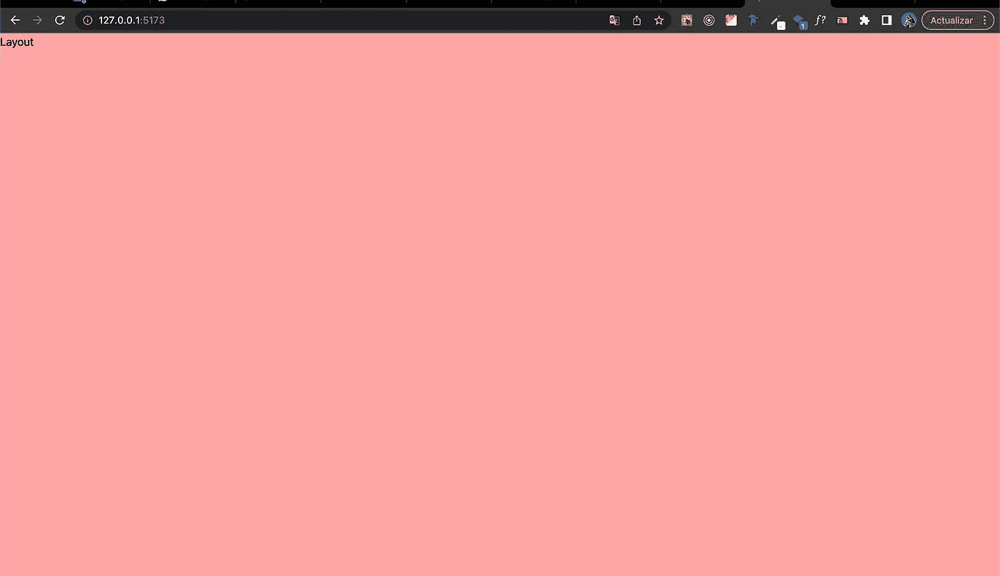

在这里，我们添加了大小为 cols-12、高度为 3.74 的导航栏，还添加了一些额外但不必要的类，如 flex、padding 和 align-items

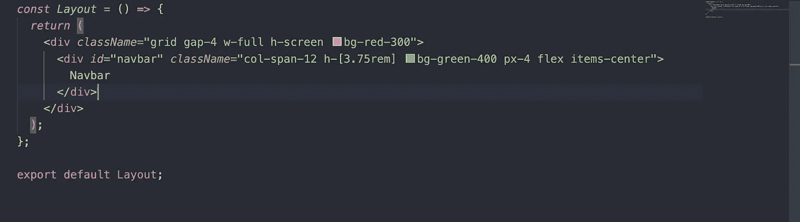

这就像导航条的样子

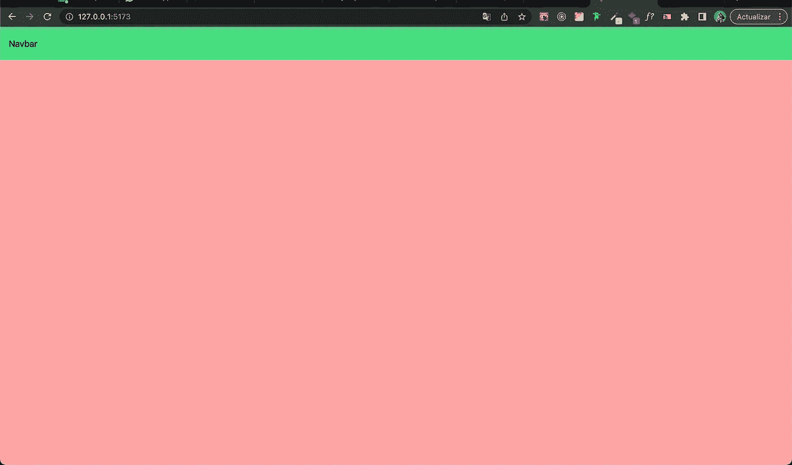

然后，我们将添加 8 列大小的内容块，并为高度添加 calc():100 VH(**viewport height**)减去 3.75 rem(navbar height)以获得桌面中所有可能的高度

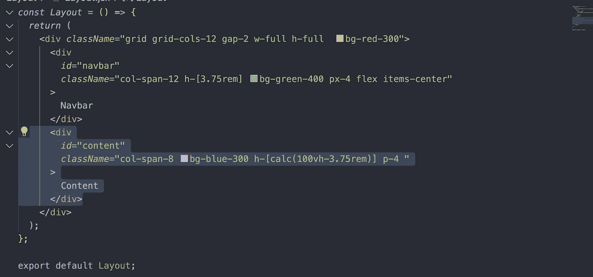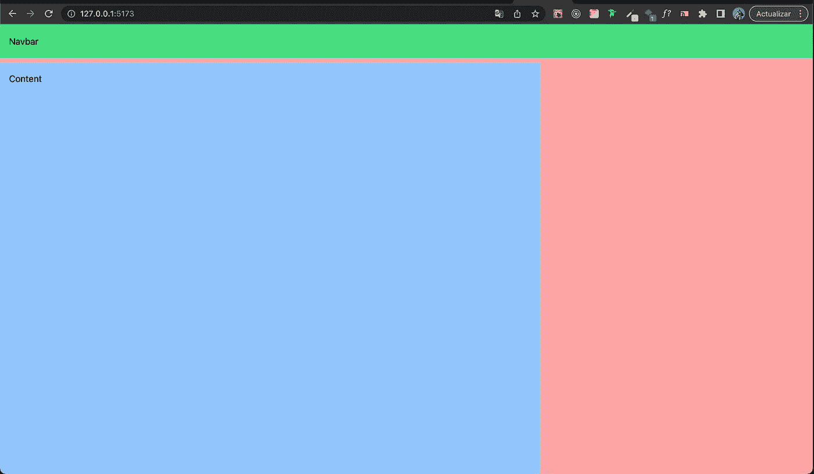

现在，我们将添加 4 列大小和橙色背景色的侧面板

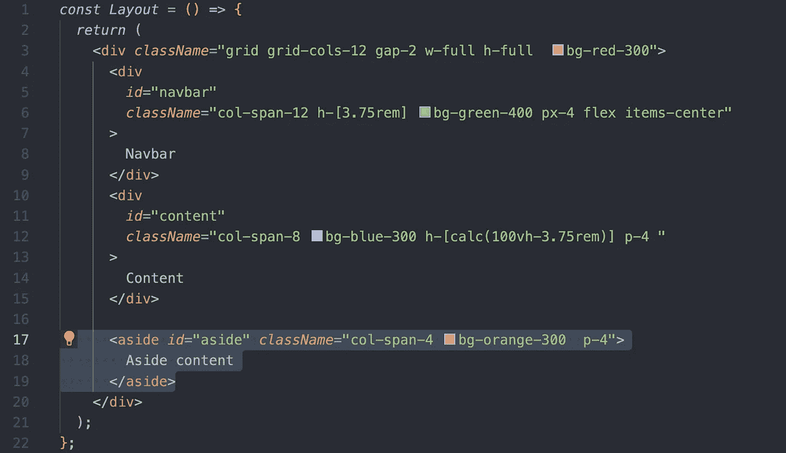

这是所有布局的桌面视图的结果(我们也将添加移动部分)

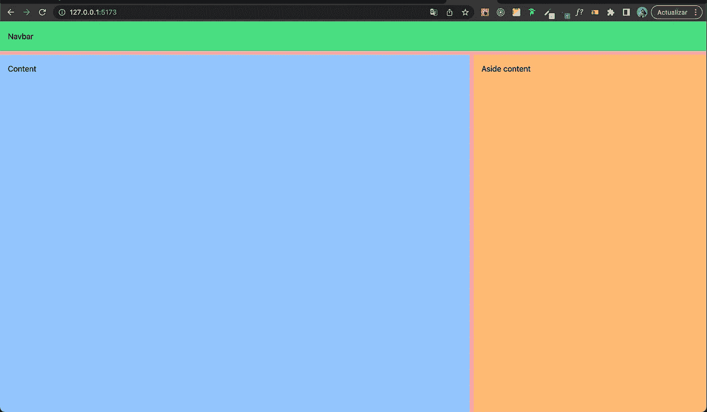

现在，我们必须为响应式设计添加断点，这是顺风的一个优势，因为它非常快，只是你需要知道如何显示元素(在这种情况下，我们希望内容和侧面板在移动视图中更改为 12 列)

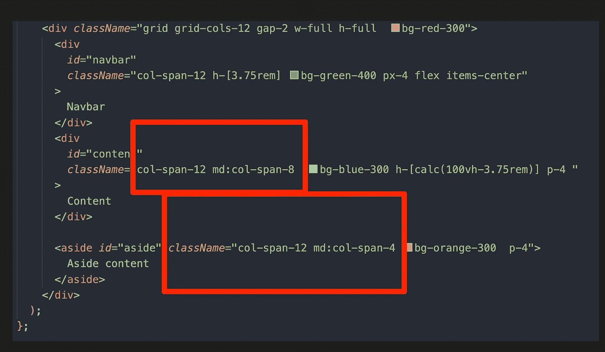

这是移动断点的视图

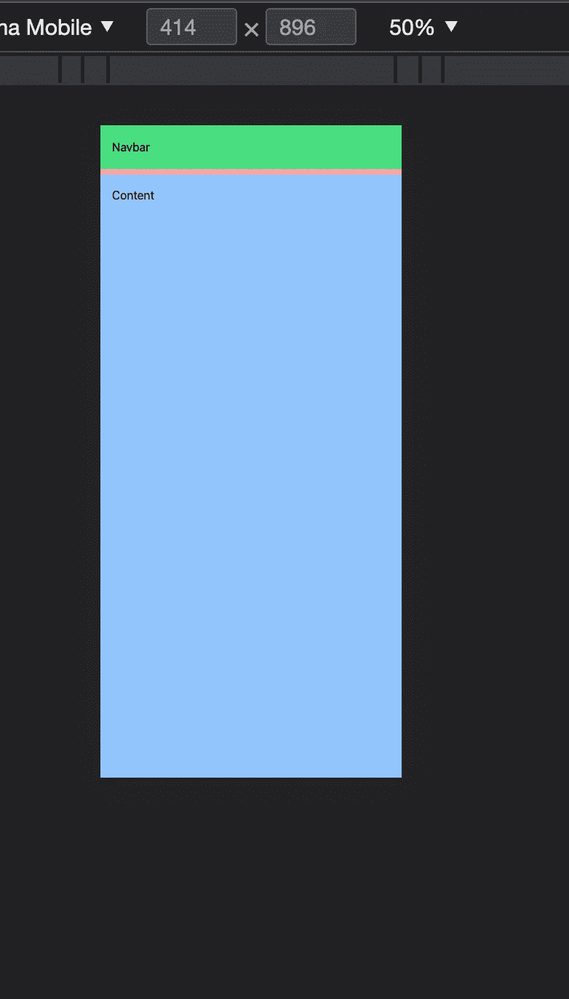

现在，我们终于可以将所有 jsx 代码分成多个组件了:

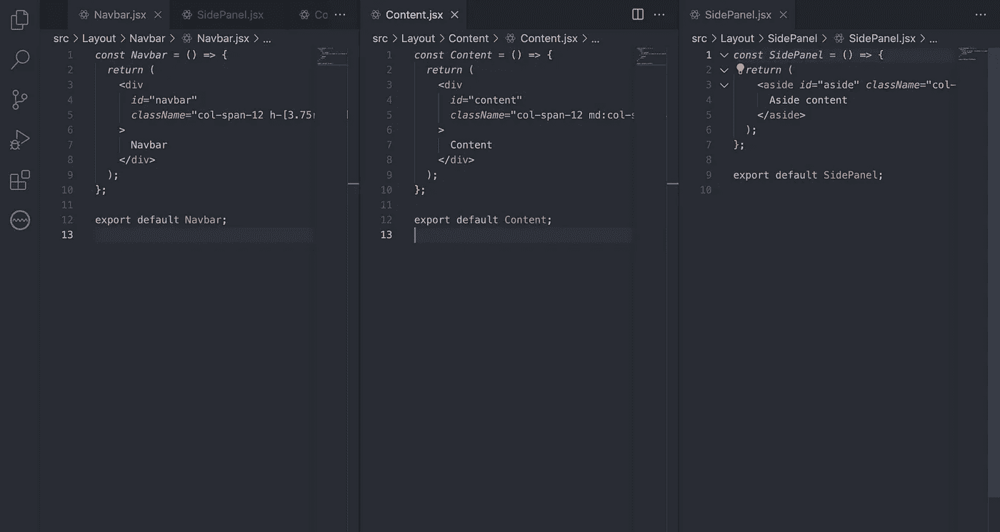

之后，我们可以将它们导入到主布局组件中，如图片所示:

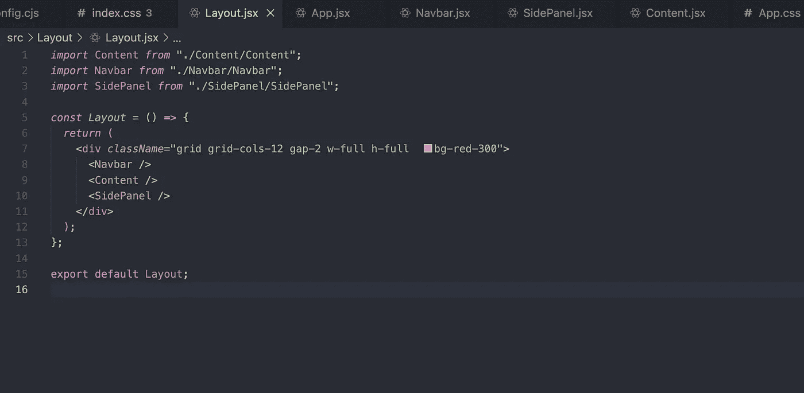

这就是我们对任何应用程序或网站的简单布局，使用 tailwind 和 react js 非常容易