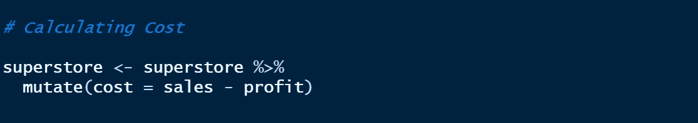
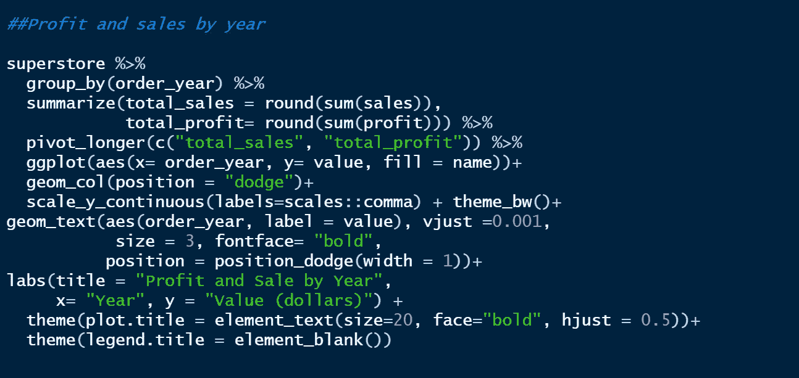
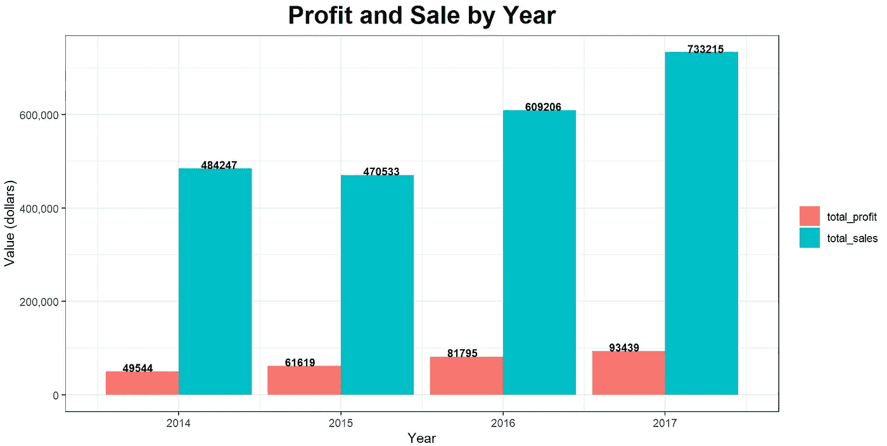

# 超市分析

> 原文：<https://blog.devgenius.io/superstore-analysis-e570d90de301?source=collection_archive---------1----------------------->

## **探索性数据分析和 R 可视化**

[卡格尔](https://www.kaggle.com/datasets/abiodunonadeji/united-state-superstore-sales)

# **简介**

洞察使您能够更好地了解您的业务，并根据数据分析进行优化。这个项目侧重于使用 R Studio 中的 R 编程进行探索性数据分析和可视化。

这个项目是基于客户、销售、利润、产品、品类甚至时间序列分析。

这个项目中使用的数据集是从 [tableau 社区](https://community.tableau.com/s/question/0D54T00000CWeX8SAL/sample-superstore-sales-excelxls)下载的。这是一个美国超市销售的样本数据集

# 加载库并将数据集导入 R Studio。

在我们继续进行分析之前，我们将加载库，导入**超市销售额(Excel)。xls dataset，**数据清理，快速了解我们将要处理的数据。

# 加载库

让我们导入我们的 Excel 文件，并将该文件作为 ***超级商店*** 存储在对象中

# 让我们快速了解我们的变量和数据框架，并做一些数据清理

密码

结果输出

密码

结果输出

从上面显示的结果来看，变量命名是不一致的，我们需要清理它

密码

让我们检查列名，确保变量名现在是一致的

检查变量名

结果输出

变量名现在是一致的。

密码

结果输出

在数据框中有 9994 行或观察值和 21 列或变量。

密码

结果输出

数据框中没有缺失值

在我们的分析中，我们不需要 **row_id** 和 **country** 变量。现在，我们将继续删除 row_id 和 country 列(变量),因为数据框仅适用于美国

密码

使用 ***colnames()*** 函数确认删除 **row_id** 和 **country** 变量。

结果输出

# 分析

超级商场的分析将根据以下内容进行。

1.  产品级别分析
2.  客户层次分析
3.  区域和时间序列分析

# 产品级别分析

产品类别代码

产品类别结果

密码

结果输出

密码

结果

子类别产品分为 17 个。

密码

每个子类别中产品数量的结果输出

密码

结果输出

从上面的形象化描述中，人们可以很容易地决定从商店购买产品时要注意哪个类别和子类别

密码

结果输出

这家商店有各种各样的办公用品，尤其是活页夹和纸张

密码

**结果输出**

与其他产品相比，复印机的利润最高，而椅子和手机的销量也很高。然而，桌子和书架的利润并不显著，因此，这些部门处于亏损状态。

密码

结果输出

密码

结果输出

密码

结果输出

居住在美国西部的人们倾向于从超市订购更多的东西。

**为了进一步分析，我们将计算成本和利润百分比变量**

*   **计算成本**

密码

现在，让我们根据成本找出十大产品

密码

结果输出

*   **计算利润百分比**

密码

现在，让我们看看利润为 100%的类别和产品

密码

结果输出

三个品类中有 140 个产品获得了 100%的利润，然而，办公用品有更多的产品获得了 100%的利润，如下图所示

密码

结果输出

## 为了进一步分析，我们来看一下客户级别的分析

# **客户层面分析**

密码

结果输出

总共有 793 名顾客

密码

结果输出

密码

结果

这种分布在消费者群体中是最高的。此外，标准等级的船舶模式在所有航段中最高

密码

结果输出

最赚钱的顾客来自印第安纳州，其次是华盛顿。然而，我们可以看到大多数盈利客户来自纽约和密歇根州。

密码

结果

# 区域和时间序列分析

密码

结果输出

西部地区销售额最高，总销售额为 725，458 美元

密码

结果输出

西部地区的利润最高，总利润为 108，418 美元

## 我们还将计算装运持续时间，从数据帧的 order_date 中提取 year

*   **计算装运持续时间**

密码

密码

结果输出

从上面的结果来看，使用 ***标准等级发货*** ***模式*** 将产品从商店发货最多需要 7 天或一周时间。

密码

结果输出

从上面的“当天发货”模式来看，在订购当天就可以发货，但是，标准等级的发货模式平均需要 5 天

*   **从订单日期中提取年份**

密码

密码

结果输出

以上显示，销售额和利润逐年增长，导致 2017 年的利润率较高

密码

结果输出

以上显示，2014-2017 年全年，西部地区的利润总额和销售额最高。然而，在 2015 年，东部的利润和销售额超过了包括西部在内的任何其他地区。

密码

结果输出

综上所述，科技产品在 2014、2016 和 2017 年的销量最高。然而，更多的家具产品在 2015 年售出。

密码

结果输出

从 2014 年到 2017 年，办公用品和科技产品的利润持续增长。然而，2015 年和 2017 年家具产品销售利润大幅下降。

密码

结果输出

所有代码都可以在我的 [***Githup 资源库***中找到](https://github.com/abbeynet77/Superstore-Analysis/blob/main/Superstore%20Project.R)

非常感谢您的阅读。请 [**关注我中**](https://medium.com/@abiodunonadeji) 更多探索性数据分析项目及数据分析相关话题。注意安全！