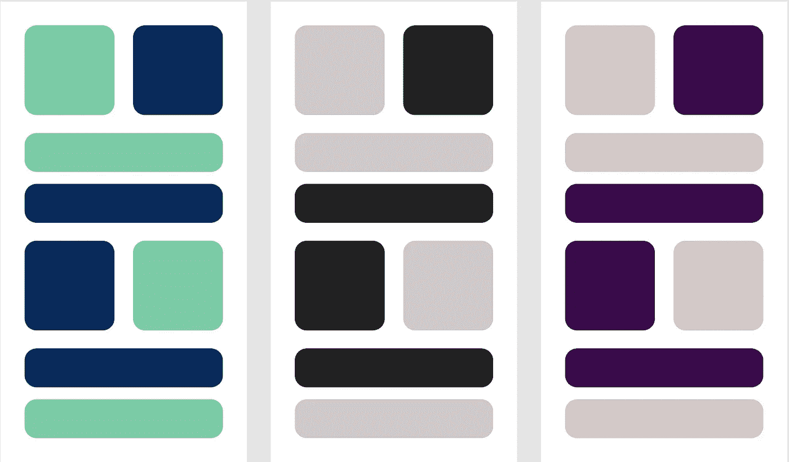

# 使用 Jetpack Compose 支持用户选择的主题

> 原文：<https://blog.devgenius.io/supporting-user-selected-themes-with-jetpack-compose-6446080ec234?source=collection_archive---------0----------------------->



Jetpack Compose 为明暗主题之间的切换提供了出色的支持。如果您使用 Android Studio 对话框添加一个空的编写活动，它将免费出现在 IDE 为您添加的样板代码中。在`ui/Theme.kt`中，您将会看到一个与此类似的函数:

```
@Composable
fun MyTheme(darkTheme: Boolean = isSystemInDarkTheme(), ...) {}
```

由于`darkTheme`的默认值，你不必担心用户在系统设置中的明暗主题之间切换——你的应用程序会自动响应这一变化。然后，您将使用这个函数作为您的编写 UI 顶层的一种包装器，只需从函数调用中省略掉`darkTheme`参数。

```
MyTheme {
    Screen()
}
```

但是如果你的应用允许你的用户从应用的偏好中选择一个主题呢？应用程序让用户在亮主题、暗主题或匹配系统主题之间进行选择是非常常见的。应用程序也提供其他主题并不罕见——既有深色主题，也有黑色主题，或者更奢侈的主题。

那么我们如何在 Compose 中做到这一点呢？如果你仔细想想，在这种情况下，我们真的没有做任何根本不同的事情——我们只是观察和响应应用程序级别的偏好，而不是系统级别的偏好。因此，让我们看看样本黑暗主题支持是如何工作的，以了解从哪里开始。

首先注意，当我们调用`MyTheme`函数时，我们只是省略了`darkTheme`参数。我们可以这样调用这个函数:

```
MyTheme(darkTheme = false) {
    Screen()
}
```

相反，我们将该值委托给函数`isSystemInDarkTheme()`。如果我们检查`isSystemInDarkTheme()`，我们看到它是一个返回布尔值的可组合函数。因为当用户改变他们的系统设置时，它能够强制[重组](https://developer.android.com/jetpack/compose/mental-model#recomposition)，我们知道它一定是在观察一个可变的状态。从概念上讲，大概是这样的:

```
@Composable
fun isSystemInDarkTheme(): Boolean {
    val darkTheme by remember { mutableStateOf(false) }
    return darkTheme
}
```

当然，在现实中，这个函数不是一个布尔文字`false`而是观察系统的黑暗主题设置。但从概念上讲，这是幕后发生的事情。更改状态的值将强制重组，这将在整个可见的 UI 中级联为应用程序主题的更改。

因此，为了支持用户选择的主题，我们需要调整我们的“MyTheme”函数，以接受一个枚举主题参数而不是一个布尔值，并将其默认值设置为一个类似于“isSystemInDarkTheme”的可组合函数，该函数观察当前的应用程序主题。让我们打开包装。

假设我们的应用程序主题有一个如下所示的枚举:

```
enum class Theme {
    Light,
    Dark,
    Auto
}
```

我们不是将`isSystemInDarkTheme()`作为参数传递给主题，而是传递一个观察当前主题的函数，如下所示:

```
@Composable
fun MyTheme(theme: Theme = currentAppTheme(), ...) {} @Composable
fun currentAppTheme(): Theme {
    val theme by themeFlow.collectAsState()
    return theme
}
```

`themeFlow`这里有一个代表当前应用主题的`StateFlow`。它可能来自视图模型、数据存储或其他一些抽象的数据源。关键的部分是它是可观察的——每当用户在你的应用中改变他们的主题偏好，新的价值必须由这个可观察的来源发出。

*注意，如果它是一个纯粹的* `*Flow*` *(比如来自数据存储库)，那么调用将需要一个初始值，如* `*themeFlow.collectAsState(initial = Theme.Auto).*` *它也可以是一个* `*LiveData*` *，在这种情况下，您将调用* `*themeLiveData.observeAsState().*`

这就是全部了！每当用户改变他们的主题偏好时，你的撰写 UI 将自动改变主题。

在上面的实现中，您可以拥有任意多的主题——红色主题、蓝色主题等等。但是请注意，在这个特定的例子中，我们仅有的主题是亮、暗和自动，我们可以很容易地将其与自动主题的`isSystemInDarkTheme()`结合起来。

```
@Composable
fun isAppDarkTheme(): Boolean {
    val theme by themeFlow.collectAsState()

    return when (theme) {
        Light -> false
        Dark -> true
        Auto -> isSystemInDarkTheme()
    }
}
```

当然，我们也可以将它与一个额外的自定义主题相结合:

```
enum class Theme {
    Light,
    Dark,
    Auto,
    Rainbow
}@Composable
fun currentAppTheme(): Theme {
    val theme by themeFlow.collectAsState()

    return when (theme) {
        Auto -> {
            if (isSystemInDarkTheme()) {
                Dark
            } else {
                Light
            }
        }
        else -> theme
    }
}
```

*关注更多关于 Kotlin 和 Android 开发的最佳实践。*