# R 中的生存分析

> 原文：<https://blog.devgenius.io/survival-analysis-in-r-d4f98d450a7a?source=collection_archive---------11----------------------->

卡普兰-迈耶生存函数给出了存活过去时间 t 的概率:

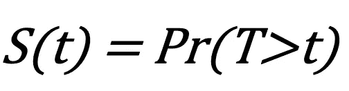

卡普兰-迈耶生存函数

86 名膀胱癌患者切除了肿瘤。移除后，这些患者被分成两组，安慰剂组(0 组)和药物 Thiopeta 治疗组(1 组)。该数据集中的可变时间表示肿瘤在患者中复发前的几个月。可变的审查员指示肿瘤是否复发。如果肿瘤没有复发，观察结果将被删除。可变数字代表 1 对 2 或更多的肿瘤切除数。

使用 Kaplan-Meier 估计值估计每个治疗组的生存函数。报告治疗组和安慰剂组的 S(5)、S(10)和 S(25)的 Kaplan-Meier 估计值。说明治疗组和安慰剂组的 Kaplan-Meier S(10)估计值。

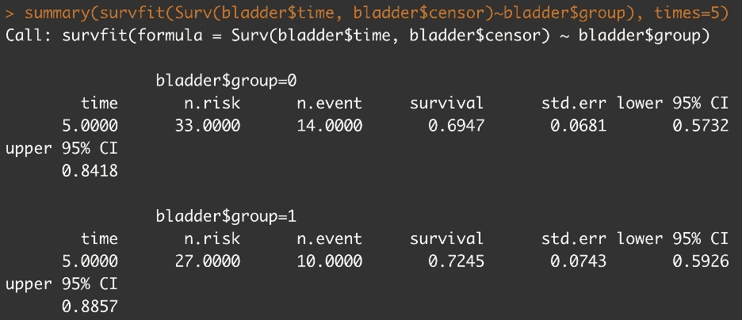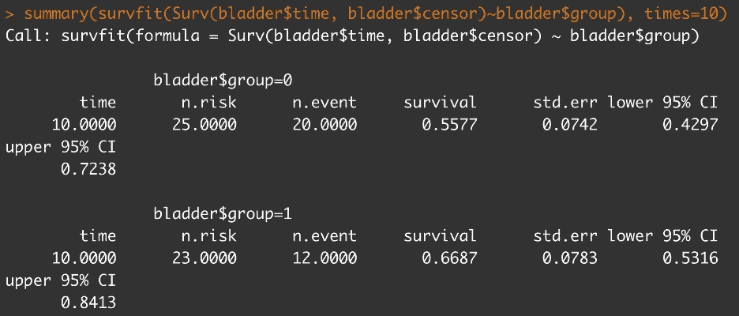

S(t)给出了患者存活超过时间(t)而没有肿瘤复发的概率。S(10)可以解释为安慰剂组的 55.77%在 10 个月内没有经历肿瘤复发，而治疗组的 66.87%在 10 个月内没有经历肿瘤复发。

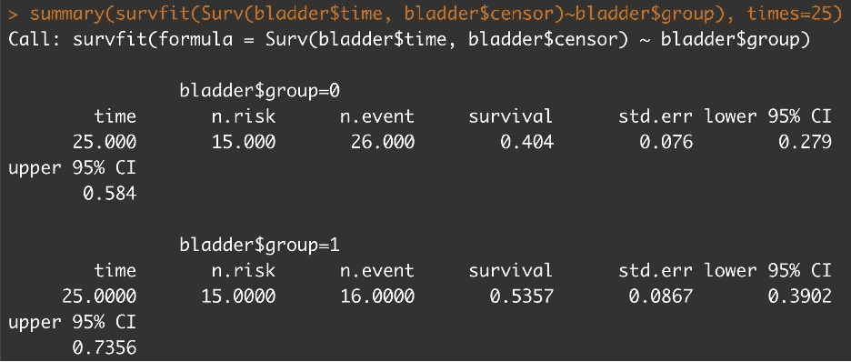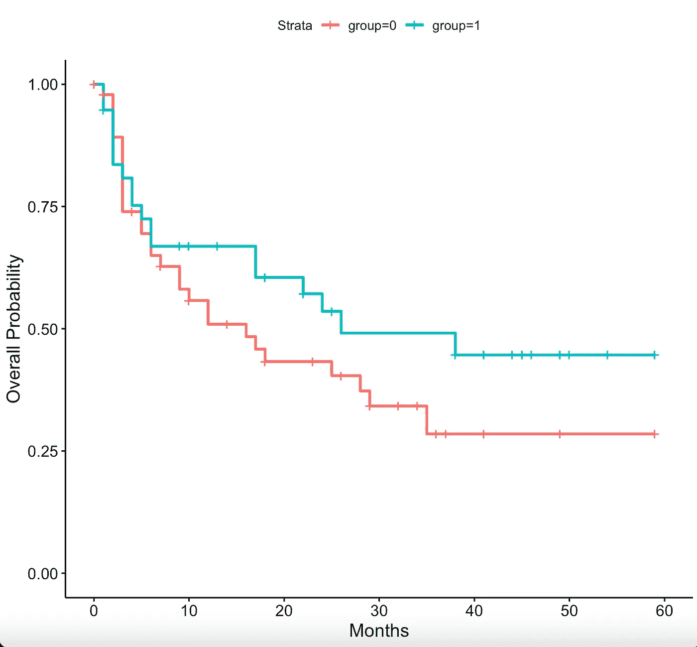

该 Kaplan-Meier 曲线给出了患者存活超过时间(t)而没有肿瘤复发的概率。第 0 组:安慰剂，第 1 组:治疗

对数秩检验将通过检验治疗组和安慰剂组随时间推移肿瘤复发概率的差异来检验治疗组和安慰剂组之间的差异。

无效假设:数据不支持安慰剂组和治疗组之间肿瘤复发时间存在差异的说法。

替代假设:数据支持安慰剂组和治疗组之间肿瘤复发时间存在差异的说法。

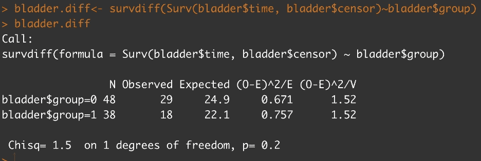

结论:未能拒绝零假设。数据不支持安慰剂组和治疗组之间肿瘤复发时间存在差异的说法。

Cox 比例风险模型:h(t)= h0(t)exp {β1 group+β2 number }其中 h(t)是给出肿瘤在 t 时间之前发生的概率的风险函数，h0(t)是风险函数， *β* 是回归系数。

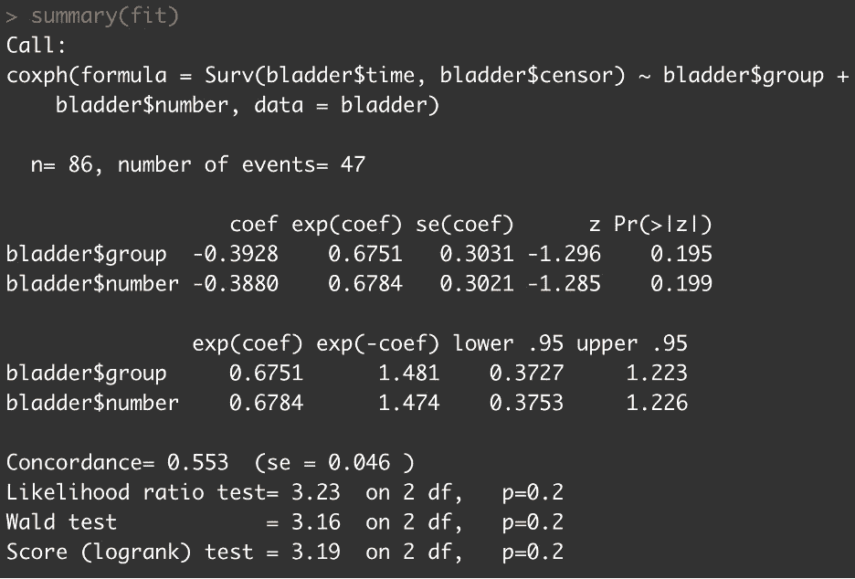

治疗组患者的肿瘤复发风险是安慰剂组患者的 0.6751 倍。95% CI 为(0.3726，1.223)，其中包含 1。这表明在治疗组中的人肿瘤复发的危险与安慰剂组中的人没有显著差异。

r 代码:

膀胱膀胱

库(生存)
膀胱. km < - survfit(膀胱$时间，膀胱$检查员)~膀胱$组，数据=膀胱)
膀胱. km
总结(survfit(膀胱$时间，膀胱$检查员)~膀胱$组)，次数=5)
总结(survfit(膀胱$时间，膀胱$检查员)~膀胱$组)，次数=10)
总结(survfit(膀胱$时间，膀胱$检查员)~膀胱$组)，次数

库(Surv miner)
ggsurplot(
fit = Surv fit(Surv(膀胱$时间，膀胱$审查)~膀胱$组，数据=膀胱)，
xlab = "月数"，
ylab = "总体概率")

膀胱差异膀胱差异

契合总结(契合)

**ISLR2 11.8 实验室:生存分析**

本实验来自第二版*统计学习及其在 R 中的应用的介绍中的第 11.8 章。*这本书对我的数据科学学习之旅非常有帮助，我强烈推荐它。

参考资料:
詹姆斯，g .、威滕，d .、哈斯蒂，t .和蒂布拉尼，R. (2021) *统计学习及其应用导论，第二版*，[https://www.statlearning.com](https://www.statlearning.com/)，斯普林格出版社，纽约州

如果你想查看一些其他的机器学习主题和实验室，这里是这本书的在线链接。实验在每一章的结尾。[https://hastie.su.domains/ISLR2/ISLRv2_website.pdf](https://hastie.su.domains/ISLR2/ISLRv2_website.pdf)

脑癌{ISLR2}

由被诊断患有脑癌的患者的存活时间组成的数据集。具有 88 个观察值和 8 个变量的数据帧:
性别:具有“女性”和“男性”级别的因子
诊断:具有“脑膜瘤”、“LG 神经胶质瘤”、“HG 神经胶质瘤”和“其他”级别的因子
loc:具有“幕下”和“幕上”级别的位置因子
ki: Karnofsky 指数
gtv:以立方厘米为单位的总肿瘤体积
立体:具有“SRS”和“SRT”级别的立体定向方法因子
状态:患者是否

资料来源:
I. Selingerova、H. Dolezelova、I. Horova、S. Katina 和 J. Zelinka。原发性脑肿瘤患者的生存率:两种统计学方法的比较。PLoS One，11(2):e0148733，2016。[https://www.ncbi.nlm.nih.gov/pmc/articles/PMC4749663/](https://www.ncbi.nlm.nih.gov/pmc/articles/PMC4749663/)

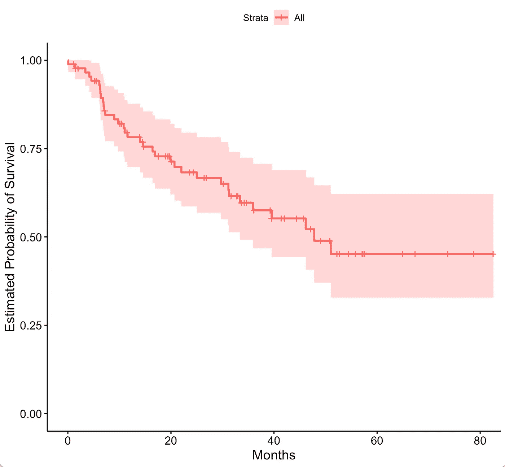

脑癌的 Kaplan-Meier 生存曲线

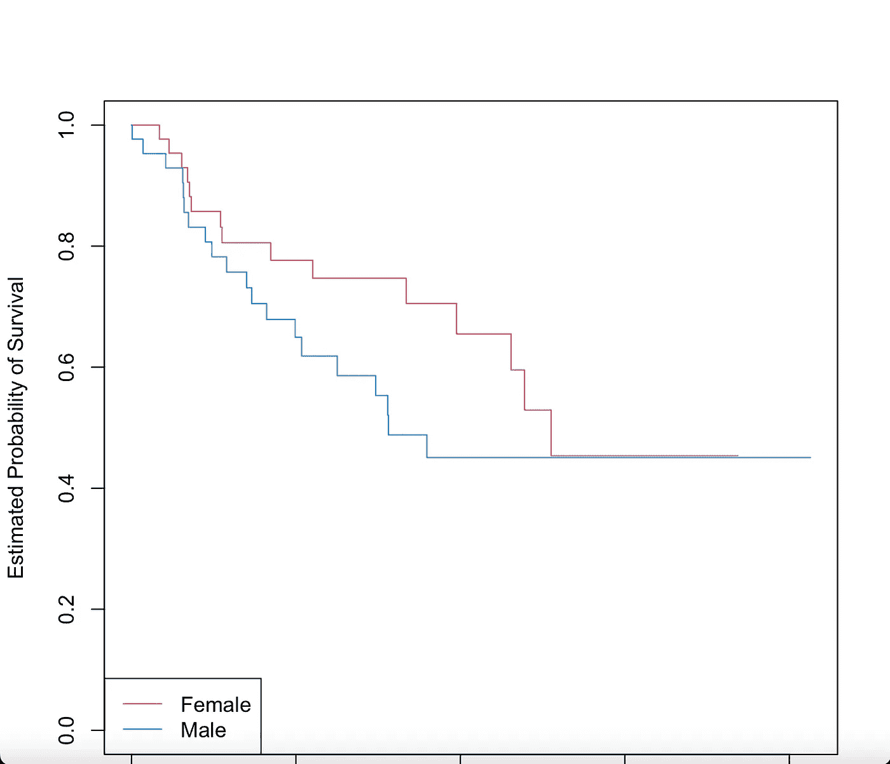

按性别分层的脑癌 Kaplan-Meier 曲线

对数秩检验将通过检验一段时间内男性和女性组之间存活概率的差异来检验男性和女性组之间的差异。

零假设:数据不支持随着时间的推移两组之间的生存概率存在差异的说法。

替代假设:数据支持这样的说法，即随着时间的推移，各组之间的生存概率存在差异。

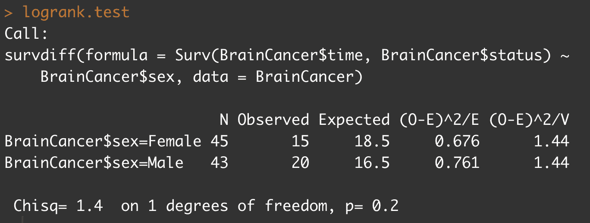

结论:未能拒绝零假设。数据并不支持随着时间的推移两组之间的生存概率存在差异的说法。

Cox 比例风险模型结果:

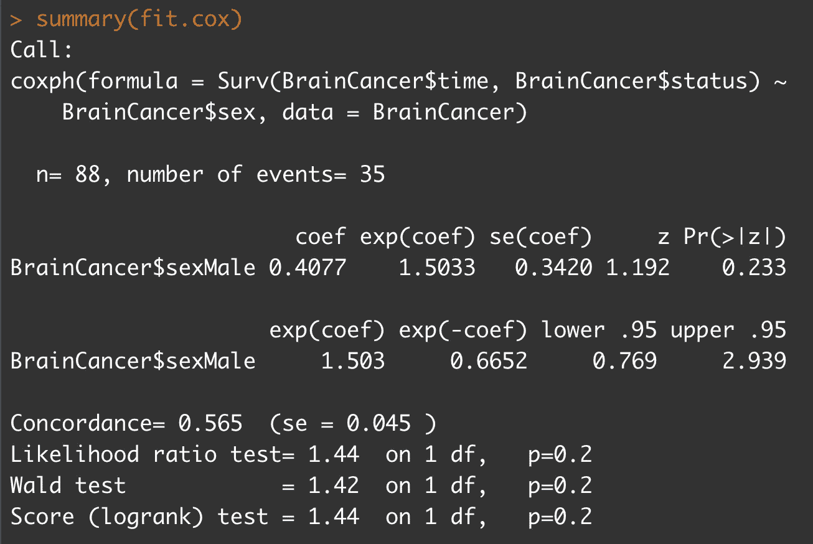

没有证据表明男性和女性的存活率有差异。

符合 Cox 模型并包括其他预测因素

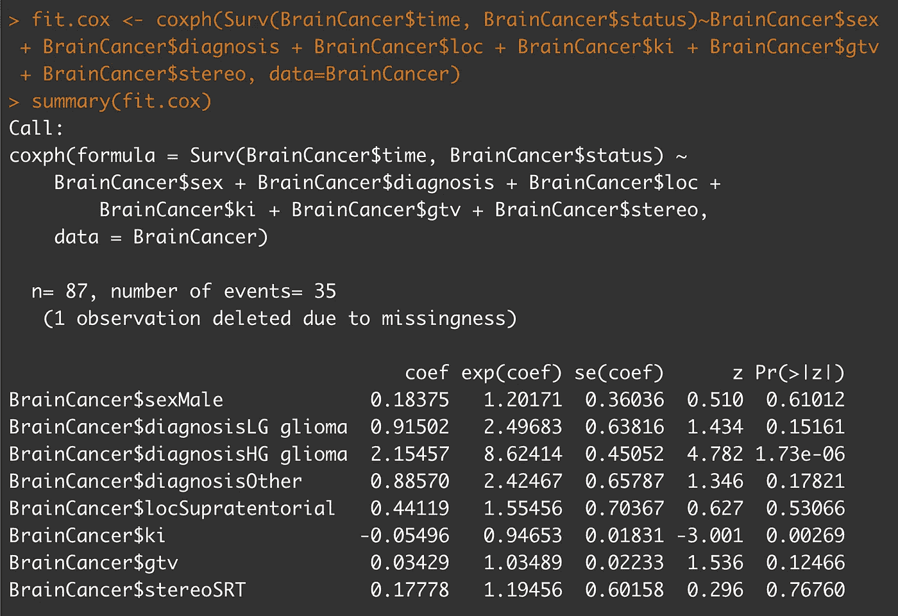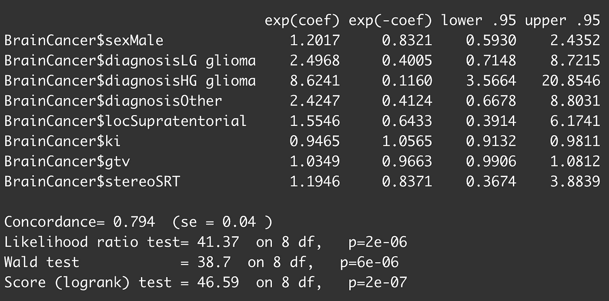

与脑膜瘤的基线条件相比，诊断为 LG 神经胶质瘤的死亡可能性是 2 倍，而诊断为 HG 神经胶质瘤的死亡可能性是脑膜瘤的基线条件的 8 倍以上。此外，Karnofsky 指数有一个负系数，表明较高的值与较长的生存期相关。

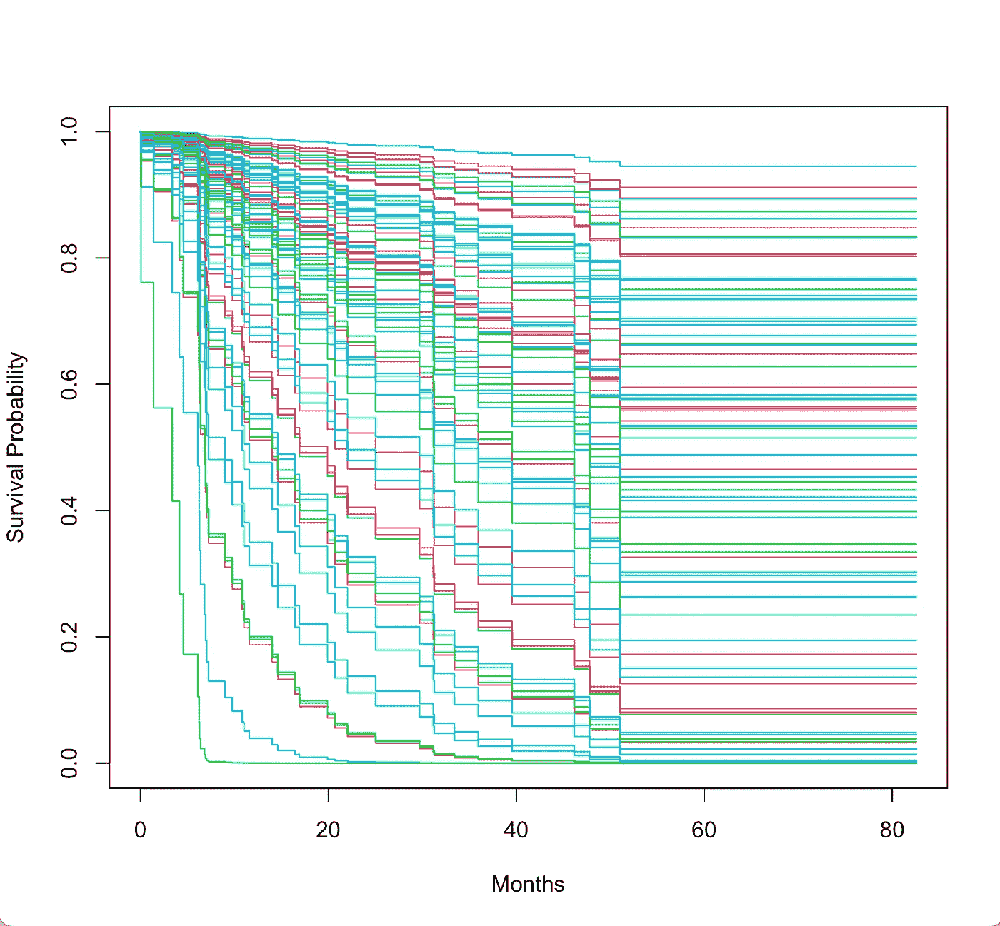

通过诊断得出的生存概率。红色:脑膜瘤，绿色:LG 胶质瘤，深蓝色:HG 胶质瘤，浅蓝色:其他

r 代码:

库(ISLR2)
数据(“脑癌”)
？脑癌

人名(脑癌)
附(脑癌)【性别】表
表(诊断)
表(状态)

库(生存)
fit.surv<-sur fit(Surv(脑癌$时间，脑癌$状态)~1，数据=脑癌)
图(fit . Surv，xlab = "月数"，
ylab = "估计的生存概率")

库(surv miner)
ggsurplot(
fit = fit . surv，
xlab = "Months "，
ylab = "估计的生存概率")

fit . sexquartz()
plot(fit . sex，xlab = " Months "，
ylab = "估计的生存概率"，col = c(2，4))
legend (c("左下角")，levels (sex)，col = c(2，4)，lty = 1)

logrank.test logrank.test

fit.cox 摘要(fit.cox)

fit.cox 摘要(fit.cox)

modaldata sex = rep("女性"，4)，
loc = rep("幕上"，4)，
ki = rep(均值(ki)，4)，
gtv = rep(均值(gtv)，4)，
stereo = rep (" SRT "，4))

surplots 图(surplots，xlab =“月”，
ylab =“生存概率”，col = 2:5)
图例(c(“左下”)，级别(诊断)，col = 2:5，lty = 1)