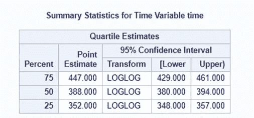
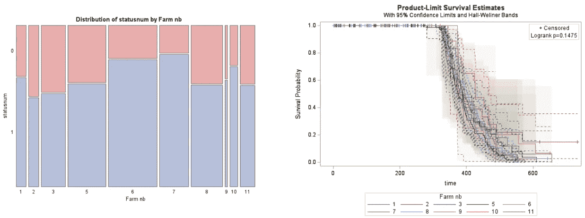
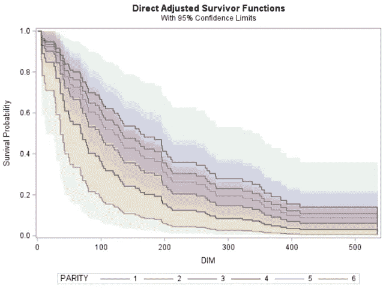
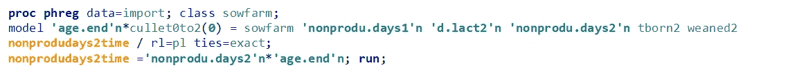
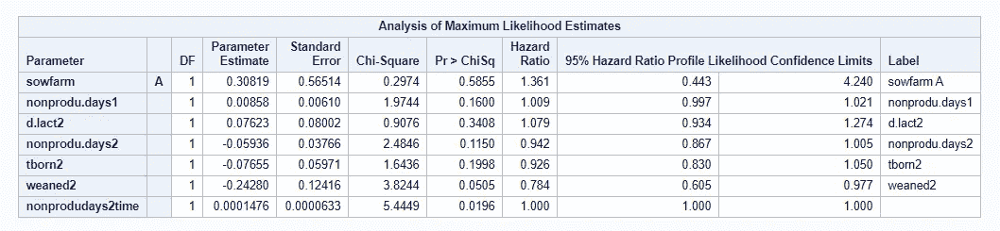
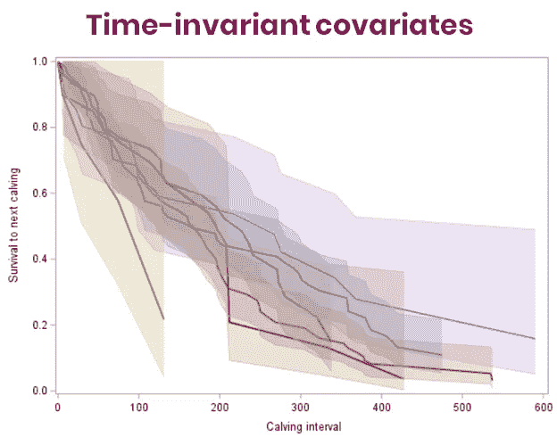
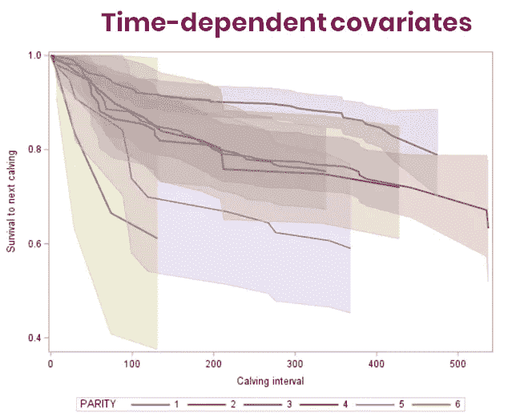
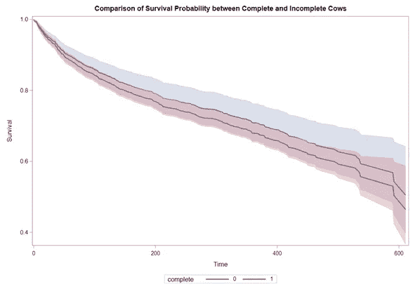
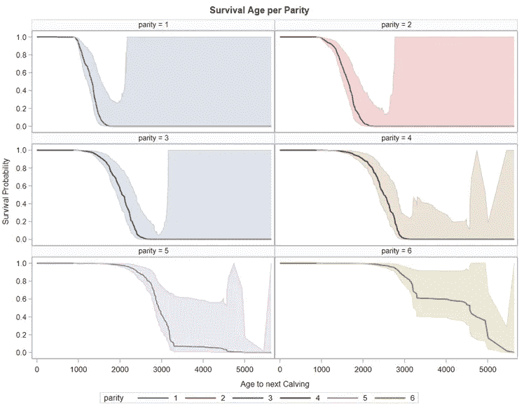
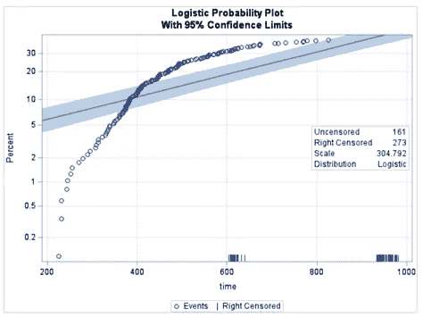

# SAS 中的生存分析

> 原文：<https://blog.devgenius.io/survival-analysis-in-sas-kaplan-meier-cox-regression-time-varying-predictors-recurrent-events-4ae7cd95f8c0?source=collection_archive---------0----------------------->

## Kaplan-Meier、Cox 回归、时变预测因子、复发事件和**加速故障时间模型**。

*这篇文章可以和我之前的* [*文章*](https://medium.com/@marc.jacobs012/introduction-to-survival-analysis-in-cows-using-r-28b82c2821fb) *一起阅读*

上面的图清楚地表明，生存(或事件发生时间)分析与两件事有关——事件发生的时间。如果你结合这两个因素，你将得到时间-事件分析。置信区间是为了警告你类似上一个的漂亮情节。SAS 中有几种程序可用于分析事件时间数据:

1.  **PROC ICLIFETEST**
2.  **PROC ICLIFEREG**
3.  **PROC 寿命测试**
4.  **PROC LIFEREG**
5.  PROC PHREG
6.  **过程逻辑**
7.  **PROC GLIMMIX**

我将向你展示一些最广泛使用的程序之间的区别，尤其是数字 3 到 5。

生存分析处理**事件发生时间数据**。因此，您可以对您能想到的任何事件进行建模。SAS 为分析事件时间数据提供了广泛的可能性。如前所述，生存分析只不过是**时间-事件分析**。因此，你不需要生存数据来使用这些分析方法。通常，当你相信一个以上的解释变量可以解释一个事件发生的时间时，你可以使用生存分析。当**随访不完整**或可变时，生存分析变得特别有用。这被称为审查——更准确地说——权利审查。

这个例子相对简单——比较治疗之间的**事件时间**。白色圆圈是最有趣的部分——这是**删失数据**或随访不完整的数据。这意味着在我们停止观察的时候，我们没有看到一个事件。

当你停止一项研究或对一个主题失去跟踪时，审查就发生了。

白色圆圈指的是经过审查的数据。

在数据集中，您需要通过指定研究对象是否经历和事件来告诉算法发生了删截。

前面的例子强调了**事件发生时间数据**的最基本部分，以及如何满足对其进行分析的要求:

1.  **时间**:对于每种动物，你都需要一个“时间”指标。
2.  **事件**:对于每种动物，您需要指定事件是否发生。这可以是任何东西。*甚至一个事件的缺席也能成为一个事件。*
3.  **审查**:对于每一只你有“到达时间”指标并且没有事件发生的动物，数据将被自动审查。
4.  **退出/丢失跟随**:右删截。

你必须对“事件”的构成有一个清晰的定义:

1.  死亡
2.  疾病
3.  重现
4.  反应

你也需要知道时钟什么时候开始:

1.  事件发生时的年龄？
2.  从研究开始的时间？
3.  随机化后的时间？
4.  自响应以来的时间？
5.  该事件会发生多次吗？

然后，我们有审查，当我们有缺失的信息发生。有三种类型:左、右、音程。最常见的是 Richt 审查。

**左侧审查:**

1.  不清楚监控的确切开始时间
2.  缺少出生日期
3.  开始治疗的日期未知
4.  在纳入研究之前经历事件——尤其是在重复事件分析中

**右审查** *(最常见的审查形式)* **:**

1.  有些动物可能无法全程观察到
2.  失访
3.  退出
4.  研究/随访的终止

左右截尾图。未检测到左侧审查。

在每一行显示研究对象的数据集，包括事件发生时间指标(C1-C2 时间间隔)和事件指标(状态)。

可以使用上面的数据集创建简单的生存图。

因此，尽管 SAS 中的分析很容易进行，但也可能非常棘手，因为有几个因素会影响非常显著的结果:

1.  事件数量
2.  事件时间
3.  审查(左、右)
4.  事件的重复发生

请记住，分析的能力取决于发生事件的数量，而不是包括的研究对象的数量。

让我们继续讨论风险率。

危险率是死亡/活着的比例。它是时间点 t 的瞬时故障率。下图显示了危险率随着时间的推移而增加

危险率。

累积风险率是一段时间内所有风险率的积分函数。因此，它是时间间隔[0，t]内的预期失败次数

累积危险。

知道了风险率，我们就可以开始寻找中位生存时间，它等于找到 t，使得 S(t) = 0.5。这是一半样本无事件的时间点。中位数生存是表达分布“中心”的最常见方式，这是由于大多数生存方法的非参数性质。在参数建模中，你向平均存活时间移动。

中位生存时间设定为 388 天。

危险函数摘要。

存活分析最常用于比较 Kaplan-Meier 乘积估计和对数秩检验为去因子分析方法的治疗。

比较治疗方法。

比较治疗组的一个简单的开始是通过比较 2*2 中的事件数。当然，如果没有生存时间，这样的比较是非常有限的。

Kaplan-Meier 估计量是生存函数最广泛使用的估计量，有无比较。也称为乘积限估计量。卡普兰-迈耶方法是一种非参数估计方法，这意味着它不假设基本分布。因此，平均存活时间。能够很好地处理删失数据，尤其是右删失数据(失访/退出)。在 SAS 中，您可以使用 **PROC LIFETEST** 来请求此分析。

我请求进行非参数对数秩检验来比较治疗方案。

每个治疗的基本信息包括总纳入数、事件数和删截数。右边是平均存活时间。

不显著的对数秩检验。

生存概率是失败概率的倒数！

累积危险图。

多重治疗的比较。

永远不要忘记调整多重比较！

累积风险图和中位数生存分析比较。置信限也许比点估计更有趣，因为它们表明了审查的程度。

生存分析中的组/治疗的比较非常简单。比较的功效取决于事件的数量。不是样本大小。要比较治疗/组，您可以使用 Kaplan-Meier 估计值来检验两个或多个组之间的统计显著性。为了获得更多的见解，还可以看看失败时间、中位存活时间和累积风险图。

在上一节中，我们讨论了如何使用以下工具比较时间-事件曲线:

1.  对数秩检验
2.  中位数生存估计
3.  生存图*(包括置信带)*

现在是时候回归事件的潜在重要变量来计算它们的风险比了。这部分变得更加棘手，因为我们从非参数*(无假设)*模型转移到半参数模型*(有一些假设)。*

Cox 比例风险模型(CPHM)是一种研究生存时间和独立变量之间关系的技术。你用 Kaplan-Meier 比较生存函数，而在 **Cox 回归中，你比较风险函数**。请记住，特定时间间隔的风险函数/比率给出了受试者在该时间间隔内失败的**概率，**假定受试者在该时间点之前没有失败。因此，危险比率是两个危险比率之间的比率。**CPHM 模型假设风险比在一段时间内保持不变。**这就是 CPHM 被称为比例风险模型的原因。该模型假设不依赖于时间！这种假设被称为比例风险假设(PHA ),经常被违反。我将向您展示如何测试这个假设，以及如果违反了这个假设，如何处理它。

在 SAS 中，PROC PHREG 是 cox 回归分析的首选程序。这是唯一的 SAS 程序，具有使用生存回归的全套可能性。这也应该是你的标准 **PROC** 用于任何种类的生存数据，即使只是比较两组。

这里，我指定了一个 COX 模型来比较不同治疗的存活时间

左侧和右侧是基本信息，带有危险和累积危险图。应该提供与卡普兰-迈耶相同的结果。

现在，我另外请求创建一个针对协变量进行调整的 Cox 回归图。

卡普兰-迈耶和考克斯回归图

在上表中，与治疗组 b 相比，治疗组 A 的动物的风险率降低了约 4% **(风险比= 0.958)** 。然而，这种降低并不显著**【HR 0.785；1.169]** 。

在附加协变量上建立新模型。

加上这些协变量。

Cox 回归模型的结果

每个协变量的风险比和每个胎次的调整后存活函数。

在 **PROC PHREG** 程序中，一个协变量中有缺失值的观察值将被完全排除！！因此，在这个例子中，我丢失了 73%的数据。意识到这一点，因为它会影响你的分析能力。SAS 不关心并提供…..

你可以清楚地看到没有包含交互项。

但不准确！

你可以看到，加入或排除某些协变量会极大地改变直接调整后的生存函数。你需要非常小心你的内容。

总是，总是，总是看你得到的估计的置信区间。它们告诉你很多关于模型的稳定性和数据的粒度。

新型号。

新结果

另一种模式，其他结果。

选择方法——这里是逐步的。这些都是传统的贪婪的方法，并不是最好的方法。也见此[帖](https://medium.com/@marc.jacobs012/predictive-regression-using-splines-partial-least-squares-penalization-cross-validation-and-339b74a7e108)。

评估 complet 模型的一种方法是查看受试者操作曲线，或 ROC 曲线。在模型中，您需要 AUC。0.5 的一致性统计意味着模型预测就像掷硬币一样好！

ROC 曲线。C 统计值是 0.88，相当不错。

获取调整后的生存函数的代码。

以及用来评估模型的表格和图表。

前面的例子是统计驱动的。最好由**生物**来驱动*(连续)*变量的选择。另一种选择方法是查看包含的协变量的函数形式。你可以使用**鞅残差**来评估这一点。你应该看不到任何结构！如果这样做，您需要添加多项式效果或样条来模拟连续协变量。

没有发现结构，因此线形内含物似乎是好的。

在 **PROC PHREG** 中，还有 **ASSES 程序**。这是一个更加统计的过程，使用重采样来测试协变量拟合。它可以用于许多评估，包括鞅以及 PH 假设。

P 值大于 0.05 意味着不需要深入研究模型。当然，一个模型总是需要有生物学上的意义。

记住 Cox 回归最重要的假设是比例风险假设(PHA)。在 SAS 中，有三种方法可以评估是否违反了这一假设:

1.  为每个分类变量创建**卡普兰迈耶图**。
2.  创建**舍恩菲尔德**残差。
3.  使用 **PROC PHREG** 中的 **PROPHAZARD / PH** 选项测试比例危险假设。

评估比例风险假设的一个广泛使用的图形标记是**生存概率不应跨越**。

舍恩菲尔德残差

通过评估程序进行 PH 值假设。在这里，一个单一的预测器似乎很棘手。

现在，如果比例风险假设被违反了呢？您有四个基本选项:

1.  **如果系数随时间的变化非常小，则忽略**非比例性。
2.  **通过非比例协变量对模型进行分层**。
3.  在随访时间的间隔内运行 Cox **模型，而不是在整个随访时间内运行。**
4.  将**随时间的协变量交互作用**作为 Cox 模型中的预测因子。

包括与时间的协变量相互作用

协变量的交互作用是显著的

协变量与时间相互作用的重要性与之前的结果一致，这意味着对于这个特定变量来说 **PHA 不成立**！！但是，它的影响力相当有限。

此外，寻找有影响力的观察结果总是好的，这样做很简单，也很直观。

下面，您将看到不同数据集的输出。在时间-事件分析中，风险比是对相关事实的估计，因为它是一个比较指标。然而，一旦你在你的模型中指定了相互作用，正如我下面所做的，你必须手动地建立你的风险比作为相互作用的函数。

包括互动。

对模型函数的风险比要求

结果呢

和更多的结果。这些互动会变得很快

因此，在 SAS 中， **PROC PHREG** 应该是您在分析事件时间数据时使用的默认程序，因为它采用了 Cox 比例风险模型(CPHM)。CPHM 是一个**半参数模型**，这意味着它可以处理许多相对简单的问题，但你需要检查某些假设。CPHM 模型主要用于**分析协变量**对事件发生时间数据的影响，有几种内置方法**统计选择**可能最重要的变量。来自 CPHM 模型的感兴趣的输出是**风险比**——一个风险率的比率，被假定为随时间恒定。风险比为 1 意味着各组之间没有差异。需要检查此**比例危险假设**以安全使用 CPHM。有几种内置方法可以做到这一点。当**分析交互**时，您需要硬编码危险比率。解释会很快变得非常模糊。

N 现在是时候转向一个更高级的话题了——时变协变量。在下面的图片中，你可以看到简单的时间-事件分析的例子。

可用于事件时间分析的图层数据。

以及我们已知格式的同一层数据—适合时间-事件分析。

组间比较。

以及使用 **PROC PHREG** 的生存回归。

到目前为止，我们只处理了不随时间变化的协变量。有了这些数据，每只动物可以用一行数据来表示，因为每个协变量只需要一个值。然而，我们通常对一个协变量的影响建模感兴趣，该协变量的值可能会在随访期间发生变化。这意味着在时间*的危险取决于在时间 ***t*** 的变量的值。危险比的解释也不同，取决于两个变量的变化。*

**

*这里我们可以看到时变协变量。处理这些协变量需要一些数据争论和重新编码。*

*要实现时变协变量，您需要重构数据，有四种方法可以实现:*

1.  ***计数过程** —独立事件*
2.  ***条件模型 A** —重复事件*
3.  ***条件模型 B** —重复事件*
4.  ***边际模型** —独立事件*

*计数过程是最广泛使用的模型，但是它**假设独立事件**。我们可以通过包含一个**稳健夹层估计量**来处理这个问题，有些人可能从广义估计方程中知道这个估计量。*

**

*包含和不包含时变 avEW 的数据集。*

*在 SAS 中的计数过程可以在下面的图片中看到。与往常一样，优势来自数据集的结构，而不是在模型本身中如何指定它。*

****

*我们现在有了一个(开始，停止)变量，而不是时间到事件变量。我还包含了一个健壮的三明治估计器来处理相关结构，这种结构通过在一个 ID 中包含多个观察值而自动存在。*

*通过包含稳健的三明治估计量，你可以尝试处理数据的相关性。结果，标准误差增加到更合适的大小。请记住，相关数据会降低功效，从而增加估计的标准误差。*

***

正常与计数过程* ****

*正常与计数过程。了解置信区间如何因包含时变协变量和三明治估计量而增加。*

**

*显示脆弱数据计数过程的生存模型的图。置信区间非常大，这是由于缺乏事件，而不是三明治估计量。*

*下面，您可以看到一个不同数据集的图表，其中包括事件时间数据和时变协变量。*

****

*数据*

************

*情节*

**

*模型*

****

*结果。时间相关数据集中的事件较少，因为我只包括具有第 1 胎和 dim=0 时的数据的动物。*

****

*结果也是如此。*

****

*以及模型之间在风险比方面的差异。仔细观察并注意，包括时变预测因素并不会导致整体效应或更大的置信区间。通过包含随时间变化的预测值，您包含了一个依赖于时间的相互作用效应，它可以导致任何地方的结果发生变化。*

*总之，大部分时间，我们处理的是不随时间变化的协变量——时不变协变量。但如果我们这样做，我们有时间相关的协变量。这意味着协变量对风险的影响取决于时间。危险比率变化的解释。要包含时间相关的协变量，必须改变数据集并进行不同的分析。结果可能变化很大。*

*L ets 停留在时变话题，从预测器转移到结果。我们来谈谈**复发事件分析**。在我们的一些例子中，剔除是事件。每只动物只能发生一次。如果我们产犊，我们可能会有复发的事件。在前面的例子中，产次是下一次产犊的标志，我把它作为一个时间不变因素包括在内*

****

*按胎次剔除的分析*

**

*该数据集同时关注淘汰和产犊。在这里，奇偶校验实际上成为一个时变协变量的指标。*

*淘汰可以发生一次，但产犊可以发生多次。因此，“事件”要么是淘汰，要么是下一次产犊(*事件*)。*

**

*现在有两种类型的事件，它们是对立的。*

**

*旧的建模方式—使用事件和奇偶校验，但不考虑起止过程。*

**

*可以看到奇偶的风险比= 0.949[0.881；0.1020].这意味着每增加一胎次，继续下一次泌乳的风险下降 100 *(0.949–1)= 5.1%。什么是危险，什么不是危险取决于事件，因此,“危险”一词有多种含义，不一定是负面的。然而，奇偶校验的影响并不显著。*

*使用混合模型，您可以根据新奶牛的协变量特征对其进行估计。估计新曲线通常可以帮助您理解模型正在做什么。该模型将所有变量视为主要影响，控制所有其他主要影响。在下面的数据集中，我只改变了奇偶性。*

**

*使用模型创建曲线的新数据集*

**

*每胎存活时间。*

*曲线的性质取决于所用模型的**类型，以及所包含的**协变量的特性**。使用的模型类型由风险区间决定。***

**

*解决重复事件问题的不同方法——计数过程、间隙时间、总时间。*

*重复事件分析中可能有两种基线:*

1.  *公共基线*
2.  *事件特定基线*

*具有**公共基线**危险的模型对所有事件具有相同的潜在危险。**事件特定基线**危险是一种分层的基线危险，它允许每个 kᵗʰ事件的基线危险不同。**按事件**分层实质上是为每个第 k 个事件拟合一个单独的模型。**集合模型还**假设危险是自上次事件以来的时间函数。因此，它使用了一个常见的危险。*

**

*特定于事件的基线模型*

**

*您会得到完全不同的模型，左边的模型更有意义，因为它具有适合数据粒度的置信区间。此外，从第一胎到第二胎的风险率也很可能影响从第二胎到第三胎的风险率。从生物学上来说，随着时间的推移，到达下一个哺乳期变得越来越困难。*

****

*汇集事件的共同来源。*

*从特定事件到公共基线**完全改变了危险比**。这是有意义的，因为只有在前一次哺乳发生的情况下，才会发生下一次哺乳的事件，除此之外别无其他。0.086 的 HR[0.071；0.104]表示去下一次哺乳期的危险性降低 100 *(0.086–1)= 91.4%。*

*让我们看看共同原点加上总时间。*

****

*公共原点加总时间。*

*根据您实际使用的模型，估计值会不断变化。这从来都不是一个好的情况，这可能暗示着一个不稳定的模型，其中包含了高度相关的协变量。*

*以下是适合不同型号的代码。*

****

*每个模型需要什么，假设什么，做什么。*

**

*每个型号的编码。*

*观察总存活时间的不同类型模型的比较如下。*

****

*两种模式的比较。看看置信区间的不同。对于 MAW LWA 来说，这些置信区间是如此之大，以至于生存曲线甚至不再有意义。即使两者都使用共同的基线。*

****

*一次性和反复性的时间差别很大。右边的图实际上将数据作为一个逐步的过程，对我来说，这更适合我们所看到的数据。*

**

*包含特定事件基线的模型比较。您可以看到，MAR WLW 和 PWP CP 有一个来自之前平价的提前期，而 PWP GT 没有。这是数据编码方式的一部分。*

**

*图表比较模型限于生存到第二次产犊。*

**

*限于存活至第三次产犊的模型比较图。这就是编码差异变得明显的地方。*

****

*每个模型类型的危险比比较。会有很大的不同。*

*选择哪个型号？我们拥有的数据集非常复杂，因为我们既有重复发生的事件，也有时间相关的协变量。对于复发事件，边际模型不适合使用，当治疗效果依赖于时间时:*

1.  ***无限制模型**没有什么意义，因为它们没有反映预期的“平均”待遇。*
2.  ***事件特定模型**需要谨慎解读。如果使用，应明确说明治疗效果不是恒定的。*
3.  ***间隙时间模型**是很好的使用模型，但是它们的风险比率反映的是上一次事件的风险，而不是一开始的风险。*

*因此，它们都有优点，当然也有缺点。*

*使用差距模型，我们得到以下结果:*

**

*请注意，宇称 os 不再是协变量，它只是作为阶层。*

****

*夹层估计量和不同阶层的一些信息。第六个及以上的奇偶校验没有非常精确的数据。随着胎次的增加，审查也增加。*

**

*结果。不要以为平价不再是协变量。*

************

*每胎次绘图*

**

*这告诉我们，每增加一头小牛，下一次泌乳的风险就会增加 36%。增加 2 头小牛与 86%进入下一个哺乳期的风险相关。*

**

*DMI 与小牛数量的风险比。这是寻找一些剂量反应效应的一种天真的方法。*

*由于缺乏数据， *csDMI* 危险比的置信上限随着 *csDMI* 的增加而大幅增加。 *csDMI* 危险比保持不变，因为我们没有指定相互作用。*

*需要结合复发事件的特应性是**左删失数据**。左删失数据是指你知道结束的数据，但不知道开始的数据。在本例中，您可以清楚地看到，对于某些奇偶校验，我们不知道长度，因为我们不知道起点。*

****

*对于一些奶牛，我们没有第一次产犊的信息。*

*让我们比较完整和不完整的奶牛。两组之间似乎没有区别。尽管如此，我们需要考虑到左审查。*

*****

两组之间似乎没有区别。尽管如此，我们需要考虑到左审查。* ********

*包括或不包括第一胎次数据的奶牛之间没有真正的差异。*

*处理左侧审查的最好方法是找到一个对每种动物都通用的起点。因为我们在这个数据集中有奶牛，我们没有关于它们最早胎次发生了什么的数据，我们不能真正计算重复事件的影响。然而，我们能做的是利用他们的出生日期。然后，时间变量实际上变成了年龄变量。下一次哺乳的机会就变成了年龄的函数。*

**

*您需要更改数据集。年龄=产次年龄。Left_time =数据集中条目的年龄。*

**

*左删失很容易包含在模型中。*

**

*从图表中可以看出。*

*现在，所有这些都不容易消化，归因于重复事件的空间和这里留下的审查是不够的。尽管如此，我还是想展示和提及它。当我们想要处理递归数据时，我们需要重构数据集，就像我们对时间相关协变量所做的那样。计数过程通常是最简单的方法。根据您想要评估的内容，有几种模型可以运行。默认情况下，没有一个比另一个更好。如果你有左截断的数据，寻找一个共同的来源或起源。时间变量的解释将会改变。*

*到目前为止，我们只处理了非参数或半参数模型。它们是很好的模型，但也局限于中位生存期。此外，他们不能外推，这有时是必要的。因此，让我们带着这个主要问题来看看时间-事件数据的参数模型:*“我们能扩展这些曲线吗？”*。*

**

*我们能延伸这些曲线吗？*

*是的，我们可以，为此，我们需要采用参数模型，称为**加速故障时间模型**，其中最常见的例子有以下分布:*

1.  *（统计学家）威伯尔（或韦布尔）*
2.  *指数的*
3.  *微克*
4.  *对数逻辑*
5.  *对数正态*

*这些模型可以超越数据，因为它们有模拟事件发生时间数据的分布的形状，并对**做出假设。***

**

*不同曲线模拟半参数曲线的示例。这种差异可以从曲线的平滑和锯齿特性中看出。*

*该对比图显示:*

1.  *半参数模型需要步骤，而参数模型则不需要。*
2.  *指数模型非常容易失败。*
3.  *所有其他的都遵循相似的曲线到达底部。*

*对于大多数生存数据，我们看不到尽头或到达底部。为了达到底部，我们需要参数模型。为此我们需要 **PROC LIFEREG** 。威布尔模型的一个例子如下。*

**

*代码很简单。我插入事件发生时间和事件，并要求符合威布尔分布。*

****

*我的结果。*

****

*又是我的结果——没什么了不起的。*

**

*这个图和前面的图已经表明威布尔分布不是最好的分布。来自这个模型的推论和推断是不可信的。*

**

*让我们试试其他发行版。指数模型似乎完全错了。逻辑模型甚至不做任何事情。其余的模型在数据开始时有问题——200 天后的第一个事件。对于农场 B，伽马模型似乎相当合适。*

*******

伽马射线似乎更合适。* **

*伽马射线更合适。*

****

*左边是不同参数模型的概率密度图，右边是模型拟合的比较。请记住，分布的差异并不能使比较变得简单明了。因此，最好总是在得出分布的基础上绘制观察到的数据。*

***

左图为使用伽马模型的处理比较，右图为伽马模型与 Kaplan-Meier 罐的比较。似乎符合 wel，但没有组间比较。* ****

*这些图表明，估计的生存概率的频率是**极右尾**。这是因为我们的数据收集在 800 天后停止。60%的人还活着。这反映在累积风险图中，其中中位存活概率图为 600 天。*

*让我们比较伽玛模型。*

**

*使用 Gamma 模型进行组间比较。记住，这些是参数模型。因此，他们有相似的假设，例如，线性回归。*

**

*每组的估计值。*

**

*每组比较。*

****

*每组比较。*

*现在，参数模型最大的优点是它们可以扩展到数据之外。[然而，和所有的预测模型一样，你需要非常小心。](https://medium.com/@marc.jacobs012/predictive-regression-using-splines-partial-least-squares-penalization-cross-validation-and-339b74a7e108)*

****

*超越我们拥有的 800 天的数据。*

***

比较观测数据和外推数据。* 

*下面是不同的数据集。*

**

*比较模型拟合度。伽马射线显然一枝独秀。*

************

*嗯，这是一个相当的职位。关于任何一个主题的完整的书已经被写了，并且许多仍然在被调查和提炼。因此，我在这里所做的仅仅是一个介绍，我打算在未来更具体地跟进某些主题，如重复事件和竞争风险模型。*

*现在，我希望你喜欢，如果有任何错误或遗漏，请让我知道！*

**