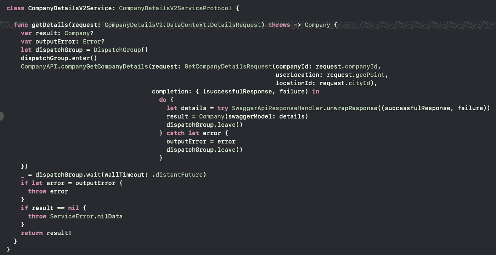
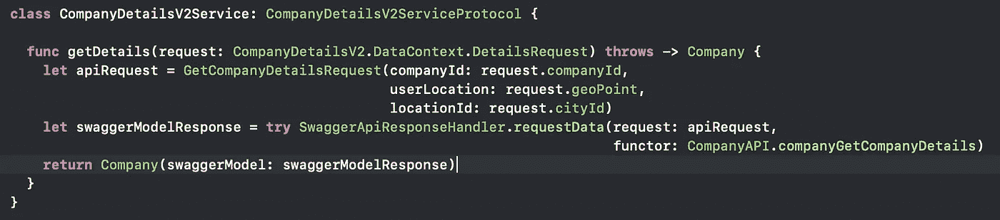

# Swagger API iOS helper pt。二

> 原文：<https://blog.devgenius.io/swagger-api-ios-helper-pt-ii-9356ef90765b?source=collection_archive---------2----------------------->

上次我写了关于 Swagger 的文章，讲述了如何减少重复代码。在过去，建议的方法意味着很多。它允许人们跳过解包和错误检查程序，继续编写业务逻辑。

 [## Swagger API iOS 助手

### Swagger 是一个很棒的工具，可以帮助开发人员在使用 web 服务时节省时间。API 规范…

medium.com](https://medium.com/@petrachkovsergey/swagger-api-ios-helper-b09da2c83c25) 

服务曾经是这样的:

SwaggerHelper v1

随着时间的推移，我考虑如何进一步减少代码，因为我显然厌倦了编写` dispatchGroup = DispatchGroup()'之类的东西。人们可以想到并注意到，我们声明结果变量的这个方法的“header”和我们发布过程结果的“footer”是非常通用的。唯一不同的是 API 的方法…

但是如果你查看生成的 API，你会注意到所有的方法都是一样的(当然它们是一样的！它们是由一个模板生成的！:-) ).所以，没有什么可以阻止我们去掉方法*的头*和*的尾部分，创建* ***一个通用方法*** ，它将使用 api 请求模型作为参数，也将 API 函数作为参数！

我给你一个完整的代码要点，将所有无聊的东西减少到 3 行代码:

现在，我们可以将那个糟糕的 CompanyDetails 方法重写为:

SwaggerHelper v2

所以，如果你只是用它们来链接 API 调用和访问 WS API，就没有必要使用笨重的 RX 框架。因为，真的，你需要的只是:

1.  检查 GCD 文档并在单独的 DispatchQueue 上运行 WS 调用
2.  按优先顺序呼叫您的服务
3.  处理结果和异常(在这里，SwaggerHelper 将帮助您！)

感谢阅读！尽情享受吧！