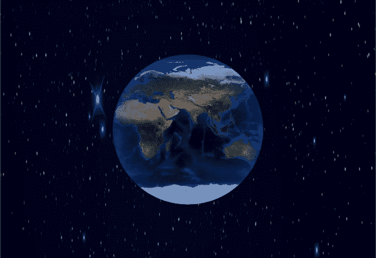
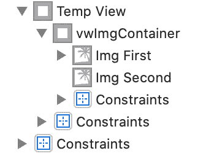

# Swift CALayer: 3D 动画地球仪🌍带 CALayer

> 原文：<https://blog.devgenius.io/swift-3d-looking-animated-globe-with-calayer-307942174caf?source=collection_archive---------15----------------------->

创建一个旋转的 3D 地球，只需使用 CALayer 和 2 组图像视图。输出如下图所示 ***。gif*** 文件与无故障动画，相信我😎。



核心动画框架支持 CALayer，它可以帮助你在屏幕上绘制、管理和动画显示可视内容。根据苹果的[文档](https://developer.apple.com/documentation/quartzcore/calayer)，layer 还保存了关于其内容的几何信息(如位置、大小和变换)，用于在屏幕上呈现该内容。

说够了😎。让我们开始烹饪我们的项目🥘。本项目所需的配料如下。

## 关键成分:

*   1 `CAShapeLayer`实例
*   1 个`CAGradientLayer`实例
*   1 幅世界地图图像🗺️(如果可能的话，使用真实的图像)
*   2 `ImageView`
*   2 `UIView`
*   1 `UIImageView`扩展，用于在将 AspectFit 内容类型分配给图像后计算图像高度
*   1 `CGAffineTransform`向 UIView 提供动画
*   1 张黑色/蓝色天空图像，由您选择🌌(用于浇头😉)

## 烹饪 Procedure🧑‍🍳：

*   在你的故事板中拖动 **UIView** (名为 *tempView* )。将其与屏幕的垂直和水平中心对齐。设置 **300x300 的宽度和高度。**同样，在 ViewController 文件中创建该视图的 **IBOutlet** 及其高度约束。
*   在 *tempView* 中，取另一个视图(名为 *vwImgContainer* )相对于超级视图(即 *tempView)分配尾部、底部和顶部约束。*提供 **600 的**宽度**。C** 也为这个 UIView 创建 ViewController 文件中的 **IBOutlet** 。
*   现在 *vwImgContainer* 将有两个 **UIImageView** 在里面，但是是并排的。第一个图像视图(名为 *imgFirst* )将具有顶部、底部、尾部、中心等约束，相对于超级视图(即 *vwImgContainer* )垂直对齐，并将具有 **300 的**宽度**。第二个**图像视图(名为 *imgSecond* )将有约束，如前导、底部、顶部、**尾随**到 ***imgFirst、*** *和*垂直居中对齐。您还需要 ViewController 文件中 *imgFirst 的 **IBOutlet** 。此外，将世界地图图像分配给两个图像视图，并赋予它们内容类型`AspectFit`*
*   在完成上述步骤后，你的半熟的项目和视图的层次结构应该看起来像下图所示



*   现在移动到 ViewController 文件，创建如下的`CAShapeLayer`和`CAGradientLayer`的实例。

```
**let** circularMaskLayer = CAShapeLayer()
**let** gradient = CAGradientLayer()
```

*   创建一个函数`setUpMaskAndGradientLayer`，我们将在`viewDidAppear`中调用它。现在我们将在 *tempView* 的中心创建一个圆形`UIBezierPath`，它的宽度和高度等于 *imgFirst 的*图像的高度，将其内容类型设置为`AspectFit`。将 BezierPath 分配给`circularMaskLayer`，进一步将`*circularMaskLayer*`分配给 *tempViews* 图层的蒙版属性。

> **注意:**需要计算高度，因为我们的**世界地图图像**是矩形的，而我们的 **imgFirst** 是方形的，当您将内容类型设置为 AspectFit 时，图像完全适合图像视图的水平方向，但在顶部和底部留有空白。

现在设置*渐变*的框架等于 *UIBezierPath* 变量*的边界。*设置渐变类型为`**radial**`。我们希望我们的颜色从圆心向圆的边缘移动。同样，将渐变的第一种颜色(中心颜色)设置为**透明**，将第二种颜色(朝向圆边缘的颜色)设置为 **HSB** ，如下图所示。

```
gradient.colors = [UIColor.clear.cgColor, UIColor(hue: 0.60 , saturation: 1, brightness: 0.90, alpha: 0.7).cgColor]
```

这将在圆的边缘产生模糊的 ***蓝色*** 色调，使我们的地球看起来更加真实和 3D。添加*渐变*作为 *tempViews* 图层属性的子层。

*   现在，为了给地球提供旋转动画，创建一个名为`animateTheWorld`的函数，调用 UIView 的 animate 函数，持续时间为 10，带有重复选项。对于旋转动画，我们将使用函数`CGAffineTransform(translationX:)`。所以基本上地球不是在旋转😜但是我们正在以重复的方式从左到右移动我们的容器，这导致了通过圆形遮罩层看到的旋转的错觉。你的函数看起来如下，你将在`setUpMaskAndGradientLayer`结束时调用它。

> **注意:**设置 **translationX** 值与 vwImgContainer 的宽度相同，y 值为 **0** ，因为我们只想水平移动视图。

```
**func** animateTheWorld() {
     UIView.animate(withDuration: 10,
                    delay: 0,
                    options: [.repeat, .curveLinear],
                    animations: {
                        **self**.vwImgContainer.transform = CGAffineTransform(translationX: 300, y: 0)
     }, completion: **nil**)
}
```

*   现在最后一步是添加一些顶层，即添加任何与天空或星系相关的图像作为背景图像。
*   现在我们的食物准备好了😋。我的意思是这个项目已经可以测试了。点击“运行”按钮，享受美食。

# **结论:**

在本教程中，我们学习了使用 CALayer 创建圆形、径向渐变和图层蒙版。我们还看到了如何使用 CGAffineTransform 将视图从一个位置转换到另一个位置。

完整的项目可以在下面的 Github repo 中找到。

[](https://github.com/DharmeshRathod712/3DGlobeAnimation.git) [## dharmeshrathod 712/3d globe animation

### 苹果允许你使用 CALayer 创建不同的形状、渐变和遮罩效果。这个项目试图利用…

github.com](https://github.com/DharmeshRathod712/3DGlobeAnimation.git) 

享受…🙌🏻快乐编码… 🥳