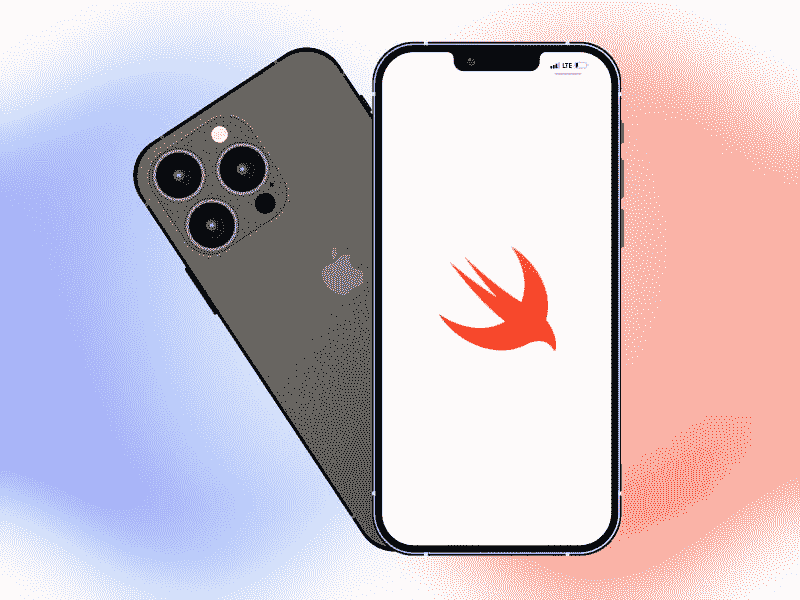

# 在开发下一个面向企业的 iOS 应用程序时要考虑的 Swift 5 特性

> 原文：<https://blog.devgenius.io/swift-5-features-to-consider-while-developing-your-next-ios-app-for-business-c1faca21f499?source=collection_archive---------8----------------------->

Swift 是一种直观的编程语言，因其独特而有价值的特性而越来越受欢迎。苹果操作系统(如 iOS、macOS 和 watchOS)的编程语言被广泛用于开发 iOS 应用程序。

iOS 应用开发已经有了很大的发展，经历了一些大规模的版本更新。Swift 最近也发布了两个版本，Swift 5.0 和 Swift 5.1。这两个版本都拥有一些独特的功能，并在使编程语言更具弹性方面发挥了至关重要的作用。

让我们看看用于 iOS 应用的 **Swift 5 最显著的特点，并理解它的好处。**

# **为什么选择 Swift 5 开发您的下一个 iOS 应用程序？**

Swift 5 拥有更新的特性和功能，有望成为移动应用开发行业的游戏规则改变者。

无论是构建您的第一个 iOS 应用程序还是尝试扩展您的业务，Swift 5 都为您提供了一些顶级、高功能和定制的应用程序。难怪 Airbnb、LinkedIn、优步等巨头选择它作为他们的 iOS 移动应用。

Swift 比 Objective C 容易学得多，这种编程语言不需要程序员记忆特定的规则就能工作。iPhone 应用程序开发人员使用它来开发应用程序，而不用担心出错和忽略规则。

# **iOS 应用程序开发的 Swift 5 关键特性**

专家认为 **Swift 5 特性**是 iOS 应用开发的游戏改变者。编程语言中重要的新更新——如 ABI 稳定性、改进的包管理器和新的运行时——提供了一系列改进和特性。

这一更新也暗示了苹果永无止境的创新和进化的愿景。

## **ABI 稳定**

Swift 5 中最重要的更新之一是 ABI 稳定性或应用程序二进制接口稳定性——应用程序编程接口(API)的二进制等价物。

iOS 应用程序开发人员使用 UIKit 库等 SDK 为他们的应用程序创建 Swift 代码。它提供了处理按钮、标签和视图控制器的 API。

借助 Swift 5 中新的 ABI 稳定性，开发人员将不再需要打包其应用程序所需的每个依赖项。一旦安装，由于苹果的集成和 API，这些依赖项中的大部分将已经存在于设备上。Swift 5 的这一特性将确保未来的应用程序比以往任何时候都更小、更容易构建。

## **标准库更新**

Swift 5 中标准库的泛型功能与 Swift 4.2 相似。然而，有一些新的和更新的功能，iOS 开发者会喜欢。这些 Swift 5 特性将帮助程序员管理他们的库和许多其他东西。

一些最显著的特征是:

*   对字符串文字更好的原始文本支持
*   SIMD 和结果向量类型的可用性在标准库中
*   利用新的 UTF-8 编码改进字符串以提高性能
*   用于处理字符串的 API
*   通过增强的字符串插值从数据构建文本的灵活性更高
*   改进字典和设置以提高应用速度

# **更新编译器&高效编码**

Swift 5 使开发人员能够发布构建和调试代码。它还支持动态可调用的代码类型，以显著提高 JavaScript、Ruby、Python 和其他语言的编码效率。Swift 5 更新执行了大量语言提议，包括通过强制进行文字初始化、用户定义的动态可调用类型，以及在编译条件下支持小于运算符。

## **软件包管理器更新**

作为 Swift 5 的一项重要新功能，包管理器更新包括特定于目标的构建设置、定制部署、依赖性镜像以及生成代码覆盖数据的能力。此功能允许您使用 swift run 命令在 REPL 中导入库，而无需创建可执行文件。

## **改善用户体验**

基于 Swift 5 的应用通常较小。由于用户可以很容易地安装和使用它们，它[改善了他们的整体体验](https://www.pixelcrayons.com/blog/how-to-improve-customer-experience-for-your-business/?utm_source=medium&utm_medium=improve-experience&utm_campaign=DC-MS)。iOS 应用的小尺寸也使得开发过程快速且更高效。更快的应用启动为终端用户提供了卓越的应用体验。

使用 iOS 应用的企业已经在 Swift 5 中重写了代码。由于 Swift 5 提供了无可挑剔的用户体验，新企业正在 Swift 5 上开发应用。

## **安全特性**

更新的版本带来了几项先进的安全措施。内存自动管理、在应用前初始化变量以及检查整数和数组溢出是一些最显著的变化。

Swift 5 更新还减少了由于限制访问内存保护而导致的编程错误。程序员可以使用精炼的语法来轻松定义他们的意图。

## **迁移到 Swift 5**

在了解了 Swift 5 for iOS 的所有优势后，您可能会考虑迁移。是否兼容 Swift 4、Swift 4.1、Swift 4.2？Swift 5 兼容之前的所有版本。

网上有很多迁移器可以满足您的需求。此外，您还可以联系 iOS 应用程序开发公司，以实现无缝迁移。

# **企业如何从 Swift 5 中受益？**

Swift 5 比以前的版本更快、更稳定、更易于使用。此外，它还提供了许多有利于企业的功能，包括改进的性能、面向开发人员的新工具以及对新设备的更好支持。这些只是企业主应考虑投资开发下一代 Swift 5 应用的部分原因。

苹果行业等待 ABI(应用程序二进制接口)稳定已经很久了。由于 Swift 5 使 ABI 比以往任何时候都更加稳定，该行业现在有了一个可靠的解决方案来满足用户方面的问题。应用程序开发人员将能够在所有即将推出的 Swift 版本(Swift 6、7 等)中运行该应用程序，使 Swift 成为企业和初创公司的首选语言。

# **Swift 5 比 Objective-C 好吗？**

Objective-C 和 Swift 都是用来构建苹果应用的。然而，Objective-C 是一种更古老的编程语言，Swift 5 已经显示出开发响应迅速、功能丰富的应用程序的潜力。对于考虑开发 iOS 应用的企业来说，Swift 5 是不二之选。

## **结论**

我们试图在本帖中包含与 Swift 5 功能相关的所有主要更新，希望您会喜欢。在开发 iOS 应用程序时选择 Swift 5 不仅仅意味着让开发过程变得简单高效。编程语言也确保使用你的产品的用户会觉得它们迷人而愉快。

在世界范围内，许多人转向这个平台，因为它提供了灵活性和创造性的空间。总而言之，就应用程序而言，Swift 5 是最好的语言之一。如果你[雇佣 iOS 应用开发者](https://www.pixelcrayons.com/hire-iphone-app-developer?utm_source=medium&utm_medium=iphone-app-developer&utm_campaign=DC-MS)，确保他们对 Swift 5 有很好的了解。Swift 产品可以轻松扩展，并且可以根据需要随时添加新功能。