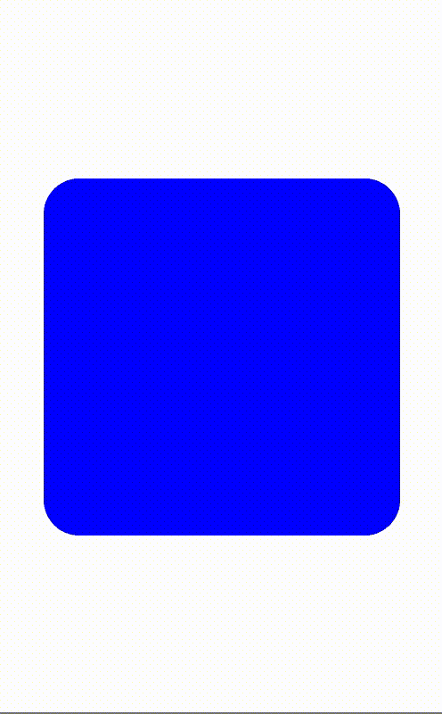
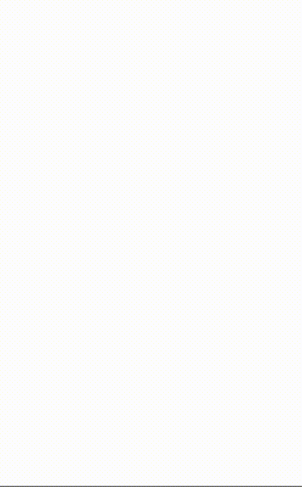
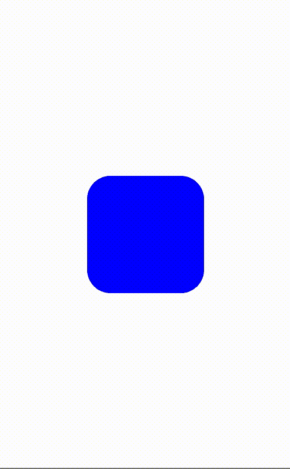
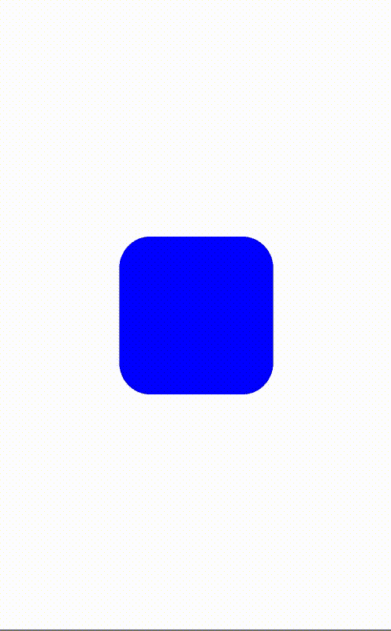

# Swift — 7 个强大的动画来改进您的应用程序 UI

> 原文：<https://blog.devgenius.io/swift-7-powerful-animations-to-improve-your-app-ui-711626be485f?source=collection_archive---------0----------------------->

## 动画可以给你的应用一个专业的外观和感觉

由[麦克斯·尼尔森](https://unsplash.com/@maxcodes?utm_source=medium&utm_medium=referral)在 [Unsplash](https://unsplash.com?utm_source=medium&utm_medium=referral) 拍摄的照片

在过去的几个月里，我一直在开发一个新的应用程序，它带有黑暗的基调和恐怖的气氛。我用 Sketch 制作了所有的图形和内容，经过几天的调优，我把所有东西都放在 Xcode 上，最后运行我的项目。

但不幸的是，我很快注意到我的应用程序不像我日常使用的其他应用程序。它缺少让它感觉生动的过渡和动画。

所以我开始学习更多关于动画的知识，我发现了一个隐藏的世界，它让我只用几行代码就能创造出令人惊叹的效果。下面你可以找到一些例子，在你的项目中使用之前，你可以在操场上尝试和定制。

# 突然出现

我们从可用于按钮和视图的基本动画开始。该动画通常也用于弹出消息和警告。

# 突出

该动画创建了与上一个动画相反的效果。通常，这用于消除视图/弹出窗口。

# 从顶部落下

这种动画可以在游戏或应用程序中使用，以显示设置或过滤视图。

# 从左边过来

这是一个真正的动态动画，当我们在两个控制器之间切换时可以使用。您可以将它添加到第二个控制器上的一个`viewDidLoad`事件中，以表示移动和延续。

# 渐显

类似于弹出动画，这可以用于按钮和视图创建。

# 淡出

类似于弹出动画，这可以用于按钮和视图的创建和消失。

# 卡片翻转

如果你使用有两个部分(如正面和背面)的卡片/信用卡/文件，这是一个非常酷的动画。

# 结论

最后，我做了一个 UIView 扩展，将所有这些动画集合在一起，并开始在我的项目中制作按钮、视图、图像和单元格的动画。现在我的 app 看起来更专业了！