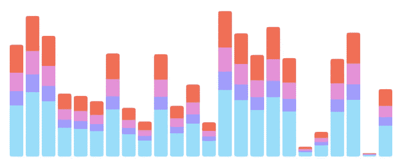
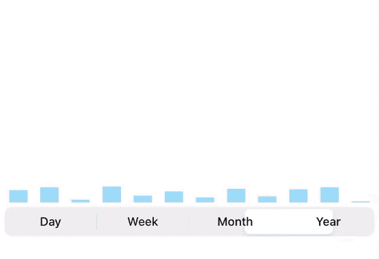
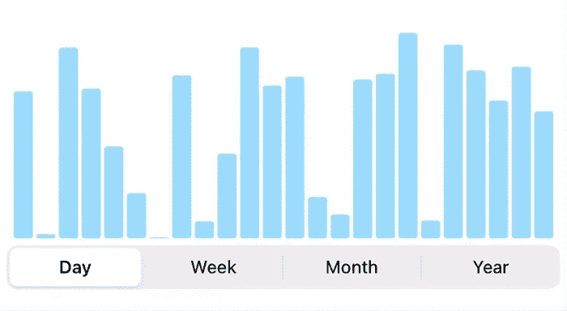
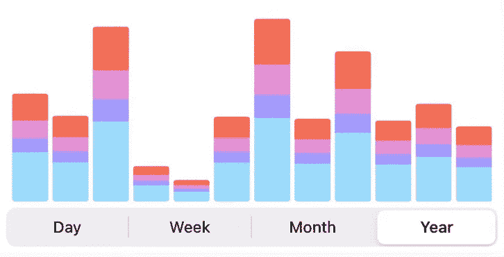

# 从零开始的 Swift 高级图表

> 原文：<https://blog.devgenius.io/swift-advanced-charts-from-scratch-c784971eacb8?source=collection_archive---------0----------------------->

你好，我叫亚历克斯，很高兴在这里见到你！

在这篇文章中，我将向你展示如何用你自己的双手创建高度可定制和灵活的条形图。看看下面的 gif，这就是它的样子

# 插曲

但是在我们跳到 Xcode 之前，有一个小插曲。为什么首先我决定写这篇文章，有许多豆荚和图书馆这样的东西？嗯，最近我在一家公司找到了一份工作，实际上是一家大公司，我得到的第一个任务是——统计的整个模块。我的第一个想法是——“让我们添加 *SwiftCharts”。*但后来我被告知—“不不不，孩子，所有的 UI 都是我们自己做的”。所以我在这里，从头开始创建许多不同的图表。因为我从来没有做过这样的事情，所以我谷歌了很多！我到处学习一些好的技术来完成我的任务。

所以当我最终完成后，我决定分享给你们，这样你们就不用花几个小时去搜索了。尽情享受吧！

# 步伐

1.  创建简单的单色条形图，并为接下来的步骤进行设置
2.  给图表添加多值能力，这样它可以显示多种颜色
3.  加动画，这样看起来就牛逼了:)

# 简单图表

我将跳过创建和设置项目的部分——我们都知道如何做。

创建一个 **UIView** 的子类，并将其命名为**条形图。**

在该类中，我们创建了两个枚举:

1.  我们将用它来管理不同类型的输入数据。这个枚举有间距值，这将用来分隔我们的酒吧彼此，所以它看起来很好。
2.  这个是我创建的，因为我的类用不同的 UI 处理不同的图表类型，在这篇文章中我们将只关注*多色。*但无论如何，拥有一些定制和扩展的空间总是好的。

我们还添加了**设置功能，**我们将使用该功能创建图表，并在需要时进行更改。再一次，你可以看到图表有不同的选项，但是现在忘掉双色*吧。*

然后我们用更多的未来来扩展我们的类:

1.  颜色:这个枚举将被用来绘制我们的图表，我在这里使用我的自定义颜色。你可以用你的，或者从 github 项目里拿这个。
2.  **数据点**:这是一个包含所需数据和值的模型

## **数据点:**

1.  **标签**:要显示在条形下方的 X 值标签
2.  **值**:棒材的实际值
3.  **颜色**:包含条形的颜色，所以每个条形实际上可以是不同的颜色
4.  复合值:这是很重要的一个。这是我们未来的一个变量，高级图表。它包含了工具条的附加值，我们将在主工具条上显示这些值。这是一个数组元组 **(CGFloat，Color)。**我选择了这种类型，所以我可以很容易地定制我想要的每个单条。它也是按颜色排序的，所以不管传入的是哪个值，颜色排序总是一样的。

## 好了，最后我们的主要功能

在前 4 行中，我们简单地获取值并计算**间距**和**条**的宽度。那么让我们来看看循环中的一些线路:

1.  从数组中获取最大值的百分比。这样做，那么最大的价值总是会有最高的标杆。
2.  这里我们计算当前条的**行高**。还有一个棘手的情况: ***(百分比> 0？百分比:2)。*** 我这样做了，所以如果值为 0，条形仍将可见，否则它看起来就像一个缺口。
3.  根据其索引计算 **X** 的值。
4.  最后用我们之前计算的值为我们的条形创建 **rect** 。然后从这个带圆角的**矩形**创建**路径**。我调用变量 **endPath** 而不仅仅是 **path** 是有原因的，稍后会返回。
5.  最后，我们创建**层，并设置路径**。并将我们的新条形层添加到视图的主层中。

现在，让我们设置我们的视图控制器来检查我们到目前为止所取得的成绩。我在故事板中添加了**条形图**和 S **增强控件**。你可以用你想要的程序来做，没关系。下面是我的 **VC** 的样子:

关于 **ViewController** 的几件事:

看一下**段动作**功能:根据选择的段，调用**条形图**的**设置**功能，需要**数据点**的计数。这个函数使用了 **randomDataPoints** 函数，我创建它是为了简单地获取我的图表所需的数据点数量。

## 这是我们目前得到的信息:

**还不错！现在让我们添加更多的颜色！**

但是在我们再次跳回代码之前，让我解释一下我的实现背后的思想。**这个其实挺重要的！**

让我们以一个值为 100 的条为例。现在我们不关心它在视图范围内的高度！我们只有一个值为 100，高度为 x 的条形。现在我们想在它上面再添加一种颜色，我们希望它代表总价值的 25%。然后我们必须给它传递值 25。有道理对吗？这个图表的所有想法，是主条(蓝色)——是条内所有值的 100 %。附加颜色仅代表总价值的某个百分比。**所以所有附加颜色的值不能超过主(蓝色)条的值。**我希望用我惊人的英语说得更清楚些:)

现在让我们继续

# 多种颜色的条形

现在，我们在 scheduleMultiColor 函数的循环中添加这个代码**:**

1.  创建一个变量来保存 Y 轴的偏移量，这样我们就不会把新的图层放在彼此的上面。
2.  计算行高。正如我所说的，额外一层的价值只是总价值的一个百分比。所以我们用这个想法来计算它的高度。还有一个 **min()** 函数，只是为了确保我们的额外层不会高于主层。
3.  计算 Y 位置。因为我们想让我们的子层位于条的顶部，我们需要**从主条**的高度减去它的值。然后我们加上 **Y 偏移**。

然后我们做和以前一样的事。创建路径，添加到层，并将此层作为子层添加到我们的**栏层**。**不要忘记增加 Y 位置偏移。**

## 现在让我们将此功能添加到 ViewController 中:

我们需要稍微改变一下 randomDataPoints 函数，以便它为图表提供额外的值。这是函数现在的样子:

以防你需要一些许可，我们是这样做的:

1.  现在，我们在变量 **randomValue** 中生成并存储条形的总值。
2.  然后我们用 3 元组的数组填充**复杂值**。第一个代表总价值的 1/4，第二个代表 1/6，第三个代表 1/8。所以它们合起来应该占总价值的一半。

## 让我们看看我们得到了什么

**好看！现在让我们加入我们都喜爱的动画！**

# 动画

在我们开始添加动画到图表之前，让我们为它创建一些助手。

这是一个动画的帮助结构。它还包含一些我们不打算使用的功能。但我决定也许对你有用。

以及**推车机**的延伸:

这个扩展使用先前创建的**动画**结构。

现在我们只需要添加几行代码来让我们的图表生动起来。

还记得我给我们的**方向**和**路径**命名前缀 **End 吗？**原因如下！要激活路径，首先我们需要创建高度等于 0 的路径条。然后用动画将这条路径更改为最后一条。

因此，在为此目的对函数进行了一些重构之后，它看起来是这样的:

现在你看到了，首先我们创建 0 个高度栏，然后我们用一行代码制作它的动画！此外，看看我们是如何制作额外图层的动画的，为了让我们的多个图层一个接一个地制作动画，我们需要添加这种平静的代码:**延迟:0.5 + (0.3 * Double(index))。**像这样，每一层将在前一层之后立即开始动画。

## 结果是:

你可以在我的 gitHub 报告中找到完整的代码:https://github.com/Kolch/Charts

**希望你真的嘱咐过它，并发现它对你自己有用！**

今天我只是给你看了我从头开始做的许多图表中的一个！如果你喜欢它，如果你想让我展示更多，请在评论中告诉我。

如果你鼓掌离开，我会很感激的！:)