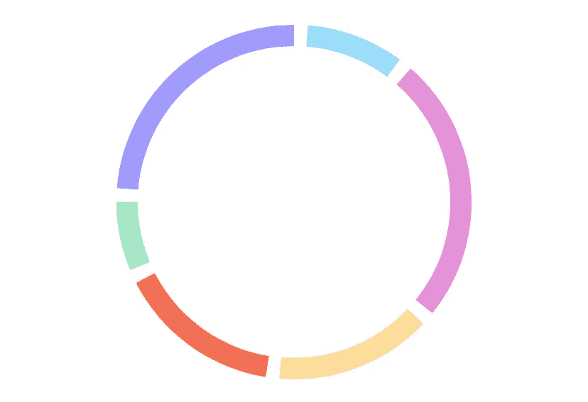
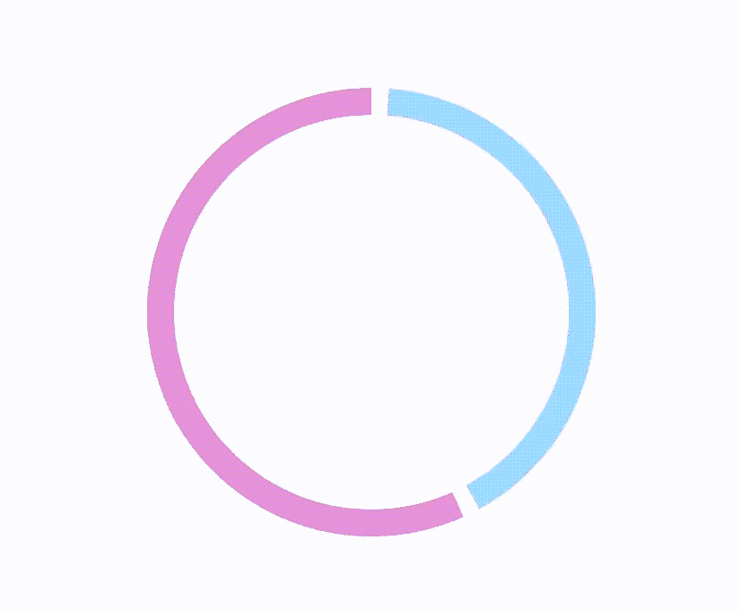
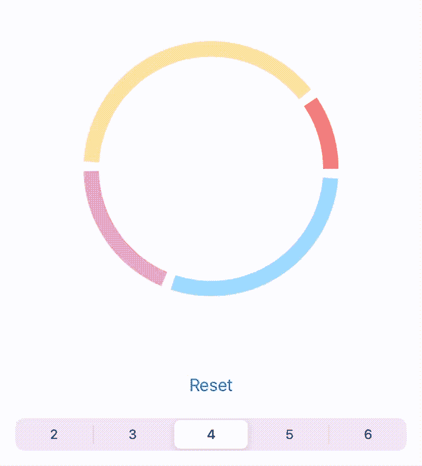

# Swift 从头开始提供高级图表— Pt 2

> 原文：<https://blog.devgenius.io/swift-advanced-charts-from-scratch-pt-2-193c38c23a21?source=collection_archive---------8----------------------->

亲爱的读者，你好！这是我关于如何从头开始创建 swift 图表的文章的第二部分。**如果你还没有查第一个——这里有一个链接**[。](/swift-advanced-charts-from-scratch-c784971eacb8)

这个图表比我们上次做的要简单得多，但是它可以用于许多场景。

# 插曲

我会尽量不重复上一篇文章中的内容，但对于没有读过第一部分的人，我要回答一个问题:

“如果我可以使用一些第三方库，为什么要从头开始构建图表？”—答案很简单。如果您只需要一个图表，那么为此导入所有库将是非常浪费的。此外，由于团队/公司/任何事物中的规则，您可能会处于无法使用 UI 库的情况(像我一样)。

现在让我们开始编码吧！

# 步伐

这张图表会比我们上次做的简单得多。所以我们只需要两步。

1.  创建带有多个值的圆形图表。
2.  添加动画，这样看起来很棒:)

**另外，我必须说，今天我们将使用我们为前面的图表创建的一些样板和扩展。**所以，如果您看到一些我没有完全解释的自定义函数，不要感到惊讶。

# 第 1 步-圆形图表

让我们开始吧！

首先，我们要像上次一样创建一个图表视图。外部图表将是 **UIView 的一个子类。**姑且称之为**圆图。**

由内而外的循环我们只需要一个函数:

1.  **设置**——它将创建并绘制我们的图表。
2.  **清除** —这将移除图层，所以我们可以重新绘制图表。

我们还需要一个全局变量来存储**图表层。**它将是所有动画的父层。当我们需要的时候，我们可以用一个命令将它从最高层移除。

## 设置

1.  我们的函数将接收元组数组: **[(CGFloat，UIColor)]** 。当然，我们可以为此创建一个特殊的模型，但是为了使它现在变得简单，就让它这样吧。
2.  清除功能——每次绘制图表时，我们都必须移除清除层。
3.  在循环中，我们计算图表中特定部分的百分比。根据百分比，线的长度将会不同。
4.  使用我们的百分比和“全部空间”(图表各部分之间的组合空间)得到直线的角度。
5.  使用当前和以前的角度获得精加工角度。
6.  为我们的道路创造第一条弧线。
7.  创建第二个弧。`radius — 15`-这是我们得到的线的宽度。

休息很简单。创建形状层，添加路径和颜色。最后添加**图层**查看图层。

## 清楚的

我想我不需要解释这些了:)

## 我们得到了什么？

嗯，还不错。我们甚至默认得到某种动画。但这不是我们想要的动画。

# 步骤 2 —动画

为了创建“时钟”动画，我们需要

1.  创建动画本身，并将其应用到层。
2.  正如您在代码中看到的，图表的第一行是在零弧度处绘制的——在 3 点钟位置。我们希望我们的动画从π/2(12 点)开始。为此，**我们将需要旋转整个层。**

## **动画**

在 **CALayer 扩展**中创建以下功能

这个动画的所有想法是，我们创建一个形状并把它作为蒙版添加到我们的图表层，之后我们制作蒙版动画。

1.  将形状层中心设置为与父层中心相同。
2.  计算半径。我们创造了巨大的半径，在下一步你会看到为什么。
3.  我们让线宽等于我们刚刚计算的半径。想法是创建一个巨大的边界和动画这个边界圆。
4.  创造圆本身。
5.  **添加我们新创建的图层到图表图层作为蒙版。**
6.  不要忘记设置这个变量，否则当动画完成时，它会自动移除，遮罩会覆盖我们的图表。
7.  **给遮罩层添加动画。**

**旋转图层**

这是用 3 行代码完成的。将它们插入到我们的`setup`函数中的`layer.addSublayer(chartLayer)`之前。

**最后一步**

现在我们需要添加一行代码来使它工作。

`chartLayer.applyClockWipeMaskAnimation(duration: 1.5)`

在`setup`功能的末尾添加这一行。

# 享受

现在我们可以享受平滑和漂亮的图表动画！

# 临终遗言

你能在这里找到的所有源代码:[https://github.com/Kolch/Charts](https://github.com/Kolch/Charts)

你可能也会喜欢我这里的另一个图表:[https://blog . dev genius . io/swift-advanced-charts-from-scratch-c 784971 eacb 8](/swift-advanced-charts-from-scratch-c784971eacb8)

希望你觉得有用！

如果你喜欢这篇文章，请在评论中告诉我。此外，我真的很感谢你会下降喜欢我的 github 回购！

**订阅不要错过关于图表和 swift 的新文章。**