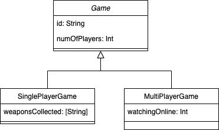

# swift:struct 的替代方案

> 原文：<https://blog.devgenius.io/swift-alternative-to-struct-a4ace0678673?source=collection_archive---------14----------------------->


照片由[夏嫣·胡伊津加](https://unsplash.com/@iam_anih?utm_source=unsplash&utm_medium=referral&utm_content=creditCopyText)在 [Unsplash](/?utm_source=unsplash&utm_medium=referral&utm_content=creditCopyText) 上拍摄

想象一下，你正在创建一个应用程序，它应该跟踪分析事件。为此，您选择了一个事件跟踪系统(如 Firebase)。

第一个想法是创建一个将建模`AnalyticsEvent`的结构。

```
struct AnalyticsEvent {
   let userId: String
   let hasAdditionalData: Bool
   let additionalData: [String: String]
   let hasFeedback: Bool
   let feedbackContent: String
   // rest of the properties
}
```

虽然这是一个假设的情况，但它凸显了一个问题。因为 struct 可以包含多个值，如果一个命令中包含多个事件(例如`hasFeedback`和`hasAdditionalData`)，可能会出现错误。这揭示了不具有互斥属性的问题，因为事件可以同时处于两种不同的状态。

使用枚举将属性分组到事例中可以使数据更加清晰。Swift 提供了一种构造，您可以将值与类型相关联，以便构建更复杂的数据结构。

```
enum AnalyticsEvent {
   case sendFeedback(userId: String, content: String)
   case sendAdditionalData(userId: String, data: [String: String]
   case connectAppleHealth(userId: String)
   // rest of the cases
}
```

通过在每个案例中添加元组，可以更清楚地看出哪些属性属于同一个案例。现在可以构造一个合适的事件，而不用担心混合和匹配错误的值。

```
let feedbackEvent = 
    AnalyticsEvent.sendFeedback(userId: "id", content: "content")
```

通过这种类型的构造，开关盒可用于展开内部值:

```
func logEvent(event: AnalyticsEvent) {
   switch event {
      case .sendFeedback(_: String, content: String): 
          print("\(content)")
      // rest of the cases
}if case let AnalyticsEvent.sendFeedback(_, content) = event {
   print("\(content)")
}
```

通过使用开关，您需要用尽`AnalyticsEvent`的所有情况。如果你对具体案例感兴趣，你可以使用`if case let`结构。同样，可以使用*通配符*操作符来匹配特定的属性，使用该操作符可以告诉您不关心特定属性的值。

## 带枚举的多态性

有时候你需要在多态的形式上有一些灵活性。这意味着你愿意混合任何类型，但这往往并不理想。由于您在编译时不知道类型，所以需要在运行时对类型`Any`进行检查，以查看它表示什么。

```
let data: [Any] = [Date(), "string", 123]for elem: Any in data {
  switch elem {
     case let stringVal as String: // handle string
     case let intVal as Int: // handle integer
     case let dateVal as Date: // handle date
     default: // handle others
  }
}
```

如果你不知道你期望的是什么，你仍然可以使用`switch`来确定类型，但是你也必须为你不感兴趣的类型覆盖默认情况。当您不确定从服务器接收的数据时，最好使用`Any`。但是如果你事先知道类型，你可以使用 enum 作为编译时的安全防护。

假设您正在从服务器接收一个`Date`或`Range<Date>`。在这种情况下，您可以建立代表其中一个选项的`DateType`模型。

```
enum DateType {
   case concrete(Date)
   case range(Range<Date>)
}
```

多亏了这种类型的建模，你现在可以用它来接收单个`DateType`甚至一个`DateType`的数组！数组的每个值可以包含多种类型中的一种，同时保持编译时安全。要对值进行操作，只需像前面的例子一样使用`switch`语句。

这样你就安全了，如果你想修改`DateType`，编译器会警告你新的/丢失的情况。

## 用枚举子类化

子类化是一个允许你建立数据层次的概念。例如，您可以使用`Pizza`来表示比萨屋中提供的所有类型的比萨。现在你可以吃一堆不同的菜:那不勒斯菜、加州菜、芝加哥深菜…

在理想情况下，对数据进行分层建模是有意义的，但在实践中，情况并非如此。有时，您需要处理不符合层次规则的边缘情况或异常。

作为一个例子，让我们来模拟一个游戏。我们可以从单人游戏开始:

```
struct SinglePlayerGame {
   let id: String
   let numOfPlayers: Int
   let weaponsCollected: [String]
}
```

如果我们现在想添加多人游戏，你可以很容易地做到这一点，因为许多属性是相似的。



游戏等级

引入的`Game`超类包含了`SinglePlayerGame`和`MultiPlayerGame`共有的属性。当像这样建模时，你被迫使用类。但这还不是最大的问题。如果你想添加新的游戏类型`AIGame`，它没有相同的属性，那么你需要重构整个数据模型。

通过使用枚举，您可以绕过层次模型，但是您仍然可以选择传递单个`Game`类型。另外增加一个新的`Game`类型不会违反现有的游戏。

```
enum Game {
   case singlePlayer(SinglePlayerGame)
   case multiPlayer(MultiPlayerGame)
   case ai(AIGame)
} let aiGame = ...
let game = Game.ai(aiGame)
```

当相似的类型开始出现分歧，或者您希望使用结构(而不仅仅是类)时，这种类型的子类化是最好的。这种方法的缺点是必须匹配整个应用程序中的所有案例。虽然它需要额外的工作，但它也是一个安全的防护措施，因为如果你忘记了什么，你会得到编译器的警告。另一个缺点是锁定模型，这意味着如果你提供/使用 enum 作为/来自第三方库，用户不能扩展它。

## 更安全地使用字符串

枚举通常与字符串一起使用。当一个枚举被定义为原始值类型时，所有被定义的事例在它们内部都带有一些值。具有原始值的枚举是通过将类型添加到枚举的声明中来定义的。

```
enum Stage: String {
    case production
    case staging
    case dev
    case local
}
```

您可以(如果您愿意)为每个事例添加原始值，但是像这样声明 enum 会为每个事例提供事例名称的值。

有时，您希望将 enum 的值作为参数发送给服务器。通过访问 raw value 属性读取枚举的原始值来设置参数。

```
let stage = Stage.production
let params = ["stage" : stage.rawValue] // ["stage": "production"]
```

将原始值赋给案例会引入 Bug。编译器会继续工作，但不幸的是 API 不会。

```
enum Stage: String {
    case production = "prod"
    case staging
    case dev
    case local
}let stage = Stage.production
let params = ["stage" : stage.rawValue] // ["stage": "prod"]
```

您可以通过两种方式解决该问题:

*   谨慎行事，忽略枚举的原始值，并匹配枚举事例中的每个事例
*   用单元测试覆盖代码以确保正确的行为

但是，如果您从服务器接收值，并且该值已被更改，该怎么办呢？这可以用自定义初始化器来处理

```
enum Stage: String {
    case production
    case staging
    case dev
    case local init?(rawValue: String) {
       switch rawValue.lowercased() {
          case "prod", "production": self = .production
          case "qa", "staging": self = .staging
          case "dev": self = .dev
          case "local": self = .local
          default: return nul
       }
    }
}
```

## 摘要

*   枚举有时是子类化的更好的选择
*   枚举给了你在编译时捕捉问题的能力
*   通过转换为枚举，可以使处理字符串更加安全