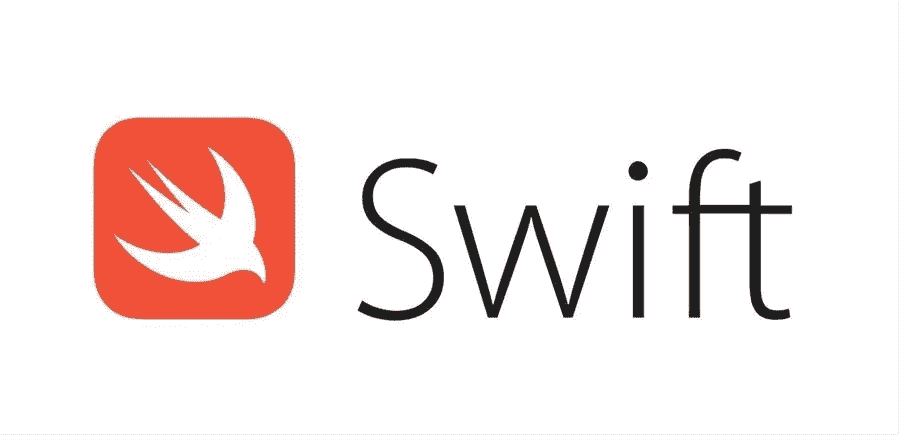

# Swift:条件语句

> 原文：<https://blog.devgenius.io/swift-conditional-statement-f65b9813298c?source=collection_archive---------16----------------------->

来自**谷歌图片**的**开发者**的照片

在这篇文章中，我们将处理条件语句。在开发中，我们希望根据指定的条件执行不同的操作。

有时我们想只执行某个条件(真)，而且要迅速。它基本上由`if .. else ..`语句表示。Swift 有条件地进行验证，然后执行代码块，如果那是有效的`true.`

这里有一个简单的`if statement`代码。

如您所见，我们使用了`==`比较操作符。我们可以将它改为其他运算符，如`!=`、`||`、`!`和其他比较运算符。

*你可以在此* ***阅读更多*** *关于算子的* [***链接***](https://docs.swift.org/swift-book/LanguageGuide/BasicOperators.html) *。*

所以，那是为了`if statement`。现在，我们进行`if..else.. statement`。你兴奋吗？是啊！

GIF 由[https://giphy.com/](https://giphy.com/)提供

# If — Else 语句

在 Swift 中，如果语句执行代码的某个部分，如果表达式被验证为`true`并且当它被验证为`false`时，我们可以让 ***可选地添加 else 语句*** ，并且每当表达式返回`false`时就会执行。

下面是一个示例代码。

*if-else 语句到此结束。*

# If — else if — else 语句

在 Swift 中，还可以通过使用`else if`语句执行许多您想要的条件。

今天就到这里吧！我希望你喜欢这篇文章，你会学到新的东西！敬请关注下一篇文章！❤

GIF by good read from[https://giphy.com/](https://giphy.com/)