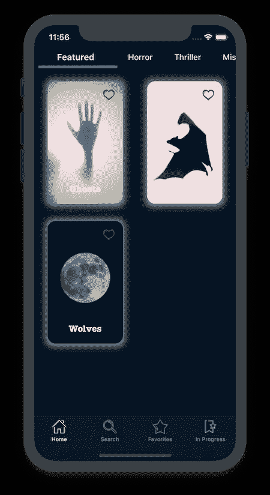

# Swift —如何创建带阴影的圆形集合视图单元格

> 原文：<https://blog.devgenius.io/swift-how-to-create-a-rounded-collectionviewcell-with-shadow-d696bd46c43f?source=collection_archive---------0----------------------->

马克斯·尼尔森在 [Unsplash](https://unsplash.com?utm_source=medium&utm_medium=referral) 上拍摄的照片

有时人们问我如何创建一个**时尚** UICollectionViewCell。通常我建议制作类似 AppStore **卡片**界面的东西，所以基本上**圆角视图**后面带**平滑阴影**是为了制作一些深度。

这真的很容易做到，我们只需要一个**自定义 UICollectionViewCell** 类和真正的**短代码**，如下所示。

轻松点。不是吗？

在这个例子中，我用白色的**作为阴影，如果你想要不同的颜色**记得改变它！

这是最后的结果:

问题或建议？下面让我知道！