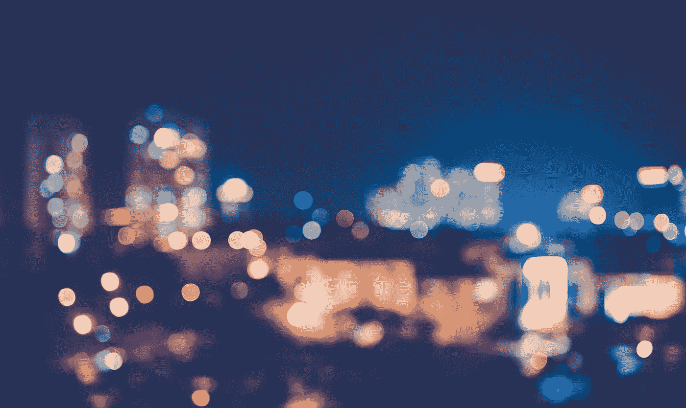

# Swift —如何模糊任何 UIView

> 原文：<https://blog.devgenius.io/swift-how-to-simply-blur-a-view-6f2926dfd242?source=collection_archive---------0----------------------->

在 [Unsplash](https://unsplash.com?utm_source=medium&utm_medium=referral) 上 [Thong Vo](https://unsplash.com/@titi_wanderer?utm_source=medium&utm_medium=referral) 拍摄的照片

每次我们创建一个新的应用程序，我们都会尽最大努力制作最令人惊叹的图形，因为我们知道**引人注目的**界面意味着更多的 AppStore 访问和自动更多的下载。

最近，越来越多的应用程序使用**阴影**和**模糊视图**来给我们的眼睛带来深度感和立体感。

下面你可以毫不费力地找到一个扩展来模糊**任何视图**！

是的，只有 6 行代码

问题或建议？下面让我知道！