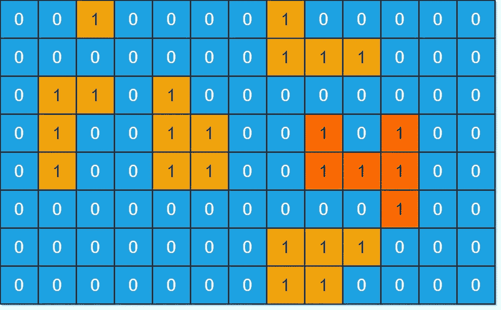

# Swift Leetcode 系列:岛屿最大面积

> 原文：<https://blog.devgenius.io/swift-leetcode-series-max-area-of-island-d3a5f1095547?source=collection_archive---------3----------------------->

## Swift + DFS +递归✅ ✅ ✅

[](https://theswiftnerd.com/max-area-of-island-leetcode/) [## 岛的最大面积(Leetcode 695)

### 难度:链接:第一天:June LeetCode 挑战给你一个 m×n 的二进制矩阵网格。一个岛是一组 1…

theswiftnerd.com](https://theswiftnerd.com/max-area-of-island-leetcode/) 

你可以通过上面的链接在 Swift Nerd 博客上阅读完整的故事。

# 问题描述

给你一个`m x n`二进制矩阵`grid`。岛屿是一组`1`(代表陆地)四向**(水平或垂直)相连的岛屿。)你可以假设网格的四个边都被水包围着。**

岛的**区域**是岛中具有值`1`的单元的数量。

返回*最大* ***面积*** *中的一个岛屿* `grid`。如果没有岛，返回`0`。

**例 1:**



```
**Input:** grid = [[0,0,1,0,0,0,0,1,0,0,0,0,0],[0,0,0,0,0,0,0,1,1,1,0,0,0],[0,1,1,0,1,0,0,0,0,0,0,0,0],[0,1,0,0,1,1,0,0,1,0,1,0,0],[0,1,0,0,1,1,0,0,1,1,1,0,0],[0,0,0,0,0,0,0,0,0,0,1,0,0],[0,0,0,0,0,0,0,1,1,1,0,0,0],[0,0,0,0,0,0,0,1,1,0,0,0,0]]
**Output:** 6
**Explanation:** The answer is not 11, because the island must be connected 4-directionally.**Input:** grid = [[0,0,0,0,0,0,0,0]]
**Output:** 0
```

# 限制

*   `m == grid.length`
*   `n == grid[i].length`
*   `1 <= m, n <= 50`
*   `grid[i][j]`不是`0`就是`1`。

# 解决办法

我们想找出网格中的最大面积。一个单元如果是 ***地*** ( **网格【I】【j】= 1**)就会贡献面积，否则就是 ***水*** 。每当我们来到陆地上，我们可以探索所有 4 个方向来找到相连的细胞。总面积将是所有这种相连单元的总和。

# 深度优先搜索

如果我们想要最大化任何数量的现存量(在这种情况下是连续单元的数量)，这是遍历任何 2D 网格的最佳技术。我们可以使用嵌套循环处理输入网格，并在陆地上递归调用 **dfs** 。 **dfs** 过程将依次递归检查所有 4 个方向，并返回陆地单元的总数。

# 诡计案件

有无限循环的机会，因为我们盲目地遍历所有 4 个方向，我们会再次访问一些单元，这又会再次触发递归。举个例子，两个 1 连在一起。他们会不停地呼唤他们的邻居。为了处理这种情况，每当递归地探索 4 个方向之前，我们将在该单元设置输入网格= 0，这样它就不会被再次计数。

## **复杂性分析**

**时间**=*O*(*R*∫*C*)，其中 R 是给定`grid`中的行数，C 是列数。我们每个广场都参观一次。

**Space**=*O(R∫C)*，我们递归时调用栈使用的空间。

感谢您的阅读。如果你喜欢这篇文章，并发现它很有用，请分享并像野火一样传播它！

你可以在[swift 网站](https://theswiftnerd.com/)|[LinkedIn](https://www.linkedin.com/in/varunrathi28/)|[Github](https://github.com/varunrathi28)上找到我