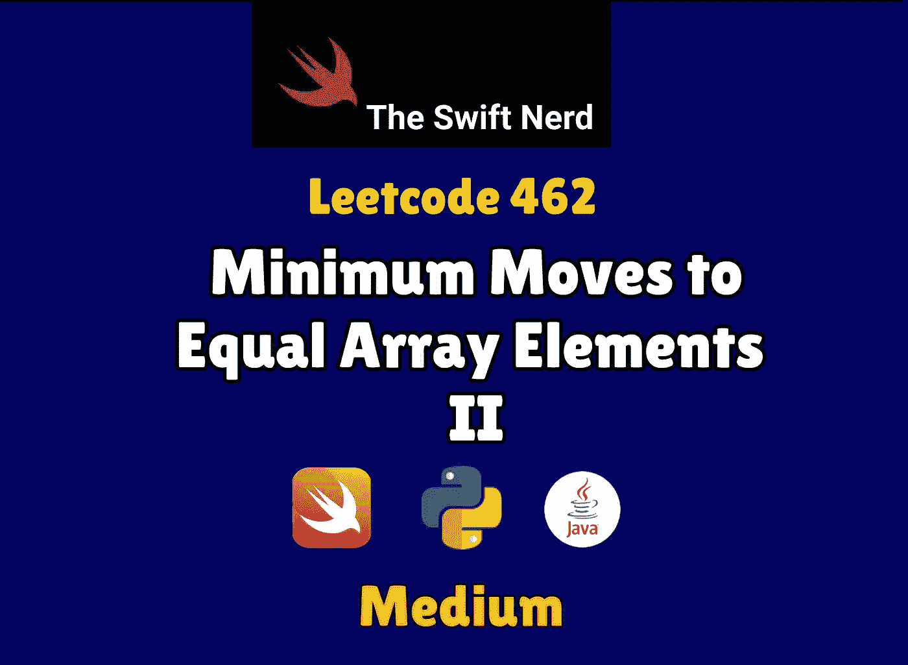

# Swift Leetcode 系列:最少移动到相等的数组元素

> 原文：<https://blog.devgenius.io/swift-leetcode-series-minimum-moves-to-equal-array-elements-94bebad14742?source=collection_archive---------3----------------------->

## 像专家一样解决 Swift 中的 Leetcode 挑战



TheSwiftNerd

[](https://theswiftnerd.com/minimum-moves-to-equal-array/) [## 最小移动到相等数组元素 II (Leetcode 462)

### 难度:链接:第 19 天:May Leetcode Challenge 给定一个大小为 n 的整数数组 nums，返回…

theswiftnerd.com](https://theswiftnerd.com/minimum-moves-to-equal-array/) 

你可以通过上面的链接在 Swift Nerd 博客上阅读完整的故事。

# 问题描述

给定一个大小为`n`的整数数组`nums`，返回*使所有数组元素等于*所需的最小移动次数。

在一次移动中，你可以通过`1`增加或减少数组中的一个元素。

# 例子

```
**Input:** nums = [1,2,3]
**Output:** 2
**Explanation:**
Only two moves are needed (remember each move increments or decrements one element):
[1,2,3]  =>  [2,2,3]  =>  [2,2,2]**Input:** nums = [1,10,2,9]
**Output:** 16
```

# 限制

*   `n == nums.length`
*   `1 <= nums.length <= 105`
*   `-109 <= nums[i] <= 109`

# 解决办法

一种强力方法可以是将每个元素视为支点，并计算离开的次数，以使其他元素等于该支点。我们可以追踪这些移动的最小值，这就是我们的答案。我们需要两个嵌套的循环来检查每一个数字组合，所以这将是一个由 **O(N2)** 限定的解决方案。我们能做得更好吗？

# 整理

如果我们按升序排列这些值，并将其绘制在直方图上，我们可以注意到所需的移动量是峰值之间的绝对差值。如果移动覆盖了中途，那么总移动将是最小的。中间值左侧的值较小，右侧的所有值都较大。这个中间值在统计学中有一个特殊的名字，叫做“M **edian** ”。这是排序列表中的中间值。

我们可以通过*对数组进行排序并找到中间值*来轻松找到中间值。然后，我们可以在单次迭代中找到与中值的绝对差之和。

# 复杂性分析

**时间= O(NLogN)**

**空格= O(1)**

感谢您的阅读。如果你喜欢这篇文章，并发现它很有用，请分享并像野火一样传播它！

你可以在[the swift nerd](https://theswiftnerd.com/)|[LinkedIn](https://www.linkedin.com/in/varunrathi28/)|[Github](https://github.com/varunrathi28)上找到我