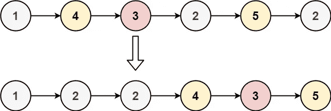

# Swift Leetcode 系列:分区列表

> 原文：<https://blog.devgenius.io/swift-leetcode-series-partition-list-5fc9dd4e52cb?source=collection_archive---------6----------------------->

## 分割两个链接列表的快速解决方案(Leetcode 86)

[](https://theswiftnerd.com/partition-list-leetcode/) [## 分区列表(Leetcode 86)

### 难度:链接:April Leetcoding 挑战:第 14 天给定一个链表的头和一个值 x，这样划分它…

theswiftnerd.com](https://theswiftnerd.com/partition-list-leetcode/) 

你也可以通过上面的链接在 Swift Nerd 博客上阅读完整的故事。

给定一个链表的`head`和一个值`x`，对其进行划分，使得小于 `x`的所有节点**出现在大于或等于**到`x`的节点**之前。**

您应该**保留**两个分区中节点的原始相对顺序。

**例 1:**



```
**Input:** head = [1,4,3,2,5,2], x = 3
**Output:** [1,2,2,4,3,5]
```

**例 2:**

```
**Input:** head = [2,1], x = 2
**Output:** [1,2]
```

# 限制

```
**Constraints:**
-The number of nodes in the list is in the range [0, 200].
-100 <= Node.val <= 100
-200 <= x <= 200
```

# 解决办法

问题是中等标签(然而它是非常简单的)。最初想到的想法是进行基于位置交换的比较，使节点 x 之前的节点小于 x，之后的节点具有更大的值。然而，由于对 LinkedList 的遍历是 O(N)运算，开销很大，所以我们应该想一个更好的解决方案。此外，我们需要保持元素的顺序，所以交换会改变这一点。

链表中什么更容易？修改链接，或者通过改变下一个指针来改变节点的顺序。我们有两个链表怎么样？一个链表将添加带有**值(< x)** 的节点，另一个链表将添加带有 **> = x** 值的节点。在我们处理完所有节点后，我们可以简单地将第一个链表的尾部绑定到第二个链表的头部。瞧啊。！简单吧？

在 swift 解决方案中，您可能会看到两个列表的头都用虚拟值初始化(LinkedList(-1))。这有助于避免检查空的磁头，原始列表只是简单的 **dummyHead- > Next。**

# 复杂性分析

我们可以很容易地分析我们的解决方案所需的工作和空间。我们在一次迭代中至少处理一次每个节点。为了用两个 LinkedList 来划分节点，我们只有对节点的引用，所以它的空间是恒定的。

时间=**O(N)**空间= **O(1)**

感谢您的阅读。如果你喜欢这篇文章，并发现它很有用，请分享并像野火一样传播它！

你可以在[the swift nerd](https://theswiftnerd.com/)|[LinkedIn](https://www.linkedin.com/in/varunrathi28/)|[Github](https://github.com/varunrathi28)上找到我