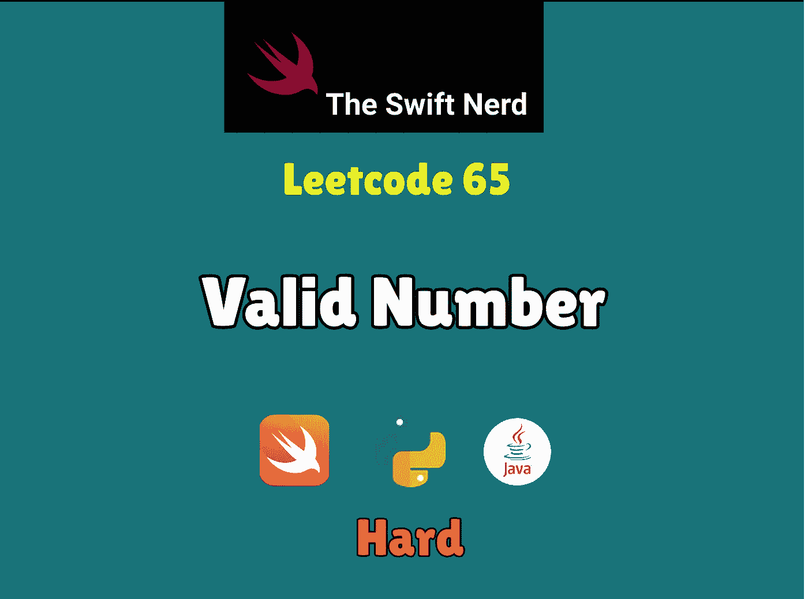

# Swift Leetcode 系列:有效号码

> 原文：<https://blog.devgenius.io/swift-leetcode-series-valid-number-d66ea86c815a?source=collection_archive---------4----------------------->

## 脸书面试问题👍 👍 👍

[](https://theswiftnerd.com/valid-number-leetcode/) [## 有效数字(Leetcode 65)

### 难度:链接:第 15 天:五月 Leetcode 挑战一个有效的数字可以拆分成以下几个部分(按顺序):A…

theswiftnerd.com](https://theswiftnerd.com/valid-number-leetcode/) 

你可以通过上面的链接在 Swift Nerd 博客上查看完整的故事。

# 问题描述

一个**有效数字**可以分成以下几个部分(按顺序):

1.  一个十进制数**或一个整数**。
2.  (可选)一个`'e'`或`'E'`，后跟一个**整数**。

一个**十进制数**可以分解成以下几个部分(按顺序):

1.  (可选)一个符号字符(`'+'`或`'-'`)。
2.  以下格式之一:
3.  至少一位数字，后跟一个点`'.'`。
4.  至少一位数字，后接一个点`'.'`，后接至少一位数字。
5.  一个点`'.'`，后跟至少一个数字。

一个**整数**可以分成以下几个部分(按顺序):

1.  (可选)符号字符(或者`'+'`或者`'-'`)。
2.  至少一位数字。

比如以下都是有效数:`["2", "0089", "-0.1", "+3.14", "4.", "-.9", "2e10", "-90E3", "3e+7", "+6e-1", "53.5e93", "-123.456e789"]`，以下都不是有效数:`["abc", "1a", "1e", "e3", "99e2.5", "--6", "-+3", "95a54e53"]`。

给定一个字符串`s`，如果 `s` *是一个* ***有效数字*** ，则返回`true` *。*

# 例子

```
**Input:** s = "0"
**Output:** true**Input:** s = "e"
**Output:** false**Input:** s = "."
**Output:** false**Input:** s = ".1"
**Output:** true
```

# 限制

*   `1 <= s.length <= 20`
*   `s`仅由英文字母(大写和小写)、数字(`0-9`)、加号`'+'`、减号`'-'`或点号`'.'`组成。

# 解决办法

这个描述看起来非常棘手，很难找到最初的解决方案。该问题是一个**硬**级问题，不是因为逻辑，而是因为边缘情况和条件。*你可以把这个问题想象成高级水平的 fizzbuzz 问题*(字面意思！).我建议浏览有效和无效数字的例子，以及为什么属于这一类的原因。看完这些例子后，你可以列出你的号码应该遵守的规则。

你处理这个问题的方式应该是从*写一个你需要检查的规则列表*开始。如果任何角色没有遵守规则，那么*我们应该立即返回 false】。我们可以遍历每个元素并用 if-else 连接我们的案例，因为只有一个案例是有效的。以下是你应该检查的规则:-*

1.  **“E”/“E”**应该不会在我们看到任何数字之前出现(比如“e123”)。此外，**‘E’/‘E’**不应出现超过一次**。**
2.  **整个字符串中至少应有 1 个数值。**
3.  **不接受除 **'e'/'E'** 以外的任何字符。**
4.  ****十进制" "**不应该出现一次以上，也不应该在我们看到一个指数之后出现 **(e/E)** 。**
5.  **符号 **(+/-)** 可以出现在**第 0 个索引**处，也可以紧跟在指数( **e/E** )之后。所有其他事件都是无效的。**

**其他所有的实例都是无效的，我们可以直接返回 false。为了使我们的工作更容易，我们采用了三个标志(布尔型)来检查是否已经看到了一个数字、十进制数或指数。我们将检查所有上述规则，并更新标志。**

# **复杂性分析**

****时间= O(N)****

****空间= O(1)****

**感谢您的阅读。如果你喜欢这篇文章，并发现它很有用，请分享并像野火一样传播它！**

**你可以在[swift 网站](https://theswiftnerd.com/)|[LinkedIn](https://www.linkedin.com/in/varunrathi28/)|[Github](https://github.com/varunrathi28)上找到我**