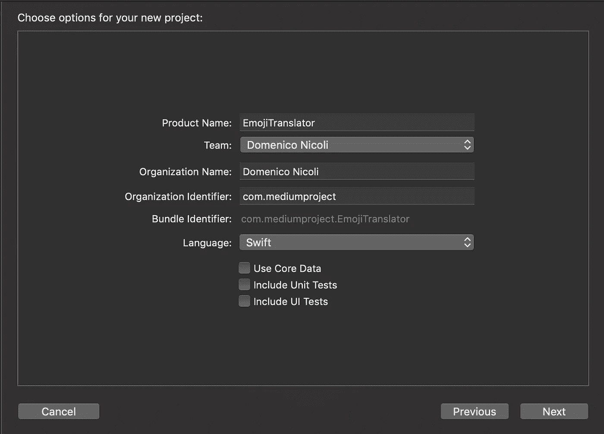
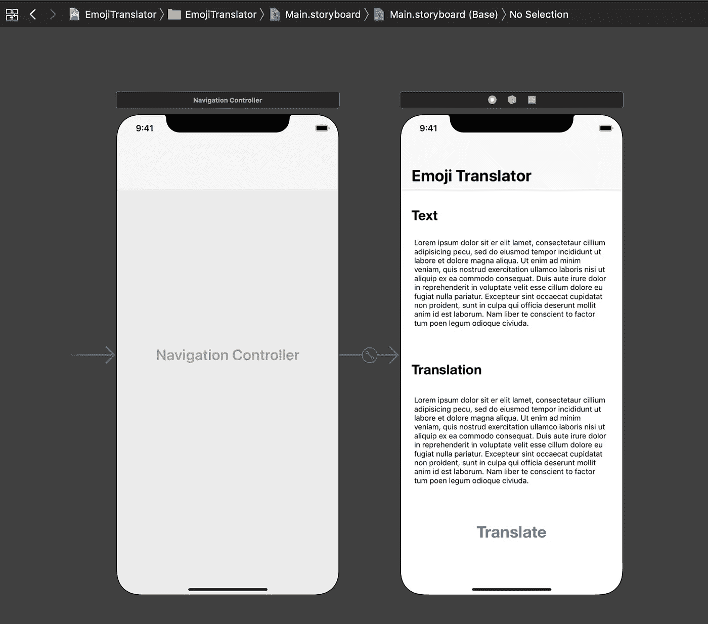
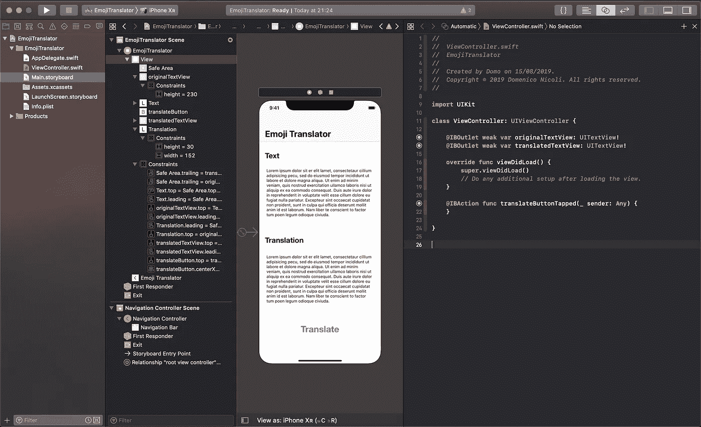
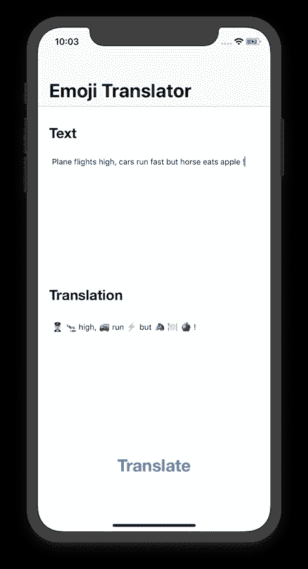

# swift——文本到表情翻译器

> 原文：<https://blog.devgenius.io/swift-text-to-emoji-translator-8849e363564c?source=collection_archive---------0----------------------->

福斯托·加西亚在 [Unsplash](https://unsplash.com?utm_source=medium&utm_medium=referral) 上拍摄的照片

现在，谷歌翻译支持 100 多种不同的语言，从南非荷兰语到祖鲁语。

但是有另一种新的语言在最近几年传播开来，但还没有得到..**表情符号**！

喜欢这些黄色面孔的人每天在聊天和信息中使用它，即使讨厌他们的人说他们无用和幼稚，关键是每天发送超过 50 亿个表情符号。

因此，在应用程序使用我们的[眉毛来移动表情符号](https://apps.apple.com/us/app/rainbrow/id1312458558)和[眼球追踪](https://apps.apple.com/app/id1445341875)来了解客户注意力最集中的地方的时候，为什么不创建一个**来用表情符号**翻译我们的想法呢？

幸运的是，马蒂亚斯·维拉维尔德已经想到了这一点，所以我们今天要做的是使用 GitHub 上的库来创建一个翻译应用程序。

首先创建一个新的 Xcode 项目。

然后通过故事板创建一个简单的界面，有两个文本框和一个按钮。第一个文本框用于原始消息，第二个用于最终翻译。

没有花哨的界面，是啊..

创建**两个文本框出口**和**平移按钮动作**在轻击时抬起。

现在从[这里下载](https://github.com/matiasvillaverde/emojimap/tree/master/EmojiMap/EmojiMap) **EmojiMap.swift** ， **emojis-es.json** ， **emojis-en.json** ， **emojis-fr.json** ， **emojis-de.json** 并将这些添加到您的项目中。

更新 **EmojiMap.swift** 文件中函数的**getsinglerandomatachefor。现在，即使没有找到匹配的表情符号，这个单词也会被返回。**

然后在 ViewController 文件中添加以下代码:

这将获取原文，**用表情符号**翻译每个单词(如果找到任何匹配)，并将结果放入翻译框中。

现在**构建它&在模拟器上运行**！

是啊，完全没有意义的句子..

我们已经做完了！真的很简单对吗？

## 我们现在能做什么？

我们可以用新支持的语言来改进这个库，在这里添加一个新的 JSON 文件(打开这个路径中已经存在的另一个 JSON 文件以供参考和理解数据结构)。

我们还可以用更多的单词和更准确的表情符号来改进现有的字典。

**问题或建议？下面让我知道！**