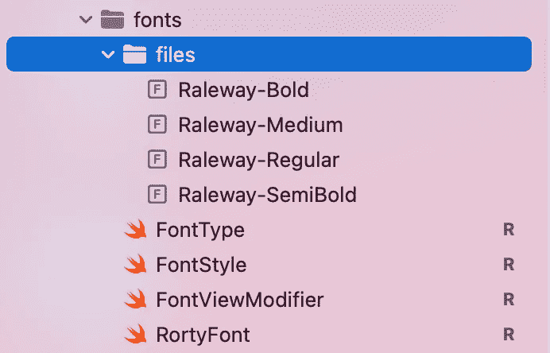
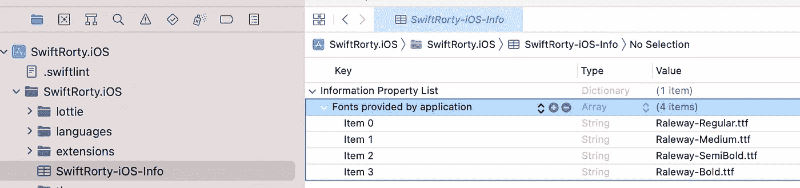
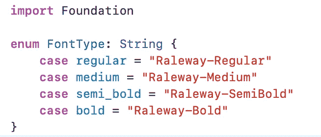
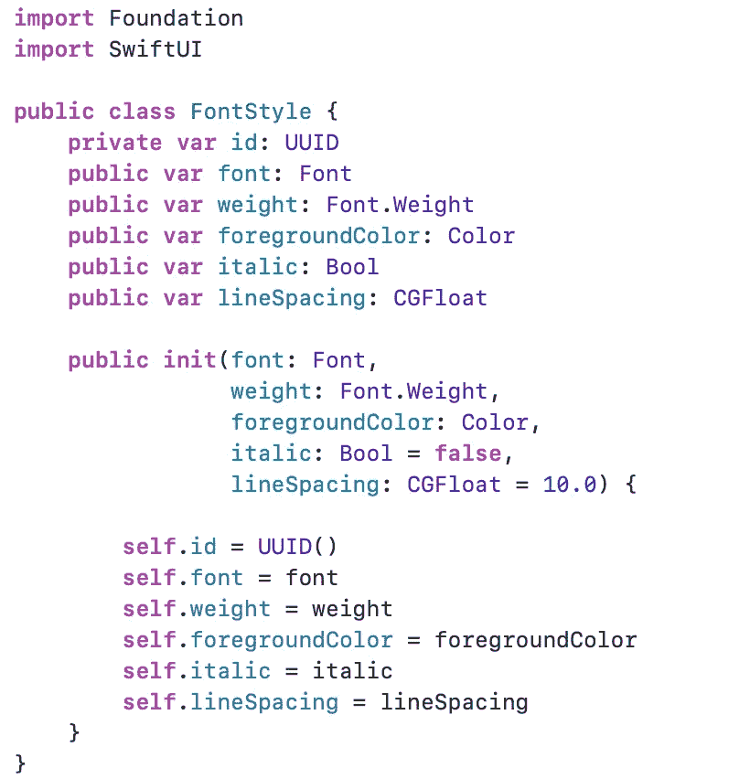
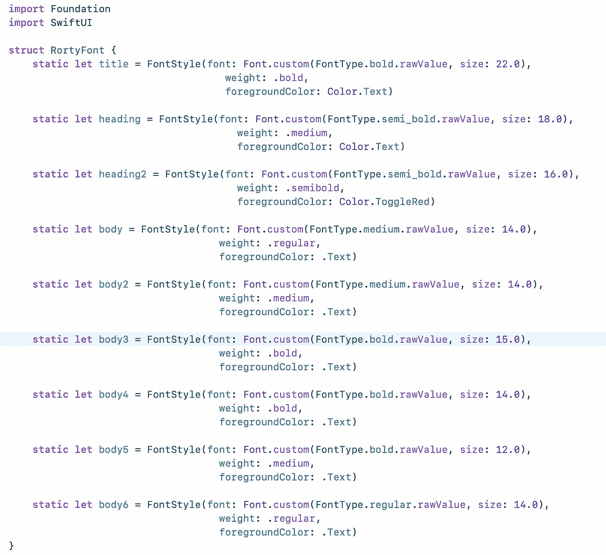
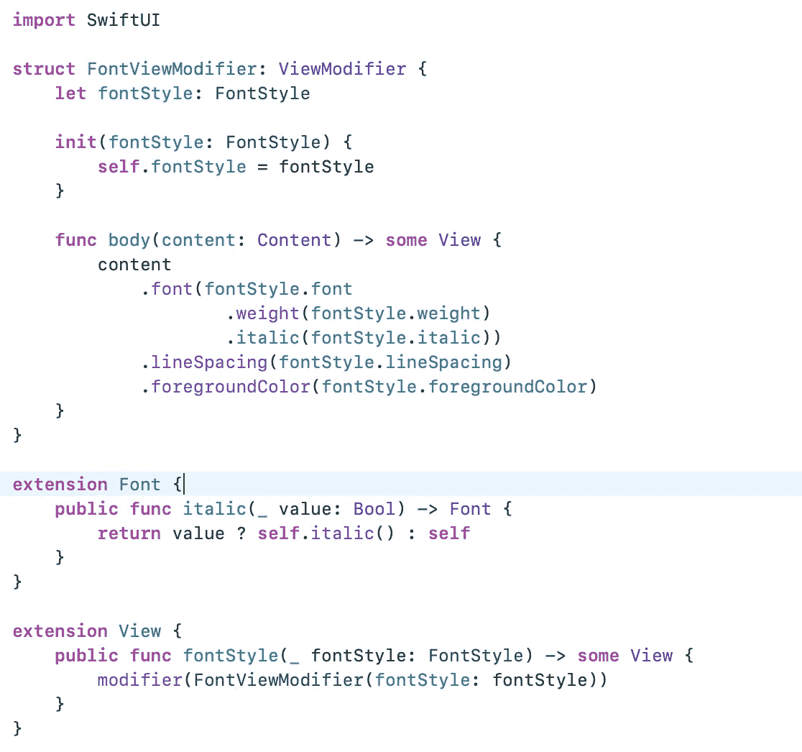
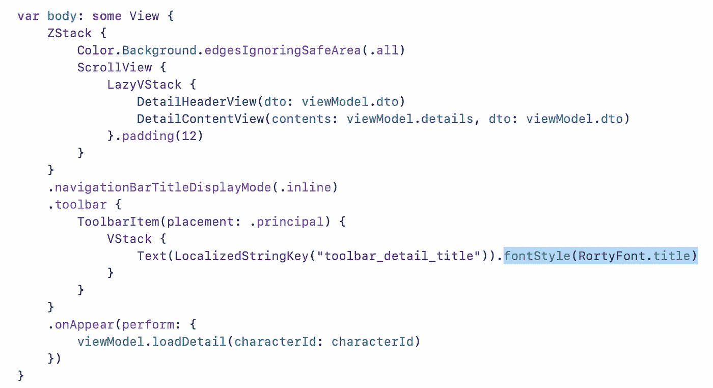

# Swift UI: ViewBuilder

> 原文：<https://blog.devgenius.io/swift-ui-viewbuilder-2205d424cadc?source=collection_archive---------6----------------------->

SwiftUI 中 ViewBuilder 的强大功能。

照片由[哈尔·盖特伍德](https://unsplash.com/@halacious)在 [Unsplash](https://unsplash.com/?utm_source=medium&utm_medium=referral) 拍摄

在这篇文章中，我将解释如何在 SwiftUI 中维护和理解 ViewBuilder。

# 介绍

通过将 SwiftUI 提供的内置视图与您在视图的 body computed 属性中创建的其他自定义视图相结合，构成一个自定义视图。使用 SwiftUI 提供的视图修改器配置视图，或者使用 ViewModifier 协议和 modifier(_:)方法定义您自己的视图修改器。

> SwiftUI 还允许你创建你自己的自定义修改器，你可以重用修改器，你可以应用到任何视图。

我将介绍如何在 SwiftUI 中使用 ViewBuilder 实现自定义字体模板机制。

# 字体

*   要加载自定义字体，我们需要将特定的字体复制到项目中。

在 Xcode 编辑器中，需要引用`Info.plist`文件中的字体。

你可以参考下面的链接。

[**https://developer . apple . com/documentation/ui kit/text _ display _ and _ fonts/adding _ a _ custom _ font _ to _ your _ app**](https://developer.apple.com/documentation/uikit/text_display_and_fonts/adding_a_custom_font_to_your_app)

*   创建一个名为`FontType`的枚举。

字体类型

*   创建一个名为`FontStyle`的类。

字体样式

*   现在我们需要创建名为`RortyFont`的自定义字体模板结构。

RortyFont

在创建了`RortyFont`结构之后，我们现在可以创建`FontViewModifier`，它将把模型中的字体应用到视图中。

# 创建视图修改器

通过使用视图修改器，一个协议需要你实现一个 **body()** 方法，该方法有一个**内容**参数。然后对这个**内容**参数应用您想要的任何修饰符并返回它。

`FontViewModifier`

# 应用视图修改器

我们可以通过将自定义修饰符传递给 **fontStyle()** 方法来应用它。

详细屏幕

我们可以在应用程序中轻松应用字体样式。

# 结论

> 视图修饰符，它是可重用的代码，它不仅适用于样式，你可以像普通的视图结构一样使用它

# 参考

*   [https://github . com/developer Sancho/swift Rorty . IOs/tree/develop/swift Rorty . IOs/theme/fonts](https://github.com/developersancho/SwiftRorty.iOS/tree/develop/SwiftRorty.iOS/theme/fonts)
*   [https://developer . apple . com/documentation/ui kit/text _ display _ and _ fonts/adding _ a _ custom _ font _ to _ your _ app](https://developer.apple.com/documentation/uikit/text_display_and_fonts/adding_a_custom_font_to_your_app)

# 完整项目

您可以从下面的链接获得该项目的源代码。

 [## 带 Rorty 应用的 SwiftUI Clean 架构

### 如果您想在继续阅读介绍之前直接检查项目，您可以通过访问…

developersancho.medium.com](https://developersancho.medium.com/swiftui-clean-architecture-with-rorty-app-f51ea0cbfa9b)  [## GitHub-developer Sancho/swift Rorty . IOs:🚀SwiftRorty 应用程序上的示例 iOS Clean 架构侧重于…

### 🚀SwiftRorty App 上的示例 iOS Clean 架构侧重于编写的可扩展性、可测试性和可维护性…

github.com](https://github.com/developersancho/SwiftRorty.iOS) 

# 谢谢🚀

希望对你有帮助。如果对你有用，可以拍拍这篇文章，关注我这样的这些文章。

快乐健康编码！

**一个美好的夜晚，持续不断**😊**🏄‍** 🚀