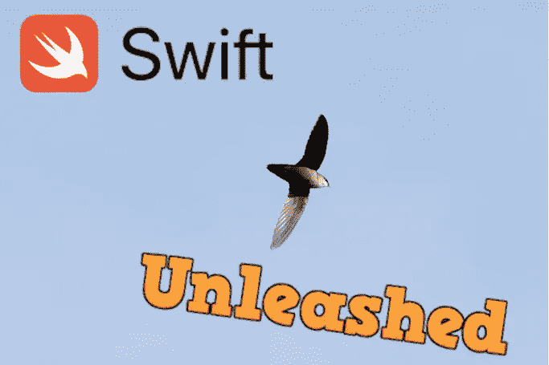

# (Swift)释放面向协议的编程

> 原文：<https://blog.devgenius.io/swift-unleash-protocol-oriented-programming-ac09ca636fda?source=collection_archive---------20----------------------->

# 首先，什么是面向协议的编程？

如果你已经知道了，让我们继续如果没有，你应该去读一读这篇来自[剑田儿岛](https://medium.com/u/4054fbebc193?source=post_page-----ac09ca636fda--------------------------------)
[(Swift)理解面向协议编程](https://medium.com/@KentaKodashima/swift-understanding-protocol-oriented-programming-bbef282ae922)的好文章

# 为什么我们需要释放它？有皮带吗？

是的，一个主要的问题，不幸的是，Swift 不允许我们在扩展中存储属性，编译器对我们咆哮。

> "扩展不能包含存储属性"。

多痛苦啊，所以我们不能将现有的类扩展到需要存储属性的协议？这是否意味着我们不能在这些情况下使用面向协议的方法，我们必须继续使用继承？
首先，有一个使用 **Obj-C** 运行时 [**关联对象**](https://nshipster.com/associated-objects/) 的[解决方案，但它不是一个纯粹的快速解决方案，使用起来看起来确实不安全，就像 Mattt Thompson *的*](https://pedrommcarrasco.github.io/posts/how-to-be-lazy-in-extensions/)*[这篇链接](https://nshipster.com/associated-objects/)文章中解释的那样，“它应该被视为最后的手段”。但是一个纯粹的 swift 解决方案呢？这在 swift 是不可能实现的？*

# 没有雨燕是真的厉害！总是有解决办法的！

在向我的朋友谷歌寻求帮助后，我找到了这篇来自[科斯坦蒂诺·皮斯塔尼亚](https://medium.com/u/c980828c9632?source=post_page-----ac09ca636fda--------------------------------)
[存储属性和扩展的好文章:一种纯粹快捷的方法](https://medium.com/@valv0/computed-properties-and-extensions-a-pure-swift-approach-64733768112c)
他最后一次尝试提供了一个解决方案，让我们在这里:

这是一个非常有趣的方法，但是有一个限制(不能真正重用，必须为每个存储的属性重写这个模式)和一个主要问题(内存泄漏，因为这个静态数组从不清空任何值)

# 可重复使用且无泄漏的解决方案！

因此，对于之前来自[科斯坦蒂诺·皮斯塔尼亚](https://medium.com/u/c980828c9632?source=post_page-----ac09ca636fda--------------------------------)的解决方案，他使用基于字符串密钥的地图得出了一个解决方案，他留下了这样的评论:

> "此外，我想通过使用类似指针的内存地址来改进散列表键机制."

## 使用弱引用作为键怎么样？

通过创建一个**弱**容器( **@PropertyWrapper** )，我们可以在序列上存储弱值

## 好吧，但是怎么做呢，既然虚弱的<anyobject>这不是 hashable 吗？</anyobject>

让我们把我的**弱**容器**做成可哈的**。

## 但是既然 v **值**是类型化的 **AnyObject** 又如何呢？

**AnyObject** **表示**的任何引用类型，并且所有引用类型化的实例都有一个唯一的标识符，它们的**内存地址**，所以**让** **用**这个**到** **构建**我们的 **hash。**

## 弱引用作为一个键将如何解决这些问题？

使用弱引用作为键将为我们提供一个指示器，以知道何时可以释放与对象实例相关联的属性。
**当****弱**映射**键**将为零时，我们可以简单地**将**这个条目**从**散列表**中移除。**

## 现在让我们创建静态 hashmap 容器！

好的，我们知道我们将使用**弱< AnyObject >** 作为键，但是值呢？
为了可重用，我们希望能够存储任何类型的值，并且不止一个，所以让我们使用**【Any】。**

由于键是基于弱引用的，我们无法控制该引用何时包含 nil，从而导致 key = "hash(nil)"(弱<nil>)。
因此，如果在我的映射中的两次读取或写入之间，两个或更多的键对象被释放(因此弱引用变成零)，这可能导致在我的 hashmap 中有两个或更多相同的 hashkey，从而导致崩溃。</nil>

## 怎样才能避免这种因为重复密钥而导致的崩溃呢？

在 hashmap 中访问或设置值之前，我们可以删除所有对应于弱<nil>的键。</nil>

## 线程安全呢？

我们可以使用并发调度队列来确保线程安全！

**如何在我的任意数组中找到对象？**

我决定在我的实现中让 getter 基于值的类型，这样它将返回第一个类型为 wanted 的元素。不幸的是，这限制了我们在一个对象的每个实例中只能存储一个特定类型的值。

为了得到一个值，我们可以通过类型来选择它。

## 然后让我们创建一个访问器来访问这个 PropertyData

我的第一个想法是，让我们使用一个属性包装器来隐藏容器！不幸的是，Swift 不允许你在非静态扩展属性上添加包装器，编译器又对我咆哮了。

> 在扩展内部声明的非静态属性“…”不能有包装

没关系，我们会挺过这种缺乏句法的困境。但是我决定仍然使用 propertyWrapper，因为它完美地描述了我在做什么。

# 干得好！现在是点心时间(奖励)！

经过这一漫长的旅程后，是时候体会这一解决方案的好处了！我们现在可以将一个现有的类扩展到需要存储属性的协议，而不必对它们进行子类化。

# 结论

这种解决方案有效，但是有一些限制，仍然可以改进。使用这种模式，我们可以重构很多代码，从面向对象转向面向协议，我们可以摆脱很多丑陋的继承；和特殊化来实现我们代码库的最佳性能。

局限性:

*   只有当我们访问 PropertyData 时，内存清理才会发生。并且如果不进一步接近，将永远不会发生(因此仍然不是完全无泄漏的)
*   我们不能在一个对象实例的 PropertyData 上存储同一类型的两个不同对象。

解决方法:

*   我们可以存储数组或对象映射来存储多个对象。
*   我们可以对 StoredObject 进行强子类化，使其唯一。

改进的空间和潜在的摆脱限制:

*   观察弱实例以“实时释放”它们的属性数据，并成为真正的无泄漏解决方案，而不必在每个 set/get 中过滤 nil 元素？(导致将 PropertyData 访问时间复杂度提高到实际 O(N)之前的 O(1))
*   用字典替换地图上的对象数组，并更改 getter 值，以便能够在 PropertyData 上存储许多相同类型的对象？如果是这样，我们将需要一个子密钥，但如何尽可能无缝地做到这一点呢？使用选择器作为子项？将这个新子密钥与当前的密钥散列结合起来并保持一个数组怎么样？我看到了许多解决这个限制的方法，但是我不知道哪一个是最好的。

希望你们中的一些人能提供建议来摆脱这些限制并改进这个解决方案！

## 现成的解决方案:SwiftAssociatedObject

编辑 09/07/2020:这让我在一个框架上发布了一个完整的关联对象的纯 Swift 实现，随时可用，开源并解决了这个解决方案的限制，而没有干扰 ObjcRuntime！

 [## inso-/SwiftAssociatedObject

### 关联对象的纯快速实现。通过创建一个…

github.com](https://github.com/inso-/SwiftAssociatedObject) 

使用 SwiftPackageManager/CocoaPod 或 Carthage 将它添加到您的项目中，并释放面向协议的编程！

# 参考

[岸田文雄](https://medium.com/u/4054fbebc193?source=post_page-----ac09ca636fda--------------------------------) : [(Swift)理解面向协议的编程](https://medium.com/@KentaKodashima/swift-understanding-protocol-oriented-programming-bbef282ae922)

[科斯坦蒂诺·皮斯塔格纳](https://medium.com/u/c980828c9632?source=post_page-----ac09ca636fda--------------------------------) : [存储属性和扩展:一种纯粹快捷的方法](https://medium.com/@valv0/computed-properties-and-extensions-a-pure-swift-approach-64733768112c)

[马特·汤普森@NSHipster](https://nshipster.com/authors/mattt/) : [关联对象](https://nshipster.com/associated-objects/)

[佩德罗·卡拉斯科](https://medium.com/u/36ca53e721a?source=post_page-----ac09ca636fda--------------------------------) : [如何在扩展中偷懒？](https://pedrommcarrasco.github.io/posts/how-to-be-lazy-in-extensions/)