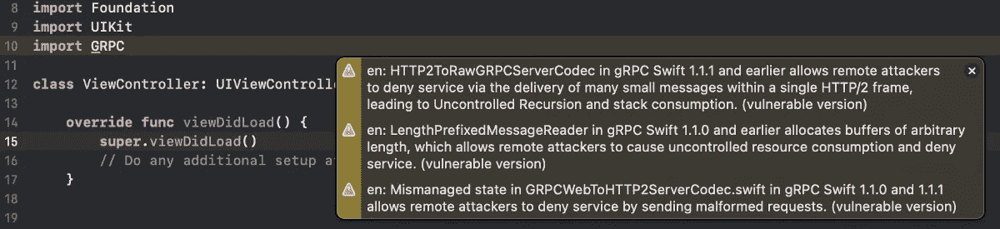
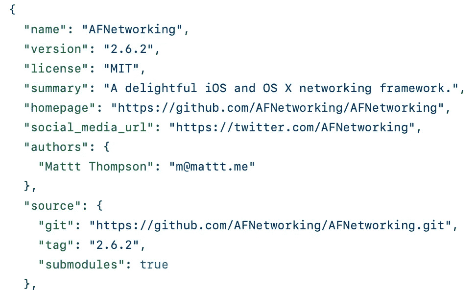
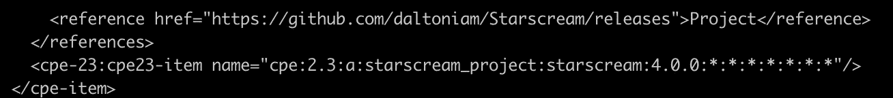
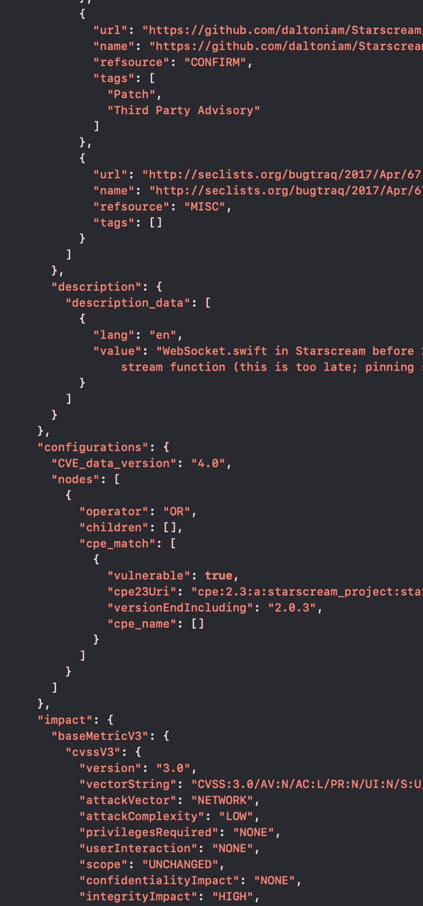
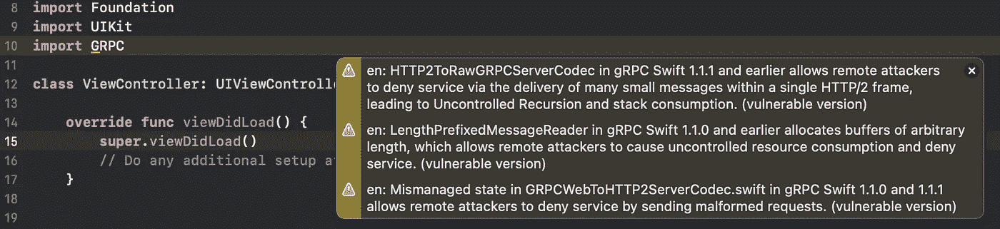

# SwiftDependencyChecker —检查 CocoaPods、Carthage 和 Swift PM 依赖项是否存在已知漏洞

> 原文：<https://blog.devgenius.io/swiftdependencychecker-check-cocoapods-carthage-and-swift-pm-dependencies-for-known-def2fba890c?source=collection_archive---------8----------------------->

# 您的应用程序是否使用了任何存在已知漏洞的库？

我们的应用程序中漏洞的一个来源是使用第三方库的易受攻击版本。有公开的漏洞数据库，但是很难搜索它们，并且重新检查漏洞是乏味的。

大多数检查易受攻击的第三方依赖项的工具都是为其他包管理器和语言构建的。其中一些工具为 CocaPods 提供了(大部分是实验性的)支持，但我没有找到任何工具可以支持在 Swift 中编写应用程序时使用的所有三种包管理器。

因此，我决定编写一个工具来检测易受攻击的第三方库的使用，该工具将满足以下要求:

*   支持 CocoaPods、Carthage、Swift 包管理器
*   与 Xcode 集成
*   开源并免费使用
*   没有收集用户数据
*   最小设置

# 分析包管理器清单文件

首先分析 Podfile.lock、Cartfile.resolved 和 Package.resolved，以检测应用程序中使用了哪些第三方库。这些文件包括直接和间接依赖关系。收集库名、版本、模块名和其他一些关于所用依赖项的数据。

Carthage 和 Swift 包管理器都是分散的包管理器，没有可以通过这些包管理器使用的库的中央列表。通常，给定依赖关系的存储库地址包含在依赖关系声明中。这些信息将用于接下来的分析步骤。

AFNetworking podspec 文件摘录

另一方面，CocoaPods 是一个集中式的包管理器，只需在包管理器清单文件中提供库的名称就足够了。因为为了进一步的分析，我们需要库的存储库地址，所以从 Podfile.lock 中检索的库的名称被“翻译”。为此，克隆了包含通过 Cocoapods 提供的所有库的信息的[规范库](https://github.com/CocoaPods/Specs)。SwiftDepenencyChecker 为每个库找到正确的 podspec 文件，并提取所需的信息。

如果设置中没有另外指定，SwiftDependencyChecker 每周更新一次 CocoaPods 规范存储库。

# 公共漏洞数据库

下一步是找出哪些库公开披露了漏洞。为此，我使用了[国家漏洞数据库](https://nvd.nist.gov) (NVD)。NVD 提供了一个 API 来搜索漏洞，但是如果只给出项目名称，有时很难找到这些信息。NVD 使用公共平台枚举(CPE)作为对象的唯一标识符。给定一个项目的 CPE，很容易找到匹配这个项目的所有漏洞。

CPE-s 以下列格式给出:

> CPE:2.3:a:**af networking _ project**:**af networking**:0 . 2 . 1:*:*:*:*

cpe 的每一部分都包含特定类型的数据:CPE 格式、公司名称、项目名称、版本、关于版本的附加信息(例如，是否是测试版)、平台等等。

当我们可以将库与 cpe-s 匹配时，我们就可以通过 NVD API 轻松地查询这些库的漏洞。

# 将项目与 CPE-s 匹配

为了将项目与 CPE-s 匹配，我使用了[官方 CPE 词典](https://nvd.nist.gov/products/cpe)。这本词典每天更新多次，可以从 NVD 网站下载。SwiftDependencyChecker 下载 cpe 字典，对于项目中检测到的每个库，它会尝试将库的名称与字典中的项目引用进行匹配。每周下载一次新版 cpe 字典，以跟上字典中的新项目。

当我们运行
grep-A3-I-e " daltoniam/红蜘蛛" official-CPE-dictionary _ v 2.3 . XML
时，我们得到以下输出:

摘自 official-CPE-dictionary _ v 2.3 . XML

参考标记与连接到相应 cpe 项目的库名相匹配。这意味着与“daltoniam/红蜘蛛”库匹配的 cpe 是
cpe:2.3:a:红蜘蛛 _project:红蜘蛛:*:*:*:*:* *

在 SwiftDependencyChecker 中，这种搜索是通过遍历字典行并匹配库名来完成的。从 Podfile.lock 翻译库名对于使这个过程更加准确是必要的。

# 查询 NVD 数据库

在 cpe 匹配步骤之后，SwiftDependencyChecker 将查询 NVD API 来查找每个 CPE 的漏洞。对 https://services.nvd.nist.gov/rest/json/cves/1.0? NVD 的查询执行如下:
cpeMatchString = \(CPE)&resultsPerPage = 2000

NVD API 回应摘录

只有具有易受攻击版本的项目才有 cpe-s，这意味着查询的数量尽可能少。NVD 允许在没有应用密钥的情况下每分钟 10 次查询，在有应用密钥的情况下每分钟 100 次请求。SwiftDependencyChecker 还不支持提供应用程序键来加速这些查询，但将来会支持。

API 的输出是 json 格式的，包含关于漏洞、其影响、其引用和受影响版本的信息。

该数据被解析并保存。对于 SwiftDependencyChecker 中的分析，了解哪些版本的库受到漏洞的影响尤为重要。

受影响版本的数据作为嵌套节点给出，并指定如何组合它们的操作符。SwiftDependencyChecker 当前记录，但忽略操作符，并将每个被指定为易受攻击的版本视为易受攻击。

对 NVD 的查询每天进行一次。这意味着，如果对给定 cpe 的最后一次查询是在不到 24 小时之前执行的，则使用保存的数据，而不是进行新的查询。可以在设置中更改该时间间隔。

# 将库的使用与易受攻击的版本相匹配

从 NVD SwiftDependencyChecker 查询漏洞后，它会检查是否有任何使用的库版本与易受攻击的版本相匹配。

这里的一个困难是，库的版本约定是否在某个时候发生了变化。例如，一个库可能在开始时使用 3.4.5 形式的版本，后来使用 2020.11.10.2 形式的版本。目前，如果版本中的组件数量不同，那么在本例中，将比较前 3 个组件。如果根本无法比较两个版本，则使用的版本被认为是易受攻击的。

# 来源分析

为了将易受攻击的库使用与项目 SwiftDependencyChecker 检查项目文件夹中的所有 swift 文件，并尝试将导入语句与易受攻击的库版本的使用进行匹配。如果 import 语句与易受攻击的依赖项的使用相匹配，则会打印一条警告。

此外，SwiftDependencyChecker 检查 Podfile.lock、Cartfile.lock 和 Package.resolved 文件，并将库名称与易受攻击的库使用进行匹配。对于每一个匹配，都会打印一个警告。

# 表演

当第一次运行 SwiftDependencyChecker 时，需要下载多个大文件，并且需要翻译所有的 CocoaPods 库名称。这需要时间。随后的运行将会显著加快，因为关于 cpe-s 和翻译的许多信息都保存在相应 json 文件的 DependencyInfo 目录中。

# 安装和使用

SwiftDependencyChecker 在 github 上[可用，也可以用以下命令与 homebrew 一起安装:](https://github.com/kristiinara/SwiftDependencyChecker)

> brew tap kristiinara/SwiftDependencyChecker
> brew 安装 SwiftDependencyChecker

安装后，SwiftDependencyChecker 可以按如下方式运行:

> SwiftDependencyChecker 分析-所有操作

这将打印出所使用的易受攻击的库版本的信息。

> 快速依赖性检查器分析-行动来源分析

打印出与在源文件中使用易受攻击的库版本相关的警告。

运行脚本构建阶段

建议将以下内容作为新的“运行脚本”添加到 Xcode 项目的“构建阶段”下。然后输出在 Xcode 中显示为警告。以这种方式使用 SwiftDependencyChecker 可以自动检查新的漏洞，而无需任何用户交互。

SwiftDependencyChecker 生成的 Xcode 中的警告

# 反馈

如果您决定试用该工具，我将非常感谢您的任何反馈。如果你确实在你的项目中发现了漏洞，我也非常希望听到这个工具是有用的。如果你有任何问题，我很乐意回答。

# 未来的工作

*   支持 NDV 应用程序键
*   让警告更好
*   构建通知用户在没有积极开发的旧项目中发现的漏洞的功能