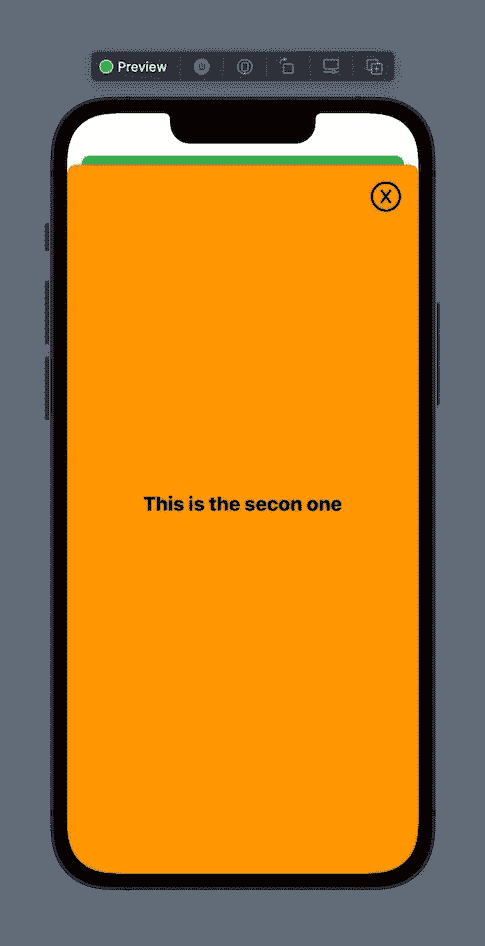
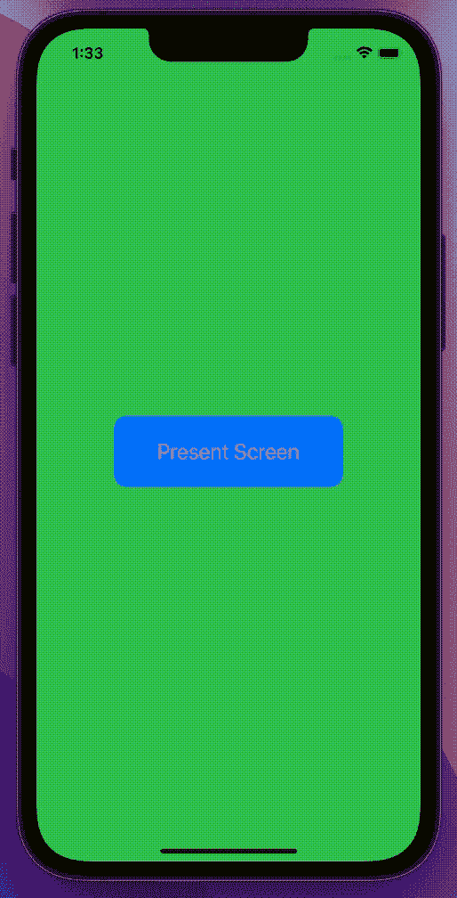

# SwiftUI:呈现模态视图的不同方式

> 原文：<https://blog.devgenius.io/swiftui-different-ways-to-present-modal-views-26472947a800?source=collection_archive---------0----------------------->

## 在 SwiftUI 中学习不同的方式和方法来对视图进行建模


照片由[皮查拜](https://www.pexels.com/it-it/@pixabay?utm_content=attributionCopyText&utm_medium=referral&utm_source=pexels)从[派克斯](https://www.pexels.com/it-it/foto/micro-fotografia-dello-specchio-d-acqua-221189/?utm_content=attributionCopyText&utm_medium=referral&utm_source=pexels)拍摄

SwiftUI 是一个令人惊叹的框架，由苹果公司正式创建，以声明性和令人难以置信的快速方式构建用户界面。它还很年轻，但是越来越多的开发者在他们的应用中采用它。因为太年轻，经常发生的事情是，没有标准的方法来做某事，最佳实践还没有定义，所以我们经常有许多方法来解决同一个问题。

在今天的文章中，我将向你展示用模态的方式呈现一个新的`View`的不同方法。

## 一个小小的 UX 速成班…

首先，让我们从一堂关于 UX 的课开始…为什么我们需要模态展示？模态流的作用是什么？

在 UX 流中，我们通常以水平过渡的方式转到下一个屏幕，通常是从左到右，就像你写的那样(请允许我做一点近似)，所以下一个控制器是从屏幕的一侧推出的。这感觉很自然，因为这是我们内心深处的习惯。这就是我们看书时发生的事情。但是，如果需要记下我们正在阅读的内容，会发生什么呢？嗯，我们把放在书下面的便利贴拿出来，放在书页上，写点东西，然后放回别的地方。上上下下。我们已经停止了正常的流向**走一条短弯路**。在应用程序中，我们会用**模态呈现**来完成。就是这样，当我们不得不暂停一个正常的流程来暂时做一些不同的事情时，就需要一个模态。也许我们需要给用户额外的信息，这样我们就可以有模式地呈现这些信息。
举一个现实生活中的例子，几天前，我正在使用我全新的“wi-fi-ed”洗衣机，在中途，我被要求输入序列号。一个按钮将我指向机器上数字的位置，一个模态视图显示了它的位置。

## 不同的方式…

在 SwiftUI 中，基本上有 3 种方式来执行模态呈现，实际上是 3+1，但我们稍后会看到。这些是我们的选择:

*   工作表
*   过渡
*   动画片

所有这些选择都很好，为我们的问题提供了解决方案，但彼此略有不同。让我们逐一分析。

我们将构建一个超级简单的应用程序来显示演示选项。只有两种观点。

## 工作表

Sheets 碰巧是呈现 SwiftUI 的经典方式，因为苹果让它变得超级简单，所以可能 90%的开发者更喜欢用这种方式。好了，别说了，让我们写点代码吧:

*   第 3 行:类型为`Bool`的`@State var`保存了整个表示的逻辑。
*   第 11 行:`Bool`被切换。
*   第 20 行:`Sheet`以标准方式呈现。

现在让我们来看看显示的屏幕:

*   第 3 行:魔法在这里完成了。属性包装器将局部变量与环境连接起来，允许我们在需要时消除这个视图。
*   第 13 行:用一个标准的命令关闭视图。

我只是向你展示了展示一个新视图的标准方法，但是有一点我不喜欢……一种卡片效果被应用到了展示的视图中。视图本身在背景中变小了，并且稍微缩小了。此外，所呈现的视图没有覆盖 100%的可用屏幕:



老实说，我对这种演示模式并不满意。如果你需要开始一个全新的心流，那么总是有一个开始的视角会很难看…悄悄靠近你…相当可怕和怪异😁。
幸运的是苹果给了我们一个解决方案(你还记得前面某处的+1 吗？).
在 presenting 视图的第 21 行，使用以下代码:

```
.fullScreenCover(isPresented: $showView) { SecondView() }
```

…你猜怎么着？`SecondView()`现在全屏呈现！

## 过渡

第二种有模式地呈现视图的方法是使用过渡。处理事务的方法略有不同，但对我来说，它更强大，更可定制。事实上，您可以从屏幕的任何一侧呈现视图，而不仅仅是从底部。这样，你也可以模仿一个`Segue`的演示模式。

让我们写一些代码:

*   第 11 行:`withAnimation`需要稍后创建一个动画过渡。
*   第 21 行:一个绑定变量被传递给呈现的视图。我们将在稍后的解散过程中使用它。
*   第 22 行:请注意`zIndex(1)`。稍后需要此修改器，以便在解散动画中，将呈现的视图保持在堆栈顶部。否则，视图将被放在后面，然后随着动画消失。
*   第 23 行:神奇之处都在这里。这一行代码触发了转换。请注意在该行的和处带有`.bottom`值的`enum`。该值驱动转换的入口点:呈现的视图将从屏幕底部进入。在解除阶段，动画会反转，因此视图会转到屏幕的底部。

现在让我们写第二个视图:

*   第 12 行:绑定变量用动画切换，以创建一个愉快的解散。

非常好，超级简单。呈现的视图覆盖了整个屏幕区域，因此您可以毫无问题地开始一个全新的流程。

请注意，由于 Xcode 13.2 实际版本中的一个错误，画布不会以正确的方式显示演示文稿。使用模拟器或在 iPhone 上运行。

## 动画片

呈现新屏幕的最后一种方式是使用动画。可能这个给了我们更多的灵活性，但是需要更多的代码:

*   第 5 行:创建一个计算变量来计算显示屏幕的垂直偏移量。
*   第 15 行:`Bool`在这里用动画切换。
*   第 26 行:`.offset`修改器允许动画视图。

呈现的`SecondView03`和前面的例子完全一样，所以我不再复制了。

请注意，由于 Xcode 13.2 实际版本的一个 bug，画布不会以正确的方式显示动画。使用模拟器或在 iPhone 上运行。

如前所述，只要付出一点额外的努力，这种动画就能创造出完全不同的美妙效果。我将向您展示一个小例子，对前面的结构做了一点编辑。

让我们创建第二个计算变量:

```
**var** yOffset: CGFloat { 
    showView ? 0 : UIScreen.main.bounds.height 
}**var** xOffset: CGFloat { 
    showView ? 0 : -UIScreen.main.bounds.width/2 
}
```

所以现在我们也有了一个水平偏移…
让我们改变第 25 行的动画，添加一点弹簧效果:

```
SecondView03(showView: $showView)
    .animation(.spring(response: 0.75, 
                       dampingFraction: 0.7, 
                       blendDuration: 1), value: showView)
    .offset(x: xOffset, y: yOffset)
```

通过这个简单的修改，我们创造了一种全新的方式来呈现屏幕…可能性是无限的。



## 最后的话

现在，您已经拥有了按照您想象的方式创建模态转换所需的所有工具。你会用哪一个？嗯，没有金科玉律。这取决于你想要创造的效果。看你的了！你有所有的权力！

如果你有兴趣了解更多，更多关于 SwiftUI 中的动画，我强烈建议你看看这本很棒的互动书籍:

[](https://www.bigmountainstudio.com/animations-16/jz1m0) [## SwiftUI 动画大师(iOS 16)

### 从初学者到大师，了解本“视频”书如何使用最有效的方法来教授 SwiftUI 动画…

www.bigmountainstudio.com](https://www.bigmountainstudio.com/animations-16/jz1m0) 

我希望你喜欢这篇文章，如果你喜欢，请鼓掌。
如果这篇文章对你有用，请随意[给我一杯咖啡](https://www.buymeacoffee.com/dy59tqxn794)并允许我创造更多酷的内容和文章。

享受你的编码！