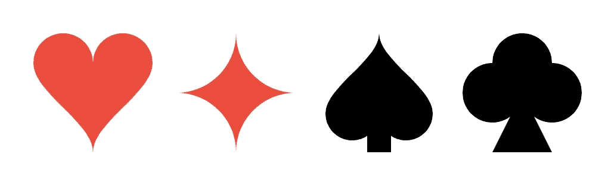
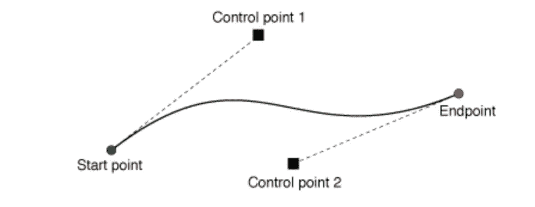

# SwiftUI:如何使用 Path API 绘制扑克牌阴影？

> 原文：<https://blog.devgenius.io/swiftui-how-to-draw-playing-cards-shades-using-path-api-f2d6c5425af1?source=collection_archive---------9----------------------->

## 如何定制造型？



在 SwiftUI 中，可以用路径和形状实现自定义渲染。可以通过路径创建形状。这使得路径成为基本绘图元素。

在本教程中，我们将使用路径来创建不同色调的扑克牌。首先，让我们学习可以绘制的路径类型。

*   **线**追加直线。

```
func addLine(to point: CGPoint)
```

*   **圆弧**相对于中心追加圆弧。需要角度，半径，中心点和方向。

```
func addArc(withCenter center: CGPoint, 
     radius: CGFloat, 
 startAngle: CGFloat, 
   endAngle: CGFloat, 
  clockwise: Bool)
```

*   **四次曲线**添加曲线作为二次方程。一个二次方程需要三个点来画一条路径。


image:[https://developer . apple . com/documentation/ui kit/uibezierpath/1624351-addquadcurve](https://developer.apple.com/documentation/uikit/uibezierpath/1624351-addquadcurve)

```
func addQuadCurve(to endPoint: CGPoint, 
     controlPoint: CGPoint)
```

*   **三次曲线**添加曲线作为三次方程。一个三次方程需要四个点来画一条路径。



image:[https://developer . apple . com/documentation/ui kit/uibezierpath/1624357-add curve](https://developer.apple.com/documentation/uikit/uibezierpath/1624357-addcurve)

```
func addCurve(to endPoint: CGPoint, 
controlPoint1: CGPoint, 
controlPoint2: CGPoint)
```

现在让我们试着用上面的来创建卡片阴影。但是在开始画图之前，我们先来看一些效用函数。在本练习中，我们将多次使用这些函数。

**菱形阴影**是最容易画的一种。我们可以用简单的直线、曲线或圆弧来实现这一点。在本演示中，我们将使用弧线。

```
1\. Move to center bottom or any centered edge (left, right or top)
2\. Keeping the corner as center draw an arch to next centered edge
```

**心形阴影**是两条三次曲线和两条圆弧的组合。

```
1\. Move to center bottom
2\. Draw cubic curve either left center or right center. Keep controls to a 45° point.
3\. Draw arch 180° arc from last point with 25% width as radius and center to 25% width and height.
4\. repeat in reverse i.e. 3 - 2 
```

.

**铲形阴影**可以通过合并**心形**阴影形状与矩形来构建。

```
1\. Create Heart shape with 90% of height
2\. Rotate Heart and retrieve path
3\. Create rect from center to bottom center with appropriate width
4\. Merge both path 
```

📌*合并形状示例*

**社荫，**三圈一三角。

```
1\. Divide rect into 2x2 grid
2\. Draw one circle with 0-1 grid intersection as diameter 
3\. Draw one circle with 0-2 grid intersection as diameter
4\. Draw one circle with 1-3 grid intersection as diameter
5\. Draw 60° equilateral Triangle from center to bottom 
```

**比赛演示:**

[](https://github.com/prafullakumar/DemoPlayingCard) [## prafullakumar/demoplayingard

### 在 GitHub 上创建一个帐户，为 prafullakumar/DemoPlayingCard 的开发做出贡献。

github.com](https://github.com/prafullakumar/DemoPlayingCard)