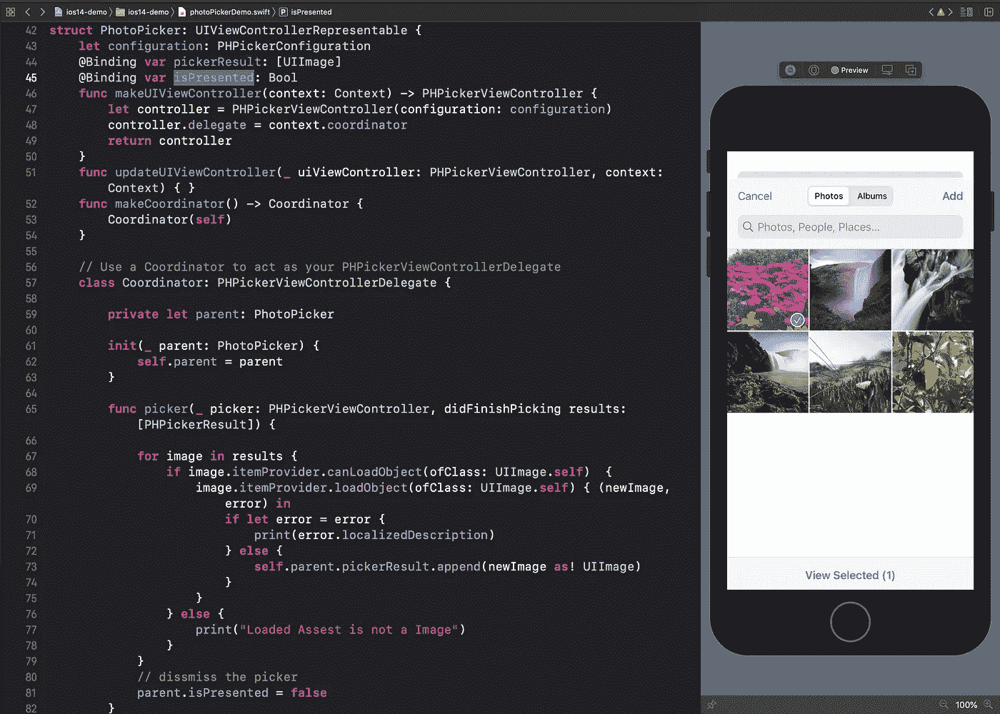
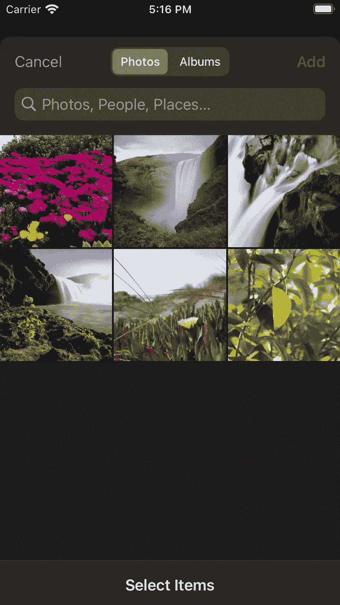

# SwiftUI:如何使用 PHPicker(PhotosUI)从库中选择图像？

> 原文：<https://blog.devgenius.io/swiftui-how-to-use-phpicker-photosui-to-select-image-from-library-5b74885720ec?source=collection_archive---------5----------------------->

## iOS 14 — Xcode 12

在 WWDC20 中，苹果增加了一个名为 PhotosUI 的新框架，可以从库中选择图像、视频等。在本教程中，我们将使用 SwiftUI 实现同样的功能。

由于 PhotosUI 是基于 UIKit 而不是 SwiftUI，我们需要编写一个可表示的。这个代表可以在 SwiftUI 中使用 PhotosUI 的" *PHPickerViewController* "

采摘者

*   *PHPickerViewController* 需要一个 *PHPickerConfiguration* 作为初始化器。
*   一旦用户完成，光拾取器将需要切换状态来关闭控制器
*   PhotoPicker 还需要一个 binging 对象将图像传回给调用者。
*   实现 PHPickerViewControllerDelegate 来处理从库中返回的图像

## **创建 *PHPickerConfiguration 和* toggle 状态，绑定对象:**

有了上面的代码，我们就可以呈现 Picker。现在剩下的是委托处理。

**实现 PHPickerViewControllerDelegate，**我们将使用 PHPickerViewControllerDelegate 创建协调器。该协调器将处理回调和数据绑定，如下所示:

**让我们结合一切:**

工作演示

带有选定图像的用户界面