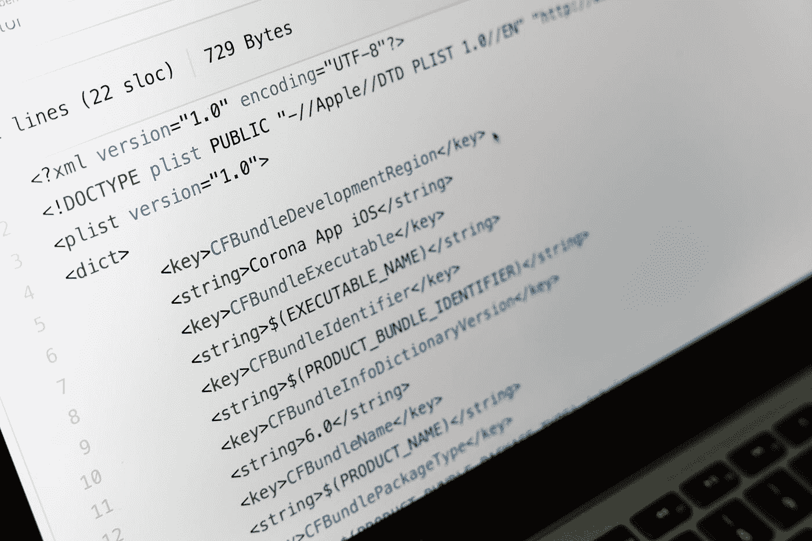
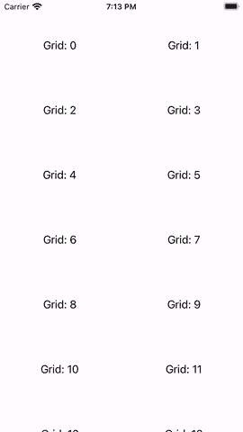
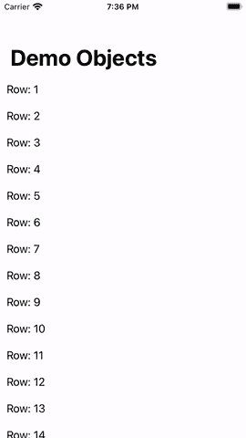
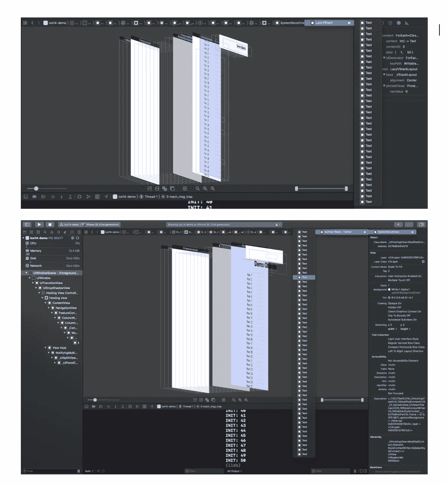

# SwiftUI:惰性网格和堆栈

> 原文：<https://blog.devgenius.io/swiftui-lazy-grids-and-stacks-8b5cdacc7c19?source=collection_archive---------9----------------------->

## 如何使用 lazy grid，LazyVGrid，LazyVStack，lazy stack？



马库斯·温克勒在 [Unsplash](https://unsplash.com?utm_source=medium&utm_medium=referral) 上的照片

随着 iOS-14 的推出，苹果引入了一些新的布局。在本教程中，我们将了解如何使用它们？LazyV(H)堆栈与普通的 V(H)堆栈有何不同？

## **如何实现 LazyH(V)Grid 和 LazyV(H)Stack？**

网格/堆栈视图的 h 和 V 定义布局方向。如果我们希望这些视图是可滚动的，我们需要用 ScrollView 包装它们。

**LazyH(V)网格:**



**LazyV(H)堆栈:**

惰性堆栈的实现与普通堆栈非常相似。懒惰堆栈与普通堆栈有什么不同，这是我们在查看基本实现后将讨论的内容:



## LazyV(H)栈和 V(H)栈有什么不同？

惰性堆栈初始化视图应该是可见的，而不是呈现所有视图。让我们看看视图调试器是如何视图的。



**上:LazyVstack，下:VStack**

我们创建了两个视图，一个使用 LazyVstack，一个使用普通 Vstack。滚动多次后，我们启动视图调试器来查看小部件树。

VStack 有 50 个文本视图。没有优化。

LazyVstack = >只有 31 个文本视图，很可能像表格视图一样循环使用。

📌我们还观察到，我们在 LazyStack 视图中使用的数据模型对于每一行只被调用一次**,尽管视图正在被重新创建。为什么会这样，是一个悬而未决的问题。**

```
**struct**  Row { **var** value: Int **init**(value: Int) {
        print("INIT: \(value)")
        **self**.value = value
   }
}
```

**参考**

[](https://developer.apple.com/videos/play/wwdc2020/10041) [## SwiftUI 的新功能- WWDC 2020 -视频-苹果开发者

### SwiftUI 可以帮助您为 iPhone、iPad、Mac、Apple Watch 和 Apple TV 构建更好、更强大的应用程序。了解更多信息…

developer.apple.com](https://developer.apple.com/videos/play/wwdc2020/10041)