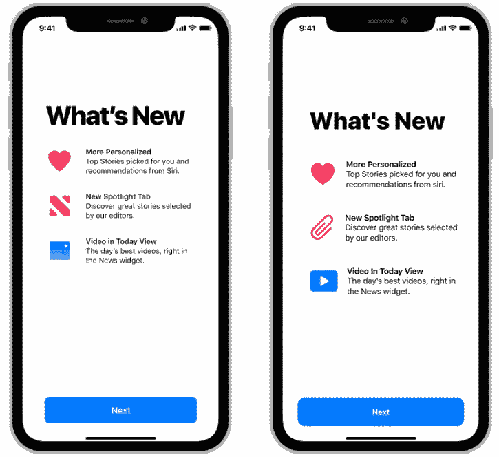
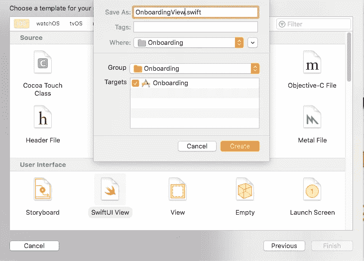

# SwiftUI 使 Onboarding 视图像苹果的应用程序

> 原文：<https://blog.devgenius.io/swiftui-make-onboarding-view-like-apples-apps-cb6d1701f6ca?source=collection_archive---------11----------------------->



你想创建一个像苹果应用程序一样的入职视图吗？

你来对地方了！

将您的项目放在您想要整合此功能的地方，创建新的 SwiftUI 视图文件，我们将它命名为“***onboardingview . swift***”。



将此代码合并到您的 ***OnboardingView*** 中:

为了能够从第一次启动的 **OnBoardingView** 转到随后所有启动的其他视图，我们创建了 **LaunchView** 来检查这是否是应用程序的第一次启动。

首先创建一个 **ObservableObject** 类，在这个类中，您可以根据 **LaunchBefore** 的布尔值初始化一个 if。

点击 OnboardingView 中的 next 按钮时, **LaunchBefore** 值会改变:

```
Button(action: {                
UserDefaults.standard.set(true, forKey: "LaunchBefore")
...
```

如果在之前**启动的值不为**真**，这意味着这是**第一次启动**，那么当前页面的值将为 **onBoardingView** 。
另一方面，如果 **LaunchBefore** 的值为真，则 currentPage 的值将为 **ContentView** ，这意味着应用程序已经启动。**

最后，有必要发布 currentPage 变量，以便 LaunchView 可以访问它。

对 OnboardingView 进行编码后，可以在 SceneDelegate 中更改根视图，以便应用程序在启动时启动 LaunchView:

现在，您可以构建并运行应用程序，一切正常。

你可以在这里找到完整的项目[。](https://github.com/clementlvx/SwiftUI-Onboarding)

感谢阅读我的第一个帖子。