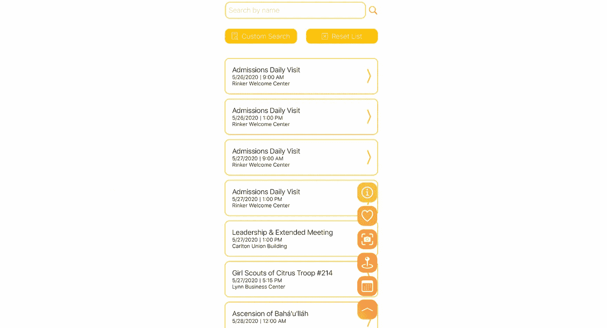
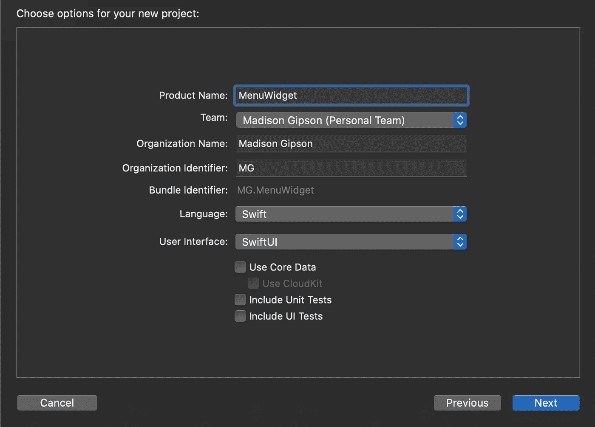
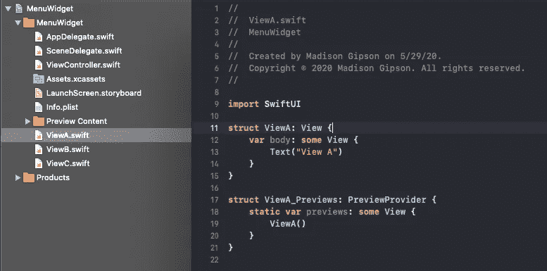
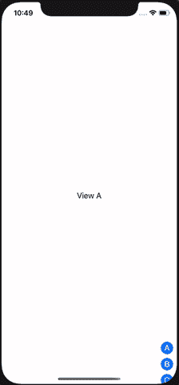
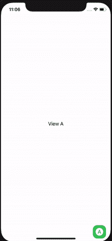

# SwiftUI 菜单小部件(易于定制和集成)

> 原文：<https://blog.devgenius.io/swiftui-menu-widget-easy-to-customize-integrate-75a36f067d83?source=collection_archive---------9----------------------->



带有菜单部件的主屏幕。

我厌倦了在应用程序中看到和使用相同的标签视图导航，所以我创建了一个菜单小部件，它稍微混合了导航，但没有使它过于复杂或混乱。本教程概述了我如何从零开始创建它，以及如何将它轻松集成到你的 iOS 应用程序中。虽然它是在 SwiftUI 中构建的，但有一些方法可以将其与 UIKit 视图集成(稍后将提供教程)。如果你只是想要成品，这里有 [GitHub 回购](https://github.com/mgipson/MenuWidget/tree/master/MenuWidget)。

# 从头开始

让我们开始吧，从一个空白的单视图 App XCode 项目开始。



使用 SwiftUI，不要包含测试。

创建后，将 ContentView.swift 重命名为 ViewController.swift 在该文件和 SceneDelegate.swift 中将有几个实例，您需要将 ContentView 更改为 ViewController。你不需要*重命名，我只是发现它有助于在更大的项目中保持事物的直线。*

因为这是从头开始的，我们需要添加一些 SwiftUI 文件，这些文件将是我们要显示的不同视图。我创建了 ViewA、ViewB、ViewC 每个视图都有一行简单的文本，其中包含它们的视图名称。



显示视图 a。为了简单起见，在 ViewB 和 ViewC 中也做了同样的工作。

回到 ViewController，我删除了 PreviewProvider，因为我通常只使用模拟器进行测试，并添加了以下内容，这导致了一个中间有“视图 A”的纯白屏幕。

```
struct ViewController: View { 
 **@State var page:String = "ViewA"** 
  var body: some View { 
   **VStack { 
    if page == "ViewA" { ViewA() } 
    if page == "ViewB" { ViewB() } 
    if page == "ViewC" { ViewC() } 
   } //end of page vstack** 
  } //end of view 
} //end of struct
```

# 切换屏幕

还没有办法在屏幕之间切换，所以这是我们接下来要添加的。在下面的代码片段中，实现了以下内容:

*   设置屏幕大小和图标大小(相对于屏幕大小设置图标大小以进行缩放)。
*   在页面 VStack 下面，我们添加了一个 ZStack，它包含了一个按钮的 v stack；在 ZStack 中嵌套 VStack 似乎是多余的，但是带有。如果只应用于按钮 VStack，bottomTrailing 对齐(菜单放置在右下角而不是屏幕中心默认位置时需要)不会有相同的效果。
*   将页面和按钮堆栈组合在一个 ZStack 中，使按钮层叠在页面上。

```
struct ViewController: View {
 @State var page:String = "ViewA"
 **let screenSize = UIScreen.main.bounds
 let iconSize = UIScreen.main.bounds.width*0.07**

 var body: some View {
 ** ZStack {**
   VStack {
    if page == "ViewA" { ViewA() }
    if page == "ViewB" { ViewB() }
    if page == "ViewC" { ViewC() }
   } //end of page vstack
   **ZStack {
    VStack {
     Button(action: { self.page = "ViewA" }) 
     {
      Image(systemName: "a.circle.fill").resizable().frame(width: iconSize, height: iconSize)
     }
     Button(action: { self.page = "ViewB" }) 
     {
      Image(systemName: "b.circle.fill").resizable().frame(width: iconSize, height: iconSize)
     }
     Button(action: { self.page = "ViewC" }) 
     {
      Image(systemName: "c.circle.fill").resizable().frame(width: iconSize, height: iconSize)
     }
    }.padding([.all]) //end of button vstack
   }.frame(width: screenSize.width, height: screenSize.height, alignment: .bottomTrailing) //end of button zstack**
  **} //end of view zstack**
 } //end of view
} //end of struct
```



成功！

# 功能性！=使用起来很有趣

酷，切换屏幕工作！但是在它实际可用之前，还有几个问题需要解决。

*   正确定位屏幕上的菜单
*   给按钮样式改头换面
*   添加一个“触发器”来展开和折叠菜单，这样我们就不会经常看到所有的按钮(会妨碍背景屏幕)

## 按钮样式

我们可以通过创建一个按钮样式来一石二鸟(在这个例子中，我坚持使用非常简单的东西，但是它演示了如何创建一个可重用的、统一的按钮样式)。在 ViewController 结构上方，添加:

```
struct PageButtonStyle: ButtonStyle { 
 let buttonSize = UIScreen.main.bounds.width*0.12 
 func makeBody(configuration: Self.Configuration) -> some View { 
  return configuration.label 
   .foregroundColor(Color.white) 
   .frame(width: buttonSize, height: buttonSize) 
   .background(Color.green) 
   .scaleEffect(configuration.isPressed ? 0.9 : 1.0) 
 } 
}
```

现在将按钮样式附加到 VStack 中的每个按钮，如下所示:

```
Button(action: { self.page = "ViewA" }) 
{ 
 Image(systemName: "a.circle.fill").resizable().frame(width: iconSize, height: iconSize) }**.buttonStyle(PageButtonStyle()).cornerRadius(15)**
```

## 展开和折叠

这要怎么做？让我们考虑清楚。

如果我们在一个屏幕上，菜单部件应该是一个按钮，其图标与当前屏幕匹配。当我们点击它时，它应该会展开并显示菜单中的所有按钮，而有当前屏幕图标的按钮应该会变成一个向上的箭头，显示菜单已展开。当点击菜单中的一个按钮时，屏幕就会切换。菜单应该只在点击箭头按钮时折叠，箭头按钮应该恢复显示当前屏幕的图标。

来实施吧！

在现有变量下，添加`expand`(表示菜单是否应该展开)和`icon`(表示当前屏幕的图标)。

```
struct ViewController: View {
 @State var page:String = "ViewA"
 let screenSize = UIScreen.main.bounds
 let iconSize = UIScreen.main.bounds.width*0.07
 **@State var expand:Bool = false
 @State var icon:String = "a.circle.fill"**
```

在 button VStack 中，在所有现有按钮周围添加一个 if 语句；当`expand`为真时将显示所有按钮，为假时仅显示当前屏幕的按钮。在 if 语句下面，添加另一个按钮；这将是当前屏幕/箭头按钮，应该一直显示。在每个按钮动作中，给`icon`添加一个与页面对应的变量赋值；这用于当前屏幕按钮。

```
VStack { 
 **if expand {** 
   Button(action: { 
   self.page = "ViewA" 
   **self.icon = "a.circle.fill"** 
  }) { 
   Image(systemName: "a.circle.fill").resizable().frame(width: iconSize, height: iconSize) 
  }.buttonStyle(PageButtonStyle()).cornerRadius(15)   Button(action: { 
   self.page = "ViewB" 
   **self.icon = "b.circle.fill"** 
  }) { 
   Image(systemName: "b.circle.fill").resizable().frame(width: iconSize, height: iconSize) 
  }.buttonStyle(PageButtonStyle()).cornerRadius(15)   Button(action: { 
   self.page = "ViewC" 
   **self.icon = "c.circle.fill"** 
  }) { 
   Image(systemName: "c.circle.fill").resizable().frame(width: iconSize, height: iconSize) 
  }.buttonStyle(PageButtonStyle()).cornerRadius(15) 
 **} //end of if statement**

  **//Arrow/Current Screen 
  Button(action: { 
   self.expand.toggle() 
  }) { 
   Image(systemName: expand ? "chevron.up" : icon).resizable().frame(width: iconSize, height: expand ? iconSize/3 : iconSize) 
  }.buttonStyle(PageButtonStyle()).cornerRadius(15)** 
}.padding([.all]) //end of button vstack
```

在“箭头/当前屏幕”按钮上，我们添加了一个切换`expand`的动作，指示菜单是否应该展开/折叠。对于图标，如果菜单被展开，我们显示人字形箭头，如果没有展开，则显示`icon`(无论设置为什么值)(使用一个方便的三元运算符)。此外，我们希望人字形箭头是成比例的，所以如果那是按钮图标(当`expand`为真时就会是)，那么缩小高度(使用三元运算符完成…它们是最好的！).

## 比以前更好

开始了。更好的按钮设计，在屏幕上适当的定位，以及一个展开/折叠菜单。就快好了。



屏幕切换，好的按钮设计，好的菜单定位，菜单展开和折叠。

# 普通的简得到了升级

这看起来不错，但仍然是一种气泡。如果有一些动画和手势会更好，你不觉得吗？

## 动画

这太简单了，你不会相信的。

我希望人字形箭头在被点击时收缩和伸展，菜单在展开和折叠时淡入淡出。只需将`.animation(.spring())`追加到人字形按钮和按钮 VStack。

```
...
 //Chevron/Current Screen
 Button(action: {
  self.expand.toggle() 
 }) {
  Image(systemName: expand ? "chevron.up" : icon).resizable().frame(width: iconSize, height: expand ? iconSize/3 : iconSize)
 }.buttonStyle(PageButtonStyle()).cornerRadius(15)**.animation(.spring())** }.padding([.all])**.animation(.spring())** //end of button vstack
```

## 手势-拖动菜单

实现这个功能后，我意识到有时候右边的菜单会挡住后面屏幕上的东西，如果能移动它就好了。如果有人用左手拿着手机呢？必须用拇指穿过屏幕才能够到它是相当讨厌的。

因此，让我们实现一个拖动手势。在现有变量下，添加`rightSide`(表示菜单在右边还是左边)。

```
struct ViewController: View {
 @State var page:String = "ViewA"
 let screenSize = UIScreen.main.bounds
 let iconSize = UIScreen.main.bounds.width*0.07
@State var expand:Bool = false
 @State var icon:String = "a.circle.fill"
 **@State private var rightSide:Bool = true** 
```

在这些变量的下方和视图主体的上方，添加 menuDrag 手势。如果用户从屏幕的右半部分拖动到左半部分，这将切换`rightSide`，反之亦然。

```
var menuDrag: some Gesture {
 DragGesture().onChanged { value in }.onEnded { value in
  if (self.rightSide && value.translation.width < -(self.screenSize.width*0.5)) || (!self.rightSide && value.translation.width > self.screenSize.width*0.5) {
   self.rightSide.toggle()
  }
 }
}
```

我们只是将`.animation(.spring())`追加到了人字形按钮和按钮 VStack 上；让我们把`.gesture(menuDrag)`也加进去。我们还想在按钮 ZStack 的对齐方式中添加一个三元运算符。

```
...
  //Chevron/Current Screen
  Button(action: {
   self.expand.toggle() 
  }) {
   Image(systemName: expand ? "chevron.up" : icon).resizable().frame(width: iconSize, height: expand ? iconSize/3 : iconSize)
}.buttonStyle(PageButtonStyle()).cornerRadius(15).animation(.spring())**.gesture(menuDrag)** }.padding([.all]).animation(.spring())**.gesture(menuDrag)** //end of button vstack
}.frame(width: screenSize.width, height: screenSize.height, **alignment: rightSide ? .bottomTrailing : .bottomLeading**) //end of button zstack
```

## 瞧啊。


成功！

# 还有更多！

现在，我们有了一个自定义菜单小部件，可以轻松集成到任何 SwiftUI 项目中。换成你自己的颜色也非常容易(甚至是渐变！)、图标、屏幕等。你甚至可以改变它，当你点击任何一个按钮，而不仅仅是人字形箭头时，它可以水平扩展或关闭。

查看 [GitHub](https://github.com/mgipson/MenuWidget/tree/master/MenuWidget) 上的项目了解更多信息。