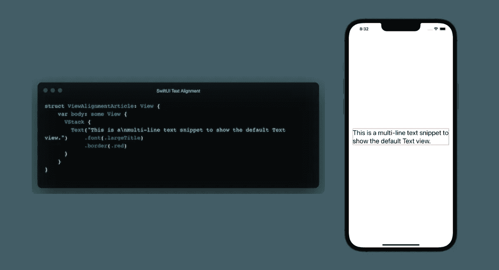
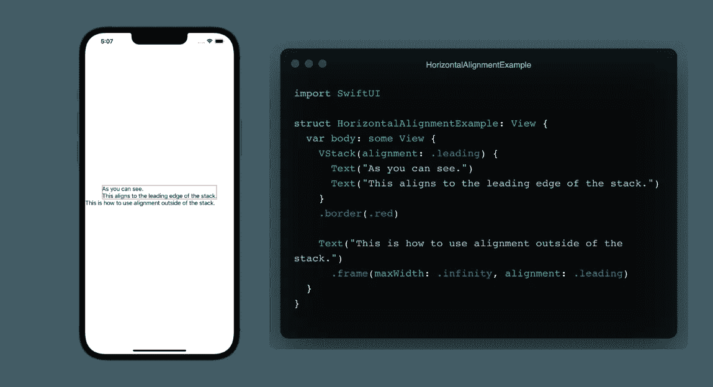
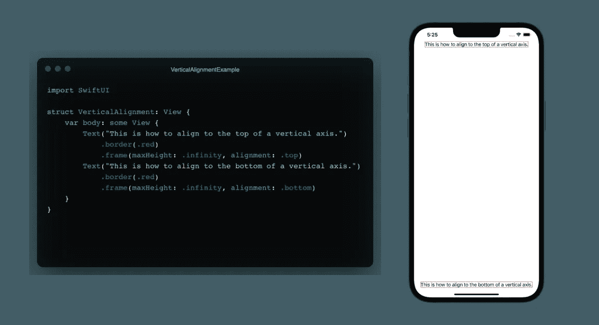
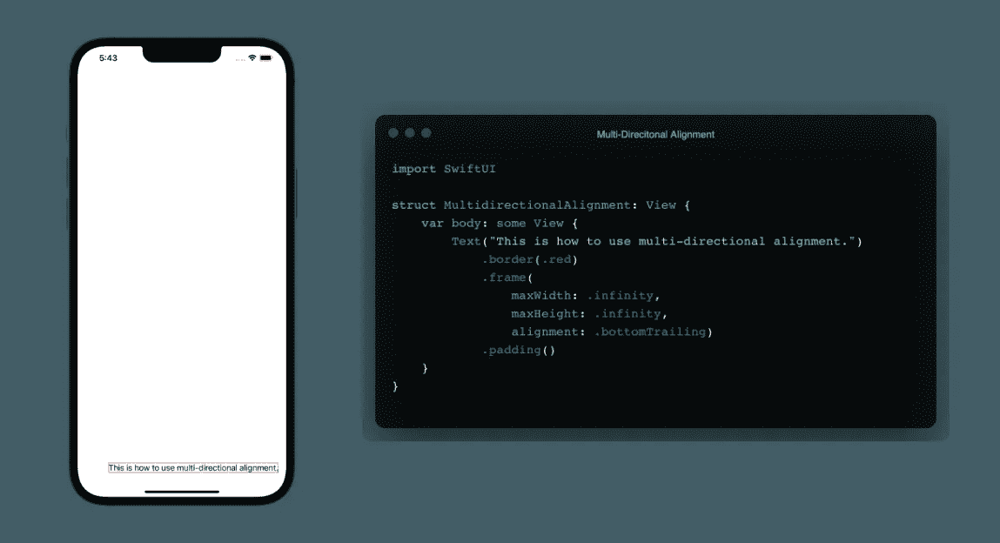
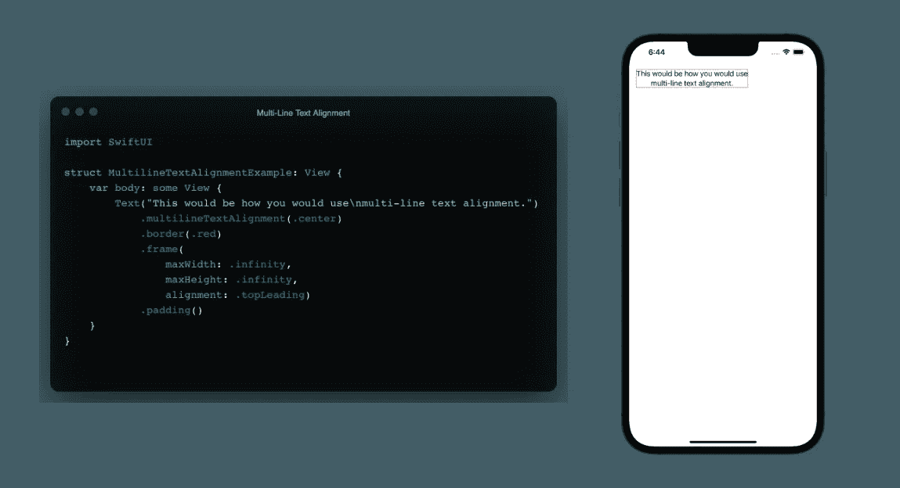

# SwiftUI 文本对齐

> 原文：<https://blog.devgenius.io/swiftui-text-alignment-8bc9e4cb8afe?source=collection_archive---------9----------------------->

*这里没有 CSS 对齐，没有 flexboxes！在本文中，我们将简单介绍如何在 SwiftUI 视图中对齐文本。*


照片由 [Edz Norton](https://unsplash.com/@edznorton?utm_source=medium&utm_medium=referral) 在 [Unsplash](https://unsplash.com?utm_source=medium&utm_medium=referral) 上拍摄

## 让我们看看默认对齐方式…

创建新视图时，默认的`Text`视图占据尽可能少的空间，并保持在框架的中心。看一下下面的多行文本视图，它显示了文本如何只占用所需的空间。



文本视图只占用框架内所需的空间。

## 我们要继续讨论下一个校准方法吗？

如果你的目标是让你的文本与框架的起始或前沿对齐，那就不要玩文字游戏了。有几种不同的方法可以做到这一点，我个人倾向于将所有内容放入某种类型的堆栈中，无论是 VStack 还是 HStack，并使用它来相应地对齐我的内容。但是，我将向您展示这两种方法。

当进行水平对齐并希望所有内容对齐时，如果使用的是 HStack 或 VStack，只需使用 VStack(alignment:。leading)或 HStack(alignment:。尾随)。这两个函数将在堆栈的开始或结束处水平对齐各自堆栈类型中的所有内容。

或者，如果您只需要对齐单个文本对象或需要指定单个文本对象对齐方式，则可以通过应用。frame()修饰符并指定对齐方式。



水平对齐的两个选项。

## 你喜欢纸杯蛋糕的顶部还是底部？

我倾向于发现垂直对齐是棘手的，但这只是我的，因为它真的很简单。要将事物与垂直轴的顶部对齐，这与水平轴非常相似。然而，它并不像您所想的那样在堆栈中工作，我将在以后写一篇关于这方面的文章！

也就是说，您将使用`.frame()`修改器并设置对齐，如下所示。



垂直对齐选项。

## 多方向的文本对齐是可能的！

虽然我们可以沿着一个轴的基础对齐，但我们也可以选择使用多方向对齐。这将允许我们通过使用以下方法之一沿两个轴对齐。

```
.topLeading
.topTrailing
.top
.leading
.center
.trailing
.bottomLeading
.bottomTrailing
```



使用多方向对齐允许我们沿两个轴对齐。

## 多行文字对齐，当你需要具体的。

如果你正在处理一个需要你特别对齐多行文本对象的设计，SwiftUI 使用`.multilineTextAlignment()`让它变得非常简单，它允许我们传入上面显示的一个修饰符。



使用简单的修饰符可以实现多行文本对齐。

*总之，SwiftUI 通过使用修饰符使文本沿不同的轴对齐变得简单。我们也可以使用单个修饰符来对齐多行文本对象。*

```
**Let's Connect!**If you have any questions, or want to chat - reach out to me on Twitter [@halluxdev](https://twitter.com/halluxdev)!
```