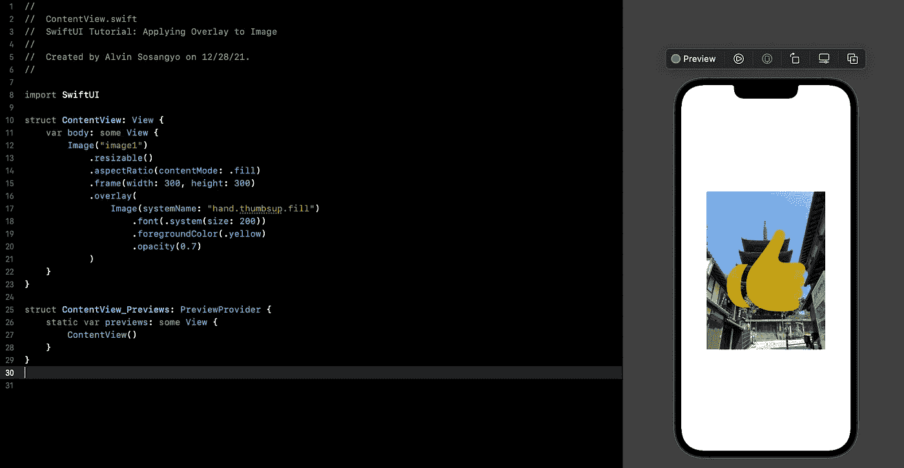
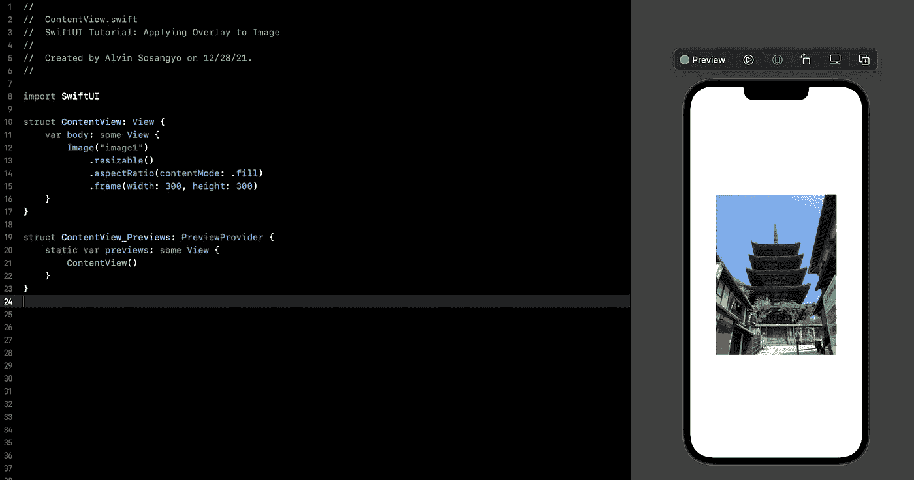
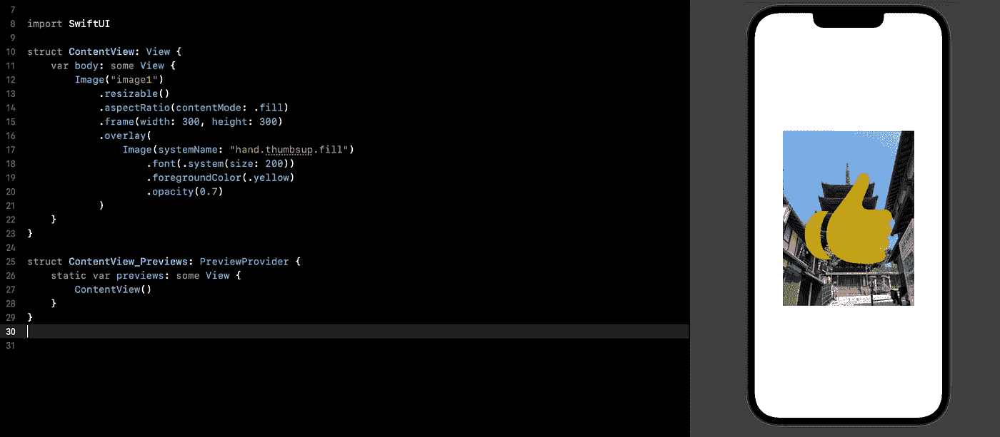
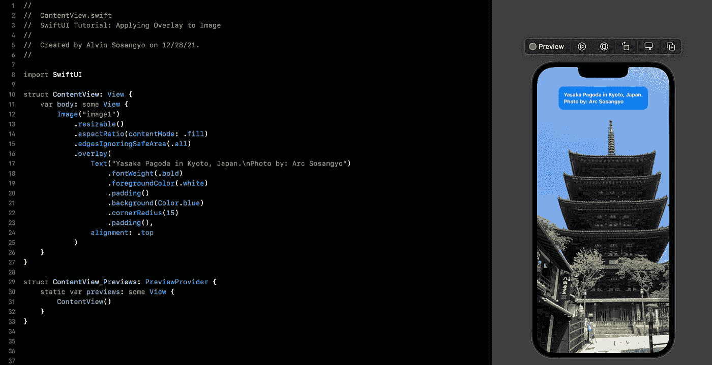
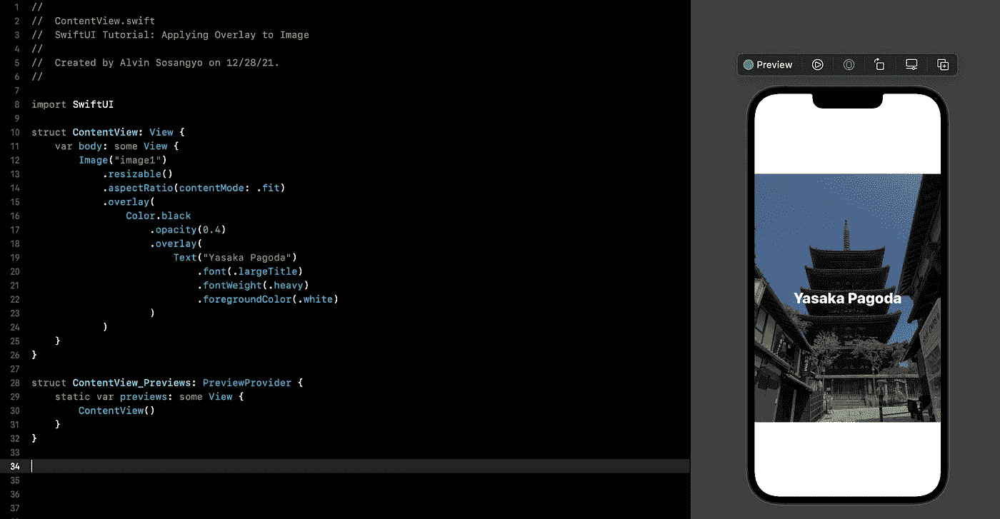

# SwiftUI 教程:对图像应用覆盖

> 原文：<https://blog.devgenius.io/swiftui-tutorial-applying-overlay-to-image-782ed39e5be4?source=collection_archive---------1----------------------->



图 1

在我之前的文章中，我们讨论了如何用 [SF 符号](/swiftui-tutorial-displaying-system-image-with-sf-symbols-75c01b5bf421)显示系统映像。

> 本教程是我的 [SwiftUI 教程](https://arc-sosangyo.medium.com/list/swiftui-tutorial-03734e631240)系列的一部分。

SwiftUI 框架支持用任何视图(如图像、形状或文本)覆盖现有图像。

# 让我们先设置

你首先需要有一个开放的项目。如果你没有现成的练习项目，先按照这个[链接](/introduction-to-swiftui-creating-new-project-9adc502e1804)上的步骤创建一个新项目。

接下来您需要做的是将一个导入的图像保存到 Xcode 中进行练习。如果你是第一次使用 SwiftUI image，我强烈建议你先学习这个[链接](/swiftui-tutorial-working-with-images-62040c279960)的教程。

下面是初始设置的代码。图 2 显示了输出。

```
import SwiftUI

struct ContentView: View {
    var body: some View {
        Image("image1")
            .resizable()
            .aspectRatio(contentMode: .fill)
            .frame(width: 300, height: 300)
    }
}
```



图二。初始设置

# 使用图像作为覆盖

如前所述，SwiftUI 有一个内置的修改器，用于应用名为。可以附加到现有图像视图的覆盖图。叠加修改器的要求是放置另一个对象作为图像的涂层。

将下方修改器添加到图像视图中。

```
.overlay(
    Image(systemName: "hand.thumbsup.fill")
        .font(.system(size: 200))
        .foregroundColor(.yellow)
        .opacity(0.7)
)
```

在上面的代码中，我们使用一个 SF 符号作为覆盖。由于 SF 符号很小，我们调整了它们的大小，使它们更加明显。颜色改为黄色，这样就不会与图像有颜色冲突。不透明度也被调整，使图像和覆盖都可见。图 3 展示了它应该是什么样子。



图 3。应用系统图像覆盖

> **注:**如果您是第一次处理 SF 符号(系统映像)，请参考此[链接](/swiftui-tutorial-displaying-system-image-with-sf-symbols-75c01b5bf421)了解更多信息。

# 使用文本作为覆盖

实际上，您可以将任何类型的视图作为覆盖图来应用。在这个例子中，我们使用一个[文本](/swiftui-tutorial-working-with-text-15de81494a07)视图作为覆盖图。

```
import SwiftUI

struct ContentView: View {
    var body: some View {
        Image("image1")
            .resizable()
            .aspectRatio(contentMode: .fill)
            .edgesIgnoringSafeArea(.all)
            .overlay(
                Text("Yasaka Pagoda in Kyoto, Japan.\nPhoto by: Arc Sosangyo")
                    .fontWeight(.bold)
                    .foregroundColor(.white)
                    .padding()
                    .background(Color.blue)
                    .cornerRadius(15)
                    .padding(),
                alignment: .top
            )
    }
}
```

覆盖还支持设置更多的定制对齐。



图 4。应用文本覆盖

# 叠加在叠加层之上

也可以在现有覆盖层上使用另一个覆盖层。让我们试着用 0.4 (40%)的不透明度给一个覆盖层上色，使图像变暗。然后我们在它上面放置另一个文本覆盖。

```
import SwiftUI

struct ContentView: View {
    var body: some View {
        Image("image1")
            .resizable()
            .aspectRatio(contentMode: .fit)
            .overlay(
                Color.black
                    .opacity(0.4)
                    .overlay(
                        Text("Yasaka Pagoda")
                            .font(.largeTitle)
                            .fontWeight(.heavy)
                            .foregroundColor(.white)
                    )
            )
    }
}
```

结果是一个像样的，值得用户界面的形象。图 5 显示了上面代码的输出。



图 5。在现有覆盖上使用覆盖

我在本教程中展示的只是一些可能的视图和定制，你可以用叠加。尝试在 SwiftUI 中使用不同的可用视图。

在我们的下一个教程中，我们将处理[按钮](https://arc-sosangyo.medium.com/swiftui-tutorial-working-with-buttons-ee3fdcfb8337)。

愿法典与你同在，

-电弧