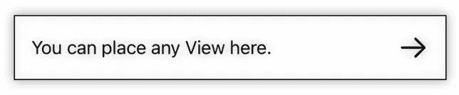

# SwiftUI 教程:使用 ViewBuilder 创建子视图

> 原文：<https://blog.devgenius.io/swiftui-tutorial-create-child-views-with-viewbuilder-e1ee5a312271?source=collection_archive---------3----------------------->

## 如何用 ViewBuilder 在 SwiftUI 中构建可重用组件


图一。

S wiftUI ViewBuilder 是一款帮助你在用户界面中构建和组织视图或可视元素的工具。它允许您创建视图的层次结构，其中一个视图作为其他视图的父视图，称为子视图。ViewBuilder 通常用于在 SwiftUI 中创建可重用的组件，这些组件是可以在一个应用程序中多次使用的视图组。要使用 ViewBuilder，您需要定义一个返回一个或多个视图的函数或闭包，然后您可以使用该函数或闭包来构建您的用户界面，方法是调用它并将结果视图添加到您的布局中。ViewBuilder 允许您轻松定义和重用组件，从而简化了创建复杂布局和视图层次的过程。

要声明一个 ViewBuilder，您必须用`@ViewBuilder`包装属性或函数，如下例所示:

```
// Property example
@ViewBuilder var content: () -> Content

// Function(method) example
@ViewBuilder private func mainView() -> some View {}

// Some prefer this format to be cleaner for function(method)
@ViewBuilder 
private func mainView() -> some View {}
```

# 在函数中使用 ViewBuilder

在 SwiftUI 中编写[干净代码](/5-best-practices-for-writing-clean-code-be1a5095eae5)的一个好习惯是将视图分成更小的函数。用 ViewBuilder 包装这些函数可以进一步提高代码的组织性和可读性。这里有一个例子:

```
struct ContentView: View {

    var body: some View {
        VStack(spacing: 25) {
            sfSymbolWithLabel("person.fill")
            sfSymbolWithLabel("house.fill")
        }
    }

    @ViewBuilder
    private func sfSymbolWithLabel(_ name: String) -> some View {
        HStack {
            Group {
                Image(systemName: name)
                Text(name)
            }
            .font(.system(size: 30))
            .foregroundColor(.blue)
        }
    }

} // ContentView
```

该示例演示了如何使用 ViewBuilder 创建一个返回视图协议的函数。

# SwiftUI:在属性中存储视图

下面是如何在 struct 属性中存储 SwiftUI 视图。这一次，我们将利用 ViewBuilder 创建一个可重用的 SwiftUI 视图。这意味着我们将定义一个返回视图的结构，并使用 ViewBuilder 包装组成视图的各种组件。

例如，我们将创建一个可重用的 SwiftUI 视图，如下所示:



图二。可重用视图

在这个例子中，矩形视图和右边的箭头图像是固定的元素。但是您可以在左侧包含任何类型的视图。

让我们首先创建一个这样的结构:

```
struct SelectionItem<Content: View>: View {

}
```

我们还必须使用一个[泛型](https://medium.com/dev-genius/swift-programming-tutorial-generics-d0ea4dd94574)约束来告诉 struct 它接受任何符合视图协议的类型。

> **注意:**在定义符合视图协议的通用类型时，内容通常是一个标准的命名约定。但是它可以用任何其他有效的标识符来替换。

在创建的结构中，添加一个我们声明的泛型数据类型的新属性，并用 ViewBuilder 包装它，如下所示:

```
@ViewBuilder var content: () -> Content
```

接下来，我们将对视图的主体进行编码。我们将创建一个 [HStack](https://medium.com/better-programming/swiftui-tutorial-working-with-stacks-vstack-hstack-and-zstack-2b0070be18d7) 并设置任何必要的修饰符。代码如下:

```
var body: some View {
    HStack {

    }
    .frame(height: 60)
    .frame(maxWidth: .infinity)
    .background(Color.white)
    .border(.black)
    .shadow(radius: 5)
    .padding()
}
```

我们在这里创建的是一个带有边框和阴影效果的白色矩形。

在我们在 HStack 中添加内容之前，我们将首先为箭头创建一个单独的函数。将此代码写在正文下面:

```
@ViewBuilder
private func arrowToRight() -> some View {
    Image(systemName: "arrow.right")
        .font(.system(size: 25))
        .foregroundColor(.black)
        .padding()
}
```

这只是一个简单的系统[图像](https://medium.com/dev-genius/swiftui-tutorial-displaying-system-image-with-sf-symbols-75c01b5bf421)，我们将把它放在 HStack 里面。

接下来，我们将回到 HStack 内容的编码。从左到右，我们将首先放置 content 属性，随后是一个分隔符()以适当的对齐方式分隔两个视图，然后是 arrowToRight 函数。在 HStack 中编写以下代码:

```
content().padding()
Spacer()
arrowToRight()
```

如果你迷路了，这里有完整的源代码。

```
struct SelectionItem<Content: View>: View {

    @ViewBuilder var content: () -> Content

    var body: some View {
        HStack {
            content().padding()
            Spacer()
            arrowToRight()
        }
        .frame(height: 60)
        .frame(maxWidth: .infinity)
        .background(Color.white)
        .border(.black)
        .shadow(radius: 5)
        .padding()
    }

    @ViewBuilder
    private func arrowToRight() -> some View {
        Image(systemName: "arrow.right")
            .font(.system(size: 25))
            .foregroundColor(.black)
            .padding()
    }

}
```

现在我们已经创建了可重用的 SwiftUI 视图，我们可以在主视图中使用它。例如，如果您正在使用内容视图，您可以按如下方式编辑它:

```
struct ContentView: View {

    var body: some View {
        VStack(spacing: 0) {
            SelectionItem {
                Text("You can place any View here.")
            }
            SelectionItem {
                VStack {
                    Text("You can place")
                    Text("any View here.")
                }
            }
            SelectionItem {
                HStack {
                    Group {
                        Image(systemName: "sunrise")
                        Image(systemName: "sun.max")
                        Image(systemName: "sunset")
                    }
                    .font(.system(size: 25))
                }
            }
        }
    }

} // ContentView
```

现在是时候测试我们的代码了。当您运行它时，视图应该类似于图 3 所示。


图 3。重用选择项

这里是 GitHub [链接](https://github.com/athurion/SwiftUI-Tutorial-Create-Child-Views-with-ViewBuilder/blob/main/ContentViewViewBuilder.swift)这部分教程的源代码。

# 不带 ViewBuilder

您可能想知道不使用 ViewBuilder 是否也能达到同样的效果。理论上，这是可能的，但是这种方法有一些缺点。具体来说，如果不使用 ViewBuilder，您可能需要手动创建和组合函数中的各个视图。下面是一个简单的截图示例:


图 4。不使用 ViewBuilder

虽然有多种方法可以解决这个错误，比如将代码嵌入到一个[组](https://medium.com/geekculture/swiftui-tutorial-working-with-group-58aace3addda)视图中或者添加`return`。首先使用`ViewBuilder`可以防止这种错误发生。

愿法典与你同在，

-电弧